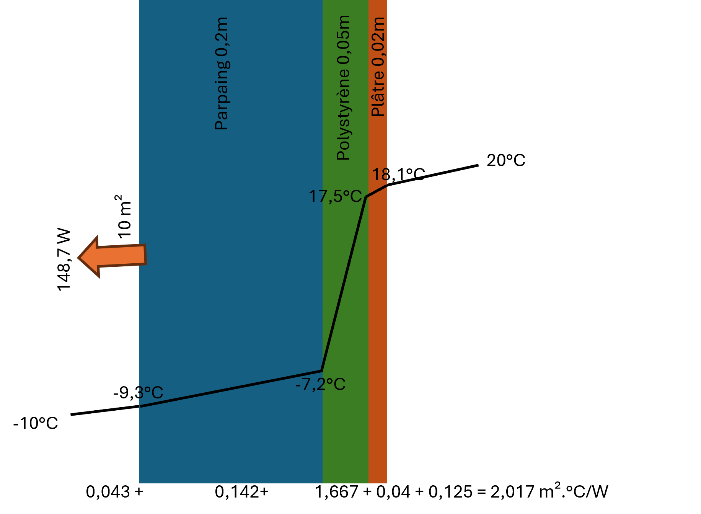

1.2. Transfert de chaleur dans un mur composite
===============================================

L'image ci-dessous montre un exemple de mur composite utilisé pour la simulation du transfert de chaleur :

Exemple de simulation du transfert de chaleur dans un mur composite :

.. code-block:: python

    from HeatTransfer import CompositeWall

    # Créer un mur composite avec des coefficients de convection externes et internes
    wall = CompositeWall.Object(he=23, hi=8, Ti=20, Te=-10, A=10)

    # Ajouter des couches au mur en utilisant les noms des matériaux
    wall.add_layer(thickness=0.20, material='Parpaings creux')  # Parpaing
    wall.add_layer(thickness=0.05, material='Polystyrène')  # Polystyrène
    wall.add_layer(thickness=0.02, material='Plâtre')  # Plâtre

    # Calculer le transfert de chaleur et les températures à chaque interface de couche
    wall.calculate()
    wall.df
    print(f"df = {wall.df}")
    print(f"R_total = {wall.R_total} m².°C/W")

Résultat attendu :

.. list-table::
   :header-rows: 1

   * - Épaisseur (m)
     - Matériau
     - Conductivité (W/m.°C)
     - Résistance (m².°C/W)
     - Température entrée (°C)
     - Température sortie (°C)
     - Q (W)
     - A (m²)
   * - NaN
     - Air extérieur
     - NaN
     - 0.043478
     - -10.000000
     - -9.353644
     - 148.661889
     - 10
   * - 0.20
     - Parpaings creux
     - 1.40
     - 0.142857
     - -9.353644
     - -7.229903
     - 148.661889
     - 10
   * - 0.05
     - Polystyrène
     - 0.03
     - 1.666667
     - -7.229903
     - 17.547079
     - 148.661889
     - 10
   * - 0.02
     - Plâtre
     - 0.50
     - 0.040000
     - 17.547079
     - 18.141726
     - 148.661889
     - 10
   * - NaN
     - Air intérieur
     - NaN
     - 0.125000
     - 18.141726
     - 20.000000
     - 148.661889
     - 10

Liste des matériaux disponibles
-------------------------------

.. list-table::
   :header-rows: 1

   * - Anglais
     - Français
     - Conductivité thermique (W/m.°C)
   * - Glass wool
     - Laine de verre
     - 0.034
   * - Expanded cork agglomerated with pitch
     - Liège expansé aggloméré au brai
     - 0.048
   * - Pure expanded cork
     - Liège expansé pur
     - 0.043
   * - Hollow concrete blocks
     - Parpaings creux
     - 1.4
   * - Hard limestone (marble)
     - Pierre calcaire dure (marbre)
     - 2.9
   * - Soft limestone
     - Pierre calcaire tendre
     - 0.95
   * - Granite
     - Pierre granit
     - 3.5
   * - Expanded polystyrene
     - Polystyrène expansé
     - 0.047
   * - Polystyrene
     - Polystyrène
     - 0.03
   * - Extruded polystyrene
     - Polystyrène extrudé
     - 0.035
   * - Polyurethane foam
     - Mousse de polyuréthane
     - 0.03
   * - Plaster
     - Plâtre
     - 0.5
   * - Glass
     - Verre
     - 1.0
   * - Air
     - Air
     - None

Explication des équations utilisées
-----------------------------------

Le modèle de transfert de chaleur dans un mur composite utilise les équations suivantes pour calculer la résistance thermique totale, le flux thermique et les températures aux interfaces des couches :

1. **Résistance thermique de convection** :
   - Résistance externe : 
     .. math::
       R_e = \frac{1}{h_e}
       
   - Résistance interne : 
     .. math::
       R_i = \frac{1}{h_i}

2. **Résistance thermique des couches** :
   - Pour chaque couche, la résistance thermique est calculée comme suit :
     .. math::
       R_{\text{couche}} = \frac{\text{épaisseur}}{\text{conductivité}}

3. **Résistance thermique totale** :
   - La résistance thermique totale du mur composite est la somme des résistances de convection et des résistances des couches :
     .. math::
       R_{\text{total}} = R_e + R_i + \sum R_{\text{couches}}

4. **Coefficient de transmission thermique** :
   - Le coefficient de transmission thermique est l'inverse de la résistance thermique totale :
     .. math::
       U = \frac{1}{R_{\text{total}}}

5. **Flux thermique** :
   - Le flux thermique à travers le mur composite est calculé en utilisant la loi de Fourier :
     .. math::
       Q = U \cdot A \cdot (T_i - T_e)
   où \( A \) est la surface du mur, \( T_i \) est la température intérieure, et \( T_e \) est la température extérieure.

6. **Températures aux interfaces des couches** :
   - La température de la paroi extérieure après la résistance convective est calculée comme suit :
     .. math::
       T_{\text{paroi extérieure}} = T_e + \frac{Q \cdot R_e}{A}
   - Les températures aux interfaces des couches sont ensuite calculées en utilisant le flux thermique et les résistances thermiques :
     .. math::
       T_{\text{interface}} = T_{\text{précédente}} + \frac{Q \cdot R_{\text{couche}}}{A}

Ces équations permettent de déterminer la distribution de température à travers le mur composite et le flux thermique total traversant le mur.