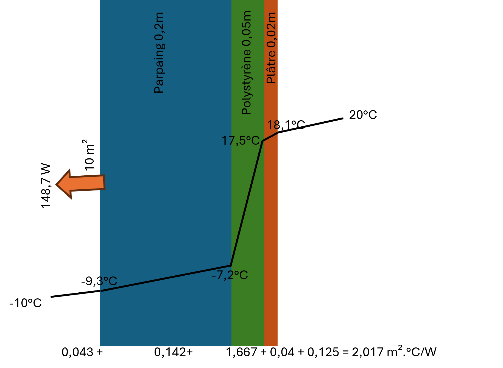

Transfert de chaleur - Mur composite
=====================================

.. code-block:: python

    from HeatTransfer import CompositeWall

    # Créer un mur avec coefficients de convection et températures
    # he : coefficient convection externe [W/m².K]
    # hi : coefficient convection interne [W/m².K]
    # Ti : température intérieure [°C]
    # Te : température extérieure [°C]
    # A : surface du mur [m²]
    wall = CompositeWall.Object(he=23, hi=8, Ti=20, Te=-10, A=10)

    # Ajouter des couches (de l'extérieur vers l'intérieur)
    # thickness : épaisseur [m]
    # material : nom du matériau (voir liste ci-dessous)
    wall.add_layer(thickness=0.20, material='Parpaings creux')
    wall.add_layer(thickness=0.05, material='Polystyrène')
    wall.add_layer(thickness=0.02, material='Plâtre')

    # Calculer le transfert et les températures à chaque interface
    wall.calculate()
    
    # Accéder aux résultats
    print(f"Résistance totale: {wall.R_total:.3f} m².K/W")
    print(f"Flux thermique: {wall.Q:.2f} W")
    print(wall.df)  # DataFrame avec détail par couche

Matériaux disponibles
---------------------

* Laine de verre (0.034 W/m.K)
* Liège expansé pur (0.043 W/m.K)
* Parpaings creux (1.4 W/m.K)
* Pierre calcaire dure (2.9 W/m.K)
* Pierre calcaire tendre (0.95 W/m.K)
* Pierre granit (3.5 W/m.K)
* Polystyrène expansé (0.047 W/m.K)
* Polystyrène (0.03 W/m.K)
* Polystyrène extrudé (0.035 W/m.K)
* Mousse de polyuréthane (0.03 W/m.K)
* Plâtre (0.5 W/m.K)
* Verre (1.0 W/m.K)