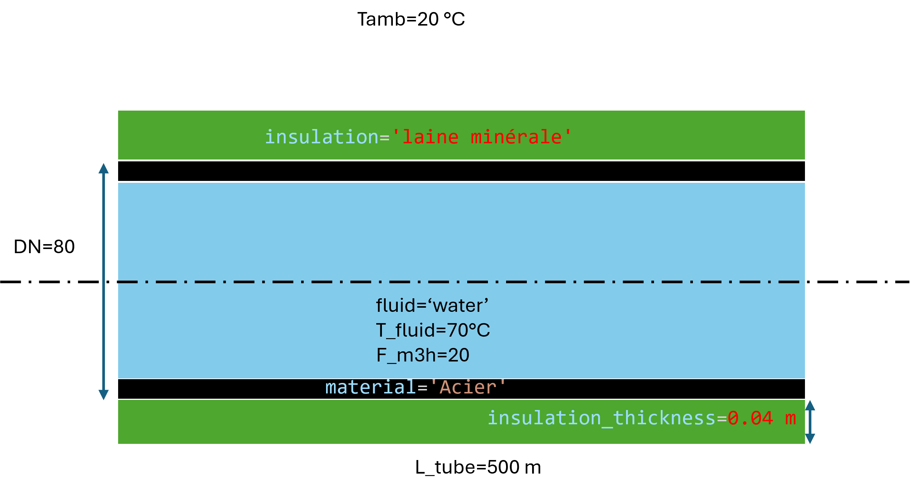
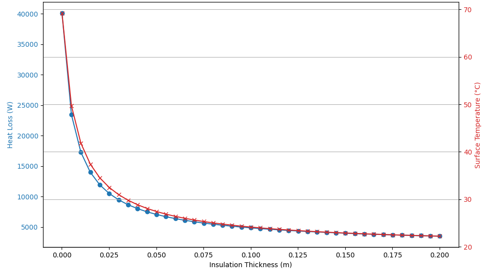

1.3. Analyse de l'isolation des tuyaux
======================================

L'image ci-dessous montre un exemple de tuyau isolé avec les paramètres de simulation :

Exemple de simulation de l'isolation des tuyaux :

.. code-block:: python

    import matplotlib.pyplot as plt
    from HeatTransfer import PipeInsulationAnalysis

    # Exemple d'utilisation
    pipe = PipeInsulationAnalysis.Object(fluid='water', T_fluid=70, F_m3h=20, DN=80, L_tube=500, material='Acier', insulation='laine minérale', insulation_thickness=0.04, Tamb=20)
    pipe.calculate()
    print(pipe.df)

    # Simulation de l'effet de l'épaisseur de l'isolant sur les déperditions thermiques
    insulation_thicknesses = [0.0001 + 0.005 * i for i in range(41)]  # Épaisseurs de 0.0001m à 0.2001m
    heat_losses = []
    surface_temperatures = []

    for thickness in insulation_thicknesses:
        pipe = PipeInsulationAnalysis.Object(fluid='water', T_fluid=70, F_m3h=20, DN=80, L_tube=500, material='Acier', insulation='laine minérale', insulation_thickness=thickness, Tamb=20)
        pipe.calculate()
        heat_losses.append(pipe.q_total)
        surface_temperatures.append(pipe.Tc)

    # Tracé des résultats
    fig, ax1 = plt.subplots(figsize=(10, 6))

    color = 'tab:blue'
    ax1.set_xlabel('Épaisseur de l\'isolant (m)')
    ax1.set_ylabel('Déperditions thermiques (W)', color=color)
    ax1.plot(insulation_thicknesses, heat_losses, marker='o', color=color, label='Déperditions thermiques (W)')
    ax1.tick_params(axis='y', labelcolor=color)

    ax2 = ax1.twinx()  # instancier un second axe qui partage le même axe x
    color = 'tab:red'
    ax2.set_ylabel('Température de surface (°C)', color=color)  # nous avons déjà géré l'étiquette x avec ax1
    ax2.plot(insulation_thicknesses, surface_temperatures, marker='x', color=color, label='Température de surface (°C)')
    ax2.tick_params(axis='y', labelcolor=color)

    fig.tight_layout()  # sinon l'étiquette y de droite est légèrement coupée
    plt.title('Effet de l\'épaisseur de l\'isolant sur les déperditions thermiques et la température de surface')
    plt.grid(True)
    plt.show()

L'image ci-dessous montre l'évolution des déperditions et de la température de surface de l'isolant en fonction de l'épaisseur de l'isolant :

Explication des équations utilisées
-----------------------------------

Le modèle d'isolation des tuyaux utilise les équations suivantes pour calculer les déperditions thermiques et la température de surface de l'isolant :

1. **Résistance thermique de convection interne** :
   
   .. math::
     R_{\text{conv, int}} = \frac{1}{h_{\text{inner}} \cdot 2 \pi r_{\text{inner}} \cdot L}

2. **Résistance thermique de conduction à travers l'isolant** :
   
   .. math::
     R_{\text{cond}} = \frac{\ln\left(\frac{r_{\text{outer}}}{r_{\text{inner}}}\right)}{2 \pi k_{\text{insulation}} \cdot L}

3. **Résistance thermique de convection externe** :
   
   .. math::
     R_{\text{conv, ext}} = \frac{1}{h_{\text{outer}} \cdot 2 \pi r_{\text{outer}} \cdot L}

4. **Résistance thermique totale** :
   
   .. math::
     R_{\text{total}} = R_{\text{conv, int}} + R_{\text{cond}} + R_{\text{conv, ext}}

5. **Flux thermique** :
   
   .. math::
     Q = \frac{T_{\text{fluid}} - T_{\text{ambient}}}{R_{\text{total}}}

6. **Température de surface de l'isolant** :
   
   .. math::
     T_{\text{surface}} = T_{\text{fluid}} - Q \cdot R_{\text{conv, int}} - Q \cdot R_{\text{cond}}

Ces équations permettent de déterminer les déperditions thermiques à travers l'isolant et la température de surface de l'isolant en fonction des paramètres de simulation.

Résumé des équations utilisées pour le calcul
---------------------------------------------

Le modèle utilise les propriétés thermophysiques des matériaux et des fluides pour calculer les déperditions thermiques et la température de surface de l'isolant. Voici un résumé des équations utilisées :

1. **Propriétés de l'air ambiant** :
   - Température ambiante : \( T_{\text{amb}} = 20 \, \text{°C} \)
   - Humidité relative : \( \text{Humidité} = 40 \% \)
   - Capacité thermique spécifique : \( C_p = 1007 \, \text{J/kg-°C} \)
   - Coefficient de dilatation thermique : \( \beta = 0.0034 \, \text{1/K} \)
   - Viscosité dynamique : \( \mu = 0.0000185 \, \text{kg/m-s} \)
   - Densité à la température de référence de 20°C : \( \rho_{\text{ref}} = 1.201 \, \text{kg/m}^3 \)
   - Conductivité thermique : \( k = 0.0261 \, \text{W/m-°C} \)

2. **Calcul des propriétés de l'air ambiant** :

   - Nombre de Rayleigh : 
     
     .. math::
       Ra_{\text{air}} = \frac{g \cdot \beta \cdot \rho_{\text{air}}^2 \cdot C_p \cdot (T_c - T_{\text{amb}}) \cdot d_{\text{e, isolé}}^3}{k_{\text{air}} \cdot \mu_{\text{air}}}
   - Nombre de Nusselt : 
     
     .. math::
       Nu = \left(0.60 + \frac{0.387 \cdot Ra_{\text{air}}^{1/6}}{\left(1 + \left(\frac{0.559}{Pr_{\text{air}}}\right)^{9/16}\right)^{8/27}}\right)^2
   - Coefficient de transfert de chaleur moyen : 
     
     .. math::
       h_{\text{air}} = \frac{Nu \cdot k_{\text{air}}}{d_{\text{e, isolé}}}

3. **Calcul des déperditions thermiques** :

   - Transfert de chaleur convectif : 
     
     .. math::
       q_{\text{conv}} = h_{\text{air}} \cdot A_{\text{e, isolé}} \cdot (T_c - T_{\text{amb}})
   - Transfert de chaleur radiatif : 
     
     .. math::
       q_{\text{rad}} = \sigma \cdot A_{\text{e, isolé}} \cdot \epsilon \cdot \left((T_c + 273.15)^4 - T_{\text{amb, K}}^4\right)
   - Flux thermique total : 
     
     .. math::
       q_{\text{total}} = q_{\text{conv}} + q_{\text{rad}}

4. **Calcul des températures** :

   - Température de la paroi interne : 
     
     .. math::
       T_{\text{paroi, int}} = T_{\text{fluid}} - q_{\text{total}} \cdot R_{\text{conv, int}}
   - Température de la paroi externe : 
     
     .. math::
       T_{\text{paroi, ext}} = T_{\text{paroi, int}} - q_{\text{total}} \cdot R_{\text{cond, tube}}
   - Température de surface de l'isolant : 
     
     .. math::
       T_{\text{surface}} = T_{\text{paroi, ext}} - q_{\text{total}} \cdot R_{\text{cond, isolant}}

Ces équations permettent de déterminer les déperditions thermiques à travers l'isolant et la température de surface de l'isolant en fonction des paramètres de simulation.