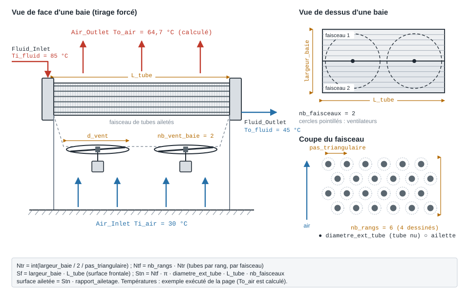
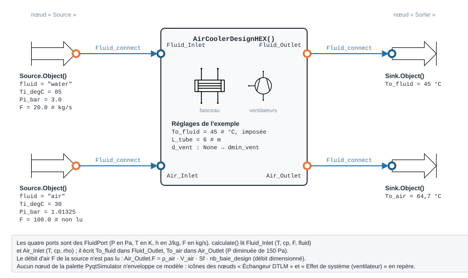
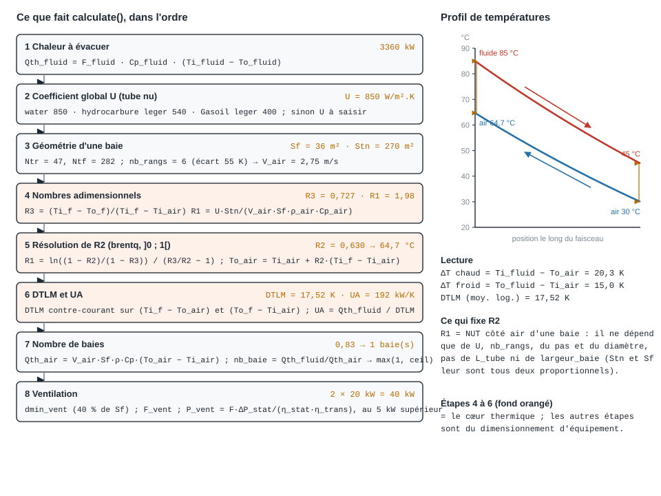

.. _aerorefrigerant:

Aéroréfrigérant
===============

   Une baie d'aéroréfrigérant, vue de face, de dessus et en coupe ; paramètres
   sous leur nom de code, températures de l'exemple exécuté ci-dessous.

À quoi ça sert
--------------

Un **aéroréfrigérant** (*air cooler*, *dry cooler*) refroidit un fluide de
procédé — eau d'un circuit fermé, hydrocarbure, huile — **par l'air ambiant**,
sans eau d'appoint ni panache : le fluide circule dans un **faisceau de tubes
ailetés**, et des **ventilateurs** soufflent l'air à travers le faisceau. C'est
l'alternative sèche à la tour de refroidissement : pas de consommation d'eau ni de
risque légionelle, mais une température de sortie limitée par la température
**sèche** de l'air (et non par la température humide).

Le modèle ``ThermodynamicCycles.HEX.AirCoolerDesignHEX`` est un **outil de
dimensionnement** : on lui donne le débit et la température du fluide à
refroidir, la température de sortie visée et la température d'air de
dimensionnement ; il rend

- la **puissance** à évacuer et la **température de sortie d'air** ;
- la **DTLM** et le **UA** requis ;
- le **nombre de baies** (modules normalisés de ``largeur_baie`` × ``L_tube``),
  la surface au sol, les surfaces d'échange nue et ailetée ;
- la **ventilation** : nombre et diamètre des ventilateurs, débit d'air,
  puissance électrique.

Il ne calcule **pas** de coefficient d'échange à partir de la géométrie : ``U``
est une valeur typique par famille de fluide (850 W/m².K pour l'eau, rapporté à
la surface de **tube nu**), et la vitesse frontale de l'air est tabulée selon le
nombre de rangs — deux barèmes hérités du code d'origine, sans source écrite.

Ports et connexions
-------------------

   Deux lignes de fluide traversent le modèle : le procédé (``Fluid_Inlet`` →
   ``Fluid_Outlet``) et l'air (``Air_Inlet`` → ``Air_Outlet``).

Les quatre ports sont des ``FluidPort`` (voir :doc:`../ports_connexions`) :
l'air est ici un **fluide CoolProp** (``fluid = "air"``), pas un ``AirPort`` de
CTA. ``calculate()`` lit sur ``Fluid_Inlet`` la température, le ``cp``, le débit
et le nom du fluide, et sur ``Air_Inlet`` la température, le ``cp`` et la masse
volumique : ces grandeurs n'existent que si les ports ont été **alimentés par
une source** avec ``Fluid_connect``.

L'aéroréfrigérant n'a **pas de nœud** dans la palette ``PyqtSimulator`` : il se
calcule en Python seulement. Le schéma reprend, pour repère, les icônes des
nœuds « Source », « Sortie », « Échangeur DTLM » et « Effet de système
(ventilateur) ».

Méthode de calcul
-----------------

   Les huit étapes de ``calculate()`` avec les valeurs de l'exemple exécuté, et
   le profil de températures en contre-courant.

Le cœur thermique tient en trois nombres adimensionnels, calculés **pour une
baie** :

.. math::

   R_3 = \frac{T_{i,f} - T_{o,f}}{T_{i,f} - T_{i,air}}, \qquad
   R_1 = \frac{U\,S_{tn}}{V_{air}\,S_f\,\rho_{air}\,c_{p,air}}, \qquad
   R_2 = \frac{T_{o,air} - T_{i,air}}{T_{i,f} - T_{i,air}}

- :math:`R_3` est l'**efficacité côté fluide** : quelle part de l'écart
  disponible le fluide perd ; elle est fixée par le cahier des charges ;
- :math:`R_1` est le **NUT côté air** d'une baie : conductance du faisceau
  rapportée au débit capacitif de l'air qui le traverse ;
- :math:`R_2` est l'**échauffement réduit de l'air**, l'inconnue.

Pour un contre-courant, le bilan :math:`\dot C_{air}(T_{o,air} - T_{i,air}) =
U S_{tn}\,\mathrm{DTLM}` s'écrit

.. math::

   R_1 = \frac{\ln\!\big((1-R_2)/(1-R_3)\big)}{R_3/R_2 - 1}

que le modèle résout en :math:`R_2` par une recherche bornée dans
:math:`]0\,;1[` (``brentq`` — le second membre y croît de 0 à l'infini, la
racine est unique ; une absence de racine lève ``ValueError``), d'où :math:`T_{o,air} = T_{i,air} +
R_2\,(T_{i,f} - T_{i,air})`, puis la DTLM et :math:`UA = Q / \mathrm{DTLM}`. La
chaleur qu'**une** baie évacue, :math:`Q_{air} = V_{air} S_f \rho_{air}
c_{p,air} (T_{o,air} - T_{i,air})`, donne le nombre de baies
:math:`Q_{fluide} / Q_{air}`.

Deux conséquences utiles pour le dimensionnement :

- :math:`R_1` ne dépend **ni de** ``L_tube`` **ni de** ``largeur_baie`` (la
  surface de tube nu et la surface frontale leur sont toutes deux
  proportionnelles) : allonger les tubes ne change pas la température de sortie
  d'air, seulement la chaleur évacuée par baie, donc le nombre de baies ;
- :math:`R_1` dépend du **nombre de rangs** (plus de rangs = plus de surface
  pour la même face, et une vitesse d'air plus faible).

Exemple : refroidir 20 kg/s d'eau de 85 à 45 °C
------------------------------------------------

Circuit d'eau de refroidissement d'un procédé : 20 kg/s à 85 °C, à ramener à
45 °C, par un air de dimensionnement à 30 °C. Tubes de 6 m, géométrie de baie
par défaut (6 m de large, deux faisceaux, deux ventilateurs).

.. code-block:: python

   from ThermodynamicCycles.Source import Source
   from ThermodynamicCycles.Sink import Sink
   from ThermodynamicCycles.HEX.AirCoolerDesignHEX import AirCoolerDesignHEX
   from ThermodynamicCycles.Connect import Fluid_connect

   # 1. Fluide de procédé : eau, 20 kg/s, 85 °C, 3 bar
   eau = Source.Object()
   eau.fluid, eau.Ti_degC, eau.Pi_bar, eau.F = "water", 85, 3.0, 20.0
   eau.calculate()

   # 2. Air ambiant de dimensionnement : 30 °C (son débit F n'est pas lu)
   air = Source.Object()
   air.fluid, air.Ti_degC, air.Pi_bar, air.F = "air", 30, 1.01325, 100.0
   air.calculate()

   # 3. L'aéroréfrigérant
   aero = AirCoolerDesignHEX()
   Fluid_connect(aero.Fluid_Inlet, eau.Outlet)
   Fluid_connect(aero.Air_Inlet, air.Outlet)
   aero.To_fluid = 45            # °C, température de sortie visée (obligatoire)
   aero.L_tube = 6               # m, longueur des tubes
   aero.calculate()

   # 4. Puits en aval des deux lignes
   puits_eau, puits_air = Sink.Object(), Sink.Object()
   Fluid_connect(puits_eau.Inlet, aero.Fluid_Outlet)
   Fluid_connect(puits_air.Inlet, aero.Air_Outlet)
   puits_eau.calculate()
   puits_air.calculate()

   print(f"Chaleur à évacuer      : {aero.Qth_fluid / 1e3:.1f} kW")
   print(f"U (tube nu)            : {aero.U} W/m².K")
   print(f"Rangs / vitesse d'air  : {aero.nb_rangs} rangs, {aero.V_air} m/s")
   print(f"Tubes par rang / fx    : {aero.Ntr} / {aero.Ntf}")
   print(f"Une baie : Sf = {aero.Sf:.0f} m², Stn = {aero.Stn:.1f} m², ailetée = {aero.surface_ailetee:.0f} m²")
   print(f"R3 = {aero.R3:.3f}   R1 = {aero.R1:.3f}   R2 = {aero.R2:.3f}")
   print(f"Sortie d'air           : {puits_air.To_degC:.1f} °C")
   print(f"Sortie d'eau           : {puits_eau.To_degC:.1f} °C")
   print(f"DTLM                   : {aero.DTLM:.2f} K")
   print(f"UA requis              : {aero.UA / 1e3:.1f} kW/K")
   print(f"Chaleur par baie       : {aero.Qth_air / 1e3:.1f} kW")
   print(f"Baies                  : {aero.nb_baie:.3f} calculées -> {aero.nb_baie_design} retenue(s)")
   print(f"Surface au sol         : {aero.S_sol_design:.0f} m²")
   print(f"Ventilateurs           : {aero.nb_vent} x {aero.d_vent:.2f} m, {aero.F_vent_m3h:.0f} m³/h chacun")
   print(f"Débit d'air (sortie)   : {aero.Air_Outlet.F:.1f} kg/s")
   print(f"Puissance électrique   : {aero.P_elec / 1e3:.0f} kW")

Sortie réelle :

.. code-block:: text

   Chaleur à évacuer      : 3360.2 kW
   U (tube nu)            : 850 W/m².K
   Rangs / vitesse d'air  : 6 rangs, 2.75 m/s
   Tubes par rang / fx    : 47 / 282
   Une baie : Sf = 36 m², Stn = 270.0 m², ailetée = 5536 m²
   R3 = 0.727   R1 = 1.978   R2 = 0.630
   Sortie d'air           : 64.7 °C
   Sortie d'eau           : 45.0 °C
   DTLM                   : 17.52 K
   UA requis              : 191.8 kW/K
   Chaleur par baie       : 4027.2 kW
   Baies                  : 0.834 calculées -> 1 retenue(s)
   Surface au sol         : 36 m²
   Ventilateurs           : 2 x 3.03 m, 194040 m³/h chacun
   Débit d'air (sortie)   : 115.3 kg/s
   Puissance électrique   : 40 kW

Lecture :

- **3,36 MW** à évacuer : :math:`\dot m\,c_p\,\Delta T` avec le :math:`c_p` de
  l'eau lu sur le port.
- L'écart d'entrée :math:`T_{i,f} - T_{i,air}` vaut 55 K : le modèle retient
  **6 rangs**, donc une vitesse frontale de 2,75 m/s.
- :math:`R_1 = 1{,}98` : le faisceau réchauffe l'air de 30 à **64,7 °C**, à
  20 K de l'eau entrante ; les deux écarts d'extrémité (20,3 et 15,0 K) donnent
  une DTLM de **17,5 K**.
- Une baie évacue un peu plus de 4 MW : il en faut **0,83**, majoré à **une**
  baie de 6 m × 6 m, soit 20 % de marge sur la surface. Deux ventilateurs de
  3,03 m, **40 kW électriques** au total (puissance arrondie aux 5 kW
  supérieurs par ventilateur, débit ramené à ``TminAmb``).
- ``Air_Outlet`` porte le débit d'air **dimensionné** (masse volumique × vitesse
  × surface frontale × nombre de baies), pas celui de la source d'air.

Paramètres à personnaliser
--------------------------

.. list-table::
   :header-rows: 1
   :widths: 26 14 40 20

   * - Attribut
     - Défaut
     - Effet
     - Plage usuelle
   * - ``Fluid_Inlet`` (source)
     - —
     - fluide, débit, température d'entrée et :math:`c_p` du procédé
     - eau, glycol, huile
   * - ``Air_Inlet`` (source)
     - —
     - température d'air de **dimensionnement** (lue) ; le débit n'est pas lu
     - 25 à 40 °C (été)
   * - ``To_fluid``
     - ``None`` (**requis**)
     - température de sortie visée, en °C ; absente → ``ValueError`` ; doit
       rester entre ``Ti_air`` et ``Ti_fluid``
     - :math:`T_{i,air}` + 8 à 15 K
   * - ``U``
     - ``None`` → 850 / 540 / 400
     - coefficient global sur tube nu ; **à saisir** pour tout fluide autre que
       ``"water"``, ``"hydrocarbure leger"``, ``"Gasoil leger"``
     - 300 à 900 W/m².K
   * - ``L_tube`` / ``L_tube_max``
     - ``3`` / ``18``
     - longueur des tubes (m), plafonnée à ``L_tube_max`` : fixe la chaleur par
       baie, donc le nombre de baies
     - 6 à 12 m
   * - ``largeur_baie``
     - ``6``
     - largeur d'une baie (m) : nombre de tubes par rang
     - 3 à 6 m
   * - ``nb_rangs``
     - ``None`` → déduit
     - rangs de tubes. Laissé à ``None``, déduit de l'écart
       :math:`T_{i,f} - T_{i,air}` : ≤ 10 K → 3 ; ≤ 50 K → 4 ; ≤ 90 K → 6 ;
       au-delà → 7. Il fixe la vitesse d'air : 4 → 3,55 ; 5 → 3,1 ; 6 → 2,75 ;
       7 → 2,5 m/s. Seuls 4 à 7 sont calculables (3 → ``ValueError``) ; une
       valeur posée est respectée
     - 4 à 7
   * - ``pas_triangulaire`` / ``diametre_ext_tube``
     - ``63.5`` / ``25.4``
     - pas des tubes et diamètre du tube nu (mm)
     - normalisés
   * - ``rapport_ailetage``
     - ``20.5``
     - surface ailetée / surface nue ; n'entre **que** dans la surface ailetée
       affichée, pas dans le calcul thermique
     - 15 à 25
   * - ``nb_faisceaux``
     - ``2``
     - faisceaux par baie : multiplie la surface de tube nu
     - 1 à 3
   * - ``nb_vent_baie``
     - ``2``
     - ventilateurs par baie
     - 2 à 3
   * - ``d_vent``
     - ``None`` → ``dmin_vent``
     - diamètre de ventilateur souhaité (m) ; relevé à ``dmin_vent`` s'il est
       absent ou plus petit (40 % de la surface frontale balayée)
     - 2 à 5 m
   * - ``Pression_statique_ventilateur``
     - ``150``
     - pression statique (Pa) ; aussi retranchée à la pression de ``Air_Outlet``
     - 100 à 250 Pa
   * - ``rendement_statique_ventilateur`` / ``rendement_transmission_ventilateur``
     - ``0.6`` / ``0.95``
     - rendements du ventilateur et de la transmission
     - 0,5 à 0,75 / 0,9 à 0,98
   * - ``TminAmb``
     - ``5``
     - température d'air minimale (°C) : dimensionne le débit volumique et la
       puissance des ventilateurs (air plus dense l'hiver)
     - −10 à 10 °C

Variante : un été à 33 °C
-------------------------

Même installation, dimensionnée pour un air à 33 °C au lieu de 30 °C.

.. code-block:: python

   # variante : air de dimensionnement à 33 °C, tout le reste identique
   air_ete = Source.Object()
   air_ete.fluid, air_ete.Ti_degC, air_ete.Pi_bar, air_ete.F = "air", 33, 1.01325, 100.0
   air_ete.calculate()

   aero_ete = AirCoolerDesignHEX()
   Fluid_connect(aero_ete.Fluid_Inlet, eau.Outlet)
   Fluid_connect(aero_ete.Air_Inlet, air_ete.Outlet)
   aero_ete.To_fluid, aero_ete.L_tube = 45, 6
   aero_ete.calculate()

   for nom, a in (("air 30 °C", aero), ("air 33 °C", aero_ete)):
       print(f"{nom} : {a.nb_rangs} rangs, R3 = {a.R3:.3f}, sortie d'air {a.To_air:.1f} °C, "
             f"DTLM {a.DTLM:.2f} K, UA {a.UA / 1e3:.1f} kW/K, "
             f"baies {a.nb_baie:.3f} -> {a.nb_baie_design}")

Sortie réelle :

.. code-block:: text

   air 30 °C : 6 rangs, R3 = 0.727, sortie d'air 64.7 °C, DTLM 17.52 K, UA 191.8 kW/K, baies 0.834 -> 1
   air 33 °C : 6 rangs, R3 = 0.769, sortie d'air 64.6 °C, DTLM 15.83 K, UA 212.3 kW/K, baies 0.925 -> 1

Trois degrés d'air en plus réduisent la DTLM de 10 % et augmentent d'autant le
UA requis : la baie unique passe de 20 % à **8 % de marge**. C'est la
température d'air de dimensionnement qui fait le prix d'un aéroréfrigérant :
elle se choisit sur les données météo du site (voir :doc:`../008-meteo/index`),
pas sur une moyenne.

Pièges
------

**1. Le nombre de baies est majoré, et il en faut au moins une.**
``nb_baie_design = max(1, ceil(nb_baie))`` : une baie commencée est une baie
entière. Avec des tubes de 12 m, une seule baie suffit largement ; avec des tubes
de 3 m, il en faut deux :

.. code-block:: python

   for L in (12, 3):
       essai = AirCoolerDesignHEX()
       Fluid_connect(essai.Fluid_Inlet, eau.Outlet)
       Fluid_connect(essai.Air_Inlet, air.Outlet)
       essai.To_fluid, essai.L_tube = 45, L
       essai.calculate()
       print(f"L_tube = {L:2d} m : baies {essai.nb_baie:.3f} -> {essai.nb_baie_design}, "
             f"{essai.nb_vent} ventilateurs de {essai.d_vent:.2f} m, {essai.P_elec / 1e3:.0f} kW")

Sortie réelle :

.. code-block:: text

   L_tube = 12 m : baies 0.417 -> 1, 2 ventilateurs de 4.28 m, 70 kW
   L_tube =  3 m : baies 1.669 -> 2, 4 ventilateurs de 2.14 m, 40 kW

La marge de surface qui résulte de la majoration (ici 140 % à 12 m, 20 % à 3 m)
n'est pas redistribuée : le modèle ne recalcule pas la température de sortie
d'eau obtenue avec la surface installée.

**2. Le nombre de rangs change par paliers, et les paliers sont nets.** La règle
(≤ 10 / 50 / 90 K) est appliquée à l'écart **lu sur les ports**, dont la
température est recalculée par CoolProp : un cas nominalement sur une borne
peut tomber d'un côté ou de l'autre à 10⁻¹¹ K près. Eau à 80 °C et air à 30 °C
(50 K « pile ») :

.. code-block:: python

   eau_80 = Source.Object()
   eau_80.fluid, eau_80.Ti_degC, eau_80.Pi_bar, eau_80.F = "water", 80, 3.0, 20.0
   eau_80.calculate()
   borne = AirCoolerDesignHEX()
   Fluid_connect(borne.Fluid_Inlet, eau_80.Outlet)
   Fluid_connect(borne.Air_Inlet, air.Outlet)
   borne.To_fluid, borne.L_tube = 45, 6
   borne.calculate()
   print(f"écart lu = {borne.Ti_fluid - borne.Ti_air!r} K -> {borne.nb_rangs} rangs")

Sortie réelle :

.. code-block:: text

   écart lu = 50.00000000002251 K -> 6 rangs

La règle voudrait 4 rangs à 50 K ; l'arrondi en donne 6. Près d'une borne,
**imposez** ``nb_rangs`` (4 à 7) : le modèle respecte une valeur posée. Le
barème rangs → vitesse d'air et les valeurs de ``U`` sont hérités du code
d'origine **sans source écrite** : ce sont des ordres de grandeur, à remplacer
par les données du constructeur dès qu'on les a.

**3. Au-dessus de 100 °C, la pression de la source compte.** Le port lit
température et :math:`c_p` à la pression de la source : une eau à 165 °C
déclarée à 1 atm serait de la **vapeur**, avec un :math:`c_p` 2,2 fois trop
faible. Donnez à la source une pression qui maintient l'eau liquide (7 bar
au moins à 165 °C).

**4. Autres limites.** ``To_air`` est arrondi au dixième avant la DTLM ;
``Pression_statique_ventilateur`` est **retranchée** à la pression de
``Air_Outlet`` ; ``df`` contient un horodatage et des libellés techniques
(``self.To_air``…), à lire plutôt par attribut ; le modèle suppose un
contre-courant pur, alors qu'un aéroréfrigérant réel est à courants croisés
multi-passes (DTLM à corriger d'un facteur :math:`F \le 1`) ; l'aéroréfrigérant
n'a pas de nœud dans ``PyqtSimulator``.

Renvois
-------

- :doc:`echangeurs` — les autres échangeurs du paquet ``HEX`` (NUT-ε, DTLM
  inverse, pincement) ; l'échangeur DTLM de la palette pour un calcul à deux
  fluides quelconques.
- :doc:`ejecteur_tour_refroidissement` — la tour de refroidissement, alternative
  humide : sortie limitée par la température humide, consommation d'eau.
- :doc:`../ports_connexions` — ``FluidPort``, ``Fluid_connect`` et la pression
  des ports.
- :doc:`../005-aeraulic/index` — pertes de charge côté air.
