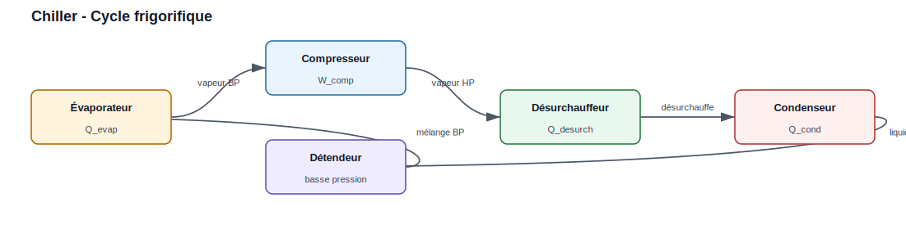
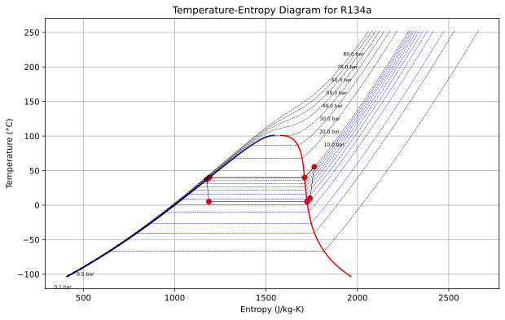
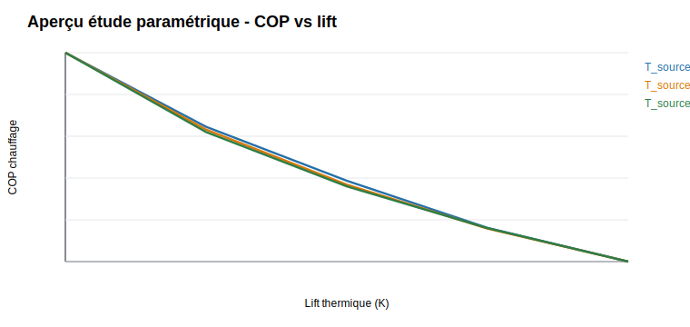

.. _chiller:

Chiller (Groupe froid / PAC)
=============================

Le module ``Chiller`` modélise un cycle frigorifique complet : évaporateur, compresseur, désurchauffeur, condenseur, détendeur. En mode PAC, la chaleur au condenseur est valorisée.

   Le fluide frigorigène traverse successivement l'évaporateur, le
   compresseur, le désurchauffeur, le condenseur et le détendeur.

Paramètres
----------

.. list-table::
   :header-rows: 1

   * - Paramètre
     - Description
     - Unité
   * - fluid
     - Fluide frigorigène
     - "R134a", "R717", "R744"...
   * - evap_params
     - Ti_degC, surchauff, F
     - dict
   * - comp_params
     - Tcond_degC, eta_is, Tdischarge_target
     - dict
   * - cond_params
     - subcooling
     - dict

Exemple
-------

.. code-block:: python

    from ThermodynamicCycles.Chiller import Object as Chiller

    ch = Chiller(
        fluid='R134a',
        evap_params={'Ti_degC': 5, 'surchauff': 5, 'F': 1.0},
        comp_params={'Tcond_degC': 40, 'eta_is': 0.75, 'Tdischarge_target': 90},
        cond_params={'subcooling': 3}
    )
    ch.calculate_cycle()
    print(ch.df)
    ch.plot()

Sortie ``ch.df`` :

.. list-table::
   :widths: 45 30 25
   :header-rows: 1

   * - Indicateur
     - Valeur typique
     - Unité
   * - Fluide
     - R134a
     - -
   * - Température évaporation
     - 5,0
     - degC
   * - Température condensation
     - 40,0
     - degC
   * - Lift thermique
     - 35,0
     - K
   * - EER
     - 3,52
     - -
   * - COP chauffage
     - 4,52
     - -
   * - COP Carnot
     - 8,95
     - -
   * - Efficacité Carnot
     - 50,5
     - %
   * - Puissance compresseur
     - environ 28,4
     - kW
   * - Puissance évaporateur
     - environ 100,0
     - kW
   * - Puissance condenseur totale
     - environ 128,4
     - kW
   * - Température refoulement
     - environ 65,0
     - degC
   * - Pression évaporation
     - 3,50
     - bar
   * - Pression condensation
     - 10,17
     - bar

Plot prévu par l'exemple
~~~~~~~~~~~~~~~~~~~~~~~~

La méthode ``ch.plot()`` affiche le diagramme température-entropie du cycle.
Elle utilise les points calculés pendant ``ch.calculate_cycle()`` et trace les
transformations principales du fluide frigorigène.

   Aperçu du plot attendu : le cycle relie l'évaporation, la compression, la
   désurchauffe, la condensation, la détente et le retour à l'évaporateur.

Étude paramétrique
------------------

Le module fournit aussi ``Chiller.parametric_study(...)`` pour comparer le COP
selon la température source et la température cible.

.. code-block:: python

    from ThermodynamicCycles.Chiller import Object as Chiller

    df_study = Chiller.parametric_study(
        fluid="R134a",
        T_source_range=[0, 5, 10],
        T_cible_range=[35, 40, 45, 50],
        superheat=5,
        subcool=3,
        eta_is=0.78,
        save_fig="chiller_parametric.svg",
    )

    print(df_study)

Résultats à afficher :

.. list-table::
   :widths: 35 45 20
   :header-rows: 1

   * - Résultat
     - Colonne du DataFrame
     - Unité
   * - Température source
     - ``T_source (degC)``
     - degC
   * - Température cible
     - ``T_cible (degC)``
     - degC
   * - Lift thermique
     - ``Lift (K)``
     - K
   * - COP chauffage
     - ``COP``
     - -
   * - Puissance compresseur
     - ``W_comp (kW)``
     - kW
   * - Puissance condenseur
     - ``Q_cond (kW)``
     - kW

Plot prévu par l'étude paramétrique :

   Le plot sauvegardé compare le COP au lift thermique et la puissance
   compresseur à la température cible.

Méthodes
--------

* ``ch.calculate_cycle()`` — Calcule le cycle complet
* ``ch.df`` — DataFrame de synthèse (EER, COP, puissances, pressions)
* ``ch.print_results()`` — Affiche le df de chaque composant
* ``ch.plot()`` — Diagramme T-S du cycle
* ``ch.summary()`` — Synthèse technique du cycle
* ``Chiller.parametric_study(...)`` — Étude paramétrique COP, EER, lift et puissance compresseur
