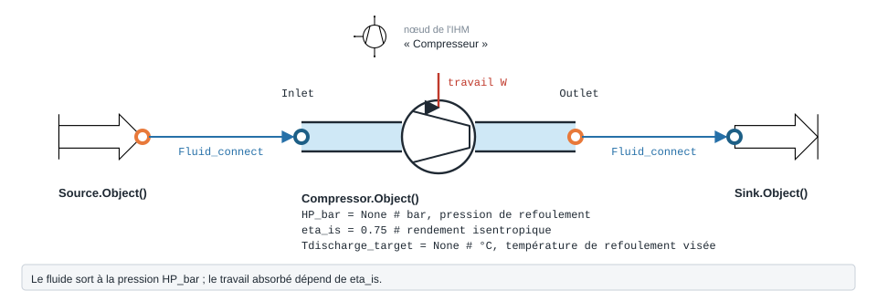

.. _compressor:

Compresseur — Compressor
========================

   Forme, ports et raccordement ; paramètres sous leur nom de code, avec leur valeur par défaut.

Le module ``Compressor`` modélise une compression polytropique. L'état d'entrée
n'est pas saisi directement sur le compresseur : il provient d'un composant amont
(``Source``, échangeur…) **connecté via** ``Fluid_connect(COMP.Inlet, amont.Outlet)``.
La consigne haute pression est donnée par ``HP_bar`` (ou ``Tcond_degC``).

Dans ce chapitre, les explications ``Source`` et ``Sink`` sont intégrées
directement avec les sections :

- **Source (entrée du compresseur)**
- **Puits (sortie du compresseur)**

Paramètres
----------

.. list-table::
   :header-rows: 1

   * - Attribut
     - Description
     - Unité
   * - ``Inlet``
     - Port d'entrée (rempli par ``Fluid_connect`` depuis l'amont)
     - —
   * - ``HP_bar``
     - Pression de refoulement imposée
     - bar
   * - ``Tcond_degC``
     - Alternative à ``HP_bar`` : température de condensation cible
     - °C
   * - ``eta_is``
     - Rendement isentropique (défaut 0,8)
     - —
   * - ``Tdischarge_target``
     - Température de refoulement cible (compresseur refroidi ; ignorée sinon)
     - °C

Exemple
-------

.. code-block:: python

    from ThermodynamicCycles.Source import Source
    from ThermodynamicCycles.Compressor import Compressor
    from ThermodynamicCycles.Connect import Fluid_connect

    # État d'entrée fourni par une Source
    SOURCE = Source.Object()
    SOURCE.Pi_bar = 1.01325
    SOURCE.Ti_degC = 25
    SOURCE.fluid = "air"
    SOURCE.F = 1                 # kg/s
    SOURCE.calculate()

    # Compresseur alimenté par la Source
    COMPRESSOR = Compressor.Object()
    Fluid_connect(COMPRESSOR.Inlet, SOURCE.Outlet)
    COMPRESSOR.HP_bar = 8              # pression de refoulement
    COMPRESSOR.Tdischarge_target = 80  # °C (compresseur refroidi)
    COMPRESSOR.calculate()

    print(COMPRESSOR.df)

Sortie réelle (``COMPRESSOR.df``) :

.. code-block:: text

                         Compressor
    Timestamp                  None
    comp_fluid                  air
    comp_F_kgs                    1
    Q_comp(KW)           321.109431
    Q_losses(KW)         266.775269
    HeatLossesRatio        0.830792
    Tis(°C)              261.805597
    To_is(°C)            261.805597
    H3is(kJ/kg)          665.268117
    T3ref(°C)            338.431681
    To(°C)                     80.0
    Ho(kJ/kg)            478.770206
    So(J/kg-K)             3.454806
    self.Outlet.P (bar)         8.0

Principaux résultats : puissance de compression ``Q_comp`` ≈ 321 kW, pertes
thermiques ``Q_losses`` ≈ 267 kW (compresseur refroidi, ``To`` ramenée à 80 °C),
et pression de refoulement ``Outlet.P`` = 8 bar.

.. note::
   Le compresseur ne définit pas ``Pi_bar``/``Ti_degC``/``F`` : ces grandeurs
   viennent du port ``Inlet`` connecté à l'amont. Sans ``Fluid_connect`` ni
   consigne ``HP_bar``/``Tcond_degC``, ``calculate()`` lève une erreur.

Exemple graphique avec PyqtSimulator
------------------------------------

Le même modèle peut être utilisé dans l'interface graphique PyqtSimulator. Le
lancement du module se fait simplement avec l'import suivant :

.. code-block:: python

   from PyqtSimulator import main

En pratique, cet import lance l'application et ouvre l'éditeur de schéma où
vous pouvez placer une ``Source``, connecter un ``Compresseur`` puis visualiser
les résultats dans la fenêtre de configuration.

.. note::
  Insérez ici la capture de la simulation PyqtSimulator lorsque l'image sera
  fournie. La page sera mise à jour avec la figure correspondante.

Source (entrée du compresseur)
------------------------------

En pratique, l'entrée du compresseur est fournie par un composant amont. Le cas
le plus courant est une ``Source`` qui calcule un état thermodynamique cohérent
(pression, température, enthalpie, débit) avant de l'envoyer vers
``COMPRESSOR.Inlet`` via ``Fluid_connect``.

Exemple détaillé de préparation d'entrée :

.. code-block:: python

    from ThermodynamicCycles.Source import Source

    SOURCE = Source.Object()
    SOURCE.Pi_bar = 1.01325
    SOURCE.Ti_degC = 25          # température d'entrée obligatoire
    SOURCE.fluid = "air"
    SOURCE.F = 1                 # débit massique [kg/s]
    SOURCE.calculate()

    print(SOURCE.df)

Sortie réelle (``SOURCE.df``) :

.. code-block:: text

                                Source
    Timestamp      2026-07-04 23:33:33
    fluid                          air
    Ti_degC                       25.0
    Pi_bar                        1.01
    F_Sm3h                      2937.5
    F_Nm3h                 2784.081453
    F_m3h                       3039.7
    F_kgh                         3600
    F_kgs                            1
    F_m3s                        0.844
    F_Sm3s                       0.816
    self.Outlet.h        424436.043917

Le DataFrame de préparation contient : ``Ti_degC`` [°C], ``Pi_bar`` [bar], les
débits (Sm³/h, Nm³/h, m³/h, kg/h, kg/s, m³/s, Sm³/s) et ``Outlet.h`` [J/kg].

.. note::
   ``SOURCE.Ti_degC`` est obligatoire : sans elle, ``calculate()`` lève une
   ``TypeError`` (température à ``None``).

Paramètres de fluide et de débit utilisables en entrée
------------------------------------------------------

**Fluides disponibles dans CoolProp**

**Fluides purs courants :**

- ``'Water'`` - Eau
- ``'Air'`` - Air
- ``'Ammonia'`` (ou ``'NH3'``) - Ammoniac
- ``'CO2'`` (ou ``'CarbonDioxide'``) - Dioxyde de carbone
- ``'Nitrogen'`` (ou ``'N2'``) - Azote
- ``'Oxygen'`` (ou ``'O2'``) - Oxygène
- ``'Hydrogen'`` (ou ``'H2'``) - Hydrogène
- ``'Methane'`` - Méthane
- ``'Propane'`` - Propane
- ``'n-Butane'`` - n-Butane
- ``'IsoButane'`` - Isobutane

**Frigorigènes HFC :**

- ``'R134a'`` - 1,1,1,2-Tétrafluoroéthane
- ``'R32'`` - Difluorométhane
- ``'R125'`` - Pentafluoroéthane
- ``'R143a'`` - 1,1,1-Trifluoroéthane
- ``'R152a'`` - 1,1-Difluoroéthane
- ``'R404A'`` - Mélange (R125/143a/134a)
- ``'R407C'`` - Mélange (R32/125/134a)
- ``'R410A'`` - Mélange (R32/125)
- ``'R507A'`` - Mélange (R125/143a)

**Frigorigènes naturels et autres :**

- ``'R290'`` (ou ``'Propane'``) - Propane
- ``'R600a'`` (ou ``'IsoButane'``) - Isobutane
- ``'R717'`` (ou ``'Ammonia'``) - Ammoniac
- ``'R744'`` (ou ``'CO2'``) - Dioxyde de carbone
- ``'R1234yf'`` - 2,3,3,3-Tétrafluoropropène
- ``'R1234ze(E)'`` - trans-1,3,3,3-Tétrafluoropropène

**Fluides industriels :**

- ``'Toluene'`` - Toluène
- ``'Ethanol'`` - Éthanol
- ``'Acetone'`` - Acétone
- ``'Methanol'`` - Méthanol

.. note::
   Liste complète des fluides :
   http://www.coolprop.org/fluid_properties/PurePseudoPure.html

**Types de débits disponibles** :

- ``F`` : débit massique [kg/s]
- ``F_kgh`` : débit massique [kg/h]
- ``F_Sm3s`` / ``F_Sm3h`` : débit volumique standard [Sm³/s] / [Sm³/h]
- ``F_Nm3s`` / ``F_Nm3h`` : débit volumique normal [Nm³/s] / [Nm³/h]
- ``F_m3s`` / ``F_m3h`` : débit volumique aux conditions d'entrée [m³/s] / [m³/h]

Équations de préparation d'entrée
---------------------------------

Le calcul d'entrée (source amont) repose sur CoolProp et convertit les débits
vers un débit massique, puis calcule l'enthalpie de l'état transmis au
compresseur.

- Débit massique à partir de Sm³/h :

  .. math::
    \dot{m} = \frac{F_{Sm3h}}{3600} \cdot \rho(P_{std}, T_{std})

- Débit massique à partir de Nm³/h :

  .. math::
    \dot{m} = \frac{F_{Nm3h}}{3600} \cdot \rho(P_{std}, T_{norm})

- Débit massique à partir de m³/s :

  .. math::
    \dot{m} = F_{m3s} \cdot \rho(P_{in}, T_{in})

- Enthalpie de l'état transmis :

  .. math::
    h_{out} = \text{PropsSI}('H', 'P', P_{out}, 'T', T_{in}, \text{fluid})

- Qualité du fluide :

  .. math::
    Q = 1 - \frac{H_v - h_{out}}{H_v - H_l}

avec : :math:`\rho` densité, :math:`P_{std}/T_{std}` conditions standards,
:math:`P_{norm}/T_{norm}` conditions normales, et :math:`P_{in}/T_{in}`
conditions d'entrée.

Puits (sortie du compresseur)
-----------------------------

En aval du compresseur, un ``Sink`` termine la ligne de fluide. Il reçoit
l'état de sortie du compresseur via ``Fluid_connect`` et calcule les grandeurs
de bilan (débits, puissance enthalpique, état de phase, température).

Exemple :

.. code-block:: python

    from ThermodynamicCycles.Sink import Sink
    # from ThermodynamicCycles.Connect import Fluid_connect

    SINK = Sink.Object()

    # État d'entrée (normalement : Fluid_connect(SINK.Inlet, COMPRESSOR.Outlet))
    SINK.Inlet.fluid = "air"
    SINK.Inlet.F = 0.334        # kg/s
    SINK.Inlet.P = 101325       # Pa
    SINK.Inlet.h = 420000       # J/kg

    SINK.calculate()

    print(SINK.df)
    print(SINK.To_degC)

Sortie réelle :

.. code-block:: text

                                  Sink
    Timestamp      2026-07-04 23:50:41
    fluid                          air
    F_kgs                        0.334
    Inlet.P(Pa)                 101325
    Inlet.P(bar)                   1.0
    Inlet.h(J/kg)               420000
    H(W)                      140280.0
    fluid_quality                vapor
    Q                         2.050715
    D (kg/m3)                      1.2
    F_Sm3h                       981.0
    F_m3h                       1000.0
    F_kgh                       1202.0

    20.59143900300944

Le ``Sink`` calcule notamment :

- la puissance enthalpique : :math:`H = \dot{m} \times h`,
- la température de sortie ``To_degC``,
- les débits volumiques équivalents,
- l'indicateur d'état ``fluid_quality``.

Pour l'air, ``fluid_quality`` vaut généralement ``vapor`` (``Q > 1``), ce qui
est normal pour un gaz permanent.

Compresseur à cylindrée — Compressor_m
--------------------------------------

**À quoi ça sert.** ``ThermodynamicCycles.Compressor.Compressor_m`` décrit un
compresseur **à piston ou à vis dont on connaît la cylindrée**. Contrairement à
``Compressor``, le débit n'est pas celui de l'amont : il est **imposé par la
machine**, à partir de sa cylindrée, de sa vitesse et de la masse volumique
aspirée. Les deux rendements dépendent du taux de compression
:math:`\tau = HP / P_{asp}` :

.. math::

   \eta_{vol} = a_0 - a_1\,\tau, \qquad
   \eta_{is} = K_1 + \frac{K_2}{\tau} + \frac{K_3}{\tau^2}

.. math::

   N = 60\,\frac{f}{p}\ \text{(tr/min)}, \qquad
   \dot m = \eta_{vol}\cdot cyl\cdot\frac{N}{60}\cdot\rho_{asp}

Dans ``PyqtSimulator``, c'est le nœud « Compresseur volumetrique » (sans accent
— à ne pas confondre avec « Compresseur volumétrique », qui est
``VolumetricCompressor`` ci-dessous ; les deux portent la même icône).

.. code-block:: python

    import contextlib, io
    from ThermodynamicCycles.Source import Source
    from ThermodynamicCycles.Compressor import Compressor_m
    from ThermodynamicCycles.Connect import Fluid_connect

    # Aspiration : R134a à 2 bar et 0 °C (vapeur surchauffée d'environ 10 K)
    ASP = Source.Object()
    ASP.fluid = "R134a"
    ASP.Pi_bar = 2.0
    ASP.Ti_degC = 0
    ASP.F = 0.1                   # kg/s — remplacé par le débit de la cylindrée, voir plus bas
    with contextlib.redirect_stdout(io.StringIO()):
        ASP.calculate()

    CM = Compressor_m.Object()
    Fluid_connect(CM.Inlet, ASP.Outlet)
    CM.HP = 10e5                  # Pa, pression de refoulement
    CM.cyl = 0.0005               # m3 balayés par tour (0,5 L)
    CM.Tdischarge_target = None   # compresseur non refroidi (adiabatique)
    CM.calculate()                # n'imprime plus rien (depuis le 28/09/2026)

    print(CM.df.drop("Timestamp"))
    print(f"Débit imposé par la machine : {CM.F:.4f} kg/s (la source annonçait {ASP.F} kg/s)")
    print(f"Port d'entrée : {CM.Inlet.F:.4f} kg/s ; débit amont remplacé : {CM.F_upstream} kg/s")

Sortie réelle :

.. code-block:: text

                               Compressor_m
    Fluid                             R134a
    eta_is                           0.7943
    VolEff                             0.76
    Taux                                5.0
    F (kg/s)                         0.1813
    F_amont remplace (kg/s)             0.1
    VitesseDeRotation (tr/min)       3000.0
    Inlet.P (bar)                       2.0
    HP (bar)                           10.0
    To_ref (C)                        63.91
    Tdischarge_target (C)       adiabatique
    Pu (W)                           8056.8
    Q_losses (W)                        0.0
    Pth (W)                          6399.8
    Pel (W)                          8056.8
    Débit imposé par la machine : 0.1813 kg/s (la source annonçait 0.1 kg/s)
    Port d'entrée : 0.1813 kg/s ; débit amont remplacé : 0.1 kg/s

Au taux de 5, le rendement volumétrique tombe à 0,76 : sur 25 L/s balayés, seuls
19 L/s de vapeur sont réellement aspirés. ``Pth`` est la puissance isentropique,
``Pu = Pth / eta_is`` la puissance transmise au gaz ; avec ``MecEff = 1`` (défaut)
``Pel`` lui est égale.

Personnaliser Compressor_m
~~~~~~~~~~~~~~~~~~~~~~~~~~

.. list-table::
   :header-rows: 1
   :widths: 24 46 30

   * - Attribut
     - Effet
     - Défaut / plage
   * - ``HP``
     - Pression de refoulement, en **Pa** (pas en bar)
     - 15e5 Pa
   * - ``cyl``
     - Volume balayé par tour
     - 0,02 m³ ; 1e-4 à 1e-2 en froid
   * - ``f``, ``p``
     - Fréquence d'alimentation et nombre de paires de pôles : :math:`N = 60 f/p`
     - 50 Hz, 1 (3000 tr/min)
   * - ``a0``, ``a1``
     - Loi de rendement volumétrique :math:`a_0 - a_1\tau`
     - piston 0,95 / 0,038 ; vis 0,9 / 0,008
   * - ``K1``, ``K2``, ``K3``
     - Loi de rendement isentropique en :math:`1/\tau`
     - 0,8 / 0,0037 / −0,16
   * - ``eta_lim``, ``eta_max``, ``t_max``
     - Alternative aux ``K`` : rendement asymptotique, rendement maximal et taux
       où il est atteint ; les trois doivent être renseignés
     - ``None``
   * - ``MecEff``
     - Rendement mécanique : ``Pel = Pth / (eta_is · MecEff)``
     - 1 (le nœud IHM propose 0,7)
   * - ``Tdischarge_target``
     - Température de refoulement d'un compresseur **refroidi** ; ``None``, ou une
       valeur supérieure à ``To_ref``, donne un compresseur adiabatique
     - 80 °C

.. code-block:: python

    # variante : même machine, refoulement à 14 bar au lieu de 10
    CM14 = Compressor_m.Object()
    Fluid_connect(CM14.Inlet, ASP.Outlet)
    CM14.HP = 14e5
    CM14.cyl = 0.0005
    CM14.Tdischarge_target = None
    CM14.calculate()
    print(f"Taux {CM.Taux:.1f} -> {CM14.Taux:.1f}")
    print(f"Rendement volumétrique {CM.VolEff:.3f} -> {CM14.VolEff:.3f}")
    print(f"Débit {CM.F:.4f} -> {CM14.F:.4f} kg/s")
    print(f"Puissance {CM.Pel/1000:.2f} -> {CM14.Pel/1000:.2f} kW")

Sortie réelle :

.. code-block:: text

    Taux 5.0 -> 7.0
    Rendement volumétrique 0.760 -> 0.684
    Débit 0.1813 -> 0.1632 kg/s
    Puissance 8.06 -> 8.77 kW

.. warning::

   - **Le débit est imposé par la cylindrée**, pas par l'amont. Depuis le
     28/09/2026, ``calculate()`` aligne ``Inlet.F`` sur ce débit (le bilan de
     masse du composant est tenu) et garde le débit que portait le port
     d'entrée dans ``CM.F_upstream`` et dans la ligne ``F_amont remplace`` du
     ``df`` : l'écart se lit, il n'est plus silencieux. La source amont, elle,
     n'est pas modifiée ; c'est à vous de l'accorder.
   - ``calculate()`` n'imprime plus ses résultats intermédiaires (il en
     imprimait 9 lignes jusqu'au 28/09/2026).
   - Au-delà de :math:`	au = a_0/a_1` (25 avec les défauts), le rendement
     volumétrique deviendrait négatif : ``calculate()`` lève désormais
     ``ValueError`` au lieu de rendre un débit négatif.

Compresseur à rapport volumétrique — VolumetricCompressor
---------------------------------------------------------

**À quoi ça sert.** ``ThermodynamicCycles.Compressor.VolumetricCompressor``
représente les machines à **lumières fixes** (vis, lobes, spiro-orbital,
palettes) : elles compriment toujours dans le même rapport de volume
``Rv = V1/V2``, quelle que soit la pression du réseau. Si ``Rv`` ne correspond
pas au taux demandé, la fin de compression interne ``P_i`` diffère de la pression
aval ``P_b`` et un transvasement irréversible coûte du travail (Destoop,
*Techniques de l'Ingénieur* B 4 220) :

.. math::

   w_{ind} = (h_i - h_a) + v_2\,(P_b - P_i), \qquad
   \eta_{th} = \frac{h_{is,b} - h_a}{w_{ind}}, \qquad
   P_{arbre} = \dot m\,\frac{w_{ind}}{\varepsilon_s}

avec :math:`\dot m = \varepsilon_v\,V_s\,f_{rotor}\,\rho_a`. Avec ``Rv = None``
(défaut), la machine est supposée **à clapets**, donc toujours adaptée
(:math:`\eta_{th} = 1`). Le modèle calcule aussi ``Rv_optimal``, le rapport qui
adapterait la machine au point demandé. Nœud IHM : « Compresseur volumétrique ».

.. code-block:: python

    from ThermodynamicCycles.Compressor import VolumetricCompressor

    # Air atmosphérique aspiré à 20 °C, refoulé à 8 bar abs
    AIR = Source.Object()
    AIR.fluid = "air"
    AIR.Pi_bar = 1.0
    AIR.Ti_degC = 20
    AIR.F = 0.1
    with contextlib.redirect_stdout(io.StringIO()):
        AIR.calculate()

    VIS = VolumetricCompressor.Object()
    Fluid_connect(VIS.Inlet, AIR.Outlet)
    VIS.Outlet.P = 8e5        # Pa : pression du réseau, à imposer
    VIS.V_s = 0.002           # m3 par tour du rotor
    VIS.f_rotor = 50.0        # Hz
    VIS.epsilon_v = 0.9       # rendement volumétrique (donnée constructeur)
    VIS.epsilon_s = 0.8       # autres pertes
    VIS.Rv = 3.0              # vis construite pour un taux plus faible
    VIS.calculate()

    print(VIS.df.drop("Timestamp"))

Sortie réelle :

.. code-block:: text

                   VolumetricCompressor
    fluid                           air
    f_rotor_Hz                     50.0
    V_s_m3                        0.002
    V_dot_m3h                     324.0
    m_flow_kgs                 0.106994
    F_upstream_kgs                  0.1
    Ti_degC                        20.0
    Tiso_degC                255.037315
    To_degC                  332.932629
    P_ext_kW                  34.273673
    Pa_bar                          1.0
    Pb_bar                          8.0
    Rv                              3.0
    Rv_optimal                 4.426114
    Pi_bar                     4.652844
    eta_th                     0.931948
    regime             sous-compression
    Q_losses_W                      0.0

La vis de ``Rv = 3`` n'atteint que ``Pi_bar`` ≈ 4,65 bar en fin de compression
interne ; l'air du réseau à 8 bar reflue dans la cellule à l'ouverture de la
lumière (**sous-compression**) et le rendement théorique tombe à 0,93. Le
rapport qui adapterait la machine est ``Rv_optimal`` ≈ 4,43.

Personnaliser VolumetricCompressor
~~~~~~~~~~~~~~~~~~~~~~~~~~~~~~~~~~

.. list-table::
   :header-rows: 1
   :widths: 22 50 28

   * - Attribut
     - Effet
     - Défaut / plage
   * - ``Outlet.P``
     - Pression de refoulement (Pa) — obligatoire
     - —
   * - ``V_s``, ``f_rotor``
     - Volume par tour et fréquence : fixent le débit volumique aspiré
     - 1e-4 m³, 50 Hz
   * - ``epsilon_v``
     - Rendement volumétrique : **donnée d'entrée**, le modèle ne calcule pas les fuites
     - 1,0 ; 0,8 à 0,95 pour une vis
   * - ``epsilon_s``
     - Rendement couvrant les pertes autres que l'inadaptation de ``Rv``
     - 0,7
   * - ``Rv``
     - Rapport volumétrique interne ; ``None`` = machine à clapets, toujours adaptée
     - ``None`` ; 2 à 5 pour une vis d'air
   * - sorties
     - ``m_flow``, ``P_ext`` (W), ``P_i``, ``Rv_optimal``, ``eta_th``, ``regime``
       (``adapte`` / ``sous-compression`` / ``sur-compression``)
     - —

.. code-block:: python

    # variante : balayer Rv de part et d'autre du point d'adaptation
    for rv in (None, 3.0, 4.43, 6.0):
        V = VolumetricCompressor.Object()
        Fluid_connect(V.Inlet, AIR.Outlet)
        V.Outlet.P = 8e5
        V.V_s, V.f_rotor, V.epsilon_v, V.epsilon_s = 0.002, 50.0, 0.9, 0.8
        V.Rv = rv
        V.calculate()
        print(f"Rv = {str(rv):>5} : P_i = {V.P_i/1e5:5.2f} bar, eta_th = {V.eta_th:.3f}, "
              f"P_arbre = {V.P_ext/1000:.2f} kW, {V.regime}")

Sortie réelle :

.. code-block:: text

    Rv =  None : P_i =  8.00 bar, eta_th = 1.000, P_arbre = 31.94 kW, adapte
    Rv =   3.0 : P_i =  4.65 bar, eta_th = 0.932, P_arbre = 34.27 kW, sous-compression
    Rv =  4.43 : P_i =  8.01 bar, eta_th = 1.000, P_arbre = 31.94 kW, adapte
    Rv =   6.0 : P_i = 12.21 bar, eta_th = 0.963, P_arbre = 33.18 kW, sur-compression

L'optimum est plat : près de ``Rv_optimal`` la perte d'inadaptation disparaît ;
une vis trop longue (``Rv = 6``) sur-comprime et perd aussi (3,7 % de rendement
théorique, contre 6,8 % pour ``Rv = 3``). C'est le calcul à faire avant d'exploiter une vis conçue pour 8 bar
sur un réseau réglé à 6 bar.

.. warning::

   - Le modèle est **adiabatique** : toutes les pertes échauffent le gaz, et
     ``Q_losses`` vaut ``0.0`` après calcul (il était déclaré « si refroidi »
     mais jamais affecté, et restait ``None``, jusqu'au 28/09/2026). Pour un
     compresseur refroidi, voir ``Compressor_m`` (``Tdischarge_target``).
   - Le débit massique est imposé par la cylindrée et réécrit ``Inlet.F`` ; le
     débit que portait l'entrée reste lisible dans ``F_upstream`` (ligne
     ``F_upstream_kgs`` du ``df``).
   - ``Rv <= 0`` lève ``ValueError`` ; quand l'équation d'état ne sait pas
     s'inverser en (s, v) (mélanges), ``P_i`` est estimée par l'exposant
     isentropique local et ``regime`` le signale.
