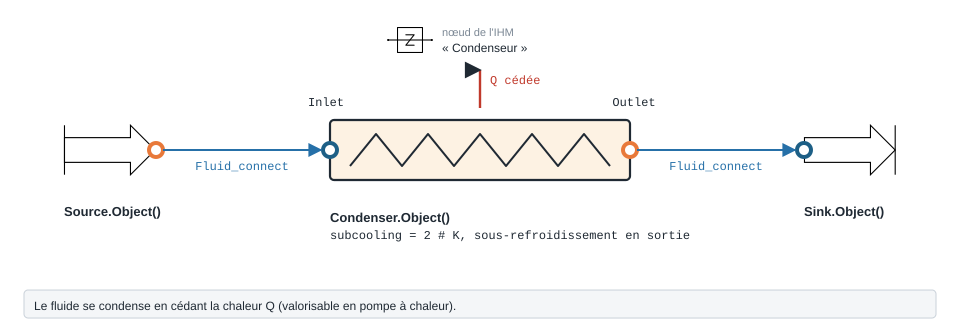
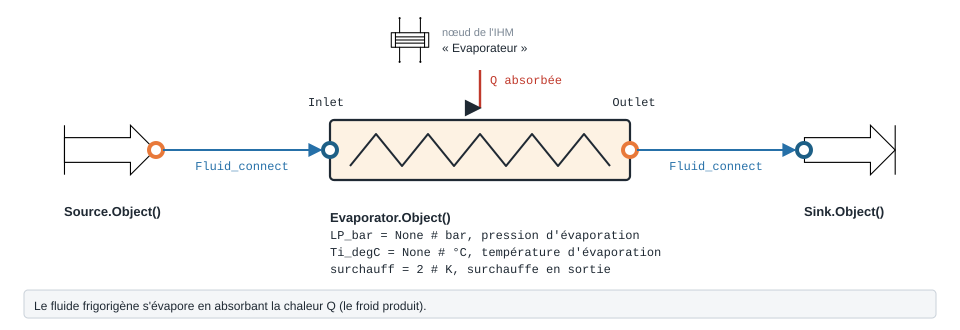

.. _condenseur_evaporateur:

Condenseur, évaporateur et givrage
==================================

Cette page documente les composants d'échange thermique du package
``ThermodynamicCycles`` : le condenseur, l'évaporateur, le refroidisseur
évaporatif (stub) et la famille de modules de givrage ``Frost``. Tous ces
composants échangent avec le reste d'un cycle via des connecteurs
``FluidPort`` (``Inlet`` / ``Outlet``), à l'exception des modules ``Frost`` qui
reçoivent leurs conditions amont sous forme de paramètres scalaires (voir plus
bas).

Rappel sur le connecteur ``FluidPort`` : il porte le fluide (``fluid``), la
pression (``P`` en Pa), l'enthalpie massique (``h`` en J/kg) et le débit
massique (``F`` en kg/s). En mode CoolProp historique, dès que ``P`` et ``h``
sont connus, ``FluidPort`` recalcule automatiquement ``T``, ``S``, ``rho``,
``cp``, ``lamda`` et ``mu``. La connexion entre deux composants se fait par
``Fluid_connect(Aval.Inlet, Amont.Outlet)``.

.. _condenseur:

Condenser (Condenseur)
----------------------

   Forme, ports et raccordement ; paramètres sous leur nom de code, avec leur valeur par défaut.

Rôle
~~~~

Le module ``Condenser`` rejette la chaleur du fluide frigorigène et le condense.
Il reçoit une vapeur (surchauffée ou saturée) à l'entrée et fournit un liquide
sous-refroidi en sortie, à pression constante (``Outlet.P = Inlet.P``). Le calcul
part de la pression d'entrée : les propriétés du liquide saturé sont évaluées à
``Q = 0`` sous cette pression, puis le sous-refroidissement est appliqué.

Connecteurs
~~~~~~~~~~~

* ``Inlet`` — ``FluidPort`` amont (vapeur frigorigène). Le fluide, ``P``, ``h``
  et ``F`` doivent être fournis (typiquement via ``Fluid_connect``).
* ``Outlet`` — ``FluidPort`` aval (liquide sous-refroidi), calculé par le module.

Équations réelles
~~~~~~~~~~~~~~~~~~

Toutes les propriétés sont obtenues par ``ThermoPropsSI`` (routeur type CoolProp).

* Point de liquide saturé à la pression d'entrée (``Q = 0``) :

  .. math::

     T_{l,sat} = T(P_{in}, Q{=}0), \quad
     H_{l,sat} = H(P_{in}, Q{=}0), \quad
     S_{l,sat} = S(P_{in}, Q{=}0)

* Température de sortie avec sous-refroidissement :

  .. math::

     T_o = T_{l,sat} - \text{subcooling}

* Enthalpie / entropie de sortie. Cas particulier fidèle au code : si le
  sous-refroidissement est nul (``subcooling <= 1e-6``), la sortie est le liquide
  saturé lui-même (``Ho = Hl_sat``, ``So = Sl_sat``) — au point de saturation le
  couple ``(P, T)`` est ambigu et ferait échouer CoolProp. Sinon :

  .. math::

     H_o = H(P_{in}, T_o), \quad S_o = S(P_{in}, T_o)

* Bilan enthalpique (chaleur rejetée, positive) :

  .. math::

     Q_{cond} = \dot{F} \, (h_{in} - h_o)

La sortie reprend le fluide, la pression et le débit de l'entrée
(``Outlet.h = Ho``).

Paramètres
~~~~~~~~~~

.. list-table::
   :header-rows: 1

   * - Paramètre
     - Description
     - Unité / défaut
   * - ``subcooling``
     - Sous-refroidissement imposé en sortie (écart sous ``Tl_sat``)
     - K (défaut 2)
   * - ``Inlet``
     - Connecteur ``FluidPort`` amont (fluide, P, h, F)
     - FluidPort
   * - ``Outlet``
     - Connecteur ``FluidPort`` aval (calculé)
     - FluidPort

Sorties principales : ``Tl_sat``, ``Hl_sat``, ``Sl_sat``, ``To``, ``Ho``,
``So``, ``Q_cond`` et le DataFrame de synthèse ``df`` (index : ``fluid``,
``Outlet.F``, ``Tl_sat(°C)``, ``Hl_sat(kJ/kg)``, ``Sl_sat(kJ/kg-K)``,
``To(°C)``, ``Ho(kJ/kg)``, ``So(kJ/kg-K)``, ``Q_cond(kW)``).

Exemple
~~~~~~~

.. code-block:: python

    from ThermodynamicCycles.Condenser import Condenser
    from ThermodynamicCycles.Source import Source
    from ThermodynamicCycles.Connect import Fluid_connect

    SOURCE = Source.Object()
    COND = Condenser.Object()

    # Vapeur surchauffée sortant du compresseur
    SOURCE.fluid = "R134a"
    SOURCE.Ti_degC = 65        # 65 °C
    SOURCE.Pi_bar = 10         # 10 bar (haute pression)
    SOURCE.F_m3h = 100         # débit volumique
    SOURCE.calculate()

    COND.subcooling = 3        # 3 K de sous-refroidissement

    Fluid_connect(COND.Inlet, SOURCE.Outlet)
    COND.calculate()

    print(COND.df)
    print("Chaleur rejetée :", COND.Q_cond / 1000, "kW")

Sortie réelle :

.. code-block:: text

                                     Condenser
   Timestamp        2026-09-28 11:58:42.048852
   fluid                                 R134a
   Outlet.F                           1.173403
   Tl_sat(°C)                        39.387631
   Hl_sat(kJ/kg)                    255.495856
   Sl_sat(kJ/kg-K)                    1.187603
   To(°C)                            36.387631
   Ho(kJ/kg)                        251.038846
   So(kJ/kg-K)                        1.173274
   Q_cond(kW)                       229.682179
   Chaleur rejetée : 229.6821787287314 kW

.. _evaporateur:

Evaporator (Évaporateur)
------------------------

   Forme, ports et raccordement ; paramètres sous leur nom de code, avec leur valeur par défaut.

Rôle
~~~~

Le module ``Evaporator`` évapore le fluide frigorigène à basse pression et
fournit une vapeur surchauffée en sortie, à pression constante. La pression
d'évaporation peut être imposée soit par la température d'évaporation
(``Ti_degC``), soit directement par la basse pression (``LP_bar``). Le module
calcule aussi une discrétisation de la puissance et du profil de température du
fluide le long de l'évaporateur.

Connecteurs
~~~~~~~~~~~

* ``Inlet`` — ``FluidPort`` amont (fluide diphasique en provenance du détendeur).
* ``Outlet`` — ``FluidPort`` aval (vapeur surchauffée), calculé par le module.

Équations réelles
~~~~~~~~~~~~~~~~~~

* Pression d'évaporation (une des deux entrées suffit) :

  .. math::

     P_{evap} = P(T{=}T_{i}, Q{=}0) \ \text{si } T_{i}\ \text{fourni}, \qquad
     P_{evap} = 10^5 \cdot \text{LP\_bar} \ \text{si LP\_bar fourni}

* Points de saturation sous ``P_evap`` :

  .. math::

     T_{sv} = T(P, Q{=}1), \quad T_{l,sat} = T(P, Q{=}0), \quad
     H_{sv} = H(P, Q{=}1), \quad S_{sv} = S(P, Q{=}1)

* Sortie avec surchauffe :

  .. math::

     T_o = T_{sv} + \text{surchauff}, \quad
     H_o = H(P, T_o), \quad S_o = S(P, T_o)

* Bilan enthalpique (chaleur absorbée, positive) :

  .. math::

     Q_{evap} = -\dot{F} \, (h_{in} - h_o) = \dot{F} \, (h_o - h_{in})

* Discrétisation (si ``Q_evap`` non nul) : la puissance est découpée en 20 pas
  ``Qevap_i`` de 0 à ``Q_evap``, et le profil de température du fluide est reconstruit
  point par point :

  .. math::

     T_{fluid,i} = T\!\left(H{=}h_{in} + \frac{Q_{evap,i}}{\dot{F}},\ P\right)

.. note::

   Le bilan côté eau (``Tw_inlet``, ``m_water_flow``, ``Twater_i``, pincement) et
   les attributs ``T1`` / ``T2`` présents dans d'anciens scripts de test sont
   **commentés dans le code actuel** (non actifs). Seul le profil côté fluide
   frigorigène (``Qevap_i``, ``Tfluid_i``) est calculé.

Paramètres
~~~~~~~~~~

.. list-table::
   :header-rows: 1

   * - Paramètre
     - Description
     - Unité / défaut
   * - ``Ti_degC``
     - Température d'évaporation (impose ``P_evap`` via ``Q=0``)
     - °C (défaut ``None``)
   * - ``LP_bar``
     - Basse pression imposée (alternative à ``Ti_degC``)
     - bar (défaut ``None``)
   * - ``fluid``
     - Fluide frigorigène ; si ``None``, repris de ``Inlet.fluid``
     - str (défaut ``None``)
   * - ``surchauff``
     - Surchauffe imposée en sortie (au-dessus de ``Tsv``)
     - K (défaut 2)
   * - ``Inlet`` / ``Outlet``
     - Connecteurs ``FluidPort``
     - FluidPort

Sorties principales : ``Tsv``, ``Tl_sat``, ``Hsv``, ``Ssv``, ``To``, ``Ho``,
``So``, ``Q_evap``, ``Qevap_i``, ``Tfluid_i`` et le DataFrame ``df`` (index :
``fluid``, ``Outlet.F``, ``Pevap(bar)``, ``Tsv(°C)``, ``Hsv(kJ/kg)``,
``Ssv(kJ/kg-K)``, ``To(°C)``, ``Ho(kJ/kg)``, ``So(kJ/kg-K)``, ``Q_evap(kW)``).

Exemple
~~~~~~~

.. code-block:: python

    from ThermodynamicCycles.Evaporator import Evaporator
    from ThermodynamicCycles.Source import Source
    from ThermodynamicCycles.Connect import Fluid_connect

    SOURCE = Source.Object()
    EVAP = Evaporator.Object()

    SOURCE.fluid = "R134a"
    SOURCE.Ti_degC = 0
    SOURCE.Pi_bar = 3
    SOURCE.F = 1               # kg/s
    SOURCE.calculate()

    EVAP.surchauff = 5         # 5 K de surchauffe
    Fluid_connect(EVAP.Inlet, SOURCE.Outlet)
    EVAP.calculate()

    print(EVAP.df)
    print("Puissance frigorifique :", EVAP.Q_evap / 1000, "kW")

    # Profil de température du fluide le long de l'évaporateur
    import matplotlib.pyplot as plt
    plt.plot(EVAP.Qevap_i, EVAP.Tfluid_i)
    plt.show()

Sortie réelle :

.. code-block:: text

                                 Evaporator
   Timestamp     2026-09-28 11:58:52.996101
   fluid                              R134a
   Outlet.F                               1
   Pevap(bar)                           3.0
   Tsv(°C)                         0.672064
   Hsv(kJ/kg)                     398.99515
   Ssv(kJ/kg-K)                    1.726715
   To(°C)                          5.672064
   Ho(kJ/kg)                     403.476789
   So(kJ/kg-K)                     1.742935
   Q_evap(kW)                    203.475164
   Puissance frigorifique : 203.47516440325376 kW

.. _evaporative_cooler:

EvaporativeCooler (Refroidisseur évaporatif)
--------------------------------------------

.. warning::

   **Module non implémenté (stub).** Le package
   ``ThermodynamicCycles/EvaporativeCooler/`` ne contient qu'un fichier
   ``__init__.py`` **vide** : aucune classe, aucune équation, aucun paramètre.
   Aucun modèle de refroidissement évaporatif n'est disponible à ce jour dans le
   code. Cette section est un emplacement réservé.

   Pour un traitement de l'air humide (flux sensible / latent, humidité
   absolue, déshumidification), voir les modules ``Frost`` ci-dessous, qui
   contiennent la physique d'air humide effectivement implémentée.

.. _frost:

Frost (Givrage des échangeurs)
------------------------------

Rôle
~~~~

Le package ``Frost`` modélise le **givrage d'un échangeur tube-ailettes** en
fonctionnement à basse température (évaporateurs / batteries froides sous 0 °C).
Il reproduit fidèlement le modèle de thèse Hadid (2012,
``pastel.hal.science/tel-01674498v1``, chapitre 2 §6), avec des corrélations
validées expérimentalement (60 essais maquettes M01–M04). Le composant intégré
principal est ``FrostedFinnedTubeHEX`` ; les autres modules sont ses briques ou
des variantes autonomes portées depuis un modèle Modelica.

Modules du package
~~~~~~~~~~~~~~~~~~~

.. list-table::
   :header-rows: 1

   * - Module
     - Rôle
   * - ``FrostedFinnedTubeHEX``
     - Échangeur tube-ailettes givrant complet (air humide + réfrigérant +
       croissance du givre + pertes de charge). Composant de haut niveau.
   * - ``CroissanceDuGivre``
     - Modèle dynamique 1D autonome de croissance du givre (Nx nœuds, port
       Modelica ``Croissance_Du_Givre.CroissanceDuGivre``).
   * - ``TubeFinGeometry``
     - Géométrie tube à ailettes rondes ; calcule surfaces, sections et
       épaisseur d'ailette effective ``Y_eff = Y0 + 2·delta_f``.
   * - ``Air``
     - Conditions amont air humide : flux sensible / latent, ``h_a``, ``h_m``
       (port Modelica ``Air``).
   * - ``Fin``
     - Ailette froide : fournit ``Tp`` (paroi) et ``A_T`` (port Modelica ``Fin``).
   * - ``correlations``
     - Corrélations de base : ``Kff`` (conductivité givre, Yonko-Sepsy),
       ``rho_ff`` (densité givre, Hayashi 1977), ``ECKERT_DRAKE`` (diffusion
       vapeur-air), ``Pvsat`` (ASHRAE 2005), ``Humid_absolue``, ``Nu_Plaque``,
       ``Colburn_Factor``…
   * - ``correlations_thesis``
     - Corrélations recalées de la thèse : Briggs-Young (nu / givrée),
       fonction de Lewis Hadid, coefficient de transfert de masse,
       Sieder-Tate / Dittus-Boelter (interne), Vampola (pertes de charge givrées).

FrostedFinnedTubeHEX
~~~~~~~~~~~~~~~~~~~~~

**Connecteurs.** Contrairement au condenseur / évaporateur, ce module
**n'utilise pas de** ``FluidPort`` (le ``FluidPort`` ne porte pas l'humidité).
Les conditions amont sont passées en **paramètres scalaires** de la classe :
côté air (``T_in_air``, ``P_air``, ``HR_in``, ``m_a``) et côté réfrigérant /
frigoporteur (``fluid_ref``, ``T_in_ref``, ``P_ref``, ``m_ref``). Les grandeurs
aval (``T_out_air``, ``HR_out``, ``T_out_ref``) sont des attributs de sortie.
La géométrie est fournie par l'instance ``self.geom = TubeFinGeometry()``.

**Chaîne de couplage physique :**

::

   Air humide --[h_a, h_m]--> [givre] --[Kff/delta_f]--> ailette --[Tube]--> réfrigérant

**Équations réelles (air humide).** À chaque appel de ``calculate()`` :

* Coefficient convectif air ``h_a`` via Briggs-Young (givrée ou sèche selon
  ``use_frosted_correlation``) : ``Nu_air`` puis ``h_a = Nu_air · k_a / d_r``.
  Le nombre de Reynolds utilise la vitesse à section minimale
  ``V_max = V_face · (S_face / S_min)`` (effet venturi inter-ailettes).
* Coefficient de transfert de masse ``h_m`` via la fonction de Lewis recalée
  Hadid : ``S_super`` (sursaturation) → ``Le_f`` → ``h_m``.
* Pression et humidité absolue amont :

  .. math::

     P_{v,in} = HR_{in} \cdot P_{vsat}(T_{in,air}), \qquad
     w_{in} = \frac{0.62198 \, P_v}{101300 - HR \, P_v}

* Flux sensible et latent sur la surface d'échange totale ``A_T_total`` :

  .. math::

     Q_{sens} = h_a \, A_T \, (T_{in,air} - T_s)

  .. math::

     Q_{lat} = h_m \, A_T \, L_{sv} \, (w_{in} - w_s), \qquad w_s = w(P_{vsat}(T_s))

  .. math::

     Q_{total} = Q_{sens} + Q_{lat}, \qquad \dot{m}_f = \frac{Q_{lat}}{L_{sv}}

* Air en sortie (refroidissement + déshumidification) :

  .. math::

     T_{out,air} = T_{in,air} - \frac{Q_{sens}}{\dot{m}_a \, C_{p,a}}, \qquad
     w_{out} = w_{in} - \frac{\dot{m}_f}{\dot{m}_a}

  puis conversion ``w_out → HR_out`` à ``T_out_air``. Seule la chaleur
  sensible refroidit l'air ; la chaleur latente part avec la vapeur déposée en
  givre et rejoint le frigoporteur (``T_out_ref`` reçoit ``Q_total``).

**Chaîne de résistances thermiques** (paroi) :
``R_air + R_givre + R_tube + R_ref`` avec
``R_givre = delta_f / (Kff(rho_f) · A_T)`` et
``R_tube = ln(d_r/d_i) / (2π · k_tube · L_T · N_T)`` ; d'où ``Ts``, ``Tp``
(paroi ailette) et ``T_out_ref = T_in_ref + Q_total/(m_ref·Cp_ref)``.

**Croissance du givre (état dynamique).** Un solveur ``fsolve`` résout le profil
de température dans la couche de givre (``Nx_frost`` nœuds 1D). Les états
persistants entre appels sont intégrés par Euler explicite sur le pas ``t`` :

.. math::

   \frac{d(\delta_f)}{dt} = \frac{\dot{m}_\delta}{A_T \, \rho_f}, \quad
   \frac{d(\rho_f)}{dt} = \frac{\dot{m}_\rho}{A_T \, \delta_f}, \quad
   \frac{d(Frost)}{dt} = \dot{m}_f

où ``m_f`` est réparti entre densification (``m_rho``) et croissance
d'épaisseur (``m_delta``). La densité du givre est bornée
(``10 ≤ rho_f ≤ 0.95·917`` kg/m³).

**Pertes de charge côté air** : corrélation Vampola modifiée Hadid
(``Vampola_dP_frosted``), avec repli sur Robinson-Briggs (sec) si échec.

Paramètres principaux (``__init__``)
~~~~~~~~~~~~~~~~~~~~~~~~~~~~~~~~~~~~~

.. list-table::
   :header-rows: 1

   * - Paramètre
     - Description
     - Unité / défaut
   * - ``T_in_air``
     - Température d'air amont
     - K (286.0)
   * - ``P_air``
     - Pression air
     - Pa (101325)
   * - ``HR_in``
     - Humidité relative amont
     - – (0.50)
   * - ``m_a``
     - Débit d'air total (peut chuter avec ``dP``)
     - kg/s (0.22)
   * - ``use_frosted_correlation``
     - Corrélation air givrée (eq 2.91) vs sèche (eq 2.83)
     - bool (True)
   * - ``fluid_ref``
     - Fluide côté réfrigérant / frigoporteur (``'water'``, ``'R134a'``…)
     - str ('water')
   * - ``T_in_ref``
     - Température réfrigérant amont
     - K (233.15 = −40 °C)
   * - ``P_ref``
     - Pression réfrigérant
     - Pa (2e5)
   * - ``m_ref``
     - Débit réfrigérant
     - kg/s (0.5)
   * - ``Cp_a`` / ``rho_a`` / ``mu_a`` / ``k_a`` / ``Lsv``
     - Constantes air sec / chaleur latente de sublimation
     - SI (1006 / 1.198 / 1.82e-5 / 0.02581 / 2834.5e3)
   * - ``t``
     - Pas de temps d'intégration
     - s (60.0)
   * - ``n_substeps_frost``
     - Sous-pas du solveur givre
     - – (30)
   * - ``delta_f``
     - Épaisseur initiale de givre (état dynamique)
     - m (1e-5)
   * - ``rho_f``
     - Densité initiale de givre (état dynamique)
     - kg/m³ (25.0)
   * - ``Frost``
     - Masse cumulée de givre (état dynamique)
     - kg (0.0)
   * - ``Nx_frost``
     - Nombre de nœuds dans la couche de givre
     - – (4)

Le DataFrame ``df`` restitue notamment : ``delta_f_mm``, ``rho_f``, ``Frost_g``,
``Tair_in/out_degC``, ``Tref_in/out_degC``, ``Ts_givre_degC``, ``Tp_paroi_degC``,
``HR_in``, ``HR_out``, ``S_super``, ``Le_f``, ``V_face``, ``V_max``,
``Re_d_air``, ``Re_ref``, ``h_a_W_m2K``, ``h_m_kg_m2s``, ``h_i_W_m2K``,
``Q_sens_W``, ``Q_lat_W``, ``Q_total_W``, ``dP_air_Pa``, ``m_f_mg_s``, etc.

Exemple
~~~~~~~

.. code-block:: python

    from ThermodynamicCycles.Frost.FrostedFinnedTubeHEX import Object as FrostedHEX

    hx = FrostedHEX()

    # Conditions air humide amont
    hx.T_in_air = 286.0        # K (13 °C)
    hx.HR_in = 0.80            # 80 % HR
    hx.m_a = 0.22             # kg/s

    # Côté frigoporteur (saumure) à -40 °C
    hx.fluid_ref = 'water'
    hx.T_in_ref = 233.15       # K
    hx.m_ref = 0.5            # kg/s

    hx.t = 60.0               # pas de temps : 60 s

    # 30 pas de 60 s = 30 min de givrage (état dynamique persistant)
    for _ in range(30):
        hx.calculate()

    print(hx.df)
    print("Épaisseur de givre :", hx.delta_f * 1000, "mm")
    print("Masse de givre cumulée :", hx.Frost * 1000, "g")
    print("Perte de charge air :", hx.dP_air, "Pa")

Sortie réelle :

.. code-block:: text

                  FrostedFinnedTubeHEX
   Timestamp                       NaN
   delta_f_mm                 0.930070
   rho_f                     39.446217
   Frost_g                  941.302929
   Tair_in_degC              12.850000
   Tair_out_degC              1.813715
   Tref_in_degC             -40.000000
   Tref_out_degC            -37.781029
   Ts_givre_degC            -20.833687
   Tp_paroi_degC            -22.425069
   HR_in                      0.800000
   HR_out                     1.349998
   S_super                    0.919686
   Le_f                       1.451934
   V_face                     0.177901
   V_max                      0.882836
   Re_d_air                1476.044134
   Re_ref                   187.824470
   h_a_W_m2K                  2.807023
   h_m_kg_m2s                 0.001922
   h_i_W_m2K                200.856852
   Q_sens_W                2442.550695
   Q_lat_W                  952.475143
   Q_total_W               3395.025838
   dP_air_Pa                  1.074960
   m_f_mg_s                 336.029333
   A_T_m2                     1.614574
   s_mm                       0.408248
   Y_eff_mm                   2.131752
   Épaisseur de givre : 0.930069941947541 mm
   Masse de givre cumulée : 941.3029286820102 g
   Perte de charge air : 1.0749603974611779 Pa

.. warning::

   ``HR_out`` vaut encore **1,35** (135 % d'humidité relative) : l'air de
   sortie est **sursaturé**. Le modèle est à paramètres localisés (un seul
   ``Q_sens`` calculé sur ``T_in_air − Ts``, sans profil le long de la
   batterie) ; il ne décrit pas le brouillard qui se formerait. L'écart est
   signalé : ``hx.sursature_out`` vaut ``True`` et ``calculate()`` émet un
   ``RuntimeWarning``. Ne reprenez pas ``Tair_out_degC`` ni ``HR_out`` dans un
   dimensionnement ; les autres grandeurs (givre, flux, perte de charge) ne sont
   pas concernées.

   Jusqu'au 28/09/2026, la température de sortie retranchait ``Q_total_W``,
   chaleur latente comprise : l'air sortait à −2,49 °C et ``HR_out`` valait
   1,89. Avec la seule part sensible, il sort à +1,81 °C.

CroissanceDuGivre (modèle 1D autonome)
~~~~~~~~~~~~~~~~~~~~~~~~~~~~~~~~~~~~~~~

Modèle de croissance du givre discrétisé en ``Nx`` nœuds (défaut 10), utilisable
seul. Entrées : température de paroi ``Tp``, surface ``A_T``, flux sensible
``Qsens_in`` et latent ``Qlat_in`` (fournis par les modules ``Fin`` et ``Air``).
À chaque pas :

* résolution du profil ``T[1..Nx]`` par ``fsolve`` (conduction ``Kff(rho_f)`` +
  diffusion de vapeur avec terme latent ``Lsv·Mu·f[i]·(T[i+1]−T[i])``, conditions
  limites paroi ``T[0]=Tp`` et surface ``Q_sens``) ;
* répartition du flux massique ``m_f = Qlat_in / Lsv`` en ``m_rho``
  (densification) et ``m_delta`` (croissance) ;
* intégration Euler explicite de ``delta_f``, ``rho_f`` et ``Frost`` (mêmes
  équations que ci-dessus).

État persistant entre appels : ``T`` (profil), ``delta_f``, ``rho_f``, ``Frost``.
Le DataFrame ``df`` fournit ``Tp_degC``, ``Ts_degC``, ``A_T_m2``, ``delta_f_mm``,
``rho_f_kgm3``, ``Frost_kg``, ``m_f_mgs``, ``m_delta_mgs``, ``m_rho_mgs``,
``Mu``, ``Kff_W_mK``, ``Q_fin_W``.
