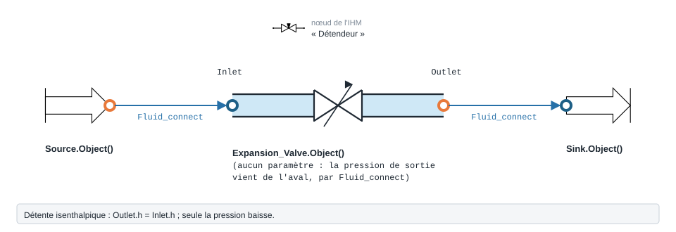

.. _detente_distributeurs:

Détente et distributeurs directionnels
======================================

Cette page documente deux familles de composants backend d'``EnergySystemModels`` :

- le **détendeur** (``ThermodynamicCycles.Expansion_Valve``), qui réalise une
  détente **isenthalpique** d'un fluide ;
- les **distributeurs directionnels** (``ThermodynamicCycles.DirectionalControl``),
  qui **routent** un fluide entre les ports P, A, B et T selon un état logique
  (vannes 3/2, 4/2, 4/3).

Tous ces modèles s'appuient sur le connecteur commun ``FluidPort`` (fluide,
pression :math:`P` en Pa, enthalpie massique :math:`h` en J/kg, débit massique
:math:`F` en kg/s). La méthode ``calculate()`` propage l'état d'un port amont vers
un port aval.

.. _expansion_valve:

Détendeur / vanne d'expansion (``Expansion_Valve``)
---------------------------------------------------

   Forme, ports et raccordement ; paramètres sous leur nom de code, avec leur valeur par défaut.

Rôle
~~~~

Le détendeur modélise la **détente isenthalpique** (laminage, sans travail
extérieur) d'un fluide entre une haute pression amont et une basse pression aval.
C'est l'organe de détente classique d'un cycle frigorifique.

Connecteurs / ports
~~~~~~~~~~~~~~~~~~~~~

.. list-table::
   :header-rows: 1
   :widths: 20 20 60

   * - Port
     - Type
     - Rôle
   * - ``Inlet``
     - ``FluidPort``
     - Entrée haute pression (fluide, :math:`h`, :math:`P`, :math:`F` fixés en amont).
   * - ``Outlet``
     - ``FluidPort``
     - Sortie basse pression. La pression ``Outlet.P`` doit être **imposée par
       l'utilisateur** (basse pression cible) avant l'appel à ``calculate()``.

Équations réelles
~~~~~~~~~~~~~~~~~~

La détente est **isenthalpique** : l'enthalpie est conservée, seule la pression
change (imposée à ``Outlet.P``). Le code exécute exactement :

.. math::

   h_{out} &= h_{in} \\
   T_{out} &= \mathrm{ThermoPropsSI}(T \mid P_{out},\, h_{out},\, \text{fluide}) \\
   S_{out} &= \mathrm{ThermoPropsSI}(S \mid P_{out},\, h_{out},\, \text{fluide}) \\
   F_{out} &= F_{in}

La puissance d'échange avec l'extérieur est nulle par construction (détente sans
travail extérieur) ; le modèle la calcule néanmoins et la stocke dans ``Q_exp`` :

.. math::

   Q_{exp} = F_{in} \cdot (h_{out} - h_{in}) = 0

Le fluide de sortie est identique à celui d'entrée
(``Outlet.fluid = Inlet.fluid``), puis ``Outlet.calculate_properties()`` complète
les propriétés (température, entropie, densité...).

Paramètres et attributs
~~~~~~~~~~~~~~~~~~~~~~~~~

Le constructeur ``__init__`` ne prend **aucun argument** ; les attributs sont
renseignés directement.

.. list-table::
   :header-rows: 1
   :widths: 22 20 58

   * - Attribut
     - Unité
     - Description
   * - ``Inlet``
     - ``FluidPort``
     - Port d'entrée (fluide, :math:`h`, :math:`P`, :math:`F`).
   * - ``Outlet``
     - ``FluidPort``
     - Port de sortie ; ``Outlet.P`` (basse pression) est à imposer avant calcul.
   * - ``Q_exp``
     - W
     - Puissance de détente (nulle par construction), calculée à l'appel.
   * - ``df``
     - ``DataFrame``
     - Synthèse (fluide, ``Outlet.F``, ``To(°C)``, ``Ho (kJ/kg)``, ``So(kJ/kg-K)``).

Exemple
~~~~~~~

.. code-block:: python

    from ThermodynamicCycles.Expansion_Valve import Expansion_Valve
    from ThermodynamicCycles.FluidPort.FluidPort import ThermoPropsSI

    detendeur = Expansion_Valve.Object()

    # Entrée : R134a liquide à la haute pression (ex. 10 bar)
    detendeur.Inlet.fluid = "R134a"
    detendeur.Inlet.F = 1.0                        # kg/s
    detendeur.Inlet.P = 10.17e5                     # Pa (haute pression)
    detendeur.Inlet.h = ThermoPropsSI("H", "P", 10.17e5, "T", 40 + 273.15, "R134a")

    # Basse pression cible imposée sur la sortie (ex. 3,5 bar)
    detendeur.Outlet.P = 3.5e5                       # Pa

    detendeur.calculate()
    print(detendeur.df)
    print("Q_exp =", detendeur.Q_exp, "W")          # ~ 0 (isenthalpique)

Sortie réelle :

.. code-block:: text

                           Expansion_Valve
   Timestamp    2026-09-28 11:58:04.096158
   fluid                             R134a
   Outlet.F                            1.0
   To(°C)                         5.028072
   Ho (kJ/kg)                   256.409166
   So(kJ/kg-K)                    1.202842
   Q_exp = 0.0 W

.. note::
   L'enthalpie ``Inlet.h`` (et la pression ``Outlet.P``) doivent être fixées avant
   ``calculate()``. Dans un cycle complet (voir :ref:`chiller`), ces valeurs sont
   propagées automatiquement depuis le condenseur en amont.

.. _directional_control:

Distributeurs directionnels (``DirectionalControl``)
----------------------------------------------------

Les distributeurs directionnels sont des **vannes de routage** (portage
Modelica ``DirectionalControl``). Ils ne modifient ni l'enthalpie ni la pression :
ils **recopient** l'état d'un port source vers un port destination selon un état
logique ``u``. Chaque modèle nomme ses ports d'après la convention hydraulique
standard :

- **P** : pression / alimentation (supply, en provenance de la pompe) ;
- **T** : retour réservoir (tank) ;
- **A**, **B** : ports utilisateur (côté actionneur).

Le routage transmet ``fluid``, ``P``, ``h`` et ``F`` du port source au port
destination ; le port non actif n'est pas alimenté. Le résultat est résumé dans
``df`` (dont la clé ``route`` donne le chemin actif).

.. _dcv_3_2:

DCV 3/2 — 3 voies, 2 positions (``DCV_3_2``)
~~~~~~~~~~~~~~~~~~~~~~~~~~~~~~~~~~~~~~~~~~~~~~

**Rôle** : sélectionner l'une de deux sources d'alimentation alternatives (P ou T)
vers un port commun A, piloté par un booléen ``u``.

**Ports** : ``Inlet_P`` et ``Inlet_T`` (deux entrées alternatives), ``Outlet_A``
(sortie commune). Type ``FluidPort``.

**Routage** (état logique ``u`` booléen) :

.. list-table::
   :header-rows: 1
   :widths: 20 30 50

   * - ``u``
     - Chemin (``route``)
     - Description
   * - ``False`` (repos)
     - ``P -> A``
     - ``Outlet_A`` alimenté par ``Inlet_P`` ; T isolé.
   * - ``True`` (activé)
     - ``T -> A``
     - ``Outlet_A`` alimenté par ``Inlet_T`` ; P isolé.

Le port actif recopie ``fluid``, ``P``, ``h`` et ``F`` vers ``Outlet_A`` (si le
débit source est ``None``, il est ramené à ``0.0``).

.. list-table:: Attributs (``__init__``)
   :header-rows: 1
   :widths: 22 20 58

   * - Attribut
     - Type / défaut
     - Description
   * - ``Inlet_P``
     - ``FluidPort``
     - Entrée alimentation P.
   * - ``Inlet_T``
     - ``FluidPort``
     - Entrée alternative T (retour réservoir).
   * - ``Outlet_A``
     - ``FluidPort``
     - Sortie commune (port utilisateur).
   * - ``u``
     - ``bool`` = ``False``
     - État logique : ``False`` → P→A, ``True`` → T→A.
   * - ``Timestamp``
     - ``None``
     - Horodatage optionnel (repris dans ``df``).
   * - ``df``
     - ``DataFrame``
     - Synthèse : ``Timestamp``, ``route``, ``u``, ``F_kgs``, ``P_bar``.

.. code-block:: python

    from ThermodynamicCycles.DirectionalControl import DCV_3_2

    v = DCV_3_2.Object()
    v.Inlet_P.fluid = "water"; v.Inlet_P.P = 3e5; v.Inlet_P.h = 1.0e5; v.Inlet_P.F = 1.2
    v.Inlet_T.fluid = "water"; v.Inlet_T.P = 3e5; v.Inlet_T.h = 0.8e5; v.Inlet_T.F = 0.5

    v.u = False        # False : P -> A
    v.calculate()
    print(v.df)        # route = "P->A"

Sortie réelle :

.. code-block:: text

             DCV_3_2
   Timestamp    None
   route        P->A
   u           False
   F_kgs         1.2
   P_bar         3.0

.. _dcv_4_2:

DCV 4/2 — 4 voies, 2 positions (``DCV_4_2``)
~~~~~~~~~~~~~~~~~~~~~~~~~~~~~~~~~~~~~~~~~~~~~~

**Rôle** : distributeur d'actionneur (vérin double effet). Il route
**deux paires** de ports simultanément selon ``u`` — un chemin alimentation
(P→actionneur) et un chemin retour (actionneur→T). Pas de mélange : chaque chemin
est indépendant.

**Ports** : ``Inlet_P`` (alimentation), ``Outlet_T`` (retour réservoir),
``port_A`` et ``port_B`` (ports utilisateur côté actionneur, dont le sens dépend
de ``u``). Type ``FluidPort``.

**Routage** (état logique ``u`` booléen) :

.. list-table::
   :header-rows: 1
   :widths: 20 30 50

   * - ``u``
     - Chemin (``route``)
     - Description
   * - ``False``
     - ``P->A, B->T``
     - P alimente ``port_A`` (sortie) ; ``port_B`` (entrée) revient vers T.
       Vérin qui s'étend.
   * - ``True``
     - ``P->B, A->T``
     - P alimente ``port_B`` (sortie) ; ``port_A`` (entrée) revient vers T.
       Vérin qui se rétracte.

Selon ``u``, le port alimenté (A ou B) recopie l'état de ``Inlet_P`` ; le port de
retour recopie son état vers ``Outlet_T`` (débit ``None`` ramené à ``0.0``).

.. list-table:: Attributs (``__init__``)
   :header-rows: 1
   :widths: 22 20 58

   * - Attribut
     - Type / défaut
     - Description
   * - ``Inlet_P``
     - ``FluidPort``
     - Alimentation (supply, côté pompe).
   * - ``Outlet_T``
     - ``FluidPort``
     - Retour réservoir.
   * - ``port_A``
     - ``FluidPort``
     - Port utilisateur A (entrée ou sortie selon ``u``).
   * - ``port_B``
     - ``FluidPort``
     - Port utilisateur B (entrée ou sortie selon ``u``).
   * - ``u``
     - ``bool`` = ``False``
     - ``False`` → P→A, B→T ; ``True`` → P→B, A→T.
   * - ``Timestamp``
     - ``None``
     - Horodatage optionnel.
   * - ``df``
     - ``DataFrame``
     - Synthèse : ``Timestamp``, ``route``, ``u``, ``F_supply_kgs``.

.. code-block:: python

    from ThermodynamicCycles.DirectionalControl import DCV_4_2

    v = DCV_4_2.Object()
    v.Inlet_P.fluid = "oil"; v.Inlet_P.P = 150e5; v.Inlet_P.h = 1.0e5; v.Inlet_P.F = 0.3
    v.port_B.fluid = "oil"; v.port_B.P = 2e5; v.port_B.h = 0.9e5; v.port_B.F = 0.3

    v.u = False        # P -> A (alimentation), B -> T (retour)
    v.calculate()
    print(v.df)        # route = "P->A, B->T"

Sortie réelle :

.. code-block:: text

                    DCV_4_2
   Timestamp           None
   route         P->A, B->T
   u                  False
   F_supply_kgs         0.3

.. _dcv_4_3_b:

DCV 4/3 centre fermé B — 4 voies, 3 positions (``DCV_4_3_B``)
~~~~~~~~~~~~~~~~~~~~~~~~~~~~~~~~~~~~~~~~~~~~~~~~~~~~~~~~~~~~~~~~

**Rôle** : distributeur d'actionneur à **trois positions** avec un centre de type B
(**centre fermé** : tous les ports bloqués en position neutre). Piloté par un
entier ``u`` dans :math:`\{-1, 0, +1\}`.

**Ports** : ``Inlet_P`` (alimentation), ``Outlet_T`` (retour), ``port_A`` et
``port_B`` (côté actionneur). Type ``FluidPort``.

**Routage** (état logique ``u`` entier) :

.. list-table::
   :header-rows: 1
   :widths: 15 30 55

   * - ``u``
     - Chemin (``route``)
     - Description
   * - ``+1``
     - ``P->A, B->T``
     - Mouvement direct : P alimente A, B revient vers T.
   * - ``0``
     - ``centre bloque``
     - Centre fermé (type B) : ``port_A.F = port_B.F = Outlet_T.F = 0.0``.
       Aucun transfert.
   * - ``-1``
     - ``P->B, A->T``
     - Mouvement inverse : P alimente B, A revient vers T.

En position neutre (``u = 0``), seuls les débits sont forcés à ``0.0`` (tous les
ports bloqués). Dans les positions ``+1`` / ``-1``, le routage recopie ``fluid``,
``P``, ``h`` et ``F`` comme pour le DCV 4/2.

.. list-table:: Attributs (``__init__``)
   :header-rows: 1
   :widths: 22 20 58

   * - Attribut
     - Type / défaut
     - Description
   * - ``Inlet_P``
     - ``FluidPort``
     - Alimentation.
   * - ``Outlet_T``
     - ``FluidPort``
     - Retour réservoir.
   * - ``port_A``
     - ``FluidPort``
     - Port utilisateur A.
   * - ``port_B``
     - ``FluidPort``
     - Port utilisateur B.
   * - ``u``
     - ``int`` = ``0``
     - ``+1`` → P→A, B→T ; ``0`` → centre fermé ; ``-1`` → P→B, A→T.
   * - ``Timestamp``
     - ``None``
     - Horodatage optionnel.
   * - ``df``
     - ``DataFrame``
     - Synthèse : ``Timestamp``, ``route``, ``u``, ``F_supply_kgs``.

.. code-block:: python

    from ThermodynamicCycles.DirectionalControl import DCV_4_3_B

    v = DCV_4_3_B.Object()
    v.Inlet_P.fluid = "oil"; v.Inlet_P.P = 150e5; v.Inlet_P.h = 1.0e5; v.Inlet_P.F = 0.3
    v.port_B.fluid = "oil"; v.port_B.P = 2e5; v.port_B.h = 0.9e5; v.port_B.F = 0.3

    v.u = 1            # P -> A, B -> T (mouvement direct)
    v.calculate()
    print(v.df)        # route = "P->A, B->T"

    v.u = 0            # centre fermé : tous débits nuls
    v.calculate()
    print(v.df)        # route = "centre bloque"

Sortie réelle :

.. code-block:: text

                  DCV_4_3_B
   Timestamp           None
   route         P->A, B->T
   u                      1
   F_supply_kgs         0.3
                     DCV_4_3_B
   Timestamp              None
   route         centre bloque
   u                         0
   F_supply_kgs            0.3

.. note::
   Les distributeurs directionnels sont des modèles de **routage logique** : ils
   n'appliquent aucune perte de charge ni loi :math:`K_v`. Pour un réglage
   hydraulique avec perte de charge et autorité, voir la :ref:`valve_3_voies`.
