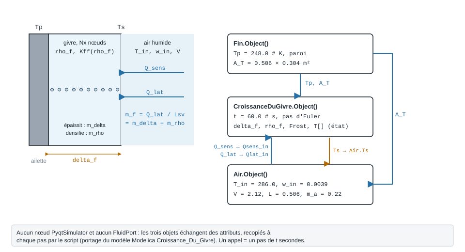
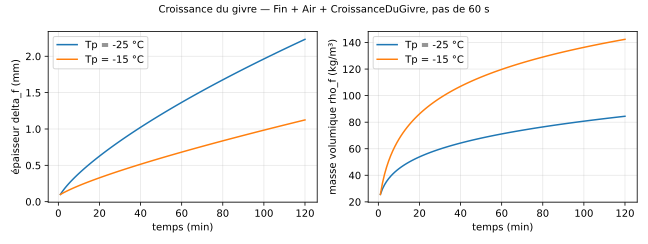

.. _givrage:

Givrage des ailettes
====================

   À gauche, la couche de givre discrétisée entre la paroi (``Tp``) et l'air ; à droite, les
   attributs que le script recopie d'un objet à l'autre à chaque pas.

À quoi ça sert
--------------

Sur une batterie froide ou un évaporateur dont la paroi est sous 0 °C, la vapeur
d'eau de l'air se dépose en **givre**. La couche grossit et se densifie : elle
isole la paroi, réduit la puissance échangée et finit par boucher le passage
entre ailettes. C'est ce qui fixe la **fréquence des dégivrages**.

Le paquet ``ThermodynamicCycles.Frost`` fournit quatre briques de calcul :

.. list-table::
   :header-rows: 1
   :widths: 30 70

   * - Module
     - Rôle
   * - ``ThermodynamicCycles.Frost.Fin``
     - Ailette froide : température de paroi ``Tp`` et surface d'échange ``A_T``.
   * - ``ThermodynamicCycles.Frost.Air``
     - Air humide amont : flux sensible ``Q_sens`` et latent ``Q_lat`` reçus par la
       surface du givre (corrélation de plaque plane, analogie de Lewis).
   * - ``ThermodynamicCycles.Frost.CroissanceDuGivre``
     - Couche de givre 1D à ``Nx`` nœuds : profil de température, puis intégration
       explicite de l'épaisseur ``delta_f``, de la masse volumique ``rho_f`` et de la
       masse déposée ``Frost``. **Un appel à** ``calculate()`` **= un pas de**
       ``t`` **secondes** ; l'état persiste d'un appel à l'autre.
   * - ``ThermodynamicCycles.Frost.TubeFinGeometry``
     - Géométrie d'un tube à ailettes rondes (thèse Hadid, 2012) : surfaces,
       espacement entre ailettes et rétrécissement du passage quand le givre
       épaissit les ailettes.

Les trois premières sont le portage du modèle Modelica ``Croissance_Du_Givre`` :
elles n'ont **ni** ``FluidPort`` **ni** nœud ``PyqtSimulator``, et c'est au script
de recopier les attributs d'un objet à l'autre (figure ci-dessus). L'échangeur
givrant complet, qui assemble ces physiques avec un fluide frigoporteur, est
``FrostedFinnedTubeHEX`` (voir :ref:`frost`).

À chaque pas, côté air :

.. math::

   Q_{sens} = h_a A_T (T_{in} - T_s), \qquad
   Q_{lat} = h_m A_T L_{sv} \,(w_{in} - w_s(T_s)), \qquad
   \dot m_f = Q_{lat} / L_{sv}

puis, côté givre, :math:`\dot m_f` se partage entre densification
(:math:`\dot m_\rho`, vapeur qui diffuse dans la couche) et épaississement
(:math:`\dot m_\delta`) :

.. math::

   \frac{d\delta_f}{dt} = \frac{\dot m_\delta}{A_T\,\rho_f}, \qquad
   \frac{d\rho_f}{dt} = \frac{\dot m_\rho}{A_T\,\delta_f}

Exemple minimal
---------------

Une ailette à −25 °C dans un air à 13 °C, humidité absolue 3,9 g/kg, 2,12 m/s —
les valeurs par défaut du modèle Modelica. On simule une heure au pas de 60 s.

.. code-block:: python

    from ThermodynamicCycles.Frost.Fin import Object as Fin
    from ThermodynamicCycles.Frost.Air import Object as Air
    from ThermodynamicCycles.Frost.CroissanceDuGivre import Object as CroissanceDuGivre

    def simuler(Tp_K=248.0, duree_min=60, T_in_K=286.0, w_in=0.0039, V=2.12):
        ailette = Fin()
        ailette.Tp = Tp_K                 # température de paroi [K]
        ailette.calculate()

        air = Air()
        air.T_in, air.w_in, air.V = T_in_K, w_in, V   # [K], [kg/kg], [m/s]
        air.A_T = ailette.A_T

        givre = CroissanceDuGivre()
        givre.Tp, givre.A_T = ailette.Tp, ailette.A_T
        givre.t = 60.0                    # pas de temps [s]

        for minute in range(1, duree_min + 1):
            # surface du givre -> air ; flux de l'air -> givre
            air.Ts = givre.Ts if givre.Ts is not None else 273.15
            air.calculate()
            givre.Qsens_in, givre.Qlat_in = air.Q_sens, air.Q_lat
            givre.calculate()
            if minute % 15 == 0:
                print(f"t = {minute:3d} min  Ts = {givre.Ts - 273.15:6.2f} °C  "
                      f"delta_f = {givre.delta_f * 1000:.3f} mm  rho_f = {givre.rho_f:5.1f} kg/m³  "
                      f"givre = {givre.Frost * 1000:5.2f} g  Q = {air.Q_sens + air.Q_lat:4.1f} W")
        return air, givre

    air, givre = simuler()
    print(f"Surface A_T = {givre.A_T:.4f} m²")

Sortie réelle :

.. code-block:: text

   t =  15 min  Ts = -22.45 °C  delta_f = 0.513 mm  rho_f =  50.0 kg/m³  givre =  3.56 g  Q = 55.5 W
   t =  30 min  Ts = -21.30 °C  delta_f = 0.834 mm  rho_f =  59.8 kg/m³  givre =  7.28 g  Q = 53.9 W
   t =  45 min  Ts = -20.45 °C  delta_f = 1.113 mm  rho_f =  66.2 kg/m³  givre = 10.95 g  Q = 52.6 W
   t =  60 min  Ts = -19.76 °C  delta_f = 1.366 mm  rho_f =  71.1 kg/m³  givre = 14.56 g  Q = 51.6 W

En une heure, 14,6 g de givre se déposent sur 0,154 m² : une couche de 1,4 mm, très
légère (71 kg/m³, moins d'un dixième de la glace). Sa surface se réchauffe de −25 à
−19,8 °C : c'est l'isolation par le givre, et la puissance échangée baisse, entre la 15e et la 60e minute, de
55,5 à 51,6 W.

   La même boucle prolongée à deux heures, pour deux températures de paroi
   (calcul de la bibliothèque, ``docs/schemas_givre_aeraulique.py``).

Paramètres à personnaliser
--------------------------

.. list-table::
   :header-rows: 1
   :widths: 24 46 30

   * - Paramètre
     - Effet
     - Valeur / plage
   * - ``Fin.Tp`` (repris par ``CroissanceDuGivre.Tp``)
     - Température de paroi : plus elle est basse, plus le givre est épais et léger
     - K, défaut ``248.0`` (−25 °C)
   * - ``Air.T_in``
     - Température de l'air amont
     - K, défaut ``286.0`` (13 °C)
   * - ``Air.w_in`` ou ``Air.HR_in``
     - Humidité de l'air amont, **absolue** (``w_in``) ou **relative**
       (``HR_in``, fraction de 0 à 1) : c'est elle qui pilote le dépôt. Donnez
       l'une des deux ; les deux ensemble doivent être cohérentes
     - kg/kg ; sans rien, ``w_in = 0.0039`` (défaut du Modelica)
   * - ``Air.V``, ``Air.L``
     - Vitesse d'air et longueur de plaque : fixent :math:`h_a` (plaque plane)
     - m/s ``2.12`` ; m ``0.506``
   * - ``Air.m_a``
     - Débit d'air : ne sert qu'à la température de sortie ``T_out``
     - kg/s, défaut ``0.22``
   * - ``Fin.surface``, ``Fin.A_T_override``
     - Surface d'échange : ``'plaque_modelica'`` (0,506 × 0,304 m², défaut),
       ``'ailette'`` (``A_fin``, anneau d'ailette double face) ou une valeur
       imposée par ``A_T_override`` ; l'origine est publiée dans ``A_T_source``
     - m²
   * - ``CroissanceDuGivre.t``
     - Pas de temps d'Euler explicite
     - s, défaut ``60.0``
   * - ``CroissanceDuGivre.Nx``
     - Nombre de nœuds dans la couche
     - défaut ``10``
   * - ``CroissanceDuGivre.delta_f``, ``rho_f``
     - État initial du givre
     - m ``1e-4`` ; kg/m³ ``25.0``

Variante : paroi moins froide, air plus humide
----------------------------------------------

.. code-block:: python

    # variante : paroi à -15 °C au lieu de -25 °C, puis air à 6 g/kg au lieu de 3,9
    print("Paroi à -15 °C :")
    air_b, givre_b = simuler(Tp_K=258.0)
    print("Air à 6 g/kg :")
    air_c, givre_c = simuler(w_in=0.0060)

Sortie réelle :

.. code-block:: text

   Paroi à -15 °C :
   t =  15 min  Ts = -14.35 °C  delta_f = 0.276 mm  rho_f =  78.0 kg/m³  givre =  2.93 g  Q = 43.4 W
   t =  30 min  Ts = -14.12 °C  delta_f = 0.425 mm  rho_f =  98.2 kg/m³  givre =  6.04 g  Q = 43.0 W
   t =  45 min  Ts = -13.93 °C  delta_f = 0.558 mm  rho_f = 110.7 kg/m³  givre =  9.12 g  Q = 42.7 W
   t =  60 min  Ts = -13.76 °C  delta_f = 0.682 mm  rho_f = 119.8 kg/m³  givre = 12.18 g  Q = 42.5 W
   Air à 6 g/kg :
   t =  15 min  Ts = -19.92 °C  delta_f = 0.881 mm  rho_f =  45.6 kg/m³  givre =  5.80 g  Q = 59.4 W
   t =  30 min  Ts = -17.63 °C  delta_f = 1.455 mm  rho_f =  53.7 kg/m³  givre = 11.64 g  Q = 55.9 W
   t =  45 min  Ts = -16.09 °C  delta_f = 1.942 mm  rho_f =  59.3 kg/m³  givre = 17.32 g  Q = 53.5 W
   t =  60 min  Ts = -14.92 °C  delta_f = 2.375 mm  rho_f =  63.7 kg/m³  givre = 22.88 g  Q = 51.7 W

Une paroi à −15 °C dépose presque autant de masse (12,2 g contre 14,6 g) mais
**1,7 fois plus dense** : la couche fait moitié moins d'épaisseur (0,68 mm) et
bouche moins vite. Un air plus humide, lui, dépose 57 % de givre en plus, en couche
légère de 2,4 mm : c'est le cas qui impose les dégivrages les plus fréquents.

Géométrie : quand le givre bouche le passage
--------------------------------------------

``TubeFinGeometry`` calcule la géométrie d'un tube à ailettes rondes (défauts :
maquette M01P3 de la thèse, tube de 25,4 mm, ailettes de 15 mm, 10 ailettes par
pouce). Le givre épaissit chaque ailette des deux côtés, :math:`Y_{eff} = Y_0 +
2\,\delta_f`, ce qui réduit l'espacement ``s`` et accélère l'air entre ailettes.

.. code-block:: python

    from ThermodynamicCycles.Frost.TubeFinGeometry import Object as TubeFinGeometry

    from ThermodynamicCycles.Frost.TubeFinGeometry import PassageObstrueError

    geo = TubeFinGeometry()
    for e in (0.0, 0.5e-3, 1.0e-3, 1.2e-3):      # épaisseur de givre par face [m]
        geo.delta_f = e
        try:
            geo.calculate()
        except PassageObstrueError as err:
            print(f"givre {e * 1000:.1f} mm/face  PassageObstrueError : {err}")
            continue
        print(f"givre {e * 1000:.1f} mm/face  Y_eff = {geo.Y_eff * 1000:.2f} mm  "
              f"s = {geo.s * 1000:.3f} mm  Vmax/Vface = {geo.S_face / geo.S_min:.2f}  "
              f"A_T = {geo.A_T:.3f} m²")

Sortie réelle :

.. code-block:: text

   givre 0.0 mm/face  Y_eff = 0.30 mm  s = 2.240 mm  Vmax/Vface = 1.84  A_T = 1.615 m²
   givre 0.5 mm/face  Y_eff = 1.30 mm  s = 1.240 mm  Vmax/Vface = 2.80  A_T = 1.615 m²
   givre 1.0 mm/face  Y_eff = 2.30 mm  s = 0.240 mm  Vmax/Vface = 5.88  A_T = 1.615 m²
   givre 1.2 mm/face  PassageObstrueError : TubeFinGeometry : le givre comble l'espace inter-ailettes (delta_f = 1.200 mm par face, Y_eff = 2.700 mm >= pas d'ailette 2.540 mm ; comblement à 1.120 mm).

Avec 2,54 mm de pas d'ailette, **1,12 mm de givre par face suffit à fermer le
passage** ; au-delà, ``calculate()`` lève ``PassageObstrueError`` (jusqu'au
28/09/2026, ``s`` était ramené en silence à 1 µm et le calcul continuait sur
une géométrie fictive). Rapproché de l'exemple précédent (1,4 mm en une heure à −25 °C), cela
donne l'ordre de grandeur de l'intervalle de dégivrage de cette géométrie.

Pièges
------

- **Humidité amont : une seule source.** ``Air`` lit ``w_in`` **ou**
  ``HR_in`` ; les donner toutes deux, incohérentes, lève une ``ValueError``
  (3,9 g/kg à 13 °C font environ 42 % d'HR, pas 50 %). Les valeurs employées sont
  publiées dans ``w_in_used`` et ``HR_in_used``. Jusqu'au 28/09/2026, ``HR_in``
  n'était pas lu et affichait 50 %.
- ``Air.T_out`` **ne compte que la chaleur sensible** :
  :math:`T_{out} = T_{in} - Q_{sens}/(\dot m_a c_p)` ; le latent part avec la
  vapeur déposée en givre. Jusqu'au 28/09/2026, il retranchait aussi
  :math:`Q_{lat}`, comme le modèle Modelica.
- ``Fin`` **transmet la plaque du Modelica par défaut.** ``A_T`` vaut
  0,506 × 0,304 m² ; ``surface = 'ailette'`` transmet ``A_fin`` (anneau
  d'ailette double face), et ``A_T_source`` dit laquelle a servi.
- **Convergence contrôlée.** ``CroissanceDuGivre`` résout le profil de
  température par ``fsolve`` ; un échec lève une ``RuntimeError`` **avant** de
  toucher l'état (``delta_f``, ``rho_f``, ``Frost``), et ``converged`` /
  ``residual`` publient le statut mesuré du dernier pas. Jusqu'au 28/09/2026, la
  solution non convergée était acceptée en silence.
- ``Frost`` **est une masse (kg)**, pas une masse surfacique (colonne
  ``Frost_kg`` du ``df``).
- **Passage bouché : une exception.** Quand le givre comble l'espace entre
  ailettes (ou annule la section minimale), ``TubeFinGeometry`` lève
  ``PassageObstrueError``. ``A_T`` reste celle de la géométrie nue : elle
  n'évolue pas avec le givre (écart connu).
- **Modèle d'appel, pas de fonction du temps.** Chaque ``calculate()`` avance
  l'état d'un pas : appeler deux fois pour « vérifier » fait croître le givre deux
  fois.

Pour aller plus loin
--------------------

- :ref:`frost` — l'échangeur givrant complet ``FrostedFinnedTubeHEX``, avec
  frigoporteur, corrélations de la thèse et pertes de charge.
- :doc:`condenseur_evaporateur` — évaporateurs et batteries froides.
