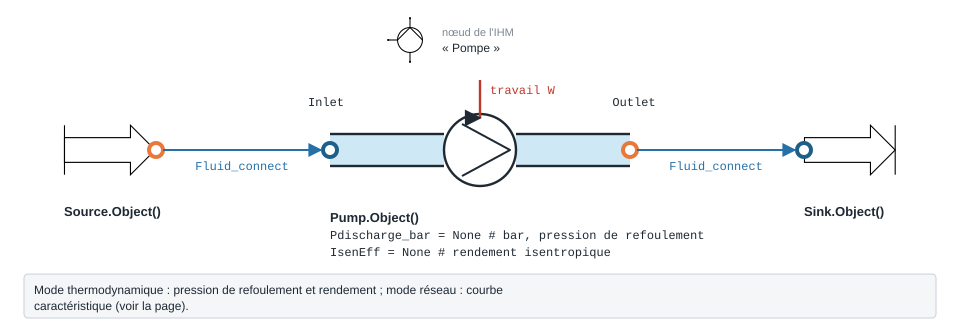

.. _pompe:

Pompe — Pump
============

   Forme, ports et raccordement ; paramètres sous leur nom de code, avec leur valeur par défaut.

Le module ``ThermodynamicCycles.Pump`` modélise une **pompe** de circulation de
liquide. Selon les paramètres fournis, il fonctionne dans **deux modes** distincts
(chemin additif, sans redondance) :

- un mode **débit imposé / thermodynamique** (compression liquide isentropique
  avec rendement), adapté aux cycles de puissance (Rankine, ORC) et aux essais à
  débit constant ;
- un mode **courbe caractéristique**, où le point de fonctionnement est déterminé
  par régression polynomiale (scikit-learn) sur la courbe HMT / rendement de la
  pompe et son intersection avec la caractéristique du réseau.

Dans les deux cas la pompe est traitée comme **isotherme** côté fluide : une pompe
liquide n'échauffe/ne refroidit pas de façon significative, la **température
d'aspiration est conservée** et l'enthalpie de refoulement est **recalculée à la
pression de refoulement** (voir plus bas).

La classe s'instancie via ``ThermodynamicCycles.Pump.Pump.Object()``.

Connecteurs
-----------

.. list-table::
   :header-rows: 1
   :widths: 18 20 62

   * - Port
     - Type
     - Rôle
   * - ``Inlet``
     - ``FluidPort``
     - aspiration (fluide, pression :math:`P`, enthalpie :math:`h`, débit
       :math:`F` en kg/s)
   * - ``Outlet``
     - ``FluidPort``
     - refoulement ; porte un **callback** ``on_pressure_change`` déclenché quand
       le réseau aval impose ``Outlet.P``

Mode 1 — Débit imposé / thermodynamique (isentropique + rendement)
------------------------------------------------------------------

Ce mode est **actif dès que** ``IsenEff`` est défini (cycle de puissance) **ou**
que ``F_impose`` (kg/s) est fourni (essai à débit constant). Il **court-circuite**
la courbe caractéristique : le débit est imposé, et la température de refoulement
est un **résultat** de la compression liquide isentropique.

Le rendement isentropique retenu est :math:`\eta = \text{IsenEff}` (ou ``0.7`` par
défaut si seul ``F_impose`` est fourni). Avec :math:`HP` la pression de
refoulement (``Pdischarge`` ou, à défaut, ``Inlet.P``) :

.. math::

   s_1 &= s(P_{in},\, h_{in}) \\
   h_{o,is} &= h(HP,\, s_1) \\
   h_{o} &= h_{in} + \frac{h_{o,is} - h_{in}}{\eta} \\
   T_{o} &= T(HP,\, h_{o}) \\
   \dot W_{pump} &= F \,\bigl(h_{o} - h_{in}\bigr)

Le refoulement est écrit sur ``Outlet`` (``Outlet.h = Ho``, ``Outlet.P = HP``,
``Outlet.F = Inlet.F``), le callback étant neutralisé pendant l'écriture de la
pression. En prime, une **courbe de pompe idéale** passant par le point de
fonctionnement :math:`(Q^\*, HMT^\*)` est proposée (centrifuge parabolique
:math:`HMT(Q) = H_0 - k\,Q^2` avec :math:`H_0 = 1{,}25\,HMT^\*`, rendement maximal
au BEP), puis ajustée par régression : le **même modèle** sert ainsi au
dimensionnement et à la simulation.

Mode 2 — Courbe caractéristique (régression polynomiale)
--------------------------------------------------------

En l'absence de ``IsenEff`` et de ``F_impose``, la pompe utilise sa **courbe
caractéristique**. Les points de construction sont fournis via ``X_F`` (débit
volumique, m³/h), ``Y_hmt`` (hauteur manométrique, m) et ``Y_eta`` (rendement).
Valeurs par défaut si non renseignés :

.. code-block:: python

   X_F   = [7, 50, 100, 150]     # m³/h
   Y_hmt = [12, 60, 80, 68]      # m
   Y_eta = [0.5, 0.7, 0.5, 0.4]  # -

Une régression polynomiale ``LinearRegression`` sur ``PolynomialFeatures`` de
**degré** :math:`n = \text{len}(X\_F) - 1` (interpolation exacte des points)
ajuste séparément HMT(Q) et η(Q). La qualité d'ajustement HMT est reportée
(``rmse_hmt``, ``r2_hmt``).

Selon les données fournies, le point de fonctionnement est déterminé ainsi :

- **``Pdischarge`` donnée** → ``calculate_flow_rate()`` : la HMT cible est déduite
  du réseau (:math:`HMT = \Delta P / (\rho g)`), puis le débit correspondant est
  trouvé sur la courbe HMT(Q) par minimisation ``L-BFGS-B`` de
  :math:`|HMT_{pred}(Q) - HMT|` ;
- **``F_m3h`` donné, sans ``Pdischarge``** → ``calculate_hmt()`` : la HMT est
  prédite par la corrélation au débit donné, puis :math:`\Delta P = \rho g\,HMT`.

Le rendement au point de fonctionnement provient de ``calculate_eta()``
(prédiction η(Q)). La puissance absorbée vaut :

.. math::

   \Delta P = \rho\, g\, HMT
   \qquad
   Q_{pump} = \frac{\dot V \,\Delta P}{\eta}

avec :math:`\dot V` = ``F_m3s`` (débit volumique, m³/s) et :math:`\rho` la masse
volumique du fluide à l'aspiration (``ThermoPropsSI("D", ...)``), :math:`g = 9{,}81`
m/s².

Équations clés
--------------

.. list-table::
   :header-rows: 1
   :widths: 30 70

   * - Grandeur
     - Relation
   * - HMT ↔ pression
     - :math:`\Delta P = \rho\, g\, HMT` ; réciproquement :math:`HMT = \Delta P/(\rho g)`
   * - Rendement (mode courbe)
     - :math:`\eta = \eta_{model}(Q)` (corrélation polynomiale)
   * - Puissance (mode courbe)
     - :math:`Q_{pump} = \dot V \,\Delta P / \eta`
   * - Compression isentropique (mode thermo)
     - :math:`h_o = h_{in} + (h_{o,is}-h_{in})/\eta`
   * - Puissance (mode thermo)
     - :math:`\dot W_{pump} = F\,(h_o - h_{in})`

Comportement réseau (couplage courbe ∩ réseau)
----------------------------------------------

Le ``Outlet`` porte un callback ``on_pressure_change`` : lorsque le **réseau aval
impose** une nouvelle pression ``Outlet.P``, la pompe **recalcule automatiquement
son point de fonctionnement** via ``calculate_from_network_pressure()`` :

1. :math:`\Delta P_{réseau} = Outlet.P - Inlet.P` puis
   :math:`HMT = \Delta P_{réseau}/(\rho g)` ;
2. le **débit** correspondant est cherché sur la courbe HMT(Q) par minimisation
   ``L-BFGS-B`` — c'est l'**intersection courbe pompe ∩ courbe réseau** ;
3. la **masse** est propagée : ``Inlet.F = F_m3s·ρ``, ``Outlet.F = Inlet.F`` (et
   le callback amont ``Inlet.callback`` est appelé si présent) ;
4. **isotherme** : la température d'aspiration est conservée, l'enthalpie de
   refoulement est recalculée à la pression réseau
   ``Outlet.h = ThermoPropsSI('H','P',Outlet.P,'T',Ti_degC+273.15,fluid)`` ;
5. le rendement est réévalué par ``calculate_eta()``.

Des garde-fous (attributs ``_calculating`` / ``_calculating_inverse``) évitent les
boucles infinies pendant les phases de calcul.

Paramètres configurables
------------------------

.. list-table::
   :header-rows: 1
   :widths: 22 16 62

   * - Paramètre
     - Défaut
     - Description
   * - ``IsenEff``
     - ``None``
     - rendement isentropique ; **active le mode thermodynamique** (``1`` = pompe idéale)
   * - ``F_impose``
     - ``None``
     - débit massique imposé (kg/s) ; **active le mode débit imposé**
   * - ``Pdischarge_bar``
     - ``None``
     - pression de refoulement (bar) ; convertie en ``Pdischarge`` (Pa)
   * - ``Pdischarge``
     - ``None``
     - pression de refoulement (Pa)
   * - ``eta``
     - ``None``
     - rendement (renseigné/prédit selon le mode)
   * - ``X_F``
     - ``[7,50,100,150]``
     - points de débit volumique de la courbe (m³/h)
   * - ``Y_hmt``
     - ``[12,60,80,68]``
     - points de hauteur manométrique (m)
   * - ``Y_eta``
     - ``[0.5,0.7,0.5,0.4]``
     - points de rendement (-)
   * - ``Timestamp``
     - ``None``
     - horodatage propagé dans le DataFrame résultat

Sorties principales
-------------------

- ``df`` : DataFrame de synthèse. En **mode courbe** : ``pump_F_kgs``,
  ``pump_F_m3h``, ``hmt(m)``, ``delta_p (Pa)``, ``Qpump(KW)``, ``self.eta``. En
  **mode thermodynamique** : ``P_aspiration_bar``, ``P_refoulement_bar``,
  ``T_refoulement_degC``, ``eta_is``, ``W_pump_kW``.
- ``F_m3h`` / ``F_m3s`` : débit volumique au point de fonctionnement.
- ``hmt`` / ``delta_p`` : hauteur manométrique (m) et différence de pression (Pa).
- ``eta``, ``Q_pump`` (mode courbe) ; ``W_pump``, ``To``, ``Ho``, ``Ho_is``
  (mode thermodynamique).
- ``rmse_hmt`` / ``r2_hmt`` : indicateurs d'ajustement de la corrélation HMT.

Exemple (Source → Pompe, courbe caractéristique)
------------------------------------------------

.. code-block:: python

    from ThermodynamicCycles.Source import Source
    from ThermodynamicCycles.Pump import Pump
    from ThermodynamicCycles.Connect import Fluid_connect

    # Source d'eau : 20 °C, 1 bar, 5 kg/s
    source = Source.Object()
    source.fluid = "water"
    source.Ti_degC = 20
    source.Pi_bar = 1.0
    source.F = 5.0
    source.calculate()

    # Pompe alimentée par la source
    pump = Pump.Object()
    Fluid_connect(pump.Inlet, source.Outlet)   # copie fluide, P, h, F

    # Point de fonctionnement fixé par la pression de refoulement (mode courbe)
    pump.Pdischarge_bar = 4.0
    pump.calculate()

    print(pump.df)               # F_m3h, hmt, delta_p, Qpump, eta
    pump.plot_pump_curve()       # courbe HMT/ΔP + rendement, point de fonctionnement

Pour un **cycle de puissance** (mode thermodynamique), fixer plutôt
``pump.IsenEff = 0.75`` (et éventuellement ``pump.F_impose`` pour un débit
imposé) avant ``pump.calculate()`` : la température de refoulement ``To`` et la
puissance ``W_pump`` deviennent les résultats de la compression liquide
isentropique.

Méthodes
--------

* ``calculate()`` — Calcule le point de fonctionnement (aiguille automatiquement vers le bon mode)
* ``calculate_hmt()`` — HMT prédite par la corrélation au débit ``F_m3h``
* ``calculate_flow_rate()`` — Débit sur la courbe pour un ``Pdischarge`` imposé
* ``calculate_eta()`` — Rendement prédit par la corrélation au débit ``F_m3h``
* ``calculate_from_network_pressure()`` — Recalcul du point sur pression réseau imposée (callback)
* ``plot_pump_curve(figsize=(14, 10))`` — Tracé de la courbe caractéristique (HMT/ΔP et rendement) avec point de fonctionnement
