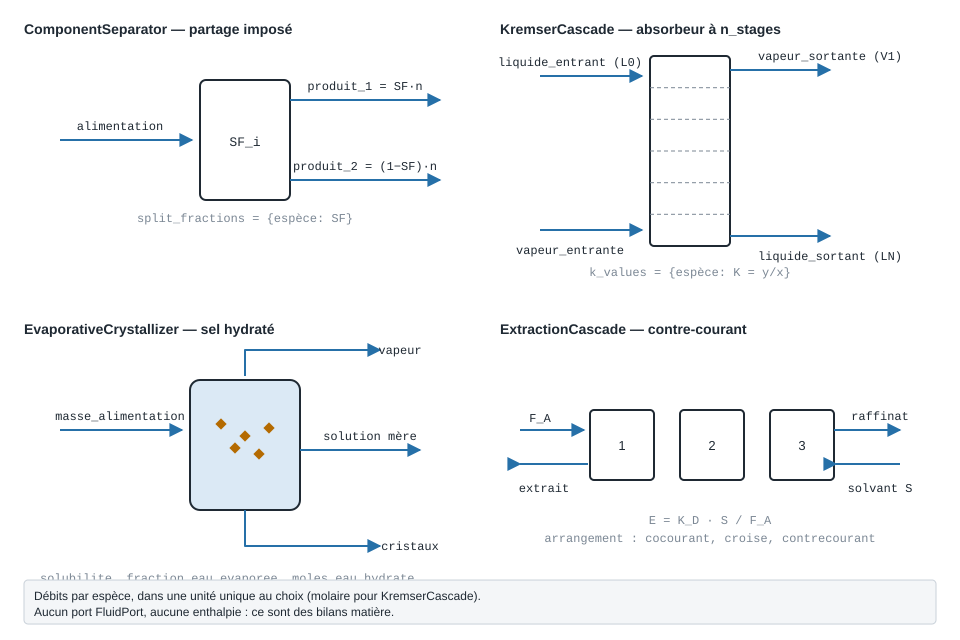

.. _separation:

Séparation — bilans matière de procédé
======================================

   Les quatre modèles du paquet ``Separation`` : ce qui entre, ce qui sort, et le
   paramètre qui fixe le partage. Aucun ne porte de port ``FluidPort`` : ce sont
   des bilans de courants donnés par espèce.

À quoi ça sert
--------------

Le paquet ``Separation`` répond aux questions de **bilan matière** que pose
une opération de séparation avant tout dimensionnement thermique :

- *une colonne fait tel partage : que valent les débits, puretés et récupérations
  en aval ?* — ``ComponentSeparator`` ;
- *combien d'étages pour laver un gaz, et que reste-t-il dans le gaz épuré ?* —
  ``KremserCascade`` (absorbeur ou stripper) ;
- *combien de cristaux sort un évaporateur-cristalliseur, à quelle pression
  tourne-t-il ?* — ``EvaporativeCrystallizer`` ;
- *co-courant, courant croisé ou contre-courant : combien d'étages d'extraction
  liquide-liquide ?* — ``ExtractionCascade``.

Pour un ingénieur énergie, ce sont les modèles qui donnent les **débits** d'un
procédé (vapeur évaporée, solvant à régénérer, liquide soutiré) — ceux dont on
calcule ensuite la chaleur avec les autres pages du guide. Aucun ne calcule
d'enthalpie, de température ni de charge thermique : ils ne l'inventent pas.

Tous suivent J. D. Seader, E. J. Henley, D. K. Roper, *Separation Process
Principles*, 3e éd., Wiley 2011 ; chaque objet garde sa référence exacte dans
son attribut ``citation``. Ces modèles n'ont **pas de nœud** dans l'interface
``PyqtSimulator`` : ils s'utilisent en Python.

.. note::
   **Unités.** Les débits se donnent **par espèce**, dans un dictionnaire
   ``{espèce: débit}``, dans l'unité de votre choix — mol/s, kmol/h, lbmol/h,
   kg/h — pourvu qu'elle soit **la même partout**. Aucune conversion n'est faite :
   les facteurs de partage sont sans dimension. ``KremserCascade`` exige des
   débits **molaires** (ses facteurs A = L/(K·V) mélangent les deux phases).

Séparateur à fractions imposées — ``ComponentSeparator``
--------------------------------------------------------

Le « séparateur simple » des simulateurs de procédés : on impose, espèce par
espèce, la **fraction SF** (*split fraction*) du débit entrant qui part dans le
premier produit ; l'appareil ferme le bilan. Il ne calcule aucun équilibre :
les SF sont des **données** — celles d'une colonne existante, d'un catalogue ou
d'un objectif de conception.

L'exemple reprend la colonne « C2 » du procédé de récupération d'hydrocarbures
de Seader (tableaux 1.5 et 1.6) : un dépropaniseur qui sort le propane en tête.

.. code-block:: python

   from Separation import ComponentSeparator, purete, recuperation

   # Alimentation de la colonne, kmol/h (ou toute unité, la même partout)
   alimentation = {"C2": 0.60, "C3": 57.00, "iC4": 171.70, "nC4": 226.60,
                   "iC5": 28.10, "nC5": 17.50}

   # SF : fraction de chaque espèce qui part en TÊTE
   colonne = ComponentSeparator(
       {"C2": 1.0, "C3": 0.9614, "iC4": 0.0035, "nC4": 0.0, "iC5": 0.0, "nC5": 0.0},
       nom_produits=("tête", "pied"),
   )
   tete, pied = colonne.calculate(alimentation)

   print("Tête :", {e: round(d, 2) for e, d in tete.items() if d})
   print("Pied :", {e: round(d, 2) for e, d in pied.items() if d})
   print(f"Pureté du propane en tête : {100 * purete(tete, 'C3'):.2f} %")
   print(f"Récupération du propane   : {100 * recuperation(tete, alimentation, 'C3'):.2f} %")
   print("Split ratios SR = SF/(1-SF) :", {e: round(sr, 3) for e, sr in colonne.split_ratios().items()})

Sortie réelle :

.. code-block:: text

   Tête : {'C2': 0.6, 'C3': 54.8, 'iC4': 0.6}
   Pied : {'C3': 2.2, 'iC4': 171.1, 'nC4': 226.6, 'iC5': 28.1, 'nC5': 17.5}
   Pureté du propane en tête : 97.86 %
   Récupération du propane   : 96.14 %
   Split ratios SR = SF/(1-SF) : {'C2': inf, 'C3': 24.907, 'iC4': 0.004, 'nC4': 0.0, 'iC5': 0.0, 'nC5': 0.0}

La tête reçoit 96,14 % du propane et presque rien du reste : le produit est du
propane à près de 98 %. Le *split ratio* d'une espèce qui part entièrement en
tête vaut ``inf`` : le modèle n'invente pas un « grand nombre ».

.. rubric:: Enchaîner des appareils

``calculate`` rend deux dictionnaires ordinaires : le pied d'une colonne
s'injecte tel quel dans la suivante, comme dans un schéma de procédé. Et
``split_fractions_mesurees(alimentation, produit)`` fait l'inverse — retrouver
les SF d'un appareil en marche à partir de son bilan mesuré.

Absorbeur ou stripper à N étages — ``KremserCascade``
-----------------------------------------------------

La **méthode de groupe de Kremser** : elle relie les courants entrants et
sortants d'une colonne à contre-courant à son nombre d'**étages d'équilibre**,
sans calcul étage par étage. Le gaz entre en bas (``vapeur_entrante``), le
solvant en haut (``liquide_entrant``) ; chaque espèce a sa constante
d'équilibre ``K = y/x``, prise à la température moyenne de la colonne.

Le facteur d'absorption ``A = L/(K·V)`` dit tout : une espèce dont A dépasse 1
est lavée presque complètement, une espèce dont A reste petit traverse. Cas
d'école (exemple 5.3 de Seader) : un gaz de raffinerie lavé par une huile
lourde dans un absorbeur à 6 étages, débits en lbmol/h.

.. code-block:: python

   from Separation import KremserCascade

   gaz = {"C1": 160.0, "C2": 370.0, "C3": 240.0, "nC4": 25.0, "nC5": 5.0}
   huile = {"nC4": 0.05, "nC5": 0.78, "huile": 164.17}
   K = {"C1": 6.65, "C2": 1.64, "C3": 0.584, "nC4": 0.195, "nC5": 0.0713, "huile": 0.0001}

   absorbeur = KremserCascade(n_stages=6, vapeur_entrante=gaz, liquide_entrant=huile, k_values=K)
   res = absorbeur.calculate()

   print(res.to_frame().round(4))
   print(f"Gaz épuré V1 = {res.V1:.2f}, solvant chargé LN = {res.LN:.2f}")
   print(f"Propane absorbé : {100 * res.taux_absorption('C3', gaz):.1f} %")

Sortie réelle :

.. code-block:: text

                  A        S      fA      fS        y1        lN
   C1        0.0310  32.2424  0.9690  0.0000  155.0376    4.9624
   C2        0.1258   7.9515  0.8742  0.0000  323.4681   46.5319
   C3        0.3532   2.8315  0.6473  0.0013  155.3462   84.6538
   nC4       1.0577   0.9455  0.1200  0.1680    3.0410   22.0090
   nC5       2.8927   0.3457  0.0011  0.6547    0.2749    5.5051
   huile  2062.5000   0.0005  0.0000  0.9995    0.0796  164.0904
   Gaz épuré V1 = 637.25, solvant chargé LN = 327.75
   Propane absorbé : 35.3 %

Lecture du tableau : ``A`` et ``S = 1/A`` sont les facteurs d'absorption et de
stripping, ``fA`` la fraction **non absorbée** de chaque espèce, ``y1`` ce qui
sort avec le gaz, ``lN`` ce qui sort avec l'huile. Le méthane (A = 0,03) passe à
97 % ; le butane (A ≈ 1,06) est absorbé à 88 % ; le pentane (A ≈ 2,9) l'est
presque totalement. C'est la **courbe en S** de toute colonne d'absorption : six
étages ne rattrapent pas une espèce trop volatile.

Cristalliseur évaporatif — ``EvaporativeCrystallizer``
------------------------------------------------------

Une solution aqueuse d'un sel est concentrée par évaporation jusqu'à
saturation ; le sel cristallise, éventuellement **hydraté** — et les cristaux
emportent alors une part de l'eau restante. Le modèle rend la vapeur, les
cristaux et la solution mère, et la pression de marche par la loi de Raoult.

La **solubilité est une donnée** (fraction massique de sel anhydre dans la
solution saturée, à la température de marche) : le modèle n'en possède aucune
table. Même règle pour la tension de vapeur de l'eau pure, qu'on lui passe.

Exemple 4.17 de Seader : 5 000 lb de solution de MgSO₄ à 20 %, 75 % de l'eau
évaporée, solubilité 36 % à 160 °F, cristaux de monohydrate MgSO₄·H₂O.

.. code-block:: python

   from Separation import EvaporativeCrystallizer

   cristalliseur = EvaporativeCrystallizer(
       masse_alimentation=5000.0,      # masse de solution entrante (lb, kg… une seule unité)
       fraction_massique_sel=0.20,     # titre en sel ANHYDRE
       fraction_eau_evaporee=0.75,     # part de l'eau qui part en vapeur
       solubilite=0.36,                # sel anhydre / solution saturée, à la T de marche
       moles_eau_hydrate=1,            # MgSO4·1H2O
       masse_molaire_sel=120.4, masse_molaire_eau=18.0,
   )
   r = cristalliseur.calculate()

   print(r.to_frame().round(1))
   print(f"Solution saturée : {r.saturee}, x_H2O = {r.fraction_molaire_eau:.4f}")
   # Tension de vapeur de l'eau pure à 160 °F : 4,74 psia -> pression de marche
   print(f"Pression du cristalliseur : {r.pression(4.74):.2f} psia")

Sortie réelle :

.. code-block:: text

                   masse
   vapeur         3000.0
   cristaux        549.1
   solution_mere  1450.9
   Solution saturée : True, x_H2O = 0.9224
   Pression du cristalliseur : 4.37 psia

Sur 5 000 lb, 3 000 lb partent en vapeur et 549 lb de cristaux hydratés sont
récupérés (le livre, qui arrondit, écrit 550) ; la solution mère saturée tourne
sous 4,37 psia, un peu en dessous de la tension de vapeur de l'eau pure.

Extraction liquide-liquide — ``ExtractionCascade``
--------------------------------------------------

Extraire un soluté d'un **diluant** par un **solvant non miscible**, en un ou
plusieurs étages. Le facteur d'extraction ``E = K'_D · S / F_A`` (``K'_D`` :
coefficient de partage, ``S`` : débit de solvant, ``F_A`` : débit de diluant)
joue le rôle du facteur d'absorption. Le modèle compare les trois arrangements :
**co-courant**, **courant croisé** (solvant divisé en parts égales entre les
étages) et **contre-courant**.

Exemple 5.2 de Seader : 4 536 kg/h d'eau chargée à 25 % de p-dioxane, traitée
par 6 804 kg/h de benzène (``K'_D`` = 1,2).

.. code-block:: python

   from Separation import ExtractionCascade

   extraction = ExtractionCascade(debit_alimentation=4536.0, fraction_massique_solute=0.25,
                                  debit_solvant=6804.0, K_D=1.2)
   print(f"Facteur d'extraction E = {extraction.E:.2f}")
   print("Taux d'extraction selon le nombre d'étages :")
   print(extraction.to_frame(5).round(3))
   print("Étages à contre-courant pour extraire 99 % :", extraction.etages_pour_taux(0.99))

Sortie réelle :

.. code-block:: text

   Facteur d'extraction E = 2.40
   Taux d'extraction selon le nombre d'étages :
           cocourant  croise  contrecourant
   etages                                  
   1           0.706   0.706          0.706
   2           0.706   0.793          0.891
   3           0.706   0.829          0.956
   4           0.706   0.847          0.982
   5           0.706   0.859          0.993
   Étages à contre-courant pour extraire 99 % : 5

À un étage, les trois arrangements se valent (70,6 %). Ensuite le co-courant
**n'extrait plus rien** — ses courants sortent déjà à l'équilibre —, le courant
croisé progresse lentement, et le contre-courant atteint 99 % en cinq étages.
C'est la raison pour laquelle les colonnes d'extraction industrielles sont à
contre-courant.

Paramètres à personnaliser
--------------------------

.. list-table::
   :header-rows: 1
   :widths: 22 40 22 16

   * - Paramètre
     - Effet
     - Plage usuelle
     - Unité
   * - ``split_fractions``
     - Part de chaque espèce envoyée dans le 1er produit (``ComponentSeparator``) ;
       toute espèce de l'alimentation doit y figurer
     - 0 à 1
     - —
   * - ``n_stages``
     - Nombre d'étages d'**équilibre** (``KremserCascade``) ; un plateau réel en
       vaut 0,2 à 0,8
     - 1 à 30
     - —
   * - ``k_values``
     - Constante d'équilibre ``K = y/x`` de chaque espèce, à la température moyenne
     - 10⁻⁴ (huile) à 10 (gaz léger)
     - —
   * - ``liquide_entrant``
     - Débit de solvant : c'est **le** levier d'un absorbeur (A croît avec L)
     - selon le procédé
     - molaire
   * - ``fraction_eau_evaporee``
     - Taux d'évaporation du cristalliseur ; en dessous d'un seuil, la solution ne
       sature pas et rien ne cristallise
     - 0 à 0,95
     - —
   * - ``solubilite``
     - Solubilité du sel **anhydre** à la température de marche (donnée de table)
     - 0,05 à 0,5
     - kg sel/kg solution
   * - ``moles_eau_hydrate``
     - Eau de cristallisation : 0 (anhydre), 1 (monohydrate), 7 (epsomite)…
     - 0 à 10
     - mol/mol
   * - ``debit_solvant``, ``K_D``
     - Fixent le facteur d'extraction ``E`` (``ExtractionCascade``) ; au-delà de
       E = 1, le contre-courant peut tout extraire
     - E de 0,5 à 5
     - massique

Variante : doubler le débit d'huile de l'absorbeur
--------------------------------------------------

Faut-il plus d'étages ou plus de solvant pour mieux récupérer le propane ? Les
deux leviers, sur le même gaz :

.. code-block:: python

   # variante : 6 étages -> 12 étages, puis huile x 2, sur le gaz de l'exemple
   print("étages  huile   C3 absorbé   nC4 absorbé")
   for n, facteur in ((6, 1.0), (12, 1.0), (6, 2.0)):
       solvant = {e: d * facteur for e, d in huile.items()}
       r = KremserCascade(n, gaz, solvant, K).calculate()
       print(f"{n:6d}   x{facteur:.0f}   {100 * r.taux_absorption('C3', gaz):9.1f} %"
             f"   {100 * r.taux_absorption('nC4', gaz):9.1f} %")

Sortie réelle :

.. code-block:: text

   étages  huile   C3 absorbé   nC4 absorbé
        6   x1        35.3 %        87.8 %
       12   x1        35.3 %        94.4 %
        6   x2        67.8 %        99.2 %

Doubler les étages ne change presque rien pour le propane : son facteur
d'absorption (0,35) reste sous 1, et une espèce à A < 1 ne peut pas être absorbée
au-delà de A, quel que soit le nombre d'étages. **Doubler l'huile**, qui double A,
est le vrai levier — au prix d'une huile deux fois plus abondante à régénérer,
donc d'une charge thermique de stripping deux fois plus grande.

Ce que les modèles refusent
---------------------------

Les quatre modèles lèvent une exception nommée plutôt que de rendre un chiffre
sans objet. Trois cas fréquents :

.. code-block:: python

   from Separation import CascadeSpecificationError, CrystallizerSpecificationError

   # 1. Une espèce de l'alimentation sans SF : ni 0 ni 1 par défaut
   try:
       ComponentSeparator({"C3": 0.96}).calculate({"C3": 57.0, "nC4": 226.6})
   except CascadeSpecificationError as exc:
       print("ComponentSeparator :", exc)

   # 2. Un taux d'extraction hors d'atteinte en co-courant (borne 1/(1+E))
   try:
       extraction.etages_pour_taux(0.80, "cocourant")
   except CascadeSpecificationError as exc:
       print("ExtractionCascade :", exc)

   # 3. Trop peu d'évaporation : la solution ne sature pas -> aucun cristal (pas une erreur)
   r = EvaporativeCrystallizer(5000.0, 0.20, 0.30, 0.36, moles_eau_hydrate=1,
                               masse_molaire_sel=120.4, masse_molaire_eau=18.0).calculate()
   print(f"30 % évaporé : saturée = {r.saturee}, cristaux = {r.masse_cristaux:.0f}")

   # 4. Un hydrate sans masse molaire : la quantité d'eau liée ne se devine pas
   try:
       EvaporativeCrystallizer(5000.0, 0.20, 0.75, 0.36, moles_eau_hydrate=1)
   except CrystallizerSpecificationError as exc:
       print("EvaporativeCrystallizer :", exc)

Sortie réelle :

.. code-block:: text

   ComponentSeparator : espece 'nC4' sans split fraction. Une SF inconnue n'est ni 0 ni 1 : la fournir, ou retirer l'espece de l'alimentation.
   ExtractionCascade : taux vise 0.8 inatteignable en cocourant avec E = 2.4 : la borne a nombre d'etages infini vaut 0.7059 (Seader, eq. 5-19/5-23/5-32).
   30 % évaporé : saturée = False, cristaux = 0
   EvaporativeCrystallizer : un hydrate exige la masse molaire du sel anhydre : l'eau de cristallisation vaut n*M_eau/M_sel par unite de sel.

Le cas 3 n'est pas une erreur : c'est un régime de marche, qui se **lit** dans
``saturee``. Les messages sont en français sans accents : c'est le texte tel que
la bibliothèque l'écrit.

Limites à garder en tête
------------------------

- **Méthodes de groupe.** ``KremserCascade`` et ``ExtractionCascade`` supposent
  des débits totaux et des constantes d'équilibre **constants** le long de la
  cascade, des étages à l'équilibre et adiabatiques. Ils ne rendent ni profil de
  température ni composition étage par étage : pour une colonne rigoureuse, voir
  :doc:`distillation`.
- **Solvants non miscibles** seulement pour l'extraction : un système
  partiellement miscible exige un calcul triangulaire, que le modèle ne fait pas.
- **Pas d'énergie.** Aucun de ces modèles ne donne de charge thermique : la
  vapeur du cristalliseur ou le solvant à régénérer se chiffrent ensuite avec
  :doc:`dessalement_evaporation` ou :doc:`echangeurs`.

Voir aussi
----------

- :doc:`distillation` — colonnes étage par étage ;
- :doc:`dessalement_evaporation` — évaporateurs multi-effets, compression
  mécanique de vapeur : la chaleur des séparations par évaporation ;
- :doc:`melangeur_flash_stockage` — ballon de flash, séparation liquide/vapeur
  à l'équilibre.
