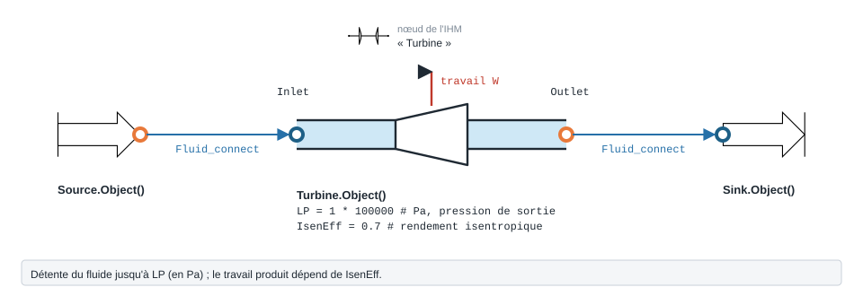

.. _turbine:

Turbine — Turbine
=================

   Forme, ports et raccordement ; paramètres sous leur nom de code, avec leur valeur par défaut.

Le module ``Turbine`` modélise une détente. Comme le compresseur, l'état d'entrée
provient d'un composant amont **connecté via** ``Fluid_connect(TURB.Inlet, amont.Outlet)`` ;
la pression d'échappement est fixée par ``LP`` (en Pa, défaut 1 bar).

Paramètres
----------

.. list-table::
   :header-rows: 1

   * - Attribut
     - Description
     - Unité
   * - ``Inlet``
     - Port d'entrée (rempli par ``Fluid_connect`` depuis l'amont)
     - —
   * - ``LP``
     - Pression d'échappement (basse pression)
     - Pa
   * - ``IsenEff``
     - Rendement isentropique (défaut 0,7)
     - —

Exemple
-------

.. code-block:: python

    from ThermodynamicCycles.Source import Source
    from ThermodynamicCycles.Turbine import Turbine
    from ThermodynamicCycles.Connect import Fluid_connect

    # État d'entrée : gaz chaud sous pression fourni par une Source
    SOURCE = Source.Object()
    SOURCE.Pi_bar = 8
    SOURCE.Ti_degC = 400
    SOURCE.fluid = "air"
    SOURCE.F = 1                 # kg/s
    SOURCE.calculate()

    # Turbine alimentée par la Source
    TURBINE = Turbine.Object()
    Fluid_connect(TURBINE.Inlet, SOURCE.Outlet)
    TURBINE.LP = 1.01325 * 100000     # pression d'échappement en Pa (~1 atm)
    TURBINE.calculate()

    print(TURBINE.df)

Sortie réelle (``TURBINE.df``) :

.. code-block:: text

                    Turbine
    Fluid               air
    IsenEff             0.7
    Inlet.P (bar)       8.0
    LP (bar)           1.01
    F (kg/s)              1
    To (C)           195.83
    Ho (J/kg)      597537.4
    So (J/kg.K)     4339.17
    Q_turb (W)     213456.9

Principaux résultats : température d'échappement ``To`` ≈ 195,8 °C et puissance
récupérée ``Q_turb`` ≈ 213,5 kW pour une détente de 8 bar / 400 °C à ~1 atm.

.. note::
   La turbine ne définit pas ``Pi_bar``/``Ti_degC``/``F`` : ces grandeurs
   viennent du port ``Inlet`` connecté à l'amont. Sans ``Fluid_connect``,
   ``calculate()`` lève une erreur.

Turbine à aubes — TurbineBlade
------------------------------

**À quoi ça sert.** ``ThermodynamicCycles.Turbine.TurbineBlade`` (repris de
Modelica ``RotatingMachines.TurbineBlade``) sert à suivre une turbine **hors de
son point nominal**. Le débit n'est plus celui de l'amont : il est **fixé par les
pressions** selon la loi de l'ellipse de Stodola, ce qui permet de répondre à
« quel débit passe si la pression d'admission baisse ? ».

.. math::

   \dot m^2 = K\,\frac{P_a^2 - P_b^2}{T_a}, \qquad
   h_b = h_a + \varepsilon_s\,(h_{is,b} - h_a), \qquad
   P_{ext} = -\dot m\,(h_b - h_a)

``K`` (kg²·K·s⁻²·Pa⁻²) caractérise la turbine ; il se **cale sur un point de
fonctionnement connu** : :math:`K = \dot m_0^2\,T_{a,0} / (P_{a,0}^2 - P_{b,0}^2)`.
C'est ce que fait le mode ``purpose = "design"`` depuis le 28/09/2026 ; en mode
``"simulation"``, ``K`` est une donnée **obligatoire** (il n'a plus de valeur par
défaut).
Nœud IHM : « Turbine à aubes ».

.. code-block:: python

    import contextlib, io
    from ThermodynamicCycles.Turbine import TurbineBlade

    # Point nominal : vapeur 40 bar / 400 °C détendue à 10 bar, 5 kg/s
    VAP = Source.Object()
    VAP.fluid = "water"
    VAP.Pi_bar = 40
    VAP.Ti_degC = 400
    VAP.F = 5
    with contextlib.redirect_stdout(io.StringIO()):
        VAP.calculate()

    # Calage de K sur ce point nominal
    m0, Ta0, Pa0, Pb0 = 5.0, 400 + 273.15, 40e5, 10e5
    K = m0**2 * Ta0 / (Pa0**2 - Pb0**2)
    print(f"K calé : {K:.4e} kg2.K/(s2.Pa2)")

    # Le même calage par le modèle : mode "design", débit nominal imposé
    TB0 = TurbineBlade.Object()
    Fluid_connect(TB0.Inlet, VAP.Outlet)
    TB0.purpose = "design"
    TB0.dp_design = 30e5        # 40 -> 10 bar
    TB0.m_flow_design = 5.0     # kg/s (à défaut : Inlet.F)
    TB0.calculate()
    print(f"K du mode design : {TB0.K:.4e} kg2.K/(s2.Pa2)")

    TB = TurbineBlade.Object()
    Fluid_connect(TB.Inlet, VAP.Outlet)
    TB.purpose = "simulation"   # pression aval imposée, débit par Stodola
    TB.Outlet.P = 10e5          # Pa
    TB.K = K
    TB.epsilon_s = 0.8
    TB.calculate()

    print(TB.df.drop("Timestamp"))

Sortie réelle :

.. code-block:: text

    K calé : 1.1219e-09 kg2.K/(s2.Pa2)
    K du mode design : 1.1219e-09 kg2.K/(s2.Pa2)
                   TurbineBlade
    fluid                 water
    m_flow_kgs              5.0
    Ti_degC               400.0
    Tiso_degC        215.343067
    To_degC          246.180861
    P_ext_kW        1399.050195
    Pa_bar                 40.0
    Pb_bar                 10.0
    purpose          simulation
    K_stodola       1.12192e-09
    F_upstream_kgs            5

Le mode ``"design"`` retrouve le même ``K`` que le calcul à la main, et le débit
recalculé en ``"simulation"`` retombe sur les 5 kg/s du calage, ce qui valide
``K`` ; la turbine fournit 1,40 MW, avec une vapeur encore surchauffée à la
sortie. ``F_upstream_kgs`` rappelle le débit que portait le port d'entrée avant
que Stodola ne le remplace.

Personnaliser TurbineBlade
~~~~~~~~~~~~~~~~~~~~~~~~~~

.. list-table::
   :header-rows: 1
   :widths: 22 50 28

   * - Attribut
     - Effet
     - Défaut
   * - ``K``
     - Coefficient de Stodola : **obligatoire** en ``"simulation"`` (sinon
       ``ValueError``) ; **calculé** en ``"design"``
     - ``None`` (1,0 avant le 28/09/2026)
   * - ``epsilon_s``
     - Rendement isentropique de la détente
     - 0,7
   * - ``purpose``
     - ``"simulation"`` : on impose ``Outlet.P`` et ``K``, le débit est calculé ;
       ``"design"`` : on impose la détente ``dp_design`` (``P_b = P_a −
       dp_design``) et le débit nominal, ``K`` est déduit
     - ``"simulation"``
   * - ``m_flow_design``
     - Débit nominal (kg/s) du mode ``"design"`` ; à défaut, ``Inlet.F``
     - ``None``
   * - ``Outlet.P``
     - Pression aval (Pa), obligatoire en mode ``"simulation"`` (sinon ``ValueError``)
     - —
   * - ``dp_design``
     - Détente imposée (Pa) en mode ``"design"``
     - 1e5

.. code-block:: python

    # variante : la chaudière glisse de 40 à 30 bar, même turbine (même K)
    VAP30 = Source.Object()
    VAP30.fluid, VAP30.Pi_bar, VAP30.Ti_degC, VAP30.F = "water", 30, 400, 5
    with contextlib.redirect_stdout(io.StringIO()):
        VAP30.calculate()
    TB30 = TurbineBlade.Object()
    Fluid_connect(TB30.Inlet, VAP30.Outlet)
    TB30.Outlet.P, TB30.K, TB30.epsilon_s = 10e5, K, 0.8
    TB30.calculate()
    print(f"Débit     : {TB.m_flow:.2f} -> {TB30.m_flow:.2f} kg/s")
    print(f"Puissance : {TB.P_ext/1000:.0f} -> {TB30.P_ext/1000:.0f} kW")
    print(f"Débit annoncé par la source : {VAP30.F} kg/s, débit lu sur le port : {TB30.Inlet.F:.2f} kg/s")

Sortie réelle :

.. code-block:: text

    Débit     : 5.00 -> 3.65 kg/s
    Puissance : 1399 -> 848 kW
    Débit annoncé par la source : 5 kg/s, débit lu sur le port : 3.65 kg/s

À 30 bar, l'ellipse ne laisse plus passer que 3,65 kg/s : c'est la turbine qui
fixe le débit, pas la source. Le modèle **réécrit** ``Inlet.F`` avec son propre
débit, et garde celui de la source dans ``TB30.F_upstream``.

.. warning::

   - **Corrigé le 28/09/2026** : ``K`` valait 1,0 par défaut, ce qui donnait
     environ 149 000 kg/s sur le point ci-dessus sans aucun message ; il n'a
     plus de défaut et son absence lève ``ValueError`` en ``"simulation"``.
   - **Corrigé le 28/09/2026** : le mode ``"design"`` appliquait le ``K`` saisi
     sans rien dimensionner ; il **déduit** maintenant ``K`` du débit nominal
     (``m_flow_design``, sinon ``Inlet.F``).
   - Le débit calculé remplace celui de la source amont sur ``Inlet.F`` (il
     reste lisible dans ``F_upstream``) : dans une chaîne, vérifiez que l'amont
     peut effectivement fournir ce débit.
   - ``P_a <= P_b`` lève ``ValueError`` (« aucune détente ») ; il donnait un
     débit nul sans exception jusqu'au 28/09/2026.
   - Dans ``PyqtSimulator``, le champ « Coefficient Stodola K » du nœud vaut
     encore 1,0 par défaut : en mode « simulation », renseignez-le.
