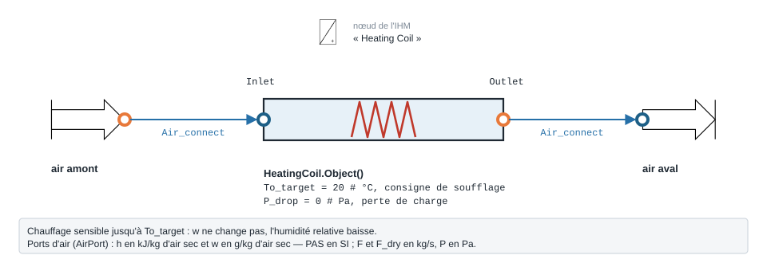
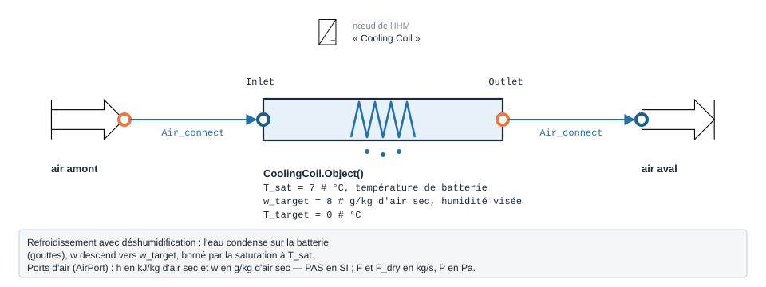
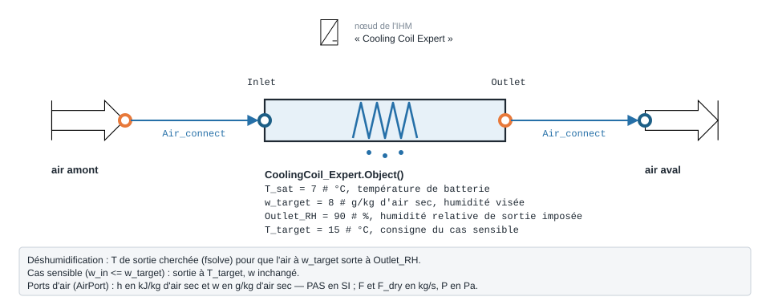

.. _batteries:

Batteries de CTA — chauffage et refroidissement
===============================================

Le sous-paquet ``AHU.Coil`` regroupe les **batteries** d'une Centrale de
Traitement d'Air (CTA) : composants qui réchauffent, refroidissent et,
éventuellement, déshumidifient l'air. Chaque batterie s'insère en série dans la
CTA — la sortie d'un composant alimente l'entrée du suivant via
``AHU.Connect.Air_connect``.

Toutes les grandeurs psychrométriques (enthalpie ``h``, humidité absolue ``w``,
température ``T``, humidité relative ``RH``, pression de vapeur saturante) sont
calculées avec ``AHU.air_humide`` (voir :doc:`air_humide`).

Modules disponibles
-------------------

.. list-table::
   :header-rows: 1
   :widths: 26 20 54

   * - Module
     - Classe
     - Rôle
   * - ``HeatingCoil``
     - ``Object``
     - Batterie chaude **sensible** : réchauffe l'air à humidité absolue
       constante jusqu'à une température de consigne.
   * - ``HeatingCoilNUT``
     - ``HeatingCoilNUT``
     - Batterie chaude **à eau**, dimensionnée par la méthode **NUT-ε**
       (efficacité d'échangeur) avec un port fluide caloporteur.
   * - ``CoolingCoil``
     - ``Object``
     - Batterie froide avec **déshumidification** (droite de saturation +
       facteur de bypass).
   * - ``CoolingCoil_Tc``
     - ``Object``
     - Batterie froide **sensible** : refroidit jusqu'à une température de
       consigne, sans condensation.
   * - ``CoolingCoil_Sensible``
     - ``Object``
     - Transformation **sensible** (chauffage ou refroidissement) à ``w``
       constant vers une température cible.
   * - ``CoolingCoil_Expert``
     - ``Object``
     - Variante « Expert » : état de sortie résolu numériquement pour une
       **humidité relative de sortie imposée**.

Connecteurs communs
-------------------

Chaque batterie expose deux ports air ``AirPort`` :

* ``Inlet`` — air entrant (``h``, ``w``, ``P``, ``F``, ``F_dry``) ;
* ``Outlet`` — air traité, calculé par ``calculate()``.

``HeatingCoilNUT`` ajoute deux ports **fluide caloporteur** ``FluidPort`` (eau) :
``Water_Inlet`` et ``Water_Outlet``.

La perte de charge côté air ``P_drop`` [Pa] est retranchée à la pression :
``Outlet.P = Inlet.P - P_drop`` (nulle par défaut). Le débit d'air sec est
conservé : ``F_dry = F / (1 + w/1000)`` [kg air sec/s]. Après calcul, chaque
batterie remplit un ``DataFrame`` ``df`` récapitulant l'état de sortie et la
puissance thermique.

.. note::
   **Convention de signe** de ``Q_th`` : ``Q_th = (h_out - h_in) · F_dry``.
   Elle est **positive** pour un chauffage (apport de chaleur) et **négative**
   pour un refroidissement (chaleur extraite).

Batterie chaude sensible — ``HeatingCoil``
------------------------------------------

   Forme, ports et raccordement ; paramètres sous leur nom de code, avec leur valeur par défaut.

**Rôle** — réchauffe l'air jusqu'à ``To_target`` sans modifier son humidité
absolue (chauffage **sensible**, ``w`` constant). Si l'air entre déjà plus chaud
que la consigne, la batterie reste inactive (``Q_th = 0``).

**Équations** :

.. math::

   w_{out} = w_{in}, \qquad
   h_{out} = h(T_{o,target},\, w_{in})

.. math::

   Q_{th} = (h_{out} - h_{in}) \cdot \dot m_{dry}, \qquad
   RH_{out} = f\big(P_{v,sat}(T_{o,target}),\, w_{in},\, P_{out}\big)

Si ``To_target <= T_in`` : ``h_out = h_in`` et ``Q_th = 0``.

**Paramètres** (``__init__``) :

.. list-table::
   :header-rows: 1
   :widths: 24 18 58

   * - Attribut
     - Défaut
     - Description
   * - ``To_target``
     - ``20``
     - Température de consigne en sortie [°C]
   * - ``P_drop``
     - ``0``
     - Perte de charge air [Pa]
   * - ``Inlet`` / ``Outlet``
     - ``AirPort()``
     - Ports air (connectés via ``Air_connect``)

**Exemple** :

.. code-block:: python

   from AHU.FreshAir import FreshAir
   from AHU.Coil import HeatingCoil
   from AHU.Connect import Air_connect

   AN = FreshAir.Object()
   AN.T = 5; AN.RH = 80; AN.F_m3h = 3000
   AN.calculate()

   HC = HeatingCoil.Object()
   HC.To_target = 20
   Air_connect(HC.Inlet, AN.Outlet)
   HC.calculate()
   print(HC.df)

Sortie réelle (air neuf 5 °C / 80 % HR, 3000 m³/h) :

.. code-block:: text

                        HeatingCoil
   ID                         2.000
   Outlet.T (C)              20.000
   Outlet.RH (%)             29.800
   Outlet.F (kg/s)            1.053
   Outlet.F_dry (kg/s)        1.048
   Outlet.P (Pa)         101325.000
   Outlet.P/10^5 (bar)        1.000
   Outlet.h (kJ/kg)          31.100
   Outlet.w (g/kgdry)         4.314
   Outlet.Pv_sat (Pa)      2338.800
   Q_th (kW)                 15.900

L'humidité absolue reste à 4,314 g/kg (chauffage sensible) ; la HR chute de 80 %
à 29,8 % et la batterie fournit 15,9 kW.

Batterie chaude à eau (NUT-ε) — ``HeatingCoilNUT``
--------------------------------------------------

**Rôle** — batterie chaude alimentée par un **fluide caloporteur (eau)**. La
puissance n'est pas imposée par une consigne d'air mais **dimensionnée** par la
méthode du Nombre d'Unités de Transfert (NUT-ε), à partir de la surface
d'échange ``S`` et du coefficient global ``U``. Le chauffage reste **sensible**
(``w`` constant).

**Connecteurs** : ports air ``Inlet`` / ``Outlet`` **et** ports eau
``Water_Inlet`` / ``Water_Outlet`` (``FluidPort(fluid='Water')``). Les propriétés
de l'eau (``cp``, ``ρ``) sont évaluées via **CoolProp**.

**Équations** — débits calorifiques et efficacité :

.. math::

   C_{eau} = \dot m_{eau}\, c_{p,eau}, \qquad
   C_{air} = \dot m_{dry}\, \cdot 1006

.. math::

   C_{min} = \min(C_{eau}, C_{air}), \qquad
   C_r = \frac{C_{min}}{C_{max}}, \qquad
   NUT = \frac{U\,S}{C_{min}}

Efficacité (formule codée, échangeur à **courants croisés non brassés**) :

.. math::

   \varepsilon = 1 - \exp\!\left[-\,\frac{NUT\,\big(1 - e^{-C_r\,NUT}\big)}{C_r}\right]

Puissance échangée puis état de sortie de l'air :

.. math::

   Q_{max} = C_{min}\,(T_{eau,in} - T_{in}), \qquad
   Q_{th} = \frac{\varepsilon\, Q_{max}}{1000}\ \text{[kW]}

.. math::

   \Delta T = \frac{Q_{th}\cdot 1000}{\dot m_{dry}\cdot 1006}, \qquad
   T_{out} = T_{in} + \Delta T, \qquad h_{out} = h(T_{out},\, w_{in})

Côté eau, l'enthalpie de sortie est mise à jour par bilan
(``h_water_out = h_water_in - Q_th·1000 / ṁ_eau``) et ``T_water_out`` en est
déduite. Si ``To_target <= T_in``, ``Q_th = 0``.

**Paramètres** (``__init__``) :

.. list-table::
   :header-rows: 1
   :widths: 24 16 60

   * - Attribut
     - Défaut
     - Description
   * - ``S``
     - ``10``
     - Surface d'échange [m²]
   * - ``U``
     - ``50``
     - Coefficient d'échange global [W/m².K]
   * - ``To_target``
     - ``20``
     - Consigne max de sortie air [°C] (garde-fou : au-delà, ``Q_th`` conservé)
   * - ``P_drop``
     - ``0``
     - Perte de charge air [Pa]
   * - ``T_water_in`` / ``T_water_out``
     - ``80`` / ``60``
     - Températures eau [°C] (recalculées depuis ``Water_Inlet`` / le bilan)
   * - ``P_water``
     - ``3e5``
     - Pression eau [Pa] (lue sur ``Water_Inlet``)
   * - ``m_water``
     - ``0``
     - Débit eau [kg/s] (lu sur ``Water_Inlet``)

**Exemple** (source d'eau chaude ``ThermodynamicCycles.Source``) :

.. code-block:: python

   from AHU.FreshAir import FreshAir
   from AHU.Connect import Air_connect
   from AHU.Coil.HeatingCoilNUT import HeatingCoilNUT
   from ThermodynamicCycles.Source import Source

   # Source d'eau chaude (fluide caloporteur)
   water = Source.Object()
   water.fluid = "Water"; water.Ti_degC = 80; water.Pi_bar = 3; water.F_m3h = 1.0
   water.calculate()

   # Air neuf
   AN = FreshAir.Object()
   AN.T = 5; AN.RH = 90; AN.F_m3h = 5000
   AN.calculate()

   # Batterie NUT-ε
   HC = HeatingCoilNUT()
   HC.S = 10; HC.U = 50; HC.To_target = 20
   Air_connect(HC.Inlet, AN.Outlet)     # côté air
   HC.Water_Inlet = water.Outlet        # côté eau
   HC.calculate()
   print(HC.df)

Sortie réelle (air 5 °C / 90 % HR, 5000 m³/h ; eau 80 °C, 1 m³/h ; S=10, U=50) :

.. code-block:: text

                        HeatingCoilNUT
   ID                            2.000
   Outlet.T (C)                 17.400
   Outlet.RH (%)                39.600
   Outlet.F (kg/s)               1.754
   Outlet.F_dry (kg/s)           1.745
   Outlet.P (Pa)            101325.000
   Outlet.P/10^5 (bar)           1.000
   Outlet.h (kJ/kg)             29.800
   Outlet.w (g/kgdry)            4.858
   Outlet.Pv_sat (Pa)         1982.600
   Q_th (kW)                    21.700
   NUT (-)                       0.980
   Effectiveness (-)             0.570
   T_water_out (C)              60.800

L'efficacité de l'échangeur (0,57) limite l'air soufflé à 17,4 °C (la consigne
de 20 °C n'est pas atteinte), pour 21,7 kW, et l'eau ressort à 60,8 °C.

Batterie froide avec déshumidification — ``CoolingCoil``
--------------------------------------------------------

   Forme, ports et raccordement ; paramètres sous leur nom de code, avec leur valeur par défaut.

**Rôle** — batterie froide qui **refroidit et déshumidifie**. Le modèle repose
sur la **droite de saturation** : l'air non traité (bypass) se mélange à l'air
saturé au contact de la batterie (point de rosée ``T_sat``), pondéré par
l'efficacité ``Eff`` et son complément le **facteur de bypass** ``FB = 1 - Eff``.

**État de la batterie** :

.. math::

   w_{sat} = w(T_{sat}, RH{=}100\%,\, P), \qquad
   h_{sat} = h(T_{sat},\, w_{sat})

Le calcul distingue plusieurs cas selon la position de l'air d'entrée :

* **Déshumidification** (``w_in >= w_target >= w_sat``) :

  .. math::

     Eff = \frac{w_{in} - w_{target}}{w_{in} - w_{sat}}, \qquad
     h_{out} = h_{in} - Eff\,(h_{in} - h_{sat})

* **Cas intermédiaire** (``w_sat < w_in <= w_target`` et ``T_in >= T_target``) :

  .. math::

     Eff = \frac{T_{target} - T_{sat}}{T_{in} - T_{sat}}, \quad
     h_{out} = h_{sat} + Eff\,(h_{in} - h_{sat}), \quad
     w_{out} = w_{sat} + Eff\,(w_{target} - w_{sat})

* **Refroidissement sensible** (``w_in <= w_sat`` et ``T_in >= T_target``) :
  ``w_out = w_in``, sortie amenée à ``T_target`` (pas de condensation).
* **Sinon** : aucune action (``Eff = 0``, ``h_out = h_in``).

Puis ``Q_th = (h_out - h_in) · F_dry`` (négatif).

**Paramètres** (``__init__``) :

.. list-table::
   :header-rows: 1
   :widths: 24 20 56

   * - Attribut
     - Défaut
     - Description
   * - ``w_target``
     - ``8``
     - Humidité absolue de consigne en sortie [g/kg air sec]
   * - ``T_target``
     - ``0``
     - Température de consigne en sortie [°C]
   * - ``T_sat``
     - ``7``
     - Température de surface (point de rosée) de la batterie froide [°C]
   * - ``Déshutype``
     - ``"Droite_sat"``
     - Type de déshumidification (droite de saturation)
   * - ``Eff`` / ``FB``
     - ``0.8`` / ``0.2``
     - Efficacité / facteur de bypass (recalculés)
   * - ``P_drop``
     - ``0``
     - Perte de charge air [Pa]

**Exemple** (air estival 30 °C / 60 % HR) :

.. code-block:: python

   from AHU.FreshAir import FreshAir
   from AHU.Coil import CoolingCoil
   from AHU.Connect import Air_connect

   AN = FreshAir.Object()
   AN.T = 30; AN.RH = 60; AN.F_m3h = 5000
   AN.calculate()          # w_in ≈ 16.0 g/kg

   CC = CoolingCoil.Object()
   CC.w_target = 8      # consigne humidité absolue [g/kg]
   CC.T_target = 14     # consigne température [°C]
   CC.T_sat    = 7      # point de rosée de la batterie [°C]
   Air_connect(CC.Inlet, AN.Outlet)
   CC.calculate()
   print(CC.df)

Sortie réelle :

.. code-block:: text

                        CoolingCoil
   Outlet.T (C)              11.200
   Outlet.RH (%)             96.500
   Outlet.F (kg/s)            1.586
   Outlet.F_dry (kg/s)        1.573
   Outlet.P (Pa)         101325.000
   Outlet.h (kJ/kg)          31.500
   Outlet.w (g/kgdry)         8.000
   Q_th (kW)                -62.500
   Eff                        0.818
   FB                         0.182

L'humidité passe de 16,0 à 8,0 g/kg (déshumidification), l'air ressort à 11,2 °C
proche de la saturation (96,5 % HR) ; la batterie extrait 62,5 kW pour une
efficacité de 0,818 (facteur de bypass 0,182).

Batterie froide sensible (consigne T) — ``CoolingCoil_Tc``
----------------------------------------------------------

**Rôle** — refroidissement **sensible** (``w`` constant) jusqu'à une consigne de
température ``T_target``, **sans condensation**. Efficacité et facteur de bypass
sont calculés relativement à la température de surface ``T_sat``.

**Équations** (si ``T_in >= T_target``) :

.. math::

   Eff = \frac{T_{target} - T_{sat}}{T_{in} - T_{sat}}, \qquad FB = 1 - Eff

.. math::

   w_{out} = w_{in}, \qquad
   h_{out} = h_s(T_{target},\, P,\, w_{in}), \qquad
   Q_{th} = (h_{out} - h_{in})\, \dot m_{dry}

Sinon, aucune action. Paramètres identiques à ``CoolingCoil`` (``w_target``,
``T_target``, ``T_sat``, ``P_drop`` …).

.. warning::
   Modèle **purement sensible** : aucune déshumidification n'est modélisée. Si
   ``T_target`` descend sous le point de rosée de l'air entrant, l'humidité
   absolue conservée conduit à une **HR de sortie > 100 %** (état non physique).
   Réserver ce modèle à l'air peu humide ou aux refroidissements restant
   au-dessus du point de rosée.

**Exemple** :

.. code-block:: python

   from AHU.Coil import CoolingCoil_Tc

   CCt = CoolingCoil_Tc.Object()
   CCt.T_target = 18; CCt.T_sat = 7
   Air_connect(CCt.Inlet, AN.Outlet)   # AN : air neuf 30 °C / 60 %
   CCt.calculate()
   print(CCt.df)

Sortie réelle :

.. code-block:: text

                        CoolingCoil_Tc
   Outlet.T (C)                 18.000
   Outlet.RH (%)               123.400
   Outlet.F (kg/s)               1.599
   Outlet.F_dry (kg/s)           1.573
   Outlet.P (Pa)            101325.000
   Outlet.h (kJ/kg)             58.800
   Outlet.w (g/kgdry)           16.042
   Q_th (kW)                   -19.600
   Eff                           0.478
   FB                            0.522

Batterie sensible à ``w`` constant — ``CoolingCoil_Sensible``
-------------------------------------------------------------

**Rôle** — transformation **sensible** simple vers ``To_target`` à humidité
absolue constante. Le sens est déterminé par ``To_target`` : refroidissement si
``To_target < T_in`` (``Q_th`` négatif), chauffage sinon. Contrairement à
``HeatingCoil``, aucune condition n'annule le calcul (la transformation est
toujours appliquée).

**Équations** :

.. math::

   w_{out} = w_{in}, \quad
   h_{out} = h(T_{o,target},\, w_{in}), \quad
   Q_{th} = (h_{out} - h_{in})\,\dot m_{dry}

**Paramètres** : ``To_target`` (défaut ``20``), ``P_drop`` (``0``).

.. note::
   Le code affecte ``Outlet.F = Inlet.F`` (annoté « à corriger » dans la
   source) ; le débit d'air sec ``Outlet.F_dry`` reste correct. Une trace de
   débogage (``print``) est émise à chaque appel de ``calculate()``.

**Exemple** (refroidissement sensible 30 → 24 °C) :

.. code-block:: python

   from AHU.Coil import CoolingCoil_Sensible

   CS = CoolingCoil_Sensible.Object()
   CS.To_target = 24
   Air_connect(CS.Inlet, AN.Outlet)    # AN : air neuf 30 °C / 60 %
   CS.calculate()
   print(CS.df)

Sortie réelle :

.. code-block:: text

   self.F_dry= 1.5732946116359037 self.Inlet.P= 101325 self.F= 1.598533403795767
                       CoolingCoil_Sensible
   T_in (C)                          30.000
   To_target (C)                     24.000
   Outlet.F (kg/s)                    1.599
   F_dry (kg/s)                       1.573
   Outlet.P (Pa)                 101325.000
   ho (kJ/kg)                        65.000
   Outlet.w (g/kgdry)                16.042
   Q_th (kW)                         -9.800
   RH_out (%)                        85.300

Batterie froide « Expert » — ``CoolingCoil_Expert``
---------------------------------------------------

   Forme, ports et raccordement ; paramètres sous leur nom de code, avec leur valeur par défaut.

**Rôle** — variante qui fixe l'état de sortie par une **humidité relative de
sortie imposée** plutôt que par un facteur de bypass. En déshumidification
(``w_in >= w_target >= w_sat``), elle cherche numériquement
(``scipy.optimize.fsolve``) la température de sortie telle que l'air, ramené à
``w_target``, sorte à ``Outlet_RH`` (90 % par défaut, 100 % si l'air entrant
dépasse déjà 90 % HR) ; l'enthalpie de sortie vaut alors ``h(T_out, w_target)``.
Deux autres cas sont prévus : refroidissement **sensible** jusqu'à ``T_target``
quand l'air est déjà assez sec (``w_in <= w_target``), et **aucune action**
sinon — y compris quand ``w_target`` est inférieur à ``w_sat``, l'humidité de
l'air saturé à ``T_sat``.

Dans l'IHM, c'est le nœud **« Cooling Coil Expert »** (famille *Chaîne d'air*) :
ses réglages sont la perte de charge **en bar** (convertie en Pa par le nœud),
la température d'eau glacée ``T_sat`` et le poids d'eau visé ``w_target``.

**Paramètres** (``__init__``) :

.. list-table::
   :header-rows: 1
   :widths: 24 18 58

   * - Attribut
     - Défaut
     - Description
   * - ``w_target``
     - ``8``
     - Humidité absolue visée en sortie [g/kg air sec]
   * - ``Outlet_RH``
     - ``90``
     - Humidité relative de sortie imposée en déshumidification [%]
   * - ``T_sat``
     - ``7``
     - Température de surface de la batterie (point de rosée) [°C]
   * - ``T_target``
     - ``15``
     - Consigne de température du cas sensible [°C]
   * - ``P_drop``
     - ``0``
     - Perte de charge air [Pa]

**Le cas de déshumidification ne converge pas.** Sur l'air estival de
l'exemple ``CoolingCoil`` ci-dessus (30 °C / 60 % HR, 16 g/kg), la batterie
Expert, réglée comme la batterie standard, s'arrête :

.. code-block:: python

   from AHU.Coil import CoolingCoil_Expert

   CCE = CoolingCoil_Expert.Object()
   CCE.w_target = 8      # g/kg d'air sec
   CCE.T_sat = 7         # °C
   Air_connect(CCE.Inlet, AN.Outlet)     # AN : air neuf 30 °C / 60 %, 5000 m3/h
   try:
       CCE.calculate()
   except ValueError as exc:
       print("ValueError :", exc)

Sortie réelle :

.. code-block:: text

   ValueError : math domain error

La recherche de ``fsolve`` part vers des températures absurdes (plus de
1 300 °C sous zéro, mesuré) et la pression de vapeur saturante ne s'y calcule
plus. La cause est dans ``air_humide.Air_RH``, que le système résout : elle
**arrondit** l'humidité relative à deux décimales, ce qui rend la fonction en
escalier et fausse les dérivées dont ``fsolve`` a besoin. Tous les cas de
déshumidification essayés (30 °C / 60 %, 35 °C / 40 %, 25 °C / 95 %, avec
``Outlet_RH`` à 90 ou 95 %) échouent de la même façon. Défaut consigné dans le
suivi de la bibliothèque.

**Le cas sensible calcule, avec une efficacité de signe faux.** Sur de l'air
sec (30 °C / 20 % HR, 5,3 g/kg), la batterie refroidit bien jusqu'à
``T_target`` :

.. code-block:: python

   AS = FreshAir.Object()
   AS.T = 30; AS.RH = 20; AS.F_m3h = 5000
   AS.calculate()

   CCE = CoolingCoil_Expert.Object()
   CCE.w_target = 8; CCE.T_target = 18; CCE.T_sat = 7
   Air_connect(CCE.Inlet, AS.Outlet)
   CCE.calculate()
   print(CCE.df)

Sortie réelle :

.. code-block:: text

                        CoolingCoil_Expert
   Outlet.T (C)                     18.000
   Outlet.RH (%)                    41.100
   Outlet.F (kg/s)                   1.609
   Outlet.F_dry (kg/s)               1.600
   Outlet.P (Pa)                101325.000
   Outlet.h (kJ/kg)                 31.400
   Outlet.w (g/kgdry)                5.257
   Q_th (kW)                       -19.500
   Eff                              -0.478
   FB                                1.478

La sortie à 18 °C et la puissance sont justes (même calcul que
``CoolingCoil_Tc``), mais ``Eff`` est calculée comme
``(T_sat − T_target)/(T_in − T_sat)`` : elle sort **négative**, et le facteur de
bypass ``FB = 1 − Eff`` dépasse 1. En déshumidification, ``Eff`` et ``FB`` ne
sont pas recalculées du tout (elles garderaient leurs valeurs initiales 0,8 et
0,2). Ne lisez pas ces deux grandeurs sur ce modèle.

.. warning::
   **Préférez** ``CoolingCoil`` **pour déshumidifier.** Il calcule la sortie par
   la droite de saturation, sans résolution numérique, et rend une efficacité
   cohérente. Réservez ``CoolingCoil_Expert`` au refroidissement sensible, en
   lisant ``Outlet.T``, ``Outlet.w`` et ``Q_th`` — pas ``Eff``.

Paramètres à personnaliser
--------------------------

Les réglages qui pilotent une batterie, et leur effet :

.. list-table::
   :header-rows: 1
   :widths: 20 44 20 16

   * - Paramètre
     - Effet
     - Plage usuelle
     - Unité
   * - ``To_target`` (``HeatingCoil``)
     - Consigne de soufflage : fixe la puissance de chauffe à débit donné
     - 16 à 35
     - °C
   * - ``T_sat`` (batteries froides)
     - Température de surface, liée à l'eau glacée (≈ départ + 1 à 3 K) : plus
       elle est basse, plus la batterie peut sécher l'air
     - 5 à 12
     - °C
   * - ``w_target``
     - Humidité absolue visée ; au-dessus de ``w_in``, la batterie ne déshumidifie pas
     - 7 à 10
     - g/kg as
   * - ``T_target``
     - Consigne des cas sensibles (``CoolingCoil_Tc``, ``CoolingCoil_Expert``)
     - 12 à 20
     - °C
   * - ``P_drop``
     - Perte de charge côté air, retranchée à la pression
     - 50 à 250
     - Pa
   * - ``F_m3h`` de l'air amont
     - Débit d'air : la puissance lui est proportionnelle
     - selon la CTA
     - m³/h

Variante : température de batterie froide
-----------------------------------------

Quelle température d'eau glacée faut-il pour sécher l'air estival à 8 g/kg ? On
rejoue l'exemple ``CoolingCoil`` pour quatre ``T_sat`` :

.. code-block:: python

   # variante : T_sat de 5 à 11 °C, même air (30 °C / 60 %) et même consigne w_target = 8
   print("T_sat   T sortie   HR sortie   Q_th (kW)   Eff")
   for t_sat in (5, 7, 9, 11):
       CCv = CoolingCoil.Object()
       CCv.w_target = 8; CCv.T_target = 14; CCv.T_sat = t_sat
       Air_connect(CCv.Inlet, AN.Outlet)
       CCv.calculate()
       print(f"{t_sat:5d}   {CCv.Outlet.T:8.1f}   {CCv.Outlet.RH:9.1f}   {CCv.Q_th:9.1f}   {CCv.Eff:.3f}")

Sortie réelle :

.. code-block:: text

   T_sat   T sortie   HR sortie   Q_th (kW)   Eff
       5       11.2        96.8       -62.6   0.756
       7       11.2        96.5       -62.5   0.818
       9       11.1        97.5       -62.7   0.902
      11       30.0        60.0         0.0   0.000

Ce qui fixe l'air soufflé, c'est ``w_target`` : de 5 à 9 °C, la sortie reste à
11,2 °C et la puissance à 62,5 kW environ. ``T_sat`` ne change que
l'**efficacité** demandée à la batterie — plus elle est chaude, moins elle peut
laisser passer d'air non traité (0,76 à 0,90). À 11 °C, l'air saturé au contact
de la batterie contient déjà plus de 8 g/kg : la consigne est hors d'atteinte,
et le modèle ne fait **rien**, sans prévenir (``Q_th = 0``, air inchangé).
Vérifiez donc que ``w_target`` reste au-dessus de l'humidité de saturation à
``T_sat``.

Variantes historiques (``old/``)
--------------------------------

Le dossier ``AHU/Coil/old/`` conserve des versions antérieures
(``HeatingCoil.py``, ``CoolingCoil.py``, ``CoolingCoil_Sensible.py``,
``CoolingCoil_Tc.py``, ``CoolingCoil_Expert.py``, ``helpers.py``). Elles sont
maintenues pour référence historique et **remplacées** par les modules décrits
ci-dessus ; ne pas les utiliser dans un nouveau modèle. Elles ne sont d'ailleurs
**pas livrées par PyPI** : le dossier n'a pas de fichier ``__init__.py`` et le
paquet publié (vérifié sur la version ``20260924003``) ne le contient pas — un
``import`` de ``AHU.Coil.old`` échoue chez un utilisateur de
``pip install energysystemmodels``.

Voir aussi
----------

* :doc:`cta_air_neuf` — chaîne complète air neuf (``FreshAir`` → batterie →
  humidificateur)
* :doc:`generic_ahu` — CTA paramétrable sur série chronologique
* :doc:`air_humide` — fonctions psychrométriques
* :doc:`nomenclature` — symboles et unités
