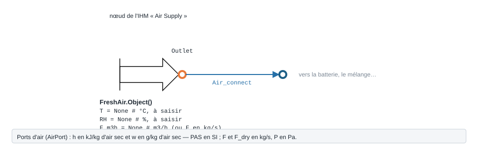
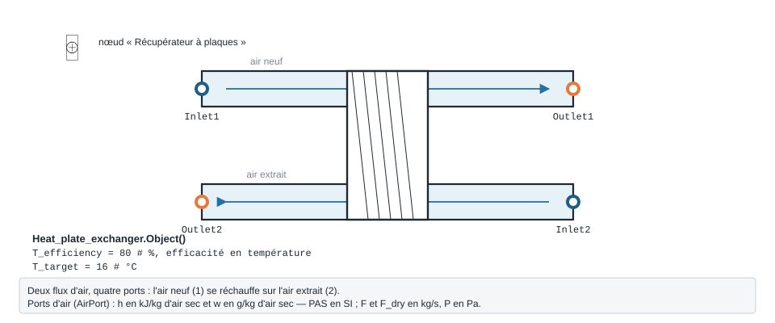
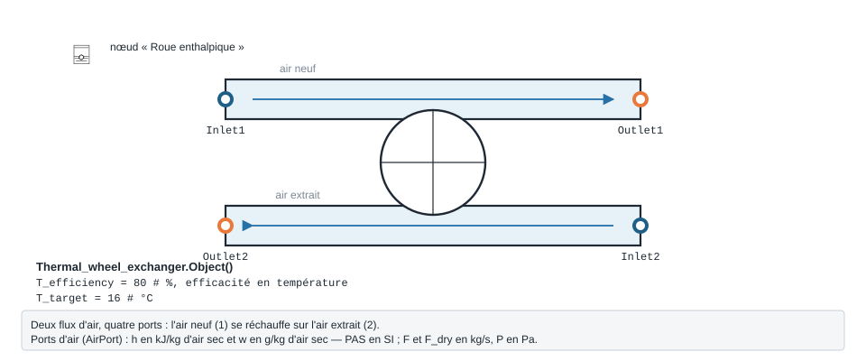
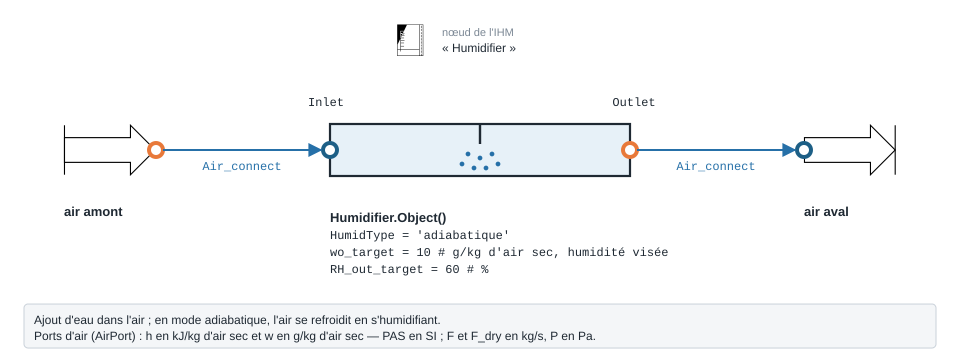

.. _composants_cta:

Composants de CTA hors batteries
================================

Cette page documente les **composants unitaires** d'une Centrale de Traitement
d'Air (CTA) fournis par le paquet ``AHU``, à l'exclusion des batteries
chaudes/froides (voir le sous-paquet ``AHU.Coil``). Chaque composant est une
classe ``Object`` qui échange l'air via des ports ``AirPort`` et expose une
méthode ``calculate()`` remplissant un DataFrame ``self.df`` de résultats.

Le connecteur ``AirPort``
-------------------------

Tous les composants communiquent via des objets ``AHU.AirPort.AirPort``. Un
``AirPort`` porte l'état d'un flux d'air humide :

.. list-table::
   :header-rows: 1
   :widths: 20 55 25

   * - Attribut
     - Signification
     - Unité
   * - ``F``
     - Débit massique d'air humide
     - kg/s
   * - ``F_dry``
     - Débit massique d'air sec
     - kg/s
   * - ``P``
     - Pression (défaut ``101325``)
     - Pa
   * - ``h``
     - Enthalpie spécifique
     - kJ/kg air sec
   * - ``w``
     - Humidité absolue
     - g H₂O / kg air sec

Les propriétés ``T`` (°C), ``RH`` (%) et ``Pv_sat`` (Pa) sont **calculées à la
demande** à partir de ``h``, ``w`` et ``P`` (propriétés Python en lecture seule) :

* ``T`` = ``air_humide.Air_T_db(h, w)`` ;
* ``Pv_sat`` = ``air_humide.Air_Pv_sat(T)`` ;
* ``RH`` = ``air_humide.Air_RH(Pv_sat, w, P)``.

La méthode ``update_properties()`` force le recalcul (invalide le cache
``_T`` / ``_RH`` / ``_Pv_sat``). Elle est appelée par chaque composant après
mise à jour de son port de sortie.

.. _composants_cta_freshair:

Air neuf — ``FreshAir``
-----------------------

   Forme, ports et raccordement ; paramètres sous leur nom de code, avec leur valeur par défaut.

**Rôle.** Point d'entrée d'air (air neuf, air repris, air extrait…). Convertit
un couple température / humidité relative (et éventuellement un débit volumique)
en état psychrométrique complet sur le port de sortie.

**Connecteurs.** ``Inlet`` (``AirPort``), ``Outlet`` (``AirPort``). La sortie
est une recopie de l'entrée une fois l'état calculé.

**Équations** (module ``AHU.FreshAir.FreshAir``). Si ``T`` et ``RH`` sont
fournis :

.. math::

   P_{v,sat} = \mathrm{Air\_Pv\_sat}(T) \qquad
   w = \mathrm{Air\_w}(P_{v,sat}, RH, P) \qquad
   h = \mathrm{Air\_h}(T, w)

Conversion optionnelle d'un débit volumique en débit massique :

.. math::

   F = \frac{F_{m3h}\;\rho_{hum}(T, RH, P)}{3600}\quad[\mathrm{kg/s}]

Débit d'air sec :

.. math::

   F_{dry} = \frac{F}{1 + w/1000}

**Paramètres** (``__init__``) :

.. list-table::
   :header-rows: 1
   :widths: 25 45 15 15

   * - Attribut
     - Description
     - Unité
     - Défaut
   * - ``id``
     - Identifiant
     - —
     - ``1``
   * - ``T``
     - Température d'entrée
     - °C
     - ``None``
   * - ``RH``
     - Humidité relative d'entrée
     - %
     - ``None``
   * - ``F``
     - Débit massique air humide
     - kg/s
     - ``None``
   * - ``F_m3h``
     - Débit volumique air humide
     - m³/h
     - ``None``
   * - ``P``
     - Pression
     - Pa
     - ``101325``

**Exemple.**

.. code-block:: python

   from AHU.FreshAir.FreshAir import Object as FreshAir

   fa = FreshAir()
   fa.T = -5.0
   fa.RH = 80.0
   fa.F_m3h = 10000
   fa.calculate()
   print(fa.Outlet.T, fa.Outlet.w, fa.Outlet.h, fa.Outlet.F)

Sortie réelle :

.. code-block:: text

   -5.0 1.979 -0.099 3.644504818131823

.. _composants_cta_airmix:

Mélange air neuf / air repris — ``AirMix``
------------------------------------------

**Rôle.** Mélange adiabatique de deux flux d'air humide (typiquement air neuf +
air repris). Le mélange se fait par bilan sur l'air sec.

**Connecteurs.** ``Inlet1``, ``Inlet2`` (``AirPort``), ``Outlet`` (``AirPort``).

**Équations** (module ``AHU.FreshAir.AirMix``). Débits d'air sec de chaque
flux :

.. math::

   \dot m_{dry,i} = \frac{F_i}{1 + w_i/1000}

Humidité absolue et enthalpie du mélange (moyennes pondérées par le débit d'air
sec) :

.. math::

   w_{out} = \frac{w_1\,\dot m_{dry,1} + w_2\,\dot m_{dry,2}}
                   {\dot m_{dry,1} + \dot m_{dry,2}}
   \qquad
   h_{out} = \frac{h_1\,\dot m_{dry,1} + h_2\,\dot m_{dry,2}}
                   {\dot m_{dry,1} + \dot m_{dry,2}}

Débit d'air humide et pression :

.. math::

   F_{out} = F_1 + F_2 \qquad P_{out} = \min(P_1, P_2)

Si un seul flux est renseigné, la sortie reprend cet unique flux.

**Paramètres.** Aucun paramètre de réglage : ``Inlet1``, ``Inlet2``, ``Outlet``,
``id`` (défaut ``1``). Les débits d'air sec ``F_dry1`` / ``F_dry2`` sont déduits.

**Exemple.**

.. code-block:: python

   from AHU.FreshAir.AirMix import Object as AirMix
   from AHU.FreshAir.FreshAir import Object as FreshAir

   neuf = FreshAir(); neuf.T = -5; neuf.RH = 80; neuf.F_m3h = 3000; neuf.calculate()
   repris = FreshAir(); repris.T = 20; repris.RH = 45; repris.F_m3h = 7000; repris.calculate()

   mx = AirMix()
   mx.Inlet1 = neuf.Outlet
   mx.Inlet2 = repris.Outlet
   mx.calculate()
   print(mx.Outlet.T, mx.Outlet.w, mx.Outlet.F)

Sortie réelle :

.. code-block:: text

   12.03 5.069486167212098 3.4206027177893485

.. _composants_cta_plate:

Récupérateur à plaques — ``HeatRecovery.Heat_plate_exchanger``
--------------------------------------------------------------

   Forme, ports et raccordement ; paramètres sous leur nom de code, avec leur valeur par défaut.

**Rôle.** Échangeur air/air à plaques (récupération **sensible**). L'air neuf
(flux 1) est préchauffé/rafraîchi par l'air extrait (flux 2) sans transfert
d'humidité côté air neuf ; la condensation éventuelle est traitée côté air
extrait.

**Connecteurs.** ``Inlet1`` / ``Outlet1`` (air neuf), ``Inlet2`` / ``Outlet2``
(air extrait). Tous des ``AirPort``.

**Équations** (module ``AHU.HeatRecovery.Heat_plate_exchanger``). Débit d'air
sec limitant :

.. math::

   \dot m_{dry,min} = \min(F_{dry,1},\,F_{dry,2})

*Régime hivernal* (``Inlet2.T ≥ Inlet1.T`` et ``Inlet1.T ≤ T_target``) — avec
plafonnement de l'efficacité pour ne pas dépasser la consigne ``T_target`` :

.. math::

   \eta_{cible} = 100\,\frac{F_{dry,1}\,(T_{target} - T_{1i})}
                              {\dot m_{dry,min}\,(T_{2i} - T_{1i})}
   \qquad \eta_T \leftarrow \max\!\big(\min(\eta_T, \eta_{cible}),\,0\big)

Température de sortie de l'air neuf (l'humidité absolue reste constante,
:math:`w_{1o} = w_{1i}`) :

.. math::

   T_{1o} = T_{1i} + \frac{\dot m_{dry,min}\,(\eta_T/100)\,(T_{2i} - T_{1i})}{F_{dry,1}}
   \qquad h_{1o} = \mathrm{Air\_h}(T_{1o}, w_{1i})

Chaleur récupérée et efficacité enthalpique :

.. math::

   \dot Q = (h_{1o} - h_{1i})\,F_{dry,1}
   \qquad
   \eta_h = 100\,\frac{F_{dry,1}\,(h_{1o} - h_{1i})}
                       {\dot m_{dry,min}\,(h_{2i} - h_{1i})}

Enthalpie de sortie de l'air extrait (bilan de chaleur) et gestion de la
condensation par comparaison des températures de rosée :

.. math::

   h_{2o} = h_{2i} - \frac{\dot Q}{F_{dry,2}}

.. math::

   T_{dp,dry} = \mathrm{Air\_T\_dp}(w_{2i}) \qquad
   T_{dp,wet} = \mathrm{Air\_T\_dp}(h_{2o})

Si :math:`T_{dp,wet} \le T_{dp,dry}` → condensation :
:math:`w_{2o} = \mathrm{Air\_w}(h_{2o}, RH{=}100)` ; sinon :math:`w_{2o} = w_{2i}`.

*Régime estival* (``Inlet2.T < Inlet1.T``) : l'air neuf est refroidi,
:math:`T_{1o} = T_{1i} - \dot m_{dry,min}\,(\eta_T/100)\,(T_{1i} - T_{2i})/F_{dry,1}`,
sans condensation modélisée (:math:`w_{2o} = w_{2i}`). Entre les deux
(``Inlet1.T > T_target``) : aucun échange. Les débits d'air sec sont conservés.

**Paramètres** (``__init__``) :

.. list-table::
   :header-rows: 1
   :widths: 25 45 15 15

   * - Attribut
     - Description
     - Unité
     - Défaut
   * - ``id``
     - Identifiant
     - —
     - ``2``
   * - ``T_efficiency``
     - Efficacité en température de l'échangeur
     - %
     - ``80``
   * - ``T_target``
     - Consigne de température de l'air neuf préchauffé (plafonne l'échange)
     - °C
     - ``16``
   * - ``h_efficiency``
     - Efficacité enthalpique (calculée)
     - %
     - ``None``
   * - ``T_efficiency_target``
     - Efficacité maxi admissible pour tenir ``T_target`` (calculée)
     - %
     - ``None``

**Exemple.**

.. code-block:: python

   from AHU.HeatRecovery.Heat_plate_exchanger import Object as PlateExchanger
   from AHU.FreshAir.FreshAir import Object as FreshAir

   neuf = FreshAir(); neuf.T = -5; neuf.RH = 80; neuf.F_m3h = 10000; neuf.calculate()
   extrait = FreshAir(); extrait.T = 22; extrait.RH = 50; extrait.F_m3h = 10000; extrait.calculate()

   hx = PlateExchanger()
   hx.T_efficiency = 75
   hx.Inlet1 = neuf.Outlet
   hx.Inlet2 = extrait.Outlet
   hx.calculate()
   print(hx.Outlet1.T, hx.heat_transfer, hx.h_efficiency)

Sortie réelle :

.. code-block:: text

   hiver
   condensation
   13.22 66.89734277373128 47.39700554449382

.. _composants_cta_wheel:

Récupérateur à roue — ``HeatRecovery.Thermal_wheel_exchanger``
--------------------------------------------------------------

   Forme, ports et raccordement ; paramètres sous leur nom de code, avec leur valeur par défaut.

**Rôle.** Roue thermique (échangeur rotatif). Contrairement à la plaque, la roue
transfère **chaleur et humidité** (échange enthalpique total). Le module
distingue transfert total (``heat_transfer1/2``), transfert sensible
(``sensible_heat_transfer1/2``) et transfert d'eau (``delta_mw1/2``).

**Connecteurs.** ``Inlet1`` / ``Outlet1`` (air neuf), ``Inlet2`` / ``Outlet2``
(air extrait). Tous des ``AirPort``.

**Équations** (module ``AHU.HeatRecovery.Thermal_wheel_exchanger``). Le
plafonnement d'efficacité et :math:`\dot m_{dry,min}` sont identiques à la
plaque. En régime hivernal, l'efficacité s'applique à l'**enthalpie** :

.. math::

   T_{1o} = T_{1i} + \frac{\dot m_{dry,min}\,(\eta_T/100)\,(T_{2i} - T_{1i})}{F_{dry,1}}

.. math::

   h_{1o} = h_{1i} + \frac{\dot m_{dry,min}\,(\eta_T/100)\,(h_{2i} - h_{1i})}{F_{dry,1}}
   \qquad w_{1o} = \mathrm{Air\_w}(h_{1o}, T_{1o})

Transferts total et sensible du flux air neuf :

.. math::

   \dot Q_1 = (h_{1o} - h_{1i})\,F_{dry,1}
   \qquad
   \dot Q_{s,1} = \big(\mathrm{Air\_h}(w_{1i}, T_{1o}) - h_{1i}\big)\,F_{dry,1}

Côté air extrait, bilan miroir (:math:`\dot Q_2 = -\dot Q_1`) et transfert
d'humidité :

.. math::

   h_{2o} = h_{2i} + \frac{\dot Q_2}{F_{dry,2}}
   \qquad
   \Delta \dot m_{w,1} = F_{dry,1}\,(w_{1o} - w_{1i}) \;,\quad
   \Delta \dot m_{w,2} = -\Delta \dot m_{w,1}

.. math::

   w_{2o} = w_{2i} + \frac{\Delta \dot m_{w,2}}{F_{dry,2}}
   \qquad
   T_{2o} = \mathrm{Air\_T\_db}(w_{2o}, h_{2o})

Efficacité enthalpique :
:math:`\eta_h = 100\,F_{dry,1}(h_{1o}-h_{1i}) / [\dot m_{dry,min}(h_{2i}-h_{1i})]`.
Le régime estival est symétrique (air neuf refroidi) ; entre les deux, pas
d'échange.

**Paramètres** (``__init__``) : identiques à la plaque (``id`` défaut ``2``,
``T_efficiency`` défaut ``80`` %, ``T_target`` défaut ``16`` °C), plus les
grandeurs calculées ``heat_transfer1/2``, ``sensible_heat_transfer1/2``,
``delta_mw1/2`` (g H₂O/s), ``T1o`` / ``T2o``.

**Exemple.**

.. code-block:: python

   from AHU.HeatRecovery.Thermal_wheel_exchanger import Object as ThermalWheel
   from AHU.FreshAir.FreshAir import Object as FreshAir

   neuf = FreshAir(); neuf.T = -5; neuf.RH = 80; neuf.F_m3h = 10000; neuf.calculate()
   extrait = FreshAir(); extrait.T = 22; extrait.RH = 50; extrait.F_m3h = 10000; extrait.calculate()

   wheel = ThermalWheel()
   wheel.T_efficiency = 75
   wheel.Inlet1 = neuf.Outlet
   wheel.Inlet2 = extrait.Outlet
   wheel.calculate()
   print(wheel.Outlet1.T, wheel.Outlet1.w, wheel.delta_mw1)

Sortie réelle :

.. code-block:: text

   13.22 6.22 15.425817241376377

.. _composants_cta_humidifier:

Humidificateur — ``Humidification.Humidifier``
----------------------------------------------

   Forme, ports et raccordement ; paramètres sous leur nom de code, avec leur valeur par défaut.

**Rôle.** Porte l'humidité absolue de l'air à une consigne ``wo_target``. Deux
technologies : humidification **adiabatique** (à eau, enthalpie conservée) ou à
**vapeur** (apport d'enthalpie). L'état de sortie est résolu numériquement
(``scipy.optimize.fsolve``).

**Connecteurs.** ``Inlet``, ``Outlet`` (``AirPort``).

**Équations** (module ``AHU.Humidification.Humidifier``). L'humidification n'a
lieu que si ``wo_target > wi`` (sinon l'air traverse sans changement,
``F_water = 0``, ``Q_th = 0``).

*Adiabatique* — enthalpie conservée (:math:`h_o = h_i`). Le système résolu fixe
:math:`(P_{v,sat}, T_o, RH_o)` par :

.. math::

   P_{v,sat} = \mathrm{Air\_Pv\_sat}(T_o) \;,\quad
   w_{target} = \mathrm{Air\_w}(P_{v,sat}, RH_o, 101325) \;,\quad
   h_i = \mathrm{Air\_h}(T_o, w_{target})

*Vapeur* — apport d'enthalpie de la vapeur injectée (variable supplémentaire
:math:`h_o`) :

.. math::

   h_o - h_i = \frac{w_{target} - w_i}{1000}\,h_{vap}
   \qquad h_{vap} = C_{pv}\,T_{vap} + L_{lv} \approx 2676\ \mathrm{kJ/kg}

Dans les deux cas, débit d'air sec, consommation d'eau et puissance thermique :

.. math::

   \dot m_{dry} = \frac{F}{1 + w_i/1000}
   \qquad
   \dot m_{water} = \dot m_{dry}\,\frac{w_{target} - w_i}{1000}\ [\mathrm{kg/s}]

.. math::

   \dot Q_{th} = (h_o - h_i)\,\dot m_{dry}

Le port de sortie prend :math:`w_{out} = w_{target}`,
:math:`P_{out} = P_{in} - \Delta P`, :math:`h_{out} = h_o`.

**Paramètres** (``__init__``) :

.. list-table::
   :header-rows: 1
   :widths: 25 40 15 20

   * - Attribut
     - Description
     - Unité
     - Défaut
   * - ``HumidType``
     - ``"adiabatique"`` ou ``"vapeur"``
     - —
     - ``"adiabatique"``
   * - ``wo_target``
     - Humidité absolue de consigne
     - g/kg air sec
     - ``10``
   * - ``RH_out_target``
     - Humidité relative de consigne
     - %
     - ``60``
   * - ``P_drop``
     - Perte de charge
     - Pa
     - ``0``
   * - ``Llv``
     - Chaleur latente de vaporisation
     - kJ/kg
     - ``2500.8``
   * - ``T_vap``
     - Température vapeur injectée
     - °C
     - ``100``
   * - ``Cpv``
     - Chaleur massique vapeur
     - kJ/kg·K
     - ``1.8262``

**Exemple.**

.. code-block:: python

   from AHU.Humidification.Humidifier import Object as Humidifier
   from AHU.FreshAir.FreshAir import Object as FreshAir

   amont = FreshAir(); amont.T = 18; amont.RH = 20; amont.F_m3h = 10000; amont.calculate()

   hmd = Humidifier()
   hmd.HumidType = "adiabatique"
   hmd.wo_target = 5          # g/kg d'air sec, atteignable (voir ci-dessous)
   hmd.Inlet = amont.Outlet
   hmd.calculate()
   print(hmd.Outlet.T, hmd.Outlet.RH, hmd.F_water, hmd.Q_th)

Sortie réelle :

.. code-block:: text

   11.87 58.11 0.008216740601793176 0.0

**Au-delà de la saturation, aucun garde-fou.** En humidification adiabatique,
l'air suit une enthalpie constante et se refroidit en s'humidifiant ; il finit
par saturer. Le modèle ne le vérifie pas : il résout ses équations et publie une
humidité relative supérieure à 100 %, physiquement impossible.

.. code-block:: python

   from AHU.Humidification.Humidifier import Object as Humidifier
   from AHU.FreshAir.FreshAir import Object as FreshAir

   # Éprouver le modèle : cibles croissantes depuis de l'air à 18 °C / 20 % HR
   for wo in (5, 6, 7, 8):          # g/kg d'air sec
       amont = FreshAir(); amont.T = 18; amont.RH = 20; amont.F_m3h = 10000; amont.calculate()
       hmd = Humidifier(); hmd.HumidType = "adiabatique"; hmd.wo_target = wo
       hmd.Inlet = amont.Outlet
       hmd.calculate()
       print(f"wo_target = {wo} g/kg -> T = {hmd.Outlet.T:5.2f} °C, RH = {hmd.Outlet.RH:6.2f} %")

Sortie réelle :

.. code-block:: text

   wo_target = 5 g/kg -> T = 11.87 °C, RH =  58.11 %
   wo_target = 6 g/kg -> T =  9.39 °C, RH =  82.13 %
   wo_target = 7 g/kg -> T =  6.92 °C, RH = 113.17 %
   wo_target = 8 g/kg -> T =  4.46 °C, RH = 153.15 %

Depuis 18 °C / 20 % HR (2,545 g/kg), la saturation est franchie entre 6 et
7 g/kg : au-delà, les résultats n'ont pas de sens physique. Vérifiez toujours
que ``Outlet.RH`` reste sous 100 %.

.. _composants_cta_airsensor:

Capteur d'air — ``Sensor.AirSensor``
------------------------------------

**Rôle.** Capteur **passif** (observateur) qui lit un ``AirPort`` sans modifier
son état et restitue une grandeur choisie parmi dix types de mesure. Utile pour
instrumenter n'importe quel point de la CTA.

**Connecteurs.** ``Inlet`` (``AirPort`` observé, non modifié). ``calculate()``
retourne ``self.value`` (la grandeur sélectionnée) et renseigne ``self.df``.

**Types de mesure** (attribut ``measurement_type``) : ``Température`` (°C),
``Humidité absolue`` (g/kg air sec), ``Humidité relative`` (%),
``Débit air humide`` (kg/s), ``Débit air humide kg/h`` (kg/h),
``Débit air sec`` (kg air sec/s), ``Débit volumique`` (m³/h),
``Débit normal`` (Nm³/h), ``Enthalpie`` (kJ/kg air sec), ``Pression`` (bar).

**Équations** (module ``AHU.Sensor.AirSensor``). Le port doit être complet
(``w``, ``h``, ``F``, ``P`` non nuls, sinon ``ValueError``). Masses volumiques
humide et normale :

.. math::

   \rho = \mathrm{Air\_rho\_hum}(T, RH, P)
   \qquad
   \rho_N = \mathrm{Air\_rho\_hum}(T_N, RH_N, P_N)

Débits dérivés :

.. math::

   \dot m_{dry} = \frac{F}{1 + w/1000}
   \qquad
   \dot V = \frac{F}{\rho}\,3600\ [\mathrm{m^3/h}]
   \qquad
   \dot V_N = \frac{F}{\rho_N}\,3600\ [\mathrm{Nm^3/h}]

Les autres mesures sont des recopies directes du port :
:math:`T`, :math:`w`, :math:`RH`, :math:`F` (kg/s et ×3600 en kg/h),
:math:`h`, :math:`P/10^5` (bar).

**Paramètres** (``__init__``) :

.. list-table::
   :header-rows: 1
   :widths: 30 40 15 15

   * - Attribut
     - Description
     - Unité
     - Défaut
   * - ``measurement_type``
     - Grandeur à restituer
     - —
     - ``"Température"``
   * - ``Timestamp``
     - Horodatage (reporté dans ``df``)
     - —
     - ``None``
   * - ``normal_temperature_degC``
     - Température des conditions normales
     - °C
     - ``0.0``
   * - ``normal_relative_humidity_percent``
     - Humidité relative des conditions normales
     - %
     - ``0.0``
   * - ``normal_pressure_Pa``
     - Pression des conditions normales
     - Pa
     - ``101325.0``

**Exemple.**

.. code-block:: python

   from AHU.Sensor.AirSensor import Object as AirSensor
   from AHU.FreshAir.FreshAir import Object as FreshAir

   air = FreshAir(); air.T = 20; air.RH = 50; air.F_m3h = 5000; air.calculate()

   capteur = AirSensor()
   capteur.Inlet = air.Outlet
   capteur.measurement_type = "Débit volumique"
   debit = capteur.calculate()
   print(debit, capteur.unit)   # m³/h

Sortie réelle :

.. code-block:: text

   5000.0 m³/h

.. _composants_cta_building:

Modèle thermique de bâtiment — ``Building.BuildingRC``
------------------------------------------------------

**Rôle.** Modèle RC à **deux nœuds** (air intérieur + enveloppe/mur) pour
simuler l'évolution de la température d'un local desservi par la CTA. Il ne
possède pas de port ``AirPort`` : l'action de la CTA est représentée par un
débit et une température de soufflage.

**Structure RC.** Deux capacités thermiques (:math:`C_{air}`, :math:`C_{mur}`)
et trois résistances : mur↔extérieur (:math:`R_{ext,mur}`), air↔mur
(:math:`R_{int,mur}`), sol↔air (:math:`R_{sol,int}`).

**Équations** (module ``AHU.Building.BuildingRC``). Résistances (demi-mur de
part et d'autre du nœud d'enveloppe) :

.. math::

   R_{ext,mur} = \frac{1}{h_{ext}\,A_{env}} + \frac{e_{mur}}{2\,\lambda_{mur}\,A_{env}}
   \qquad
   R_{int,mur} = \frac{e_{mur}}{2\,\lambda_{mur}\,A_{env}} + \frac{1}{h_{int}\,A_{env}}

.. math::

   R_{sol,int} = \frac{1}{h_{sol}\,A_{sol}}

Capacités thermiques :

.. math::

   C_{air} = \rho_{air}\,c_{p,air}\,V_{int}
   \qquad
   C_{mur} = \rho_{mur}\,c_{p,mur}\,A_{env}\,e_{mur}

Débit massique de soufflage :
:math:`\dot m_{air} = \dot V_{souff}\,\rho_{air}/3600`. La consigne de soufflage
est régulée : :math:`T_{souff} = T_{froid}` si :math:`T_{int} > T_{froid}`,
:math:`T_{chaud}` si :math:`T_{int} < T_{chaud}`, sinon :math:`T_{int}`.

Intégration temporelle (Euler explicite, sous-pas de 30 s maxi) des deux
nœuds :

.. math::

   \frac{dT_{int}}{dt} = \frac{1}{C_{air}}\Bigg[
      \frac{T_{mur} - T_{int}}{R_{int,mur}}
    + \frac{T_{sol} - T_{int}}{R_{sol,int}}
    + \dot m_{air}\,c_{p,air}\,(T_{souff} - T_{int})
   \Bigg]

.. math::

   \frac{dT_{mur}}{dt} = \frac{1}{C_{mur}}\Bigg[
      \frac{T_{int} - T_{mur}}{R_{int,mur}}
    + \frac{T_{ext} - T_{mur}}{R_{ext,mur}}
   \Bigg]

Puissances et énergies stockées :

.. math::

   \dot Q_{vent} = \dot m_{air}\,c_{p,air}\,(T_{souff} - T_{int})
   \qquad
   \dot Q_{dep} = \frac{T_{ext} - T_{mur}}{R_{ext,mur}}
   \qquad
   \dot Q_{sol} = \frac{T_{sol} - T_{int}}{R_{sol,int}}

.. math::

   E_{air} = (C_{air}\,T_{int} - E_{air,init})\;/\;3.6{\times}10^{6}\ [\mathrm{kWh}]

**Paramètres** (``__init__``, extrait) :

.. list-table::
   :header-rows: 1
   :widths: 25 40 15 20

   * - Attribut
     - Description
     - Unité
     - Défaut
   * - ``V_int``
     - Volume intérieur
     - m³
     - ``1000``
   * - ``A_env`` / ``A_sol``
     - Surface enveloppe / sol
     - m²
     - ``800`` / ``200``
   * - ``e_mur``
     - Épaisseur mur
     - m
     - ``0.2``
   * - ``lambda_mur``
     - Conductivité thermique mur
     - W/m·K
     - ``1.7``
   * - ``rho_mur`` / ``cp_mur``
     - Masse volumique / chaleur massique mur
     - kg/m³, J/kg·K
     - ``2300`` / ``880``
   * - ``h_ext`` / ``h_int`` / ``h_sol``
     - Coefficients de convection ext / int / sol
     - W/m²·K
     - ``25`` / ``7.7`` / ``5.9``
   * - ``T_ext`` / ``T_sol``
     - Température extérieure / sol
     - °C
     - ``5`` / ``18``
   * - ``debit_soufflage``
     - Débit de soufflage
     - m³/h
     - ``0``
   * - ``T_consigne_chaud`` / ``T_consigne_froid``
     - Consignes chauffage / rafraîchissement
     - °C
     - ``19`` / ``25``

**Exemple.**

.. code-block:: python

   from AHU.Building.BuildingRC import Object as BuildingRC

   local = BuildingRC()
   local.T_ext = -2.0
   local.debit_soufflage = 500     # m³/h
   local.T_int = 18.0

   for _ in range(60):             # 60 pas de 60 s = 1 h
       local.calculate(dt=60)
   print(local.T_int, local.Q_total, local.E_mur)
Sortie réelle :

.. code-block:: text

   18.18538828587805 -162763.9071177696 -171.27880431530977

