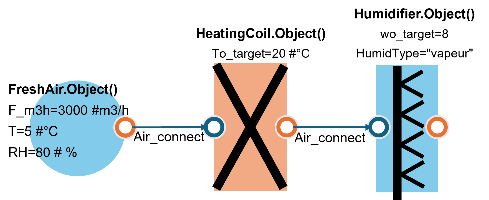
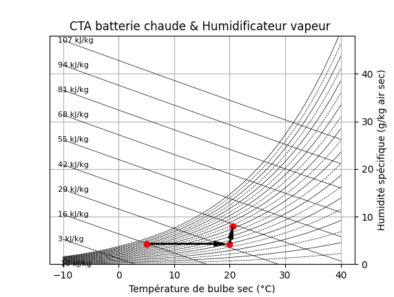

.. _cta_air_neuf:

CTA d'air neuf
==============

L'image ci-dessous montre le schéma de la CTA :

.. code-block:: python

    # =============================================================================
    # Modèle AHU (Air frais + Batterie de chauffage + Humidificateur)
    # =============================================================================

    # module de calcul des prop d'air humide
    from AHU import FreshAir
    # Composant Batterie de chauffage
    from AHU import HeatingCoil
    # composant Humidificateur (vapeur ou adiabatique)
    from AHU.Humidification import Humidifier
    # connexion entre les composants
    from AHU.Connect import Air_connect

    AN = FreshAir.Object()
    AN.F_m3h = 3000  # m3/h
    AN.T = 5  # °C
    AN.RH = 80  # %
    AN.calculate()
    print(f"AN.df : {AN.df}")

    BC = HeatingCoil.Object()
    BC.To_target = 20  # °C
    Air_connect(BC.Inlet, AN.Outlet)
    BC.calculate()
    print(f"BC.df : {BC.df}")

    HMD = Humidifier.Object()
    HMD.wo_target = 8  # g/Kg air sec
    Air_connect(HMD.Inlet, BC.Outlet)
    HMD.HumidType = "vapeur"  # par défaut : Humidificateur adiabatique
    HMD.calculate()
    print(f"HMD.df : {HMD.df}")

    ################ plot

    from AHU.air_humide import PsychrometricChart

    chart = PsychrometricChart.Object(figsize=(12, 4))

    # options d'affichage
    chart.set_title('CTA batterie chaude & Humidificateur vapeur ')

    custom_points = [{'h': BC.Inlet.h, 'w': BC.Inlet.w}, {'h': BC.Outlet.h, 'w': BC.Outlet.w}, {'h': HMD.Outlet.h, 'w': HMD.Outlet.w}]
    chart.add_points(custom_points)

    chart.show(draw_arrows=True)

Résultats
=========

Le diagramme psychrométrique ci-dessous montre les points de fonctionnement de la CTA :

Les tableaux ci-dessous montrent les résultats des calculs pour chaque composant de la CTA :

**AN.df :**

.. list-table::
   :header-rows: 1

   * - Parameter
     - FreshAir
   * - ID
     - 1.000
   * - Outlet.T (C)
     - 5.000
   * - Outlet.RH (%)
     - 80.000
   * - Outlet.F (kg/s)
     - 1.053
   * - Outlet.F_dry (kg/s)
     - 1.048
   * - Outlet.P (Pa)
     - 101325.000
   * - Outlet.P/10^5 (bar)
     - 1.000
   * - Outlet.h (kJ/kg)
     - 15.800
   * - Outlet.w (g/kgdry)
     - 4.314
   * - Outlet.Pv_sat (Pa)
     - 872.500

**BC.df :**

.. list-table::
   :header-rows: 1

   * - Parameter
     - HeatingCoil
   * - ID
     - 2.000
   * - Outlet.T (C)
     - 20.000
   * - Outlet.RH (%)
     - 29.800
   * - Outlet.F (kg/s)
     - 1.053
   * - Outlet.F_dry (kg/s)
     - 1.048
   * - Outlet.P (Pa)
     - 101325.000
   * - Outlet.P/10^5 (bar)
     - 1.000
   * - Outlet.h (kJ/kg)
     - 31.000
   * - Outlet.w (g/kgdry)
     - 4.314
   * - Outlet.Pv_sat (Pa)
     - 2338.800
   * - Q_th (kW)
     - 15.900

**HMD.df :**

.. list-table::
   :header-rows: 1

   * - Parameter
     - Humidifier
   * - ID
     - None
   * - Outlet.T (C)
     - 20.6
   * - Outlet.RH (%)
     - 53.1
   * - Outlet.F (kg/s)
     - 1.056
   * - Outlet.F_dry (kg/s)
     - 1.048
   * - Outlet.P (Pa)
     - 101325
   * - Outlet.P/10^5 (bar)
     - 1.0
   * - Outlet.h (kJ/kg)
     - 40.9
   * - Outlet.w (g/kgdry)
     - 8
   * - Outlet.Pv_sat (Pa)
     - 2424.2
   * - HumidType
     - vapeur
   * - F_water (kg/s)
     - 0.003863
   * - Q_th (kW)
     - 0.01