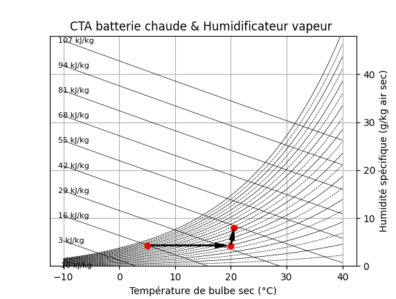

.. _cta_air_neuf:

CTA d'air neuf
==============

Schéma
------

.. image:: ../images/003_ahu_fresh_air.png
   :alt: AHU Fresh Air
   :width: 600px
   :align: center

Exemple de code
---------------

.. code-block:: python

    from AHU import FreshAir, HeatingCoil
    from AHU.Humidification import Humidifier
    from AHU.Connect import Air_connect
    from AHU.air_humide import PsychrometricChart

    # Air neuf
    AN = FreshAir.Object()
    AN.F_m3h = 3000
    AN.T = 5
    AN.RH = 80
    AN.calculate()

    # Batterie de chauffage
    BC = HeatingCoil.Object()
    BC.To_target = 20
    Air_connect(BC.Inlet, AN.Outlet)
    BC.calculate()

    # Humidificateur
    HMD = Humidifier.Object()
    HMD.wo_target = 8
    Air_connect(HMD.Inlet, BC.Outlet)
    HMD.HumidType = "vapeur"
    HMD.calculate()

    # Diagramme psychrométrique
    chart = PsychrometricChart.Object(figsize=(12, 4))
    chart.set_title('CTA batterie chaude & Humidificateur vapeur')
    
    custom_points = [
        {'h': BC.Inlet.h, 'w': BC.Inlet.w},
        {'h': BC.Outlet.h, 'w': BC.Outlet.w},
        {'h': HMD.Outlet.h, 'w': HMD.Outlet.w}
    ]
    chart.add_points(custom_points)
    chart.show(draw_arrows=True)

Résultats de simulation
------------------------

**Diagramme psychrométrique** :

**Résultats numériques** :

- **Air neuf (AN)** : T=5°C, RH=80%, F=1.053 kg/s, w=4.314 g/kg_sec, h=15.8 kJ/kg
- **Batterie chauffage (BC)** : T_sortie=20°C, RH=29.8%, Q_th=15.9 kW
- **Humidificateur (HMD)** : T_sortie=20.6°C, RH=53.1%, w_sortie=8 g/kg_sec, F_eau=0.0039 kg/s

Chaque composant retourne un DataFrame (``df``) avec les détails complets.

Paramètres possibles
--------------------

**FreshAir (Air neuf)** :

- ``F_m3h`` : Débit volumique [m³/h]
- ``T`` : Température [°C]
- ``RH`` : Humidité relative [%]
- ``P`` : Pression atmosphérique [Pa] (défaut: 101325)

**HeatingCoil (Batterie de chauffage)** :

- ``To_target`` : Température de sortie cible [°C]
- ``Inlet`` : Connecté via ``Air_connect()``
- Calcule automatiquement ``Q_th`` (puissance thermique) [kW]

**Humidifier** :

- ``wo_target`` : Humidité absolue de sortie cible [g/kg_air_sec]
- ``HumidType`` : Type d'humidification
  
  - ``"adiabatique"`` (défaut) : Humidification par évaporation d'eau
  - ``"vapeur"`` : Injection de vapeur

- ``Inlet`` : Connecté via ``Air_connect()``
- Calcule automatiquement ``F_water`` (débit d'eau) [kg/s] et ``Q_th`` [kW]

**PsychrometricChart** :

- ``figsize`` : Dimensions du graphique (largeur, hauteur)
- ``set_title()`` : Définir le titre du diagramme
- ``add_points()`` : Liste de points avec coordonnées ``{'h': enthalpie, 'w': humidité}``
- ``show(draw_arrows=True)`` : Afficher avec flèches de transformation

Explication du modèle
----------------------

Ce modèle simule une Centrale de Traitement d'Air (CTA) simple composée de trois éléments en série :

1. **Prise d'air neuf** : Introduction d'air extérieur avec conditions définies (T, RH, débit)
2. **Batterie de chauffage** : Réchauffage de l'air à température constante d'humidité absolue
3. **Humidificateur** : Ajout d'humidité par injection de vapeur ou évaporation adiabatique

Le module utilise les propriétés de l'air humide pour calculer :

- Les transformations sur le diagramme psychrométrique (h, w)
- Les puissances thermiques nécessaires
- Les débits de fluides (air sec, air humide, eau d'humidification)

La fonction ``Air_connect()`` permet de chaîner les composants en connectant la sortie d'un composant à l'entrée du suivant.

**Transformations psychrométriques** :

- **Chauffage** : Ligne horizontale (w constant) vers la droite (T augmente)
- **Humidification vapeur** : Ligne quasi-horizontale (T légèrement augmente)
- **Humidification adiabatique** : Ligne isoenthalpique (h constant)
