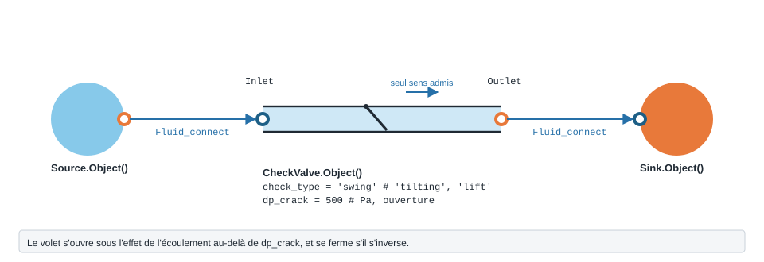

.. _check_valve:

Clapet anti-retour
==================

À quoi ça sert
--------------

Chiffrer la perte de charge d'un clapet anti-retour — à disque basculant
(``'tilting'``), à battant (``'swing'``) ou à soulèvement (``'lift'``) — placé
au refoulement d'une pompe ou en pied de colonne. En écoulement direct, le modèle
applique un coefficient ζ selon le type de clapet. Il **ne modélise pas** le
blocage d'un écoulement inverse (voir « Éprouver le modèle »). Dans
``PyqtSimulator``, c'est le nœud **« Clapet anti-retour »**, présent dans trois
scènes : *Pompes en parallèle avec clapets*, *Usine — réseau industriel maillé* et
*Remplissage régulé par niveau*.

   Forme, ports et raccordement de ``CheckValve`` ; paramètres sous leur
   nom de code, avec leur valeur par défaut.

Exemple minimal
---------------

.. code-block:: python

   from ThermodynamicCycles.Source import Source
   from ThermodynamicCycles.Hydraulic import CheckValve
   from ThermodynamicCycles.Connect import Fluid_connect

   # Amont : eau à 15 °C, 3 bar, 2 kg/s
   SOURCE = Source.Object()
   SOURCE.fluid = "water"
   SOURCE.Pi_bar = 3.0        # bar
   SOURCE.Ti_degC = 15        # °C
   SOURCE.F = 2.0             # kg/s
   SOURCE.calculate()

   # Clapet anti-retour à battant, DN50
   CLAPET = CheckValve.Object()
   Fluid_connect(CLAPET.Inlet, SOURCE.Outlet)
   CLAPET.d_hyd = 0.05          # m — diamètre intérieur
   CLAPET.check_type = "swing"  # à battant
   CLAPET.calculate()

   print(CLAPET.df.drop("Timestamp"))

Sortie réelle :

.. code-block:: text

              CheckValve
   fluid           water
   Type            swing
   Direction     forward
   État           Ouvert
   V (m/s)         1.019
   Re            44775.0
   ζ (-)             2.0
   ΔP (Pa)        1038.4
   P_in (Pa)    300000.0
   P_out (Pa)   298962.0
   F_kgs             2.0

Lecture : un clapet à battant DN50 coûte 1 038,4 Pa à 1 m/s, soit 3,8 fois
une vanne d'isolement standard dans les mêmes conditions (voir
:doc:`vanne_isolement`).

Ce qu'on personnalise
---------------------

.. list-table::
   :header-rows: 1
   :widths: 22 44 18 16

   * - Paramètre
     - Effet
     - Valeurs
     - Source
   * - ``check_type``
     - type de clapet : ζ = 1,0 (``'tilting'``), 2,0 (``'swing'``) ou 4,5
       (``'lift'``) avec les coefficients par défaut
     - ``'tilting'``, ``'swing'``, ``'lift'``
     - coefficients du code
   * - ``source``
     - ``'legacy'`` (défaut) ou ``'crane'`` (K = n·f_T) ; ``'crane'`` ne couvre
       que ``'swing'`` et ``'lift'``
     - ``'legacy'``, ``'crane'``
     - Crane TP-410, éd. 2009, p. A-28
   * - ``D_in_pouces``
     - diamètre nominal en pouces ; **obligatoire** avec ``source='crane'``, car
       l'objet ne le crée pas
     - 0,5 à 24
     - —
   * - ``d_hyd`` (m)
     - diamètre intérieur ; fixe la vitesse et le Reynolds
     - DN du clapet
     - —

Variante exécutée : les trois types, puis la table Crane.

.. code-block:: python

   from ThermodynamicCycles.Source import Source
   from ThermodynamicCycles.Hydraulic import CheckValve
   from ThermodynamicCycles.Connect import Fluid_connect

   # variante : type de clapet et source des coefficients
   print("check_type  source    zeta    dP (Pa)")
   for check_type, source in (("tilting", "legacy"), ("swing", "legacy"), ("lift", "legacy"),
                              ("swing", "crane"), ("lift", "crane")):
       SOURCE = Source.Object()
       SOURCE.fluid = "water"; SOURCE.Pi_bar = 3.0; SOURCE.Ti_degC = 15; SOURCE.F = 2.0
       SOURCE.calculate()
       CLAPET = CheckValve.Object()
       Fluid_connect(CLAPET.Inlet, SOURCE.Outlet)
       CLAPET.check_type = check_type
       CLAPET.source = source
       CLAPET.D_in_pouces = 2.0     # pouces — OBLIGATOIRE avec source='crane'
       CLAPET.calculate()
       print(f"{check_type:10s}  {source:6s}  {CLAPET.zeta:6.3f}   {CLAPET.delta_P:8.1f}")

Sortie réelle :

.. code-block:: text

   check_type  source    zeta    dP (Pa)
   tilting     legacy   1.000      519.2
   swing       legacy   2.000     1038.4
   lift        legacy   4.500     2336.3
   swing       crane    1.900      986.4
   lift        crane   11.400     5918.7

Ce que ça dit :

* le clapet à soulèvement perd **4,5 fois** plus que le clapet à disque basculant ;
* pour le clapet **à battant**, les deux sources concordent (ζ = 1,9 selon Crane,
  2,0 par défaut) ;
* pour le clapet **à soulèvement**, elles divergent : Crane donne ζ = 11,4, soit
  **2,53 fois** le coefficient par défaut. Pour chiffrer un clapet à soulèvement,
  préférez ``source='crane'``.

En régime laminaire (Re < 2300), le code multiplie ζ par 2300/Re.

Éprouver le modèle
------------------

.. code-block:: python

   import math
   from ThermodynamicCycles.Source import Source
   from ThermodynamicCycles.Hydraulic import CheckValve
   from ThermodynamicCycles.Connect import Fluid_connect

   def clapet(F=2.0, **reglages):
       SOURCE = Source.Object()
       SOURCE.fluid = "water"; SOURCE.Pi_bar = 3.0; SOURCE.Ti_degC = 15; SOURCE.F = F
       SOURCE.calculate()
       C = CheckValve.Object()
       Fluid_connect(C.Inlet, SOURCE.Outlet)
       for cle, valeur in reglages.items():
           setattr(C, cle, valeur)
       return C

   # 1) source='crane' sans D_in_pouces : l'attribut n'existe pas par défaut
   C = clapet(source="crane")
   try:
       C.calculate()
   except AttributeError as e:
       print("échec :", e)

   # 2) Écoulement inverse : le clapet se dit fermé, mais le débit passe quand même
   C = clapet(F=-2.0); C.calculate()
   print("inverse -> état :", "Ouvert" if C.is_open else "Fermé", "| dP =", C.delta_P,
         "Pa | débit en sortie =", C.Outlet.F, "kg/s")

   # 3) alpha n'intervient pas dans le calcul, et un type inconnu n'est pas refusé
   C = clapet(alpha=math.radians(30)); C.calculate()
   print("alpha = 30° -> zeta =", C.zeta)
   C = clapet(check_type="inconnu"); C.calculate()
   print("check_type='inconnu' -> zeta =", C.zeta)

Sortie réelle :

.. code-block:: text

   échec : 'Object' object has no attribute 'D_in_pouces'
   inverse -> état : Fermé | dP = 500 Pa | débit en sortie = -2.0 kg/s
   alpha = 30° -> zeta = 2.0
   check_type='inconnu' -> zeta = 2.0

Quatre comportements à connaître :

* ``source='crane'`` **échoue** tant que ``D_in_pouces`` n'a pas été posé ; posez-le
  toujours, comme dans la variante ;
* en **écoulement inverse**, le clapet se déclare « Fermé » et impose une perte
  égale à ``dp_crack`` (500 Pa par défaut), mais **le débit inverse passe quand
  même** vers l'aval. Le modèle ne bloque pas un retour d'eau : c'est au réseau de
  le traiter ;
* ``alpha`` (angle d'inclinaison du clapet basculant) **n'intervient pas** dans le
  calcul ;
* un ``check_type`` inconnu **n'est pas refusé** : il reçoit ζ = 2,0.

Limites connues
---------------

* ``dp_crack`` n'est **pas** une pression d'ouverture : en écoulement direct, le
  clapet est toujours ouvert, quel que soit l'écart de pression.
* Les coefficients par défaut (1,0 ; 2,0 ; 4,5) ne portent pas de référence précise
  dans le code ; celle de Crane est citée avec sa page.

Toutes les entrées
------------------

.. list-table::
   :header-rows: 1
   :widths: 26 26 48

   * - Entrée
     - Défaut
     - Commentaire du code
   * - ``d_hyd``
     - ``0.05``
     - Diamètre hydraulique (m)
   * - ``check_type``
     - ``'swing'``
     - 'tilting', 'swing', ou 'lift'
   * - ``source``
     - ``'legacy'``
     - —
   * - ``alpha``
     - ``math.radians(5)``
     - Angle d'inclinaison pour tilting (rad)
   * - ``dp_crack``
     - ``500``
     - Différence pression d'ouverture (Pa)
   * - ``zeta_coeff``
     - ``(table interne)``
     - —

Lignes du ``df`` de sortie : ``fluid``, ``Type``, ``Direction``, ``État``, ``V (m/s)``, ``Re``, ``ζ (-)``, ``ΔP (Pa)``, ``P_in (Pa)``, ``P_out (Pa)``.

Pour aller plus loin
--------------------

* :doc:`index` — tous les modèles hydrauliques.
* :doc:`vanne_isolement` — la même comparaison des sources, pour une vanne.
* :doc:`resolution_circuit` — assembler le clapet dans un réseau.
* Sources citées par le code : Crane TP-410 ; Idel'chik, *Handbook of Hydraulic
  Resistance*.
