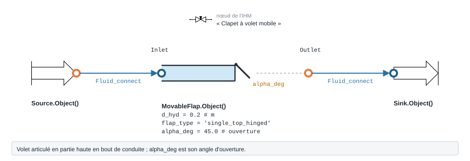

.. _movable_flap:

Clapet à volet mobile
=====================

Clapet à volet mobile.

.. note::
   Fiche relevée dans le code de la bibliothèque (entrées, valeurs par défaut et
   unités telles qu'écrites dans ``__init__``). L'exemple exécuté, avec sa
   sortie réelle et sa variante, reste à écrire pour ce modèle.

   Forme, ports et raccordement de ``MovableFlap`` ; paramètres sous leur
   nom de code, avec leur valeur par défaut.

``MovableFlap`` — clapet mobile.

.. code-block:: python

   from ThermodynamicCycles.Hydraulic import MovableFlap
   modele = MovableFlap.Object()

* **Ports** : ``Inlet``, ``Outlet`` (voir :doc:`../ports_connexions`).
* **Nœud de l'IHM** : « Clapet à volet mobile ».
* **Exceptions levées par le code** : ``ValueError``.

.. list-table::
   :header-rows: 1
   :widths: 26 26 48

   * - Entrée
     - Défaut
     - Commentaire du code
   * - ``d_hyd``
     - ``0.2``
     - —
   * - ``flap_type``
     - ``'single_top_hinged'``
     - single_top_hinged \| double_top_hinged \| single_center_hinged
   * - ``alpha_deg``
     - ``45.0``
     - —
   * - ``l_over_b``
     - ``1.0``
     - —
   * - ``apply_handbook_corrections``
     - ``False``
     - —
   * - ``handbook_roughness_multiplier``
     - ``None``
     - —
   * - ``handbook_aspect_ratio``
     - ``None``
     - —

Lignes du ``df`` de sortie : ``fluid``, ``F_kgs``, ``d_hyd_mm``, ``flap_type``, ``alpha_deg``, ``l_over_b``, ``V_ms``, ``Re``, ``ksi_loc_base``, ``ksi_loc``, ``dP_Pa``, ``dP_mbar``.

Voir :doc:`index` pour la liste de tous les modèles hydrauliques.
