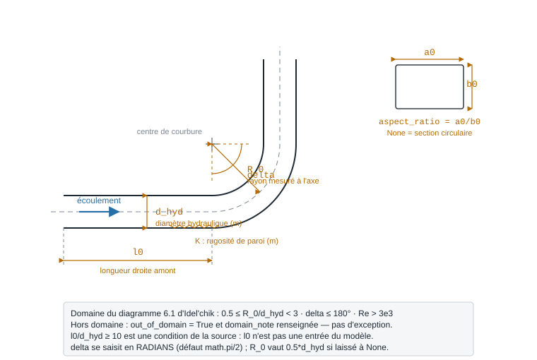

.. _coudes_tes_singularites:

Coudes, tés et singularités
===========================

En plus du :ref:`tube droit <straight_pipe>` (perte linéaire) et des
vannes, la bibliothèque fournit les **singularités** hydrauliques courantes
(pertes locales :math:`\xi`). Tous ces modèles partagent la loi
:math:`\Delta P = \xi \cdot \tfrac{1}{2}\rho V^2` et la
:ref:`propagation de pression aval→amont <propagation_pression>`.

Coudes
------

.. list-table::
   :header-rows: 1
   :widths: 30 70

   * - Modèle
     - Description
   * - ``Hydraulic.CurvedBend``
     - coude **arrondi** : singularité (rayon de courbure :math:`R_0`, angle
       :math:`\delta`) + frottement le long de la longueur développée.
   * - ``Hydraulic.EdgedBend``
     - coude **à angle vif** : :math:`\xi` local selon l'angle.

Singularités de section
-----------------------

.. list-table::
   :header-rows: 1
   :widths: 30 70

   * - Modèle
     - Description
   * - ``Hydraulic.SuddenContraction``
     - **rétrécissement** brusque : perte par frottement + variation de pression
       dynamique (la pression statique chute).
   * - ``Hydraulic.SuddenExpansion``
     - **élargissement** brusque : la pression statique **remonte** (récupération
       cinétique) diminuée du frottement — signe géré correctement.

Tés (jonctions 3 ports)
-----------------------

.. list-table::
   :header-rows: 1
   :widths: 30 70

   * - Modèle
     - Description
   * - ``Hydraulic.ConvergingTee``
     - **té convergent** : 2 entrées (axe ``Inlet_St`` + branche ``Inlet_S``) →
       1 sortie ``Outlet``. Bilan masse :math:`F_C = F_{St}+F_S` et **mélange
       enthalpique** :math:`h_C = (F_{St}h_{St}+F_S h_S)/F_C`. Coefficients
       Idel'cik.
   * - ``Hydraulic.DivergingTee``
     - **té divergent** : 1 entrée ``Inlet`` → 2 sorties (``Outlet_St`` axe,
       ``Outlet_S`` branche). Bilan masse :math:`F_{St}=F_C-F_S`.

.. note::
   Ces modèles sont **bidirectionnels** : si la pression d'une sortie est imposée
   (aval), le modèle remonte la (les) pression(s) d'entrée
   (:math:`P_{in}=P_{out}+\Delta P`). Voir :ref:`propagation_pression`.

.. _curved_bend:

Coude arrondi — ``CurvedBend``
------------------------------

À quoi ça sert
~~~~~~~~~~~~~~

Chiffrer la perte de charge d'un coude cintré ou d'un coude « 1.5 D », « 3 D »
d'un réseau d'eau, de vapeur ou de gaz : c'est ce qui décide, avec le tube
droit, de la hauteur manométrique d'une pompe. Le modèle applique le
**diagramme 6.1 d'Idel'chik** : une perte **locale** due à la déviation, qui
dépend de l'angle, du rayon de courbure, du nombre de Reynolds et de la
rugosité, plus le **frottement** le long de la longueur développée de l'arc.

Ne vous en servez pas pour un coude soudé à angle vif (``EdgedBend``) ni pour
un serpentin (R_0/d_hyd ≥ 3, modèle ``Hydraulic.Coil``). La corrélation vaut
pour un coude **isolé**, précédé d'au moins dix diamètres de conduite droite :
deux coudes rapprochés interagissent, et le modèle ne le sait pas.

Dans ``PyqtSimulator``, le même modèle est le nœud **« Coude courbe »** de la
palette.

   Où se mesure chaque paramètre de ``CurvedBend``. ``R_0`` se prend **à
   l'axe** de la conduite, et ``delta`` se saisit en **radians**.

Exemple minimal
~~~~~~~~~~~~~~~

Le coude reçoit son état de l'amont par ``Fluid_connect`` (voir
:doc:`../ports_connexions`).

.. code-block:: python

   import math
   from ThermodynamicCycles.Source import Source
   from ThermodynamicCycles.Hydraulic import CurvedBend
   from ThermodynamicCycles.Connect import Fluid_connect

   # Amont : eau de chauffage à 60 °C, 3 bar, 2 kg/s
   SOURCE = Source.Object()
   SOURCE.fluid = "water"
   SOURCE.Pi_bar = 3.0        # bar
   SOURCE.Ti_degC = 60        # °C
   SOURCE.F = 2.0             # kg/s
   SOURCE.calculate()

   # Coude DN50 « 1.5 D » à 90°
   COUDE = CurvedBend.Object()
   Fluid_connect(COUDE.Inlet, SOURCE.Outlet)
   COUDE.d_hyd = 0.05              # m — diamètre intérieur
   COUDE.R_0 = 1.5 * COUDE.d_hyd   # m — rayon de courbure, mesuré à l'axe
   COUDE.delta = math.radians(90)  # rad — l'angle se saisit en radians
   COUDE.K = 0.045e-3              # m — rugosité d'un acier commercial
   COUDE.calculate()

   print(COUDE.df.drop("Timestamp"))
   print("hors domaine :", COUDE.out_of_domain)

Sortie réelle :

.. code-block:: text

                    CurvedBend
   fluid                 water
   F_kgs                   2.0
   d_hyd_mm               50.0
   R0_d_hyd                1.5
   delta_deg              90.0
   V_ms               1.035909
   Re            109271.515452
   correlation        idelchik
   regime                  kRe
   ksi_loc_base       0.271636
   ksi_loc            0.271636
   ksi_fr             0.051368
   lambda_FRI         0.021801
   dP_Pa            170.411742
   dP_mbar            1.704117
   P_in_Pa            300000.0
   P_out_Pa      299829.588258
   hors domaine : False

Lecture : à 1 m/s, ce coude coûte 170 Pa, dont 84 % par la déviation
(``ksi_loc`` = 0,272) et 16 % par le frottement le long de l'arc (``ksi_fr`` =
0,051). ``regime = kRe`` signifie que Re (1,1·10⁵) est sous 2·10⁵ : la
correction de Reynolds du diagramme s'applique. ``dP_Pa`` est la grandeur à
reporter dans un bilan de réseau ; ``P_out_Pa`` est déjà la pression aval.

Ce qu'on personnalise
~~~~~~~~~~~~~~~~~~~~~

.. list-table::
   :header-rows: 1
   :widths: 22 38 22 18

   * - Paramètre
     - Effet
     - Plage raisonnable
     - Source
   * - ``d_hyd`` (m)
     - Diamètre intérieur ; fixe la vitesse, donc Re et la pression dynamique
     - DN15 à DN300
     - —
   * - ``R_0`` (m)
     - Rayon de courbure à l'axe. Le rapport ``R_0/d_hyd`` est ce qui compte ;
       ``None`` donne 0,5 × ``d_hyd``
     - 0,5 ≤ R_0/d_hyd < 3
     - Idel'chik, diag. 6.1
   * - ``delta`` (rad)
     - Angle de déviation ; ``math.radians(45)`` pour un coude à 45°
     - 0 à π (180°)
     - Idel'chik, diag. 6.1
   * - ``K`` (m)
     - Rugosité absolue ; agit par ``lambda_FRI`` et par la correction k_Δ
       au-dessus de Re = 4·10⁴
     - 1,5·10⁻⁶ (défaut, tube lisse) à 0,2·10⁻³
     - —
   * - ``aspect_ratio``
     - Rapport a0/b0 d'une gaine rectangulaire ; ``None`` = section circulaire
     - 0,25 à 8
     - Idel'chik, diag. 6.1 (C1)
   * - ``correlation``
     - ``'idelchik'`` (défaut) ou ``'legacy'``, l'ancienne formule, conservée
       pour reproduire des résultats antérieurs
     - —
     - —
   * - ``apply_reynolds_factor``, ``apply_roughness_factor``
     - Désactivent k_Re ou k_Δ ; à ``True`` sauf étude de sensibilité
     - —
     - —

.. warning::
   ``correlation = 'legacy'`` sous-estime la perte des coudes courants : à
   R_0/d_hyd = 1,5, son ``ksi_loc`` vaut 0,076 là où Idel'chik imprime 0,17
   (–55 %), et son facteur d'angle est linéaire. Ne l'employez que pour
   retrouver un ancien calcul.

Variante exécutée : le même débit, en faisant varier le rayon puis l'angle.

.. code-block:: python

   import math
   from ThermodynamicCycles.Source import Source
   from ThermodynamicCycles.Hydraulic import CurvedBend
   from ThermodynamicCycles.Connect import Fluid_connect

   SOURCE = Source.Object()
   SOURCE.fluid = "water"; SOURCE.Pi_bar = 3.0; SOURCE.Ti_degC = 60; SOURCE.F = 2.0
   SOURCE.calculate()

   # variante : rayon de courbure et angle
   print("R_0/d_hyd  delta   ksi_loc  ksi_fr   dP (Pa)")
   for r_sur_d, angle in ((0.5, 90), (1.0, 90), (1.5, 90), (2.0, 90), (1.5, 45), (1.5, 180)):
       COUDE = CurvedBend.Object()
       Fluid_connect(COUDE.Inlet, SOURCE.Outlet)
       COUDE.d_hyd = 0.05
       COUDE.R_0 = r_sur_d * COUDE.d_hyd
       COUDE.delta = math.radians(angle)
       COUDE.K = 0.045e-3
       COUDE.calculate()
       print(f"{r_sur_d:8.1f}  {angle:4d}°  {COUDE.ksi_loc:7.3f}  {COUDE.ksi_fr:6.3f}  {COUDE.delta_P:8.1f}")

Sortie réelle :

.. code-block:: text

   R_0/d_hyd  delta   ksi_loc  ksi_fr   dP (Pa)
        0.5    90°    1.792   0.017     954.4
        1.0    90°    0.333   0.034     193.6
        1.5    90°    0.272   0.051     170.4
        2.0    90°    0.235   0.068     160.2
        1.5    45°    0.173   0.026     104.8
        1.5   180°    0.380   0.103     254.8

Ce que ça dit : passer d'un coude serré (R_0/d_hyd = 0,5) à un coude « 1 D »
divise la perte **par cinq** ; au-delà, le gain s'essouffle (–12 % de 1 à 1,5,
–6 % de 1,5 à 2) parce que le frottement le long d'un arc plus long reprend une
partie de ce que la déviation perd. L'angle n'agit pas proportionnellement : un
demi-tour à 180° coûte 1,5 fois un coude à 90°, pas deux fois.

Éprouver le modèle
~~~~~~~~~~~~~~~~~~

Le modèle a **deux façons** de réagir hors du diagramme, et elles ne se
ressemblent pas :

* hors de 0,5 ≤ R_0/d_hyd < 3, ou pour Re ≤ 3·10³, il **calcule quand même**,
  mais pose ``out_of_domain = True`` et explique pourquoi dans ``domain_note``.
  C'est à vous de lire ce drapeau ;
* à faible débit (3·10³ < Re < 10⁴), la source change de formule, et sa table
  A2 s'arrête à R_0/d_hyd = 2. Au-delà, le modèle **refuse** par
  ``OutOfTableError`` plutôt que d'extrapoler.

.. code-block:: python

   import math
   from ThermodynamicCycles.Source import Source
   from ThermodynamicCycles.Hydraulic import CurvedBend
   from ThermodynamicCycles.Hydraulic.CurvedBend import OutOfTableError
   from ThermodynamicCycles.Connect import Fluid_connect

   def coude(r_sur_d, F):
       SOURCE = Source.Object()
       SOURCE.fluid = "water"; SOURCE.Pi_bar = 3.0; SOURCE.Ti_degC = 60; SOURCE.F = F
       SOURCE.calculate()
       COUDE = CurvedBend.Object()
       Fluid_connect(COUDE.Inlet, SOURCE.Outlet)
       COUDE.d_hyd = 0.05
       COUDE.R_0 = r_sur_d * COUDE.d_hyd
       COUDE.delta = math.radians(90)
       return COUDE

   # 1) coude plus serré que le diagramme 6.1 : calculé, mais signalé
   C = coude(0.3, 2.0)
   C.calculate()
   print("R_0/d_hyd = 0.3 -> dP =", round(C.delta_P, 1), "Pa, hors domaine :", C.out_of_domain)
   print("  note :", C.domain_note)

   # 2) faible débit (3e3 < Re < 1e4) sur un grand rayon : la source ne publie rien
   C = coude(2.5, 0.12)
   try:
       C.calculate()
   except OutOfTableError as e:
       print("refusé :", e)

Sortie réelle :

.. code-block:: text

   R_0/d_hyd = 0.3 -> dP = 2377.5 Pa, hors domaine : True
     note : R0/D0 = 0.30 hors du domaine 0.5 <= R0/D0 < 3 du Diagramme 6.1 (au-dela de 3 : Diagramme 6.2, modele Hydraulic.Coil)
   refusé : Coude a R0/D0 = 2.50 en regime 3e3 < Re < 1e4 : la table A2 du Diagramme 6.1 (p.424) s'arrete a R0/D0 = 2.0 et rien n'est publie au-dela. Aucune valeur n'est extrapolee. Pour R0/D0 >= 3 c'est le Diagramme 6.2 (serpentins) qui s'applique ; sinon, poser apply_reynolds_factor = False pour n'obtenir que zeta_qu + zeta_fr, en connaissance de cause.

Les 2 377 Pa du premier cas sont une **extrapolation** de la formule en
(R_0/d_hyd)⁻²·⁵ : le chiffre existe, mais la source ne le garantit pas. Le
modèle ne vérifie pas non plus la longueur droite amont (l0/d_hyd ≥ 10) : ce
n'est pas une de ses entrées.

Pour aller plus loin
~~~~~~~~~~~~~~~~~~~~

* :ref:`straight_pipe` — la perte linéaire des tronçons droits.
* :ref:`propagation_pression` — comment ``P_out_Pa`` se propage dans un réseau.
* :doc:`../ports_connexions` — ce que transporte ``Inlet`` / ``Outlet``.
* Source : I. E. Idel'chik, *Handbook of Hydraulic Resistance*, 4ᵉ éd., Begell
  House, 2008, diagramme 6.1, p. 424-426. Les formules de k_Re et le
  coefficient A2 y sont qualifiés de « tentatives » par l'auteur lui-même : ce
  sont des ordres de grandeur. Entre 70 et 100°, la source ne donne qu'une
  table ; le modèle l'interpole linéairement.
