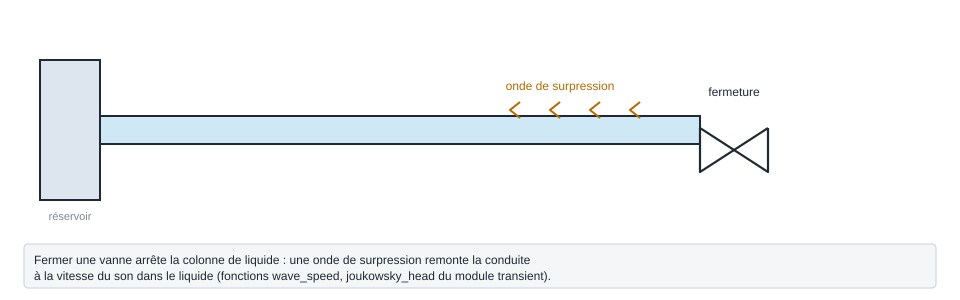

.. _transient:

Coups de bélier
===============

   Forme, ports et raccordement de ``transient`` ; paramètres sous leur
   nom de code, avec leur valeur par défaut.

Régime transitoire d'un réseau de liquide : la surpression d'un coup de bélier, par exemple à la fermeture d'une vanne.

.. note::
   Fiche relevée dans le code de la bibliothèque (entrées, valeurs par défaut et
   unités telles qu'écrites dans ``__init__``). L'exemple exécuté, avec sa
   sortie réelle et sa variante, reste à écrire pour ce modèle.

``transient`` — coups de belier : regime transitoire des reseaux de liquide.

.. code-block:: python

   import ThermodynamicCycles.Hydraulic.transient

* **Fonctions publiques** : ``K_from_kv``, ``check_valve_reversals``, ``from_hydraulic_network``, ``joukowsky_head``, ``linear_closure``, ``liquid_bulk_modulus``, ``wave_speed``.
* **Classes** : ``ConversionReport``, ``TransientNetwork``, ``TransientNode``, ``TransientPipe``, ``TransientResult``, ``TransientValve``.

Voir :doc:`index` pour la liste de tous les modèles hydrauliques.
