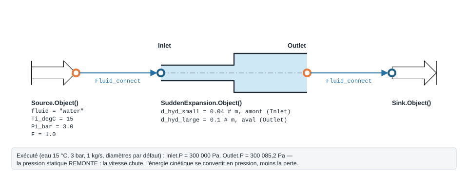
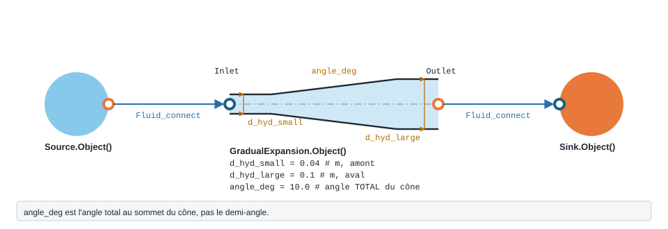
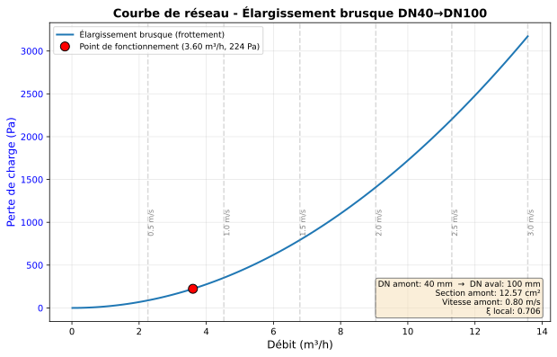

.. _elargissement_section:

Élargissement de section
========================

   Élargissement brusque : les rôles s'inversent — ``d_hyd_small`` en amont,
   ``d_hyd_large`` en aval. Mesuré : la pression **remonte** de 85 Pa.

   Forme, ports et raccordement de ``GradualExpansion`` ; paramètres sous leur
   nom de code, avec leur valeur par défaut.

Passage d'un petit diamètre à un grand : brusque (``SuddenExpansion``) ou
progressif, par un diffuseur conique (``GradualExpansion``). La vitesse chute
et la pression statique **remonte**, diminuée de la perte.

``SuddenExpansion`` — elargissement brusque (Modelica PressureLoss.Orifice.SuddenExpansionOrifice).

.. code-block:: python

   from ThermodynamicCycles.Hydraulic import SuddenExpansion
   modele = SuddenExpansion.Object()

* **Ports** : ``Inlet``, ``Outlet`` (voir :doc:`../ports_connexions`).
* **Nœud de l'IHM** : « Elargissement ».

.. list-table::
   :header-rows: 1
   :widths: 26 26 48

   * - Entrée
     - Défaut
     - Commentaire du code
   * - ``d_hyd_small``
     - ``0.04``
     - m -- amont (Inlet)
   * - ``d_hyd_large``
     - ``0.1``
     - m -- aval (Outlet)
   * - ``correlation``
     - ``'Borda-Carnot'``
     - —
   * - ``roughness``
     - ``1.5e-06``
     - m
   * - ``apply_handbook_corrections``
     - ``False``
     - —
   * - ``handbook_roughness_multiplier``
     - ``None``
     - —
   * - ``handbook_aspect_ratio``
     - ``None``
     - —

Lignes du ``df`` de sortie : ``fluid``, ``F_kgs``, ``d_small_mm``, ``d_large_mm``, ``V_small_ms``, ``V_large_ms``, ``correlation``, ``Re_small``, ``darcy_factor``, ``ksi_loc_base``, ``ksi_loc``, ``dP_friction_Pa``, ``dP_static_Pa``.

   Courbe de réseau de l'élargissement brusque ci-dessus.

.. note::
   **D'où viennent les courbes de réseau.** Elles sont tracées par la bibliothèque,
   par le chemin qu'emprunte le nœud de l'IHM : ``compute_network_curve(modele,
   **modele.network_plot_kwargs())`` puis ``render_network_figure``, importés de
   ``ThermodynamicCycles.Hydraulic.network_plot``. ``modele.Plot()`` trace la même figure dans une fenêtre
   autonome (``Plot()`` levait ``TypeError`` jusqu'à la version de la
   bibliothèque du 28/09/2026 ; corrigé).

``GradualExpansion`` — diffuseur conique (elargissement progressif).

.. code-block:: python

   from ThermodynamicCycles.Hydraulic import GradualExpansion
   modele = GradualExpansion.Object()

* **Ports** : ``Inlet``, ``Outlet`` (voir :doc:`../ports_connexions`).
* **Nœud de l'IHM** : « Diffuseur conique ».
* **Exceptions levées par le code** : ``ValueError``.

.. list-table::
   :header-rows: 1
   :widths: 26 26 48

   * - Entrée
     - Défaut
     - Commentaire du code
   * - ``d_hyd_small``
     - ``0.04``
     - m -- amont (Inlet)
   * - ``d_hyd_large``
     - ``0.1``
     - m -- aval (Outlet)
   * - ``angle_deg``
     - ``10.0``
     - angle TOTAL du cone
   * - ``roughness``
     - ``1.5e-06``
     - m
   * - ``correlation``
     - ``'idelchik'``
     - —
   * - ``ksi_exp``
     - ``None``
     - —
   * - ``ksi_fr``
     - ``None``
     - —
   * - ``phi_exp``
     - ``None``
     - —

Lignes du ``df`` de sortie : ``fluid``, ``F_kgs``, ``d_small_mm``, ``d_large_mm``, ``angle_deg``, ``length_m``, ``V_small_ms``, ``V_large_ms``, ``Re_small``, ``correlation``, ``darcy_factor``, ``ksi_exp``, ``ksi_fr``, ``ksi_loc``, ``dP_friction_Pa``, ``dP_static_Pa``.

.. note::
   Ces modèles sont **bidirectionnels** : si la pression d'une sortie est imposée
   (aval), le modèle remonte la (les) pression(s) d'entrée
   (:math:`P_{in}=P_{out}+\Delta P`). Voir :doc:`propagation_pression`.

Voir :doc:`index` pour la liste de tous les modèles hydrauliques.
