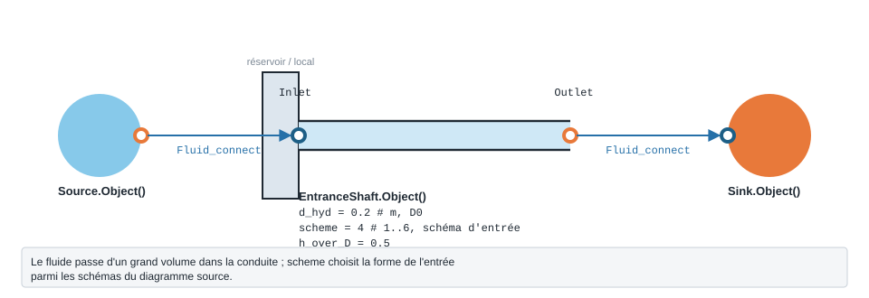

.. _entrance_shaft:

Entrée de conduite
==================

   Forme, ports et raccordement de ``EntranceShaft`` ; paramètres sous leur
   nom de code, avec leur valeur par défaut.

Perte à l'entrée d'une gaine ou d'un puits circulaire.

.. note::
   Fiche relevée dans le code de la bibliothèque (entrées, valeurs par défaut et
   unités telles qu'écrites dans ``__init__``). L'exemple exécuté, avec sa
   sortie réelle et sa variante, reste à écrire pour ce modèle.

``EntranceShaft`` — entree de gaine/shaft circulaire (Idelchik 4th ed, Diagram 3.18).

.. code-block:: python

   from ThermodynamicCycles.Hydraulic import EntranceShaft
   modele = EntranceShaft.Object()

* **Ports** : ``Inlet``, ``Outlet`` (voir :doc:`../ports_connexions`).
* **Nœud de l'IHM** : « Prise d'entrée en puits ».
* **Exceptions levées par le code** : ``ValueError``.

.. list-table::
   :header-rows: 1
   :widths: 26 26 48

   * - Entrée
     - Défaut
     - Commentaire du code
   * - ``d_hyd``
     - ``0.2``
     - m, D0
   * - ``scheme``
     - ``4``
     - 1..6 selon diagramme
   * - ``h_over_D``
     - ``0.5``
     - —
   * - ``apply_handbook_corrections``
     - ``False``
     - —
   * - ``handbook_roughness_multiplier``
     - ``None``
     - —
   * - ``handbook_aspect_ratio``
     - ``None``
     - —

Lignes du ``df`` de sortie : ``fluid``, ``F_kgs``, ``d_hyd_mm``, ``scheme``, ``h_over_D``, ``V_ms``, ``Re``, ``ksi_loc_base``, ``ksi_loc``, ``dP_Pa``, ``dP_mbar``.

Voir :doc:`index` pour la liste de tous les modèles hydrauliques.
