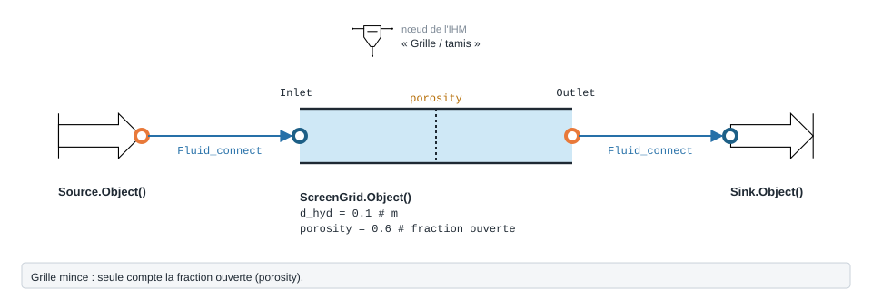
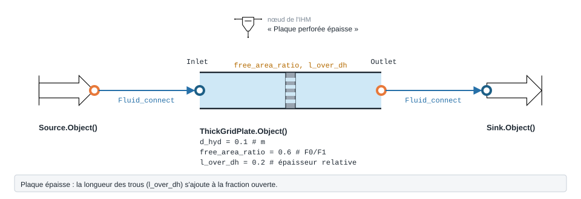

.. _screen_grid:

Grille et plaque perforée
=========================

Grille, tamis ou tôle perforée placés dans l'écoulement.

.. note::
   Fiche relevée dans le code de la bibliothèque (entrées, valeurs par défaut et
   unités telles qu'écrites dans ``__init__``). L'exemple exécuté, avec sa
   sortie réelle et sa variante, reste à écrire pour ce modèle.

   Forme, ports et raccordement de ``ScreenGrid`` ; paramètres sous leur
   nom de code, avec leur valeur par défaut.

``ScreenGrid`` — grille/ecran/perfore uniforme.

.. code-block:: python

   from ThermodynamicCycles.Hydraulic import ScreenGrid
   modele = ScreenGrid.Object()

* **Ports** : ``Inlet``, ``Outlet`` (voir :doc:`../ports_connexions`).
* **Nœud de l'IHM** : « Grille / tamis ».
* **Exceptions levées par le code** : ``ValueError``.

.. list-table::
   :header-rows: 1
   :widths: 26 26 48

   * - Entrée
     - Défaut
     - Commentaire du code
   * - ``d_hyd``
     - ``0.1``
     - m
   * - ``porosity``
     - ``0.6``
     - fraction ouverte 0<phi<1
   * - ``shape_factor``
     - ``1.0``
     - facteur geometrique global
   * - ``zeta_model``
     - ``'legacy'``
     - —
   * - ``k0``
     - ``1.3``
     - —
   * - ``apply_handbook_corrections``
     - ``False``
     - —
   * - ``handbook_roughness_multiplier``
     - ``None``
     - —
   * - ``handbook_aspect_ratio``
     - ``None``
     - —

Lignes du ``df`` de sortie : ``fluid``, ``F_kgs``, ``d_hyd_mm``, ``porosity``, ``shape_factor``, ``V_ms``, ``Re``, ``ksi_loc_base``, ``ksi_loc``, ``dP_Pa``, ``dP_mbar``.

   Forme, ports et raccordement de ``ThickGridPlate`` ; paramètres sous leur
   nom de code, avec leur valeur par défaut.

``ThickGridPlate`` — grille epaisse/plaque perforee.

.. code-block:: python

   from ThermodynamicCycles.Hydraulic import ThickGridPlate
   modele = ThickGridPlate.Object()

* **Ports** : ``Inlet``, ``Outlet`` (voir :doc:`../ports_connexions`).
* **Nœud de l'IHM** : « Plaque perforée épaisse ».
* **Exceptions levées par le code** : ``ValueError``.

.. list-table::
   :header-rows: 1
   :widths: 26 26 48

   * - Entrée
     - Défaut
     - Commentaire du code
   * - ``d_hyd``
     - ``0.1``
     - m
   * - ``free_area_ratio``
     - ``0.6``
     - f = F0/F1
   * - ``l_over_dh``
     - ``0.2``
     - —
   * - ``lambda_fric``
     - ``0.02``
     - —
   * - ``tau_override``
     - ``None``
     - —
   * - ``apply_handbook_corrections``
     - ``False``
     - —
   * - ``handbook_roughness_multiplier``
     - ``None``
     - —
   * - ``handbook_aspect_ratio``
     - ``None``
     - —

Lignes du ``df`` de sortie : ``fluid``, ``F_kgs``, ``d_hyd_mm``, ``free_area_ratio``, ``l_over_dh``, ``lambda_fric``, ``tau``, ``V_ms``, ``Re``, ``ksi_loc_base``, ``ksi_loc``, ``dP_Pa``.

Voir :doc:`index` pour la liste de tous les modèles hydrauliques.
