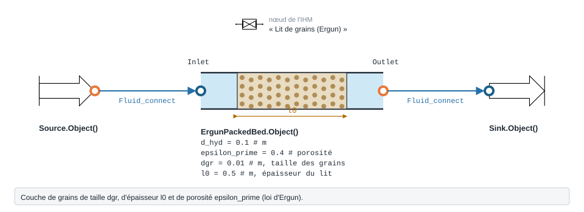

.. _ergun_packed_bed:

Lit de grains
=============

Écoulement à travers un lit poreux ou un lit de grains.

.. note::
   Fiche relevée dans le code de la bibliothèque (entrées, valeurs par défaut et
   unités telles qu'écrites dans ``__init__``). L'exemple exécuté, avec sa
   sortie réelle et sa variante, reste à écrire pour ce modèle.

   Forme, ports et raccordement de ``ErgunPackedBed`` ; paramètres sous leur
   nom de code, avec leur valeur par défaut.

``ErgunPackedBed`` — lit poreux / packed bed (Idelchik, section 8).

.. code-block:: python

   from ThermodynamicCycles.Hydraulic import ErgunPackedBed
   modele = ErgunPackedBed.Object()

* **Ports** : ``Inlet``, ``Outlet`` (voir :doc:`../ports_connexions`).
* **Nœud de l'IHM** : « Lit de grains (Ergun) ».
* **Exceptions levées par le code** : ``ValueError``.

.. list-table::
   :header-rows: 1
   :widths: 26 26 48

   * - Entrée
     - Défaut
     - Commentaire du code
   * - ``d_hyd``
     - ``0.1``
     - m
   * - ``epsilon_prime``
     - ``0.4``
     - porosite (0..1)
   * - ``dgr``
     - ``0.01``
     - m, taille moyenne des grains
   * - ``phi1``
     - ``1.0``
     - coeff. de forme des grains
   * - ``Bprime``
     - ``1.8``
     - 1.8 lisse ; 4.0 rugueux
   * - ``l0``
     - ``0.5``
     - m, epaisseur du lit

Lignes du ``df`` de sortie : ``fluid``, ``F_kgs``, ``d_hyd_mm``, ``epsilon_prime``, ``dgr_mm``, ``phi1``, ``Bprime``, ``l0_m``, ``w1_ms``, ``Re1``, ``lambda_bed``, ``ksi_loc``, ``dP_Pa``, ``dP_kPa``.

Voir :doc:`index` pour la liste de tous les modèles hydrauliques.
