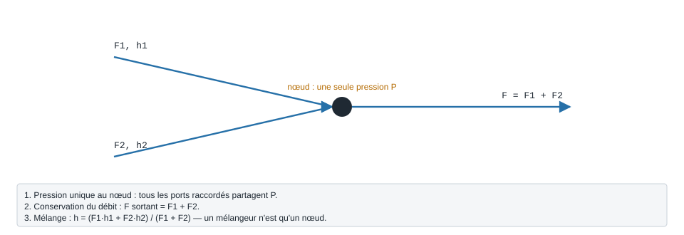

.. _loi_des_noeuds:

Loi des nœuds hydrauliques
==========================

   Les trois règles d'un nœud : une pression, la somme des débits, le mélange des enthalpies.

Lorsqu'on connecte des ports (``Fluid_connect``), ils forment un **nœud
hydraulique**. La loi de nœud (``Connect._apply_kirchhoff_law``) impose :

1. **Homogénéité des pressions** — tous les ports d'un nœud partagent le même
   potentiel (comme les nœuds d'un circuit).
2. **Conservation du débit (KCL)** — débit entrant = débit sortant
   (répartiteur / collecteur).
3. **Mélange masse + énergie** — quand plusieurs flux convergent, le nœud calcule
   lui-même le mélange :

   .. math::

      \dot m_{\text{out}} = \sum_i \dot m_i
      \qquad
      h_{\text{mix}} = \dfrac{\sum_i \dot m_i\, h_i}{\sum_i \dot m_i}

   Ainsi un **mélangeur** est une simple loi de nœud (pas besoin d'un modèle
   dédié) : deux flux qui entrent dans un même point sont mélangés
   automatiquement.

C'est l'analogue de la loi des nœuds de Kirchhoff en électricité : le débit
joue le rôle du courant, la pression celui du potentiel (voir
:doc:`propagation_pression`). Un exemple exécuté sur un circuit série est dans
:doc:`resolution_circuit`.
