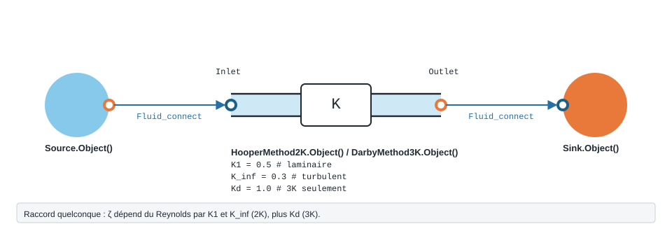

.. _methodes_k:

Singularité quelconque — méthodes 2K et 3K
==========================================

Quand un raccord n'a pas de modèle dédié, on le chiffre par ses coefficients publiés : méthode 2K de Hooper, méthode 3K de Darby, ou données Crane TP-410.

.. note::
   Fiche relevée dans le code de la bibliothèque (entrées, valeurs par défaut et
   unités telles qu'écrites dans ``__init__``). L'exemple exécuté, avec sa
   sortie réelle et sa variante, reste à écrire pour ce modèle.

   Forme, ports et raccordement de ``HooperMethod2K`` ; paramètres sous leur
   nom de code, avec leur valeur par défaut.

``HooperMethod2K`` — Singularité hydraulique utilisant la méthode 2K de Hooper.

.. code-block:: python

   from ThermodynamicCycles.Hydraulic import HooperMethod2K
   modele = HooperMethod2K.Object()

* **Ports** : ``Inlet``, ``Outlet`` (voir :doc:`../ports_connexions`).
* **Nœud de l'IHM** : « Singularité Hooper 2K ».

.. list-table::
   :header-rows: 1
   :widths: 26 26 48

   * - Entrée
     - Défaut
     - Commentaire du code
   * - ``d_hyd``
     - ``0.05``
     - Diamètre hydraulique (m)
   * - ``D_in_pouces``
     - ``2.0``
     - Diamètre nominal en pouces
   * - ``K1``
     - ``0.5``
     - Coefficient régime laminaire (augmente perte à faible Re)
   * - ``K_inf``
     - ``0.3``
     - Coefficient régime turbulent asymptotique

Lignes du ``df`` de sortie : ``fluid``, ``V (m/s)``, ``Re``, ``ζ (-)``, ``ΔP (Pa)``, ``P_in (Pa)``, ``P_out (Pa)``.

``DarbyMethod3K`` — Singularité hydraulique utilisant la méthode 3K de Darby.

.. code-block:: python

   from ThermodynamicCycles.Hydraulic import DarbyMethod3K
   modele = DarbyMethod3K.Object()

* **Ports** : ``Inlet``, ``Outlet`` (voir :doc:`../ports_connexions`).
* **Nœud de l'IHM** : « Singularité Darby 3K ».

.. list-table::
   :header-rows: 1
   :widths: 26 26 48

   * - Entrée
     - Défaut
     - Commentaire du code
   * - ``d_hyd``
     - ``0.05``
     - Diamètre hydraulique (m)
   * - ``D_in_pouces``
     - ``2.0``
     - Diamètre nominal en pouces
   * - ``K1``
     - ``0.5``
     - Coefficient régime laminaire
   * - ``K_inf``
     - ``0.3``
     - Coefficient régime turbulent asymptotique
   * - ``Kd``
     - ``1.0``
     - Coefficient de correction géométrique

Lignes du ``df`` de sortie : ``fluid``, ``V (m/s)``, ``Re``, ``ζ (-)``, ``ΔP (Pa)``, ``P_in (Pa)``, ``P_out (Pa)``.

``crane_valves`` — Crane TP-410 resistance coefficients for valves: K = n * f_T.

.. code-block:: python

   import ThermodynamicCycles.Hydraulic.crane_valves

* **Fonctions publiques** : ``butterfly_n_factor``, ``butterfly_zeta``, ``citation``, ``n_factor``, ``zeta``.

``crane_data`` — Crane TP-410 friction data: turbulent friction factor f_T and absolute roughness.

.. code-block:: python

   import ThermodynamicCycles.Hydraulic.crane_data

* **Fonctions publiques** : ``absolute_roughness``, ``friction_factor_source``, ``friction_factor_table``, ``friction_factor_turbulent``, ``list_materials``, ``material_info``, ``roughness_source``.

Voir :doc:`index` pour la liste de tous les modèles hydrauliques.
