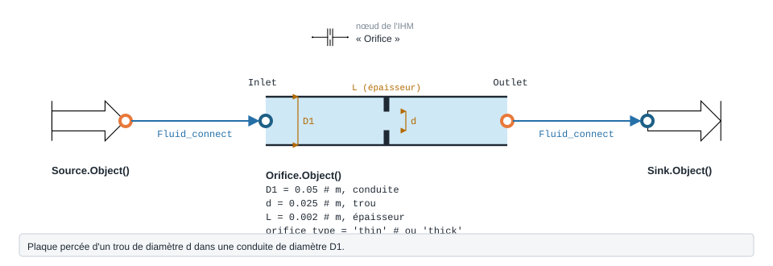

.. _orifice:

Orifice
=======

   Forme, ports et raccordement de ``Orifice`` ; paramètres sous leur
   nom de code, avec leur valeur par défaut.

Diaphragme ou orifice dans une conduite, mince ou épais.

.. note::
   Fiche relevée dans le code de la bibliothèque (entrées, valeurs par défaut et
   unités telles qu'écrites dans ``__init__``). L'exemple exécuté, avec sa
   sortie réelle et sa variante, reste à écrire pour ce modèle.

``Orifice`` — Singularité d'orifice : contraction + éventuellement tube + expansion.

.. code-block:: python

   from ThermodynamicCycles.Hydraulic import Orifice
   modele = Orifice.Object()

* **Ports** : ``Inlet``, ``Outlet`` (voir :doc:`../ports_connexions`).
* **Nœud de l'IHM** : « Orifice ».

.. list-table::
   :header-rows: 1
   :widths: 26 26 48

   * - Entrée
     - Défaut
     - Commentaire du code
   * - ``D1``
     - ``0.05``
     - Diamètre amont (m)
   * - ``d``
     - ``0.025``
     - Diamètre orifice (m)
   * - ``L``
     - ``0.002``
     - Épaisseur paroi / longueur orifice (m)
   * - ``orifice_type``
     - ``'thin'``
     - 'thin' ou 'thick'

Lignes du ``df`` de sortie : ``fluid``, ``V (m/s)``, ``Re``, ``ζ_total (-)``, ``ΔP (Pa)``, ``P_in (Pa)``, ``P_out (Pa)``.

Voir :doc:`index` pour la liste de tous les modèles hydrauliques.
