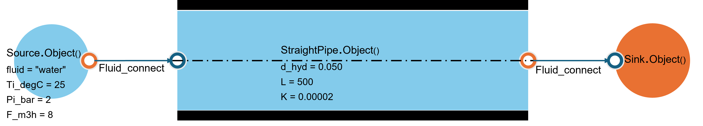

.. _straight_pipe:

4.1. de la perte de charge linéaire d'un conduit d'eau
========================================================

4.1.1. Exemple d'utilisation de "StraightPipe"
--------------------------------------------

L'image ci-dessous montre un exemple de tube avec la source et le puits :

Le code suivant montre comment utiliser la classe "StraightPipe" pour calculer la perte de charge linéaire d'un conduit d'eau :

.. code-block:: python

    from ThermodynamicCycles.Hydraulic import StraightPipe
    from ThermodynamicCycles.Source import Source
    from ThermodynamicCycles.Sink import Sink
    from ThermodynamicCycles.Connect import Fluid_connect

    SOURCE = Source.Object()
    STRAIGHT_PIPE = StraightPipe.Object()
    STRAIGHT_PIPE2 = StraightPipe.Object()
    SINK = Sink.Object()

    SOURCE.fluid = "water"
    SOURCE.Ti_degC = 25
    SOURCE.Pi_bar = 2
    SOURCE.F_m3h = 8
    SOURCE.calculate()

    STRAIGHT_PIPE.d_hyd = 0.050
    STRAIGHT_PIPE.L = 500
    STRAIGHT_PIPE.K = 0.00002

    Fluid_connect(STRAIGHT_PIPE.Inlet, SOURCE.Outlet)
    STRAIGHT_PIPE.calculate()
    Fluid_connect(SINK.Inlet, STRAIGHT_PIPE.Outlet)
    SINK.calculate()

    print(SOURCE.df)
    print(STRAIGHT_PIPE.df)
    print(SINK.df)

Résultats :
-----------

Source
------
.. list-table::
   :header-rows: 1

   * - Timestamp
     - 2025-02-23 17:32:30
   * - fluid
     - water
   * - Ti_degC
     - 25.0
   * - Pi_bar
     - 2
   * - F_Sm3h
     - 8.0
   * - F_Nm3h
     - None
   * - F_m3h
     - 8.0
   * - F_kgh
     - 7976.737
   * - F_kgs
     - 2.216
   * - F_m3s
     - 0.002
   * - F_Sm3s
     - 0.002

StraightPipe
------------
.. list-table::
   :header-rows: 1

   * - Timestamp
     - None
   * - fluid
     - water
   * - Ti_degC
     - 25.0
   * - Inlet.F (kg/s)
     - 2.216
   * - Inlet.h (j/kg)
     - 105011.0
   * - Outlet.h (j/kg)
     - 105011.0
   * - A (m2)
     - 0.002
   * - V (m/s)
     - 1.132
   * - Re
     - 63397.0
   * - delta_P(Pa)
     - 136626.9

Sink
----
.. list-table::
   :header-rows: 1

   * - Timestamp
     - 2025-02-23 17:32:30
   * - fluid
     - water
   * - F_kgs
     - 2.216
   * - Inlet.P(Pa)
     - 336626.9
   * - Inlet.h(J/kg)
     - 105011.0
   * - H(W)
     - 232680.0
   * - fluid_quality
     - liquid
   * - Q
     - -0.220011
   * - D (kg/m3)
     - 997.2
   * - F_Sm3h
     - 8.0
   * - F_m3h
     - 8.0
   * - F_kgh
     - 7977.0

Nomenclature
------------
.. list-table::
   :header-rows: 1

   * - Parameter
     - Description
   * - Ti_degC
     - Température d'entrée en degrés Celsius
   * - Pi_bar
     - Pression d'entrée en bars
   * - F_Sm3h
     - Débit volumétrique standard en mètres cubes par heure
   * - F_Nm3h
     - Débit volumétrique normal en mètres cubes par heure
   * - F_m3h
     - Débit volumétrique en mètres cubes par heure
   * - F_kgh
     - Débit massique en kilogrammes par heure
   * - F_kgs
     - Débit massique en kilogrammes par seconde
   * - F_m3s
     - Débit volumétrique en mètres cubes par seconde
   * - F_Sm3s
     - Débit volumétrique standard en mètres cubes par seconde
   * - Inlet.F
     - Débit massique à l'entrée en kilogrammes par seconde
   * - Inlet.h
     - Enthalpie à l'entrée en joules par kilogramme
   * - Outlet.h
     - Enthalpie à la sortie en joules par kilogramme
   * - A
     - Section du tube en mètres carrés
   * - V
     - Vitesse d'écoulement en mètres par seconde
   * - Re
     - Nombre de Reynolds
   * - delta_P
     - Perte de pression en pascals
   * - Inlet.P
     - Pression à l'entrée en pascals
   * - H
     - Puissance en watts
   * - fluid_quality
     - Qualité du fluide
   * - Q
     - Débit thermique
   * - D
     - Densité en kilogrammes par mètre cube
   * - Ti
     - Température d'entrée en Kelvin
   * - To
     - Température de sortie en Kelvin
   * - roughness
     - Rugosité de la surface
   * - d_hyd
     - Diamètre hydraulique en mètres
   * - L
     - Longueur en mètres
   * - K
     - Rugosité en mètres
   * - alpha
     - Angle d'inclinaison du tube en radians
   * - delta_Z
     - Hauteur du tuyau en mètres
   * - delta_H
     - Perte de pression en mètres
   * - eta
     - Viscosité dynamique du fluide
   * - rho
     - Densité du fluide
   * - delta_P
     - Perte de pression due aux frottements
   * - diff_P
     - Différence de pression entre l'entrée et la sortie
   * - m_flow
     - Débit massique en kilogrammes par seconde
   * - perimeter
     - Périmètre
   * - A
     - Section du tube en mètres carrés
   * - V
     - Vitesse d'écoulement en mètres par seconde
   * - Re
     - Nombre de Reynolds
   * - h
     - Enthalpie en joules par kilogramme