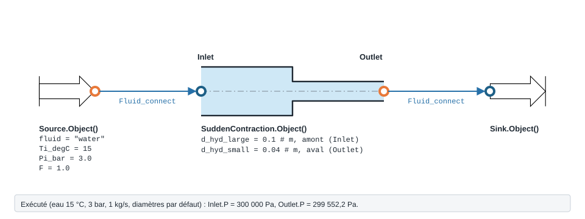
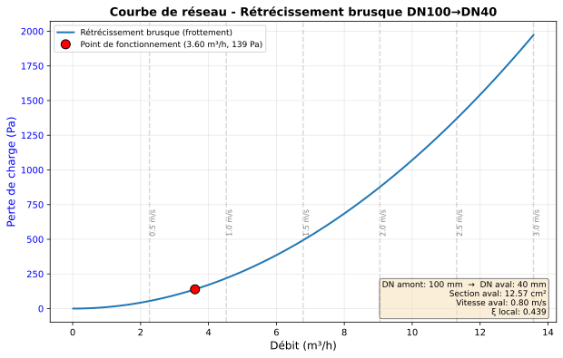
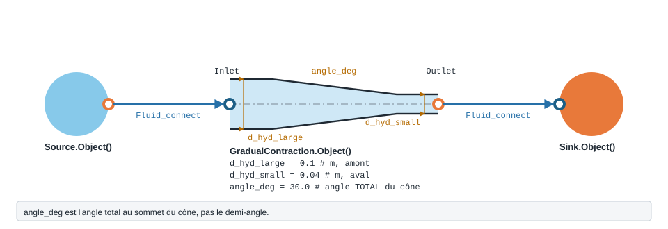

.. _reduction_section:

Réduction de section
====================

Passage d'un grand diamètre à un petit : brusque (``SuddenContraction``) ou
progressif, par un confuseur conique (``GradualContraction``). La pression
statique chute : perte par frottement et hausse de la pression dynamique.

``SuddenContraction`` — retrecissement brusque (Modelica PressureLoss.Orifice.SuddenContractionOrifice).

.. code-block:: python

   from ThermodynamicCycles.Hydraulic import SuddenContraction
   modele = SuddenContraction.Object()

* **Ports** : ``Inlet``, ``Outlet`` (voir :doc:`../ports_connexions`).
* **Nœud de l'IHM** : « Retrecissement ».

.. list-table::
   :header-rows: 1
   :widths: 26 26 48

   * - Entrée
     - Défaut
     - Commentaire du code
   * - ``d_hyd_small``
     - ``0.04``
     - m -- aval (Outlet)
   * - ``d_hyd_large``
     - ``0.1``
     - m -- amont (Inlet)
   * - ``correlation``
     - ``'Idelcik'``
     - —
   * - ``roughness``
     - ``1.5e-06``
     - m
   * - ``apply_handbook_corrections``
     - ``False``
     - —
   * - ``handbook_roughness_multiplier``
     - ``None``
     - —
   * - ``handbook_aspect_ratio``
     - ``None``
     - —

Lignes du ``df`` de sortie : ``fluid``, ``F_kgs``, ``d_small_mm``, ``d_large_mm``, ``V_small_ms``, ``V_large_ms``, ``correlation``, ``Re_large``, ``darcy_factor``, ``ksi_loc_base``, ``ksi_loc``, ``dP_friction_Pa``, ``dP_static_Pa``.

   Rétrécissement brusque : ``d_hyd_large`` est le diamètre **amont** (``Inlet``),
   ``d_hyd_small`` le diamètre **aval** (``Outlet``).

   Courbe de réseau du rétrécissement brusque ci-dessus.

.. note::
   **D'où viennent les courbes de réseau.** Elles sont tracées par la bibliothèque,
   par le chemin qu'emprunte le nœud de l'IHM : ``compute_network_curve(modele,
   **modele.network_plot_kwargs())`` puis ``render_network_figure``, importés de
   ``ThermodynamicCycles.Hydraulic.network_plot``. La méthode ``modele.Plot()``
   lève aujourd'hui un ``TypeError`` pour ce modèle (arguments ``info``,
   ``curve_label`` ou ``regime`` refusés) : utilisez ces deux fonctions à la place.

   Forme, ports et raccordement de ``GradualContraction`` ; paramètres sous leur
   nom de code, avec leur valeur par défaut.

``GradualContraction`` — confuseur conique (retrecissement progressif).

.. code-block:: python

   from ThermodynamicCycles.Hydraulic import GradualContraction
   modele = GradualContraction.Object()

* **Ports** : ``Inlet``, ``Outlet`` (voir :doc:`../ports_connexions`).
* **Nœud de l'IHM** : « Confuseur conique ».
* **Exceptions levées par le code** : ``ValueError``.

.. list-table::
   :header-rows: 1
   :widths: 26 26 48

   * - Entrée
     - Défaut
     - Commentaire du code
   * - ``d_hyd_small``
     - ``0.04``
     - m -- aval (Outlet)
   * - ``d_hyd_large``
     - ``0.1``
     - m -- amont (Inlet)
   * - ``angle_deg``
     - ``30.0``
     - angle TOTAL du cone
   * - ``roughness``
     - ``1.5e-06``
     - m
   * - ``correlation``
     - ``'idelchik'``
     - —
   * - ``ksi_conv``
     - ``None``
     - —
   * - ``ksi_fr``
     - ``None``
     - —

Lignes du ``df`` de sortie : ``fluid``, ``F_kgs``, ``d_small_mm``, ``d_large_mm``, ``angle_deg``, ``length_m``, ``V_small_ms``, ``V_large_ms``, ``Re_small``, ``correlation``, ``darcy_factor``, ``ksi_conv``, ``ksi_fr``, ``ksi_loc``, ``dP_friction_Pa``, ``dP_static_Pa``.

``Hooper1988PipeSizeChange`` — Hooper (1988) correlations for losses caused by pipe-size changes.

.. code-block:: python

   import ThermodynamicCycles.Hydraulic.Hooper1988PipeSizeChange

* **Fonctions publiques** : ``darcy_friction_factor``, ``gradual_contraction_k``, ``gradual_expansion_k``, ``rounded_contraction_k``, ``sharp_contraction_k``, ``sharp_expansion_k``.

.. note::
   Ces modèles sont **bidirectionnels** : si la pression d'une sortie est imposée
   (aval), le modèle remonte la (les) pression(s) d'entrée
   (:math:`P_{in}=P_{out}+\Delta P`). Voir :doc:`propagation_pression`.

Voir :doc:`index` pour la liste de tous les modèles hydrauliques.
