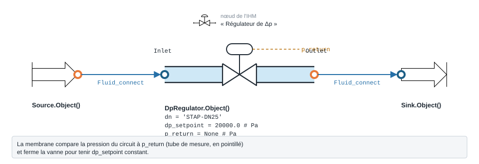

.. _dp_regulator:

Régulateur de pression différentielle
=====================================

Régulateur qui maintient une pression différentielle constante sur un circuit (type STAP / STAM).

.. note::
   Fiche relevée dans le code de la bibliothèque (entrées, valeurs par défaut et
   unités telles qu'écrites dans ``__init__``). L'exemple exécuté, avec sa
   sortie réelle et sa variante, reste à écrire pour ce modèle.

   Forme, ports et raccordement de ``DpRegulator`` ; paramètres sous leur
   nom de code, avec leur valeur par défaut.

``DpRegulator`` — regulateur de pression differentielle (STAP / STAM IMI TA).

.. code-block:: python

   from ThermodynamicCycles.Hydraulic import DpRegulator
   modele = DpRegulator.Object()

* **Ports** : ``Inlet``, ``Outlet`` (voir :doc:`../ports_connexions`).
* **Nœud de l'IHM** : « Régulateur de Δp ».
* **Exceptions levées par le code** : ``ValueError``.

.. list-table::
   :header-rows: 1
   :widths: 26 26 48

   * - Entrée
     - Défaut
     - Commentaire du code
   * - ``dn``
     - ``'STAP-DN25'``
     - cle TA_Valve -> Kv max ; None -> kv_max direct
   * - ``kv_max``
     - ``None``
     - m3/h, utilise si dn est None
   * - ``dp_setpoint``
     - ``20000.0``
     - Pa (20 kPa, plage courante STAP 10-60 kPa)
   * - ``p_return``
     - ``None``
     - Pa, pression au point de reference (capillaire)
   * - ``delta_P``
     - ``None``
     - —
   * - ``regulating``
     - ``None``
     - —

Lignes du ``df`` de sortie : ``fluid``, ``F_kgs``, ``Q_m3h``, ``dn``, ``Kv_max``, ``dp_setpoint_Pa``, ``p_return_Pa``, ``dp_open_Pa``, ``dP_Pa``, ``regulating``, ``P_out_Pa``.

Voir :doc:`index` pour la liste de tous les modèles hydrauliques.
