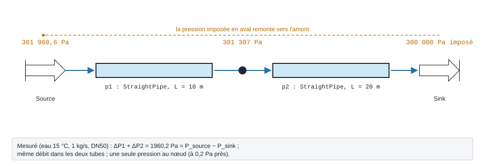

.. _resolution_circuit:

Résolution d'un circuit hydraulique
===================================

Assembler des modèles par ``Fluid_connect`` suffit à résoudre une **chaîne**
de composants : la pression imposée en aval remonte de composant en composant
(:doc:`propagation_pression`), et chaque raccordement applique la loi des nœuds
(:doc:`loi_des_noeuds`).

Circuit série : deux tubes entre une source et un puits
-------------------------------------------------------

   Le circuit de l'exemple ci-dessous, avec les pressions **mesurées** à son exécution.

.. code-block:: python

   from ThermodynamicCycles.Source import Source
   from ThermodynamicCycles.Hydraulic import StraightPipe
   from ThermodynamicCycles.Connect import Fluid_connect

   src = Source.Object(); src.fluid = "water"; src.Ti_degC = 15
   src.Pi_bar = 5; src.F = 1.0; src.calculate()

   p1 = StraightPipe.Object(); p1.L = 10; p1.d_hyd = 0.05
   p2 = StraightPipe.Object(); p2.L = 20; p2.d_hyd = 0.05

   Fluid_connect(p1.Inlet, src.Outlet); p1.calculate()
   Fluid_connect(p2.Inlet, p1.Outlet); p2.calculate()

   # Le puits impose le POTENTIEL aval -> il remonte jusqu'à la source
   p2.Outlet.P = 3.0e5

   dP1 = p1.Inlet.P - p1.Outlet.P
   dP2 = p2.Inlet.P - p2.Outlet.P
   print("pression au nœud   : p1.Outlet.P =", round(p1.Outlet.P, 1), "Pa ; p2.Inlet.P =", round(p2.Inlet.P, 1), "Pa")
   print("mailles (KVL)      : P_amont - P_aval =", round(p1.Inlet.P - p2.Outlet.P, 1), "Pa ; dP1 + dP2 =", round(dP1 + dP2, 1), "Pa")
   print("nœuds (KCL)        : débits =", p1.Inlet.F, p1.Outlet.F, p2.Inlet.F, p2.Outlet.F, "kg/s")
   print("pression à la source remontée :", round(src.Outlet.P, 1), "Pa")

Sortie réelle :

.. code-block:: text

   StraightPipe: P_entrée détectée 500000.000 bar → calcul P_sortie
   Détection d'un changement de Outlet.P. Recalcul en cours...
   Détection d'un changement de Outlet.P. Recalcul en cours...
   StraightPipe: P_entrée détectée 499346.477 bar → calcul P_sortie
   Détection d'un changement de Outlet.P. Recalcul en cours...
   Détection d'un changement de Outlet.P. Recalcul en cours...
   Détection d'un changement de Outlet.P. Recalcul en cours...
   Détection d'un changement de Outlet.P. Recalcul en cours...
   Détection d'un changement de Outlet.P. Recalcul en cours...
   StraightPipe: P_entrée mise à jour 301307.045 bar → P_sortie recalculée 300000.223 bar (ancienne: 300000.000)
   Détection d'un changement de Outlet.P. Recalcul en cours...
   Détection d'un changement de Outlet.P. Recalcul en cours...
   Détection d'un changement de Outlet.P. Recalcul en cours...
   Détection d'un changement de Outlet.P. Recalcul en cours...
   Détection d'un changement de Outlet.P. Recalcul en cours...
   StraightPipe: P_entrée mise à jour 301307.157 bar → P_sortie recalculée 300000.335 bar (ancienne: 300000.223)
   StraightPipe: P_entrée mise à jour 301960.569 bar → P_sortie recalculée 301307.157 bar (ancienne: 301307.045)
   Détection d'un changement de Outlet.P. Recalcul en cours...
   Détection d'un changement de Outlet.P. Recalcul en cours...
   StraightPipe: P_entrée mise à jour 301307.045 bar → P_sortie recalculée 300000.223 bar (ancienne: 300000.335)
   pression au nœud   : p1.Outlet.P = 301307.2 Pa ; p2.Inlet.P = 301307.0 Pa
   mailles (KVL)      : P_amont - P_aval = 1960.3 Pa ; dP1 + dP2 = 1960.2 Pa
   nœuds (KCL)        : débits = 1.0 1.0 1.0 1.0 kg/s
   pression à la source remontée : 301960.6 Pa

Les trois lois sont vérifiées : le nœud entre les deux tubes a une pression
unique (à 0,2 Pa près), la somme des deux chutes égale l'écart total de
pression (à 0,1 Pa près), et le débit est le même partout. La pression imposée
au puits (3 bar) est remontée jusqu'à la source.

.. note::
   Les lignes « StraightPipe: … » et « Détection d'un changement … » sont des
   traces que ``StraightPipe`` imprime à chaque recalcul. Elles annoncent des
   « bar » mais affichent des **pascals** (500000.000 = 5 bar).

Réseau maillé ou bouclé : le solveur nodal
------------------------------------------

La propagation par les ports converge sur des chaînes et de petits parallèles,
mais, comme le dit le code lui-même, **ne garantit rien sur un réseau maillé
ou une boucle fermée**. Pour ces réseaux, la bibliothèque fournit un solveur
nodal : inconnues = débit de chaque branche et pression de chaque nœud libre,
équations = chute de pression par branche et loi des nœuds, résolution par
Newton.

``network`` — solveur de reseau hydraulique en regime permanent (noeuds / branches).

.. code-block:: python

   import ThermodynamicCycles.Hydraulic.network

* **Fonctions publiques** : ``kv_density_factor``.
* **Classes** : ``AreaChangeElement``, ``AshraeFittingElement``, ``AshraeTeeElement``, ``Branch``, ``CheckValveElement``, ``CoilElement``, ``ControlValveElement``, ``CurvedBendElement``, ``DpRegulatorElement``, ``DuctElement``, ``EdgedBendElement``, ``Element``, ``FlowContext``, ``FunctionElement``, ``HazenWilliamsPipeElement``, ``HydraulicNetwork``, ``KvElement``, ``LocalLossElement``, ``ModelLossElement``, ``NetworkResult``, ``Node``, ``PipeElement``, ``PumpElement``, ``SimulationResult``, ``TAValveElement``, ``Tank``, ``TeeElement``, ``ThreeWayValveElement``.

.. note::
   Fiche relevée dans le code. L'exemple exécuté du solveur nodal reste à écrire.

Des réseaux complets, prêts à ouvrir, sont livrés avec l'IHM : voir la liste des
17 scènes en fin de :doc:`index`.
