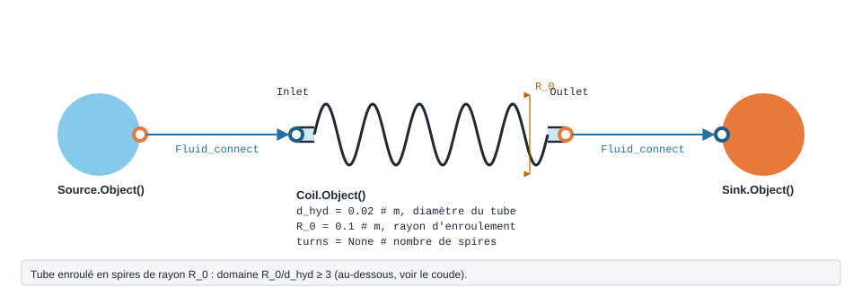

.. _coil:

Serpentin
=========

   Forme, ports et raccordement de ``Coil`` ; paramètres sous leur
   nom de code, avec leur valeur par défaut.

Tube lisse enroulé à grand rayon de courbure (R_0/d_hyd ≥ 3), au-delà du domaine du coude.

.. note::
   Fiche relevée dans le code de la bibliothèque (entrées, valeurs par défaut et
   unités telles qu'écrites dans ``__init__``). L'exemple exécuté, avec sa
   sortie réelle et sa variante, reste à écrire pour ce modèle.

``Coil`` — Serpentin lisse a grand rayon de courbure (Idel'chik, Diagramme 6.2).

.. code-block:: python

   from ThermodynamicCycles.Hydraulic import Coil
   modele = Coil.Object()

* **Ports** : ``Inlet``, ``Outlet`` (voir :doc:`../ports_connexions`).
* **Nœud de l'IHM** : « Serpentin ».

.. list-table::
   :header-rows: 1
   :widths: 26 26 48

   * - Entrée
     - Défaut
     - Commentaire du code
   * - ``d_hyd``
     - ``0.02``
     - m -- diametre (Dh si non circulaire)
   * - ``R_0``
     - ``0.1``
     - m -- rayon d'enroulement
   * - ``turns``
     - ``None``
     - spires ; si renseigne, impose delta
   * - ``K``
     - ``1.5e-06``
     - m -- rugosite (diagnostic seulement)
   * - ``section``
     - ``'circular'``
     - circular \| square \| rectangular
   * - ``aspect_ratio``
     - ``None``
     - b0/a0, obligatoire si rectangular
   * - ``lambda_source``
     - ``'auto'``
     - auto \| formula \| table

Lignes du ``df`` de sortie : ``fluid``, ``F_kgs``, ``d_hyd_mm``, ``R0_d_hyd``, ``delta_deg``, ``L_dev_m``, ``V_ms``, ``Re``, ``X``, ``lambda_el``, ``lambda_source``, ``ksi_total``, ``dP_Pa``, ``dP_mbar``.

Voir :doc:`index` pour la liste de tous les modèles hydrauliques.
