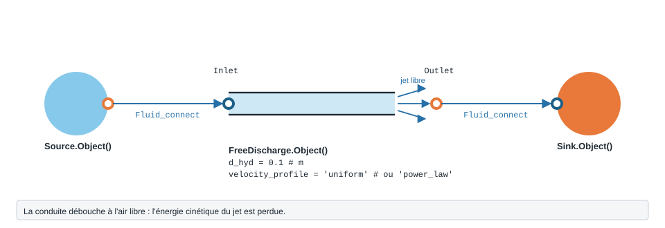

.. _free_discharge:

Sortie libre
============

   Forme, ports et raccordement de ``FreeDischarge`` ; paramètres sous leur
   nom de code, avec leur valeur par défaut.

Perte à la sortie libre d'un tube ou d'un canal.

.. note::
   Fiche relevée dans le code de la bibliothèque (entrées, valeurs par défaut et
   unités telles qu'écrites dans ``__init__``). L'exemple exécuté, avec sa
   sortie réelle et sa variante, reste à écrire pour ce modèle.

``FreeDischarge`` — sortie libre de tube/canal (Idelchik, section 11).

.. code-block:: python

   from ThermodynamicCycles.Hydraulic import FreeDischarge
   modele = FreeDischarge.Object()

* **Ports** : ``Inlet``, ``Outlet`` (voir :doc:`../ports_connexions`).
* **Nœud de l'IHM** : « Décharge libre ».
* **Exceptions levées par le code** : ``ValueError``.

.. list-table::
   :header-rows: 1
   :widths: 26 26 48

   * - Entrée
     - Défaut
     - Commentaire du code
   * - ``d_hyd``
     - ``0.1``
     - —
   * - ``velocity_profile``
     - ``'uniform'``
     - uniform \| power_law
   * - ``m_profile``
     - ``7.0``
     - —

Lignes du ``df`` de sortie : ``fluid``, ``F_kgs``, ``d_hyd_mm``, ``velocity_profile``, ``m_profile``, ``w0_ms``, ``ksi_loc``, ``dP_Pa``.

Voir :doc:`index` pour la liste de tous les modèles hydrauliques.
