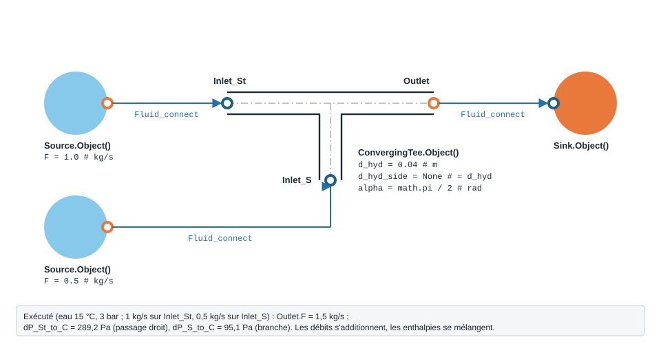
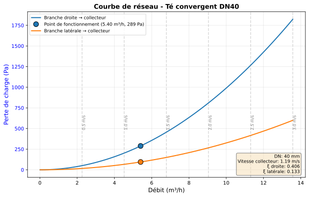
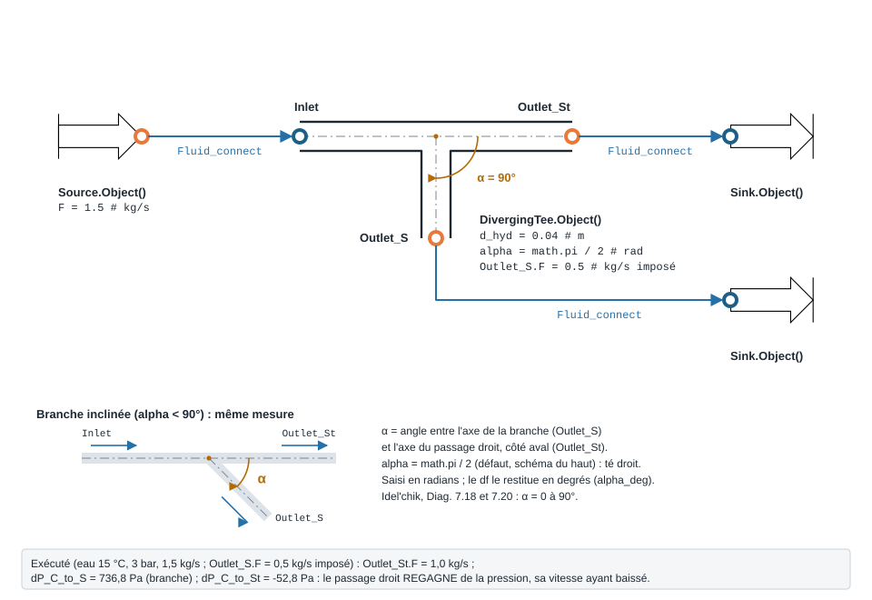
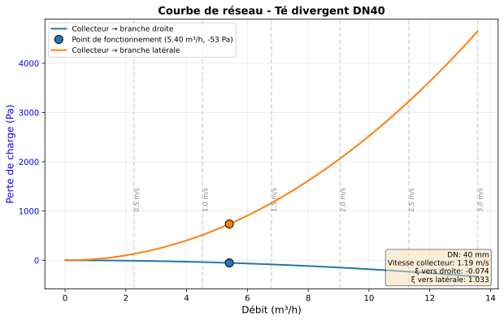

.. _te_jonction:

Té / jonction 3 ports
=====================

Deux modèles à trois ports : le té **convergent** réunit deux courants, le té
**divergent** en partage un. Bilan de masse sur les trois ports ; le té
convergent mélange aussi les enthalpies.

``ConvergingTee`` — te convergent (Idel'chik, Diagrammes 7.1 a 7.4).

.. code-block:: python

   from ThermodynamicCycles.Hydraulic import ConvergingTee
   modele = ConvergingTee.Object()

* **Ports** : ``Inlet_St``, ``Inlet_S``, ``Outlet`` (voir :doc:`../ports_connexions`).
* **Nœud de l'IHM** : « Té convergent ».
* **Exceptions levées par le code** : ``ValueError``.

.. list-table::
   :header-rows: 1
   :widths: 26 26 48

   * - Entrée
     - Défaut
     - Commentaire du code
   * - ``d_hyd``
     - ``0.04``
     - m -- diametre commun (collecteur = passage droit)
   * - ``d_hyd_side``
     - ``None``
     - m -- diametre de la branche (None = d_hyd)
   * - ``alpha``
     - ``math.pi / 2``
     - rad -- angle de la branche
   * - ``correlation``
     - ``'idelchik'``
     - 'idelchik' (Diag. 7.1-7.4) \| 'legacy'
   * - ``A_factor``
     - ``None``
     - Table 7.1
   * - ``ksi_St``
     - ``None``
     - —
   * - ``ksi_S``
     - ``None``
     - —

Lignes du ``df`` de sortie : ``fluid``, ``F_St_kgs``, ``F_S_kgs``, ``F_C_kgs``, ``q_ratio``, ``Fs_Fc``, ``V_C_ms``, ``correlation``, ``ksi_St``, ``ksi_S``, ``dP_St_C_Pa``, ``dP_S_C_Pa``, ``alpha_deg``.

``DivergingTee`` — te divergent (Idel'chik, Diagrammes 7.18 et 7.20).

.. code-block:: python

   from ThermodynamicCycles.Hydraulic import DivergingTee
   modele = DivergingTee.Object()

* **Ports** : ``Inlet``, ``Outlet_St``, ``Outlet_S`` (voir :doc:`../ports_connexions`).
* **Nœud de l'IHM** : « Té divergent ».
* **Exceptions levées par le code** : ``ValueError``.

.. list-table::
   :header-rows: 1
   :widths: 26 26 48

   * - Entrée
     - Défaut
     - Commentaire du code
   * - ``d_hyd``
     - ``0.04``
     - m -- diametre commun (collecteur = passage droit)
   * - ``d_hyd_side``
     - ``None``
     - m -- diametre de la branche (None = d_hyd)
   * - ``height_ratio``
     - ``None``
     - hs/hc (None = sqrt(Fs/Fc), tubes circulaires)
   * - ``alpha``
     - ``math.pi / 2``
     - rad -- angle de la branche (defaut 90°)
   * - ``correlation``
     - ``'idelchik'``
     - 'idelchik' (Diag. 7.18/7.20) \| 'legacy'
   * - ``ksi_St``
     - ``None``
     - —
   * - ``ksi_S``
     - ``None``
     - —
   * - ``domain_note``
     - ``''``
     - —

Lignes du ``df`` de sortie : ``fluid``, ``F_C_kgs``, ``F_St_kgs``, ``F_S_kgs``, ``q_ratio``, ``Fs_Fc``, ``V_C_ms``, ``correlation``, ``ksi_St``, ``ksi_S``, ``dP_C_St_Pa``, ``dP_C_S_Pa``, ``alpha_deg``.

   Té convergent : **deux** composants amont, un sur le passage droit
   (``Inlet_St``), un sur la branche (``Inlet_S``) ; les débits s'additionnent.

   Courbes de réseau du té convergent : une courbe par chemin, passage droit et
   branche vers le collecteur.

   Té divergent : le débit de la branche s'**impose** par ``Outlet_S.F`` ; le passage
   droit ``Outlet_St`` reçoit le reste (1,5 − 0,5 = 1,0 kg/s, mesuré).

   Courbes de réseau du té divergent : la branche latérale perd de la pression, le
   passage droit en **regagne** (courbe sous zéro, −53 Pa au point de fonctionnement).

.. note::
   **D'où viennent les courbes de réseau.** Elles sont tracées par la bibliothèque,
   par le chemin qu'emprunte le nœud de l'IHM : ``compute_network_curve(modele,
   **modele.network_plot_kwargs())`` puis ``render_network_figure``, importés de
   ``ThermodynamicCycles.Hydraulic.network_plot``. La méthode ``modele.Plot()``
   lève aujourd'hui un ``TypeError`` pour ce modèle (arguments ``info``,
   ``curve_label`` ou ``regime`` refusés) : utilisez ces deux fonctions à la place.

.. note::
   Ces modèles sont **bidirectionnels** : si la pression d'une sortie est imposée
   (aval), le modèle remonte la (les) pression(s) d'entrée
   (:math:`P_{in}=P_{out}+\Delta P`). Voir :doc:`propagation_pression`.

Voir :doc:`index` pour la liste de tous les modèles hydrauliques.
