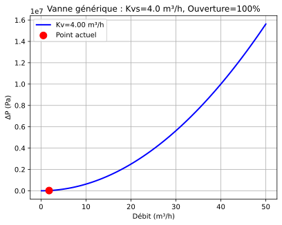

.. _general_valve:

Vanne générique à Kv — GeneralValve
===================================

À quoi ça sert
--------------

Chiffrer la perte de charge d'une vanne quand on ne connaît d'elle que ce que
donne le catalogue : son **Kvs**, le débit d'eau (m³/h) qui la traverse
grande ouverte sous 1 bar de perte. C'est le modèle à prendre pour une vanne 2
voies de régulation, une vanne de réglage quelconque ou tout organe dont le
constructeur publie un Kv. Il sait aussi, si on lui donne les données du
constructeur, détecter la cavitation et l'écoulement bloqué.

Ne vous en servez pas pour une vanne d'équilibrage IMI TA (:doc:`TA_valve`, qui
porte les tables Kv du fabricant) ni pour une vanne 3 voies
(:doc:`valve_3_voies`). Dans ``PyqtSimulator``, c'est le nœud **« Vanne
générique (Kv) »**.

Exemple minimal
---------------

La vanne reçoit son état de l'amont par ``Fluid_connect`` (voir
:doc:`../ports_connexions`).

.. code-block:: python

   from ThermodynamicCycles.Source import Source
   from ThermodynamicCycles.Hydraulic import GeneralValve
   from ThermodynamicCycles.Connect import Fluid_connect

   # Amont : eau à 20 °C, 10 bar, 0,5 kg/s (≈ 1,8 m3/h)
   SOURCE = Source.Object()
   SOURCE.fluid = "water"
   SOURCE.Pi_bar = 10.0       # bar
   SOURCE.Ti_degC = 20        # °C
   SOURCE.F = 0.5             # kg/s
   SOURCE.calculate()

   # Vanne DN25, Kvs = 4 m3/h, grande ouverte
   VANNE = GeneralValve.Object()
   Fluid_connect(VANNE.Inlet, SOURCE.Outlet)
   VANNE.Kvs = 4.0            # m3/h — donnée du constructeur
   VANNE.ouverture = 1.0      # FRACTION : 1.0 = 100 %
   VANNE.D_mm = 25            # mm
   VANNE.calculate()

   print(VANNE.df.drop("Timestamp"))

Sortie réelle :

.. code-block:: text

                 GeneralValve
   fluid                water
   Q (m³/h)             1.802
   Kv_eff (m³/h)          4.0
   Ouverture (%)        100.0
   ΔP (Pa)            20306.1
   P_in (Pa)        1000000.0
   P_out (Pa)        979694.0
   F_kgs                  0.5

Lecture : 1,802 m³/h dans un Kv de 4 donnent (1,802 / 4)² = 0,203 bar, soit
20 306 Pa. C'est la définition même du Kv, appliquée telle quelle.

   Tracée par la méthode ``Plot()`` du modèle : la parabole ΔP = (Q/Kv)²·10⁵ et
   le point de fonctionnement de l'exemple.

Ce qu'on personnalise
---------------------

.. list-table::
   :header-rows: 1
   :widths: 22 42 20 16

   * - Paramètre
     - Effet
     - Plage raisonnable
     - Source
   * - ``Kvs`` (m³/h)
     - Kv à pleine ouverture ; la perte varie comme 1/Kvs²
     - catalogue constructeur
     - IEC 60534
   * - ``ouverture`` (–)
     - **fraction de 0 à 1**, pas un pourcentage. ``set_opening(50)``, lui,
       prend des pourcents et recalcule
     - 0 à 1
     - —
   * - ``D_mm`` (mm)
     - diamètre nominal ; ne sert qu'à la vitesse, au Reynolds et au ζ exporté,
       **pas** à la perte de charge
     - DN de la vanne
     - —
   * - ``cv_curve``
     - loi d'ouverture Kv/Kvs = f(ouverture). Défaut : exponentielle
       ``exp(3,5·(x − 1))`` ; ``GeneralValve.Object._linear_curve`` pour une
       loi linéaire
     - —
     - **non tracée** (voir ci-dessous)
   * - ``F_L``, ``p_v``, ``p_c``
     - activent le contrôle de cavitation et d'écoulement bloqué (les trois
       sont nécessaires) ; ``F_LP``, ``F_P`` en présence de raccords
     - catalogue, propriétés du fluide
     - IEC 60534-2-1, Fisher CVH ch. 5
   * - ``zeta_model``
     - ``'legacy'`` (défaut) ou ``'iec'`` : ne change **que** le ζ exporté,
       jamais ΔP
     - —
     - Fisher CVH p. 113

Variante exécutée : le Kvs, puis l'ouverture.

.. code-block:: python

   from ThermodynamicCycles.Source import Source
   from ThermodynamicCycles.Hydraulic import GeneralValve
   from ThermodynamicCycles.Connect import Fluid_connect

   # variante : Kvs et ouverture
   print(" Kvs  ouverture   Kv_eff    dP (Pa)")
   for Kvs, ouverture in ((4.0, 1.0), (6.3, 1.0), (10.0, 1.0), (10.0, 0.75), (10.0, 0.5), (10.0, 0.25)):
       SOURCE = Source.Object()
       SOURCE.fluid = "water"; SOURCE.Pi_bar = 10.0; SOURCE.Ti_degC = 20; SOURCE.F = 0.5
       SOURCE.calculate()
       VANNE = GeneralValve.Object()
       Fluid_connect(VANNE.Inlet, SOURCE.Outlet)
       VANNE.Kvs = Kvs
       VANNE.ouverture = ouverture
       VANNE.calculate()
       print(f"{Kvs:4.1f}   {ouverture*100:5.0f} %   {VANNE.Kv_effective:6.3f}   {VANNE.delta_P:9.0f}")

Sortie réelle :

.. code-block:: text

    Kvs  ouverture   Kv_eff    dP (Pa)
    4.0     100 %    4.000       20306
    6.3     100 %    6.300        8186
   10.0     100 %   10.000        3249
   10.0      75 %    4.169       18697
   10.0      50 %    1.738      107591
   10.0      25 %    0.724      619144

Ce que ça dit : passer de Kvs 4 à Kvs 10 divise la perte par 6,25, le carré du
rapport. Et la loi d'ouverture est très raide : à mi-course, la vanne ne passe
plus que 17 % de son Kvs, et sa perte est multipliée par 33.

Éprouver le modèle
------------------

.. code-block:: python

   from ThermodynamicCycles.Source import Source
   from ThermodynamicCycles.Hydraulic import GeneralValve
   from ThermodynamicCycles.Connect import Fluid_connect

   def vanne(ouverture):
       SOURCE = Source.Object()
       SOURCE.fluid = "water"; SOURCE.Pi_bar = 10.0; SOURCE.Ti_degC = 20; SOURCE.F = 0.5
       SOURCE.calculate()
       V = GeneralValve.Object()
       Fluid_connect(V.Inlet, SOURCE.Outlet)
       V.Kvs = 10.0
       V.ouverture = ouverture
       return V

   # 1) Sans données de cavitation, aucun garde-fou : à 10 % d'ouverture la perte de
   #    charge dépasse la pression amont, et CoolProp échoue sur une pression négative.
   V = vanne(0.10)
   try:
       V.calculate()
   except ValueError:
       print("échec CoolProp : dP =", round(V.delta_P), "Pa pour", round(V.Inlet.P), "Pa en amont")

   # 2) Avec F_L, p_v et p_c, le modèle détecte l'écoulement bloqué et plafonne dP.
   V = vanne(0.10)
   V.F_L = 0.9               # facteur de récupération de pression (constructeur)
   V.p_v = 2339.0            # Pa, pression de vapeur de l'eau à 20 °C
   V.p_c = 22.064e6          # Pa, pression critique de l'eau
   V.calculate()
   print("avec F_L : choked =", V.choked, "| état :", V.cavitation_state,
         "| dp_max =", round(V.dp_max), "Pa | dP retenu =", round(V.delta_P), "Pa")

   # 3) Un mode de calcul du zeta inconnu est refusé.
   V = vanne(1.0)
   V.zeta_model = "autre"
   try:
       V.calculate()
   except ValueError as e:
       print("refusé :", e)

Sortie réelle :

.. code-block:: text

   échec CoolProp : dP = 1769298 Pa pour 1000000 Pa en amont
   avec F_L : choked = True | état : cavitation | dp_max = 808187 Pa | dP retenu = 808187 Pa
   refusé : zeta_model inconnu : 'autre' (attendu 'legacy' ou 'iec')

Trois comportements à connaître :

* **sans** ``F_L``, ``p_v`` et ``p_c``, le modèle n'a **aucun garde-fou** : une
  perte de charge supérieure à la pression amont produit une pression de sortie
  négative, et c'est CoolProp qui échoue, avec une ``ValueError`` peu parlante.
  Vérifiez toujours que ΔP reste sous la pression amont ;
* **avec** ces trois données, l'écoulement bloqué est détecté (``choked``),
  la perte est plafonnée à ``dp_max`` et ``cavitation_state`` dit
  ``'aucune'``, ``'cavitation'`` ou ``'flashing'`` ;
* seul ``zeta_model`` lève une exception nommée.

Limites connues
---------------

* **La densité du fluide n'entre pas dans ΔP.** Le code applique
  ΔP = (Q/Kv)²·10⁵ avec Q en m³/h ; la définition du Kv comporte aussi la densité
  relative ρ/1000. Pour l'eau à 20 °C (998,6 kg/m³), le code surestime ΔP de
  0,1 % ; pour une eau glycolée à 30 % (1038 kg/m³, mesuré par CoolProp), il le
  **sous-estime de 3,7 %**.
* **La loi d'ouverture n'a pas de source.** Le code le déclare lui-même : les
  constantes de la courbe exponentielle (3,5 et le plancher 0,001) ne viennent
  d'aucune référence identifiée. Pour un calcul d'autorité de vanne, fournissez
  la caractéristique du constructeur par ``cv_curve``.
* **« Fermée » n'est pas étanche** : à ``ouverture = 0``, le Kv vaut 0,1 % du
  Kvs.
* **Le ζ exporté en mode** ``'legacy'`` **est faux** dès que ``Kvs`` est modifié
  après la création de l'objet : il reste calculé sur le Kvs par défaut (10).
  Utilisez ``zeta_model = 'iec'`` si vous exploitez ζ. ΔP n'est pas concerné.

Pour aller plus loin
--------------------

* :doc:`index` — toutes les formes hydrauliques.
* :doc:`TA_valve`, :doc:`valve_3_voies` — les vannes spécialisées.
* :doc:`propagation_pression` — comment la vanne reporte sa perte dans le
  réseau.
* Sources citées par le code : IEC 60534-2-1 (dimensionnement des vannes de
  réglage) ; Fisher/Emerson, *Control Valve Handbook*, 2001, ch. 5 (Kv = 0,865 Cv,
  cavitation) ; Crane TP-410, éd. 2009, exemples 7-27 et 7-28.
