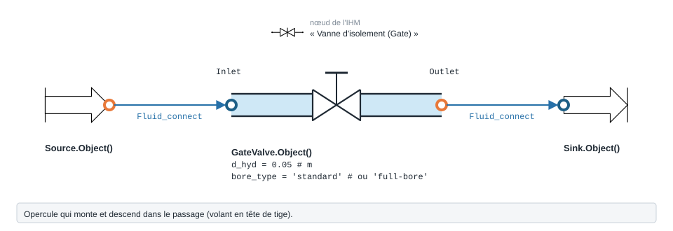

.. _gate_valve:

Vanne d'isolement
=================

   Forme, ports et raccordement de ``GateValve`` ; paramètres sous leur
   nom de code, avec leur valeur par défaut.

À quoi ça sert
--------------

Chiffrer la perte de charge d'une vanne d'isolement à opercule (*gate valve*),
celle qu'on laisse grande ouverte en service et qu'on ferme pour isoler un tronçon.
Grande ouverte, elle perd peu ; c'est ce que ce modèle sert à quantifier dans un
bilan de réseau. Ce n'est **pas** un organe de réglage : pour régler un débit,
voir :doc:`vanne_generique` ou :doc:`TA_valve`. Dans ``PyqtSimulator``, c'est le
nœud **« Vanne d'isolement (Gate) »**.

Exemple minimal
---------------

.. code-block:: python

   from ThermodynamicCycles.Source import Source
   from ThermodynamicCycles.Hydraulic import GateValve
   from ThermodynamicCycles.Connect import Fluid_connect

   # Amont : eau à 15 °C, 3 bar, 2 kg/s
   SOURCE = Source.Object()
   SOURCE.fluid = "water"
   SOURCE.Pi_bar = 3.0        # bar
   SOURCE.Ti_degC = 15        # °C
   SOURCE.F = 2.0             # kg/s
   SOURCE.calculate()

   # Vanne d'isolement DN50 (2 pouces), passage standard, grande ouverte
   VANNE = GateValve.Object()
   Fluid_connect(VANNE.Inlet, SOURCE.Outlet)
   VANNE.d_hyd = 0.05          # m — diamètre intérieur
   VANNE.D_in_pouces = 2.0     # pouces — diamètre nominal
   VANNE.bore_type = "standard"
   VANNE.calculate()

   print(VANNE.df.drop("Timestamp"))

Sortie réelle :

.. code-block:: text

                 GateValve
   fluid             water
   Bore type      standard
   Ouverture (%)     100.0
   V (m/s)           1.019
   Re              44775.0
   ζ (-)             0.525
   ΔP (Pa)           272.6
   P_in (Pa)      300000.0
   P_out (Pa)     299727.0
   F_kgs               2.0

Lecture : à 1 m/s dans un DN50, la vanne coûte 272,6 Pa. Le modèle applique la
forme **2K de Hooper** : :math:`\zeta = K_1/Re + K_\infty \,(1 + 1/D_{in})`,
avec ``D_in_pouces`` le diamètre nominal **en pouces** — mais ses coefficients
par défaut n'ont **pas de source retrouvée** (voir « Limites connues »).

Ce qu'on personnalise
---------------------

.. list-table::
   :header-rows: 1
   :widths: 22 44 18 16

   * - Paramètre
     - Effet
     - Valeurs
     - Source
   * - ``bore_type``
     - passage standard ou intégral ; le passage intégral perd moins
     - ``'standard'``, ``'full-bore'``
     - Hooper 2K
   * - ``source``
     - origine des coefficients : ``'legacy'`` (défaut, Hooper 2K du code) ou
       ``'crane'`` (K = n·f_T, table Crane)
     - ``'legacy'``, ``'crane'``
     - Crane TP-410, éd. 2009, p. A-28 (K = 8 f_T)
   * - ``D_in_pouces``
     - diamètre nominal en **pouces** ; entre dans le terme :math:`1 + 1/D_{in}`
     - 0,5 à 24
     - —
   * - ``d_hyd`` (m)
     - diamètre intérieur ; fixe la vitesse et le Reynolds
     - DN de la vanne
     - —
   * - ``ouverture``
     - **fraction** de 0 à 1 ; ``set_opening(50)`` prend des pourcents
     - 0 à 1
     - **aucune** (voir ci-dessous)

Variante exécutée : type de passage, source des coefficients, ouverture.

.. code-block:: python

   from ThermodynamicCycles.Source import Source
   from ThermodynamicCycles.Hydraulic import GateValve
   from ThermodynamicCycles.Connect import Fluid_connect

   # variante : type de passage, source des coefficients, ouverture
   print("bore_type   source   ouverture     zeta    dP (Pa)")
   for bore, source, ouverture in (("standard", "legacy", 1.0), ("full-bore", "legacy", 1.0),
                                   ("standard", "crane", 1.0), ("standard", "legacy", 0.5)):
       SOURCE = Source.Object()
       SOURCE.fluid = "water"; SOURCE.Pi_bar = 3.0; SOURCE.Ti_degC = 15; SOURCE.F = 2.0
       SOURCE.calculate()
       VANNE = GateValve.Object()
       Fluid_connect(VANNE.Inlet, SOURCE.Outlet)
       VANNE.bore_type = bore
       VANNE.source = source
       VANNE.ouverture = ouverture
       VANNE.calculate()
       print(f"{bore:10s}  {source:6s}   {ouverture*100:5.0f} %   {VANNE.zeta:7.4f}   {VANNE.delta_P:8.1f}")

Sortie réelle :

.. code-block:: text

   bore_type   source   ouverture     zeta    dP (Pa)
   standard    legacy     100 %    0.5250      272.6
   full-bore   legacy     100 %    0.3000      155.8
   standard    crane      100 %    0.1520       78.9
   standard    legacy      50 %    2.8109     1459.4

Ce que ça dit :

* le passage intégral perd **43 %** de moins que le passage standard (155,8 Pa
  contre 272,6 Pa) ;
* **les deux sources ne sont pas d'accord** : pour la même vanne, les
  coefficients par défaut du code donnent ζ = 0,525, la table Crane ζ = 0,152 —
  **3,45 fois moins**. Seule la valeur Crane est sourcée (p. A-28 : K = 8 f_T,
  f_T = 0,019 en 2") ; préférez ``source = 'crane'`` quand vous chiffrez une
  perte réelle ;
* à mi-ouverture, la perte est multipliée par 5,4.

Éprouver le modèle
------------------

.. code-block:: python

   from ThermodynamicCycles.Source import Source
   from ThermodynamicCycles.Hydraulic import GateValve
   from ThermodynamicCycles.Connect import Fluid_connect

   def vanne(**reglages):
       SOURCE = Source.Object()
       SOURCE.fluid = "water"; SOURCE.Pi_bar = 3.0; SOURCE.Ti_degC = 15; SOURCE.F = 2.0
       SOURCE.calculate()
       V = GateValve.Object()
       Fluid_connect(V.Inlet, SOURCE.Outlet)
       for cle, valeur in reglages.items():
           setattr(V, cle, valeur)
       return V

   # 1) Une source de coefficients inconnue est refusée
   V = vanne(source="autre")
   try:
       V.calculate()
   except ValueError as e:
       print("refusé :", e)

   # 2) Un type de passage inconnu est refusé (il retombait sur 'standard' avant le 28/09/2026)
   V = vanne(bore_type="inconnu")
   try:
       V.calculate()
   except ValueError as e:
       print("refusé :", e)

   # 3) « Fermée » n'est pas étanche : à ouverture 0, les coefficients sont multipliés par 100
   V = vanne(ouverture=0.0); V.calculate()
   print("ouverture 0 -> zeta =", round(V.zeta, 2), "; dP =", round(V.delta_P), "Pa")

   # 4) Crane ne publie que la vanne grande ouverte : une ouverture partielle est refusée
   V = vanne(source="crane", ouverture=0.5)
   try:
       V.calculate()
   except ValueError as e:
       print("refusé :", str(e).split(" ; ")[0])

Sortie réelle :

.. code-block:: text

   refusé : source 'autre' inconnue ; attendu 'legacy' ou 'crane'
   refusé : GateValve : bore_type 'inconnu' inconnu ; attendu l'un de ['full-bore', 'standard']
   ouverture 0 -> zeta = 52.5 ; dP = 27258 Pa
   refusé : GateValve source='crane' : Crane TP-410 p. A-28 ne publie K que pour la vanne grande ouverte (beta = 1, theta = 0)

* une ``source`` inconnue est refusée, par ``ValueError`` ;
* un ``bore_type`` inconnu est refusé de même, en nommant les deux valeurs
  admises. Jusqu'à la version de la bibliothèque du 28/09/2026, il retombait en
  silence sur ``'standard'`` ;
* avec ``source = 'crane'``, une ouverture partielle est refusée : Crane ne publie
  que la vanne grande ouverte, et le code n'applique plus en silence la valeur
  grande ouverte ;
* ``ouverture = 0`` ne ferme pas la vanne : les coefficients sont multipliés par
  100 et le débit continue de passer. Pour isoler un tronçon dans un calcul,
  retirez-le du réseau.

Limites connues
---------------

* **La loi d'ouverture n'a pas de source.** Les coefficients sont divisés par
  :math:`\text{ouverture}^{2,5} + 0{,}01`, loi que le code commente comme
  « typique pour vannes papillon ». Une vanne à opercule ne se règle pas ainsi :
  ne tirez pas de conclusion d'une ouverture partielle.
* **Écart de facteur 3,45** entre les coefficients par défaut et Crane TP-410,
  mesuré ci-dessus. Les coefficients par défaut (K1 = 0,7, K∞ = 0,35 ; 0,5 et
  0,2 en passage intégral) étaient attribués à « Hooper 1988, CRANE TP410 » :
  aucune des deux sources ne les contient, et le code le dit désormais. Le
  défaut reste ``'legacy'`` pour ne pas déplacer les résultats existants ; le
  basculer vers ``'crane'`` est une décision laissée aux mainteneurs.

Toutes les entrées
------------------

.. list-table::
   :header-rows: 1
   :widths: 26 26 48

   * - Entrée
     - Défaut
     - Commentaire du code
   * - ``d_hyd``
     - ``0.05``
     - Diamètre hydraulique (m)
   * - ``D_in_pouces``
     - ``2.0``
     - Diamètre nominal (pouces)
   * - ``bore_type``
     - ``'standard'``
     - 'standard' ou 'full-bore'
   * - ``source``
     - ``'legacy'``
     - —
   * - ``coeff_base``
     - ``(table interne)``
     - —
   * - ``K1``
     - ``None``
     - Coefficient laminaire
   * - ``K_inf``
     - ``None``
     - Coefficient turbulent

Lignes du ``df`` de sortie : ``fluid``, ``Bore type``, ``Ouverture (%)``, ``V (m/s)``, ``Re``, ``ζ (-)``, ``ΔP (Pa)``, ``P_in (Pa)``, ``P_out (Pa)``.

Pour aller plus loin
--------------------

* :doc:`index` — tous les modèles hydrauliques.
* :doc:`methodes_2k_3k` — la méthode 2K appliquée à un raccord quelconque.
* :doc:`propagation_pression` — comment la perte se reporte dans le réseau.
* Source vérifiée : Crane TP-410, *Flow of Fluids Through Valves, Fittings and
  Pipe*, éd. 2009, p. A-28 (vanne à opercule : K = 8 f_T) et p. A-27 (f_T).
