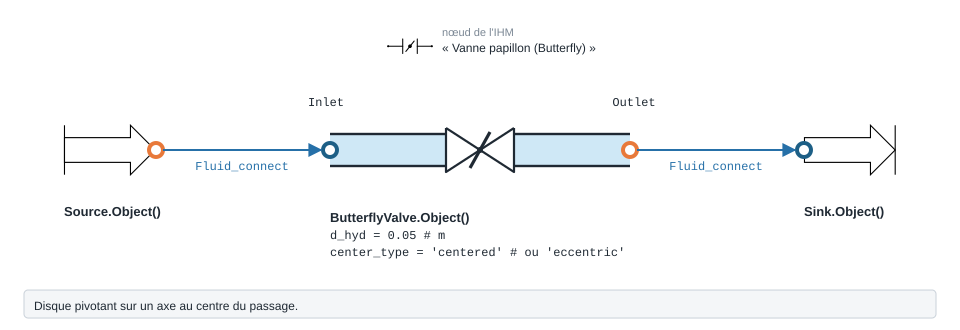
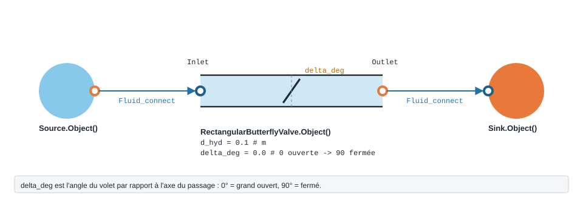

.. _butterfly_valve:

Vanne papillon
==============

Vanne papillon, en section circulaire ou rectangulaire.

.. note::
   Fiche relevée dans le code de la bibliothèque (entrées, valeurs par défaut et
   unités telles qu'écrites dans ``__init__``). L'exemple exécuté, avec sa
   sortie réelle et sa variante, reste à écrire pour ce modèle.

   Forme, ports et raccordement de ``ButterflyValve`` ; paramètres sous leur
   nom de code, avec leur valeur par défaut.

``ButterflyValve`` — Vanne papillon (butterfly valve).

.. code-block:: python

   from ThermodynamicCycles.Hydraulic import ButterflyValve
   modele = ButterflyValve.Object()

* **Ports** : ``Inlet``, ``Outlet`` (voir :doc:`../ports_connexions`).
* **Nœud de l'IHM** : « Vanne papillon (Butterfly) ».
* **Exceptions levées par le code** : ``ValueError``.

.. list-table::
   :header-rows: 1
   :widths: 26 26 48

   * - Entrée
     - Défaut
     - Commentaire du code
   * - ``d_hyd``
     - ``0.05``
     - Diamètre hydraulique (m)
   * - ``D_in_pouces``
     - ``2.0``
     - Diamètre nominal (pouces)
   * - ``center_type``
     - ``'centered'``
     - 'centered' ou 'eccentric'
   * - ``source``
     - ``'legacy'``
     - —
   * - ``crane_disc_type``
     - ``None``
     - —
   * - ``coeff_base``
     - ``(table interne)``
     - —
   * - ``K1``
     - ``None``
     - Coefficient laminaire
   * - ``K_inf``
     - ``None``
     - Coefficient turbulent

Lignes du ``df`` de sortie : ``fluid``, ``Center type``, ``Ouverture (%)``, ``Angle (°)``, ``V (m/s)``, ``Re``, ``ζ (-)``, ``ΔP (Pa)``, ``P_in (Pa)``, ``P_out (Pa)``.

   Forme, ports et raccordement de ``RectangularButterflyValve`` ; paramètres sous leur
   nom de code, avec leur valeur par défaut.

``RectangularButterflyValve`` — vanne papillon rectangulaire (Idelchik 9.18).

.. code-block:: python

   from ThermodynamicCycles.Hydraulic import RectangularButterflyValve
   modele = RectangularButterflyValve.Object()

* **Ports** : ``Inlet``, ``Outlet`` (voir :doc:`../ports_connexions`).
* **Nœud de l'IHM** : « Papillon rectangulaire ».
* **Exceptions levées par le code** : ``ValueError``.

.. list-table::
   :header-rows: 1
   :widths: 26 26 48

   * - Entrée
     - Défaut
     - Commentaire du code
   * - ``d_hyd``
     - ``0.1``
     - m
   * - ``delta_deg``
     - ``0.0``
     - deg, 0 ouverte -> 90 fermee

Lignes du ``df`` de sortie : ``fluid``, ``F_kgs``, ``d_hyd_mm``, ``delta_deg``, ``V_ms``, ``Re``, ``ksi_loc_lam``, ``ksi_loc_quad``, ``ksi_loc``, ``dP_Pa``.

Voir :doc:`index` pour la liste de tous les modèles hydrauliques.
