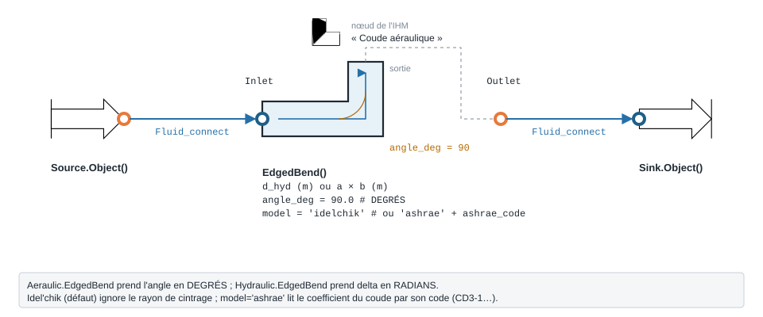

.. _edged_bend_air:

Coude aéraulique — EdgedBend
============================

   Forme, ports et raccordement ; paramètres sous leur nom de code, avec leur valeur par défaut.

À quoi ça sert
--------------

Chiffrer la perte de charge singulière d'un **coude de gaine** : on donne la
section, l'angle de déviation et le débit d'air ; le modèle rend
:math:`\Delta P = \xi \cdot \rho u^2 / 2`. Deux sources pour le coefficient ``xi`` :

- ``model = 'idelchik'`` (**défaut**) : une seule corrélation d'Idel'chik,
  :math:`\xi = 0{,}95 \sin^2(\theta/2) + 2{,}05 \sin^4(\theta/2)`. Elle ne
  connaît **que l'angle** : ni rayon de cintrage, ni gorges, ni forme de section.
- ``model = 'ashrae'`` : le coefficient est lu dans le catalogue de singularités
  ASHRAE (Handbook-Fundamentals 2001, ch. 34), par le **code de construction** du
  coude (``'CD3-1'`` embouti, ``'CD3-9'`` à gorges, ``'CR3-1'`` rectangulaire…).

L'écart entre les deux est de premier ordre (facteur 9 sur l'exemple ci-dessous) :
pour un coude réel de catalogue, préférez ``'ashrae'``.

.. warning::

   Ce coude prend l'angle en **degrés** (``angle_deg``). Son homologue
   hydraulique ``Hydraulic.EdgedBend`` le prend en **radians** (``delta``).
   Confondre les deux ne lève aucune erreur.

Exemple minimal
---------------

Coude à 90° sur une gaine Ø 250 mm, 1000 m³/h d'air à 20 °C. Le composant amont
est une ``Source`` d'air (ports fluide ``FluidPort``, voir :doc:`../ports_connexions`).

.. code-block:: python

    from ThermodynamicCycles.Aeraulic import EdgedBend
    from ThermodynamicCycles.Source import Source
    from ThermodynamicCycles.Sink import Sink
    from ThermodynamicCycles.Connect import Fluid_connect

    SOURCE = Source.Object()
    SOURCE.fluid = "air"
    SOURCE.Ti_degC = 20           # °C
    SOURCE.Pi_bar = 1.01325       # bar
    SOURCE.F_m3h = 1000           # débit volumique [m³/h]
    SOURCE.calculate()

    COUDE = EdgedBend()           # le paquet Aeraulic exporte la classe elle-même
    COUDE.d_hyd = 0.250           # diamètre de la gaine [m]
    COUDE.angle_deg = 90          # angle de déviation [degrés]

    Fluid_connect(COUDE.Inlet, SOURCE.Outlet)
    COUDE.calculate()
    SINK = Sink.Object()
    Fluid_connect(SINK.Inlet, COUDE.Outlet)
    SINK.calculate()

    print("xi =", round(COUDE.xi(), 4))
    print(COUDE.df)

Sortie réelle :

.. code-block:: text

   xi = 0.9875
                                  EdgedBend
   Timestamp     2026-09-28 12:43:06.665712
   section (m2)                    0.049087
   rho (kg/m3)                     1.204575
   Qv (m3/s)                       0.277778
   u (m/s)                         5.658842
   delta_P (Pa)                   19.045669
   P_in_Pa                         101325.0
   P_out_Pa                   101305.954331

Ce qu'on personnalise
---------------------

.. list-table::
   :header-rows: 1

   * - Paramètre
     - Effet
     - Valeur / plage
   * - ``d_hyd`` (ou ``a``, ``b``)
     - Section : fixe la vitesse ``u``, donc ``delta_P`` en :math:`u^2`
     - m ; ``a × b`` pour une gaine rectangulaire
   * - ``angle_deg``
     - Angle de déviation, seule entrée du modèle Idel'chik
     - degrés, défaut ``90.0``
   * - ``model``
     - Source du coefficient
     - ``'idelchik'`` (défaut) ou ``'ashrae'``
   * - ``ashrae_code``
     - Type de coude du catalogue ASHRAE (mode ``'ashrae'`` seulement)
     - ``'CD3-1'``, ``'CD3-9'``, ``'CD3-17'``, ``'CR3-1'``…

Variante : le même coude décrit comme un coude embouti ASHRAE ``CD3-1``.

.. code-block:: python

    from ThermodynamicCycles.Aeraulic import EdgedBend
    from ThermodynamicCycles.Source import Source
    from ThermodynamicCycles.Sink import Sink
    from ThermodynamicCycles.Connect import Fluid_connect

    SOURCE = Source.Object()
    SOURCE.fluid = "air"
    SOURCE.Ti_degC = 20           # °C
    SOURCE.Pi_bar = 1.01325       # bar
    SOURCE.F_m3h = 1000           # débit volumique [m³/h]
    SOURCE.calculate()

    COUDE = EdgedBend()           # le paquet Aeraulic exporte la classe elle-même
    COUDE.d_hyd = 0.250           # diamètre de la gaine [m]
    COUDE.angle_deg = 90
    # variante : coude embouti du catalogue ASHRAE (r/D = 1,5)
    COUDE.model = "ashrae"
    COUDE.ashrae_code = "CD3-1"

    Fluid_connect(COUDE.Inlet, SOURCE.Outlet)
    COUDE.calculate()
    SINK = Sink.Object()
    Fluid_connect(SINK.Inlet, COUDE.Outlet)
    SINK.calculate()

    print("xi =", round(COUDE.xi(), 4))
    print(COUDE.df.to_string())   # tableau complet, citation comprise

Sortie réelle :

.. code-block:: text

   xi = 0.11
                                                                          EdgedBend
   Timestamp                                             2026-09-28 12:43:17.238009
   section (m2)                                                            0.049087
   rho (kg/m3)                                                             1.204575
   Qv (m3/s)                                                               0.277778
   u (m/s)                                                                 5.658842
   delta_P (Pa)                                                            2.121543
   P_in_Pa                                                                 101325.0
   P_out_Pa                                                           101322.878457
   Co (-)                                                                      0.11
   ASHRAE fitting                                                             CD3-1
   citation        ASHRAE Handbook-Fundamentals (2001), ch.34, table CD3-1, p.34.29

À débit et section identiques, le coefficient tombe de 0,9875 (Idel'chik, angle
seul) à 0,11 (``CD3-1`` au diamètre de 250 mm) : la perte de charge passe de
19,05 Pa à 2,12 Pa.

Éprouver le modèle
------------------

Un ``model`` inconnu n'est pas remplacé en silence par le défaut : il est refusé.

.. code-block:: python

    from ThermodynamicCycles.Aeraulic import EdgedBend

    COUDE = EdgedBend()
    COUDE.d_hyd = 0.250
    COUDE.model = "ashrea"        # faute de frappe
    try:
        COUDE.xi()
    except ValueError as e:
        print("refusé :", e)

Sortie réelle :

.. code-block:: text

   refusé : model='ashrea' inconnu : attendu 'idelchik' (defaut) ou 'ashrae'. Pas de repli silencieux sur le defaut -- une faute de frappe rendrait un resultat plausible et non demande.

Pour aller plus loin
--------------------

- :doc:`perte_pression_lineaire` — la gaine droite, même raccordement.
- Sources : Idel'chik, *Handbook of Hydraulic Resistance*, 4e éd. (2008) ;
  ASHRAE Handbook-Fundamentals 2001 (SI), ch. 34.
