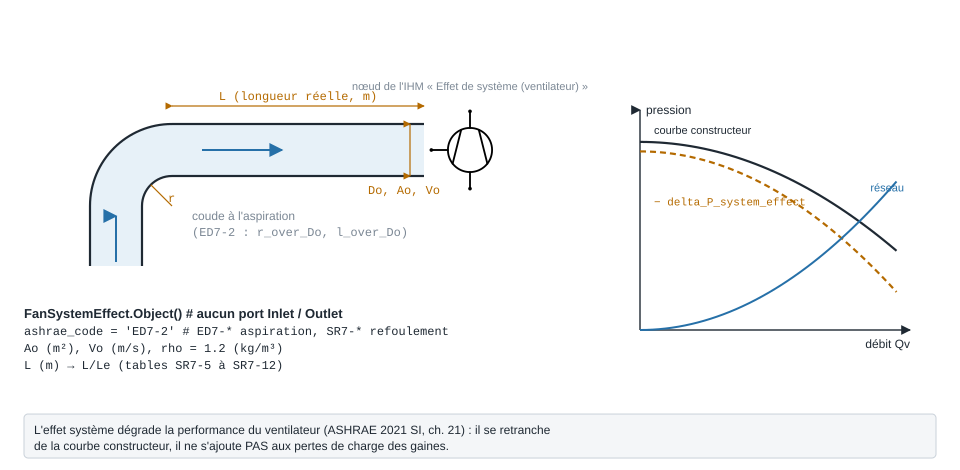

.. _fan_system_effect:

Effet système ventilateur
=========================

   Raccordement du ventilateur et paramètres sous leur nom de code ; à droite, le principe de lecture
   (schéma, pas de données).

À quoi ça sert
--------------

Un ventilateur est essayé en laboratoire avec des gaines droites et longues à
l'aspiration et au refoulement. Sur site, on le raccorde souvent par un coude
serré contre l'ouïe, ou on le fait déboucher directement dans un plénum : il ne
délivre plus sa courbe catalogue. ASHRAE appelle cette perte de performance
l'**effet système** et la chiffre comme une fraction de la pression dynamique au
ventilateur :

.. math::

   \Delta P_{se} = C_o \cdot \frac{\rho V_o^2}{2}

Le coefficient :math:`C_o` est lu dans les tables ASHRAE (Handbook Fundamentals
2001 SI, ch. 34) : ``ED7-*`` pour l'**aspiration** du ventilateur, ``SR7-*`` pour
son **refoulement**. Pour les coudes au refoulement (``SR7-5`` à ``SR7-12``), la
table est indexée par :math:`L/L_e`, où :math:`L_e` est la longueur effective,
celle qu'il faut pour que le profil de vitesse se rétablisse (ASHRAE 2021 SI,
ch. 21, éq. 35 et 36) :

.. math::

   L_e = \frac{V_o \sqrt{A_o}}{4500} \;\;(V_o > 13\ \mathrm{m/s}), \qquad
   L_e = \frac{\sqrt{A_o}}{350} \;\;(V_o \le 13\ \mathrm{m/s})

avec :math:`A_o` en **mm²** dans ces équations. Le modèle reçoit ``Ao`` en m² et
fait la conversion lui-même.

.. important::

   **L'effet système ne s'ajoute pas aux pertes de charge des gaines.** Il se
   retranche de la courbe du ventilateur (ASHRAE 2021 SI, ch. 21, p. 21.12). Pour
   l'empêcher d'être additionné par erreur, la classe n'a **ni** ``Inlet`` **ni**
   ``Outlet`` **ni** ``delta_P`` : sa sortie s'appelle ``delta_P_system_effect``.
   Pour la même raison, elle n'hérite pas de la base interne des pertes
   singulières (``ThermodynamicCycles.Aeraulic._singular_base``, dont dérivent
   ``Filter``, ``IrisDamper``… et qui n'a pas de page propre) et le paquet
   ``Aeraulic`` ne l'exporte pas dans son ``__all__``.

Exemple minimal
---------------

L'exemple 8 d'ASHRAE (2001, ch. 34) : un ventilateur centrifuge aspire par un coude
à 4 segments de rayon relatif :math:`r/D_o = 1{,}5`, placé à 900 mm de l'ouïe, sur
un conduit de 450 mm ; la vitesse au ventilateur est de 10 m/s.

.. code-block:: python

    import math
    from ThermodynamicCycles.Aeraulic import FanSystemEffect

    EFFET = FanSystemEffect.Object()
    EFFET.ashrae_code = "ED7-2"          # coude à l'aspiration (fan inlet, 4 gore elbow)
    EFFET.r_over_Do = 1.5                # rayon du coude / diamètre
    EFFET.l_over_Do = 0.900 / 0.450      # distance coude-ouïe / diamètre
    EFFET.Ao = math.pi * 0.450**2 / 4    # section au ventilateur [m²]
    EFFET.Vo = 10.0                      # vitesse au ventilateur [m/s]
    EFFET.calculate()

    print("Code     :", EFFET.ashrae_code)
    print("Co       :", EFFET.C_o)
    print(f"pv       : {EFFET.p_v:.1f} Pa")
    print(f"Effet système : {EFFET.delta_P_system_effect:.1f} Pa")
    print("Source   :", EFFET.citation)

Sortie réelle :

.. code-block:: text

   Code     : ED7-2
   Co       : 0.6
   pv       : 60.0 Pa
   Effet système : 36.0 Pa
   Source   : ASHRAE Handbook-Fundamentals (2001), ch.34, table ED7-2, p.34.48

Le livre lit :math:`C_o = 0{,}60` : le ventilateur perd 36 Pa par rapport à sa
courbe catalogue. On sélectionne donc le ventilateur pour la perte du réseau
**plus** 36 Pa — c'est le seul usage où ASHRAE additionne les deux, pour choisir la
machine, jamais pour chiffrer le réseau.

Ce qu'on personnalise
---------------------

.. list-table::
   :header-rows: 1
   :widths: 22 48 30

   * - Paramètre
     - Effet
     - Valeur / plage
   * - ``ashrae_code``
     - Le raccordement : ``ED7-1`` (ventilateur en plénum), ``ED7-2`` (coude à
       l'aspiration), ``SR7-1`` (refoulement libre), ``SR7-2`` (diffuseur plan),
       ``SR7-5`` à ``SR7-12`` (coude au refoulement, positions A à D),
       ``SR7-17`` (diffuseur pyramidal) ; la liste exacte :
       ``FanSystemEffect.calculable_codes()``
     - requis, sinon ``ValueError``
   * - ``Ao``
     - Section au ventilateur (ouïe ou bouche de refoulement)
     - m²
   * - ``Vo``
     - Vitesse au ventilateur ; fixe la pression dynamique et le choix entre les
       éq. 35 et 36
     - m/s, requis
   * - ``rho``
     - Masse volumique de l'air
     - kg/m³, défaut ``1.2``
   * - ``r_over_Do``, ``l_over_Do``
     - Axes des tables ``ED7-*``
     - selon la table
   * - ``L`` (ou ``l_over_Le``)
     - Longueur réelle du raccordement au refoulement ; le modèle calcule
       :math:`L_e` puis :math:`L/L_e`
     - m
   * - ``ab_over_Ao``
     - Rapport section de sortie aubage / section de refoulement (``SR7-1``,
       ``SR7-5`` à ``SR7-12``)
     - 0,4 à 1,0
   * - ``theta_deg``, ``area_ratio``
     - Angle et rapport de sections du diffuseur plan (``SR7-2``)
     - degrés, :math:`A_1/A_o`
   * - ``theta_deg``, ``ao_over_A1``
     - Angle et rapport de sections du diffuseur pyramidal (``SR7-17``) ; le
       rapport y est **inverse** de celui de ``SR7-2``, d'où un attribut distinct
     - degrés, :math:`A_o/A_1` de 1,5 à 4

Variante : éloigner le coude du refoulement
-------------------------------------------

Un ventilateur de 0,25 m² de bouche (:math:`A_b/A_o = 0{,}7`) souffle à 10 m/s dans
un coude en position B (``SR7-6``). On fait varier la longueur de conduit droit
entre la bouche et le coude.

.. code-block:: python

    # variante : même ventilateur, coude au refoulement de plus en plus loin
    for L in (0.0, 0.5, 1.0, 1.5):
        SORTIE = FanSystemEffect.Object()
        SORTIE.ashrae_code = "SR7-6"
        SORTIE.Ao = 0.25          # m²
        SORTIE.Vo = 10.0          # m/s
        SORTIE.ab_over_Ao = 0.7
        SORTIE.L = L              # m, conduit droit avant le coude
        SORTIE.calculate()
        print(f"L = {L:.1f} m  Le = {SORTIE.Le:.3f} m  L/Le = {SORTIE.l_over_Le:.2f}  "
              f"Co = {SORTIE.C_o:.2f}  effet = {SORTIE.delta_P_system_effect:.1f} Pa")

Sortie réelle :

.. code-block:: text

   L = 0.0 m  Le = 1.429 m  L/Le = 0.00  Co = 1.40  effet = 84.0 Pa
   L = 0.5 m  Le = 1.429 m  L/Le = 0.35  Co = 0.53  effet = 32.0 Pa
   L = 1.0 m  Le = 1.429 m  L/Le = 0.70  Co = 0.20  effet = 11.9 Pa
   L = 1.5 m  Le = 1.429 m  L/Le = 1.05  Co = 0.00  effet = 0.0 Pa

À 10 m/s, :math:`L_e = \sqrt{250\,000}/350 = 1{,}43` m. Un coude collé à la bouche
coûte 84 Pa, soit 1,4 fois la pression dynamique ; 50 cm de conduit droit en
retirent 60 % ; au-delà de :math:`L_e`, l'effet est **nul**. Zéro est la sortie
normale du modèle, pas un défaut.

Éprouver le modèle
------------------

Le modèle ne devine pas un axe de table manquant, ne lit pas un rapport de
sections à l'envers, et refuse une table dont l'extraction n'est pas fiable :

.. code-block:: python

    for code, axes in (("ED7-2", {"r_over_Do": 1.5}),
                       ("ER7-1", {}),
                       ("SR7-17", {"theta_deg": 20, "area_ratio": 2.0})):
        E = FanSystemEffect.Object()
        E.ashrae_code, E.Ao, E.Vo = code, 0.25, 10.0
        for nom, valeur in axes.items():
            setattr(E, nom, valeur)
        try:
            E.calculate()
        except ValueError as e:
            print(code, "refusé :", e)

Sortie réelle :

.. code-block:: text

   ED7-2 refusé : le fitting 'ED7-2' est tabule en 'L_over_Do' : renseigner `l_over_Do`.
   ER7-1 refusé : le fitting 'ER7-1' n'est pas calculable : extraction NON FIABLE (bloc NON PARSE par l'extracteur (form='unparsed').). Codes calculables : ED7-1, ED7-2, SR7-1, SR7-2, SR7-5, SR7-6, SR7-7, SR7-8, SR7-9, SR7-10, SR7-11, SR7-12, SR7-17.
   SR7-17 refusé : le fitting 'SR7-17' est tabule en 'Ao_over_A1' : renseigner `ao_over_A1`.

``SR7-17`` se calcule depuis le 28/09/2026, avec son propre attribut
``ao_over_A1`` (il était refusé faute d'attribut pour cet axe) :

.. code-block:: python

    E = FanSystemEffect.Object()
    E.ashrae_code, E.Ao, E.Vo = "SR7-17", 0.25, 10.0
    E.theta_deg, E.ao_over_A1 = 20, 2.0
    E.calculate()
    print(f"SR7-17 : Co = {E.C_o:.2f}, effet système = {E.delta_P_system_effect:.1f} Pa")

Sortie réelle :

.. code-block:: text

   SR7-17 : Co = 0.43, effet système = 25.8 Pa

La table (2001 SI, ch. 34, p. 34.68) donne bien 0,43 à 20° et
:math:`A_o/A_1 = 2`, sans interpolation.

Pièges
------

- **Ne pas l'ajouter au réseau.** ``delta_P_system_effect`` n'est pas une perte de
  charge de gaine ; l'additionner au ``delta_P`` des tronçons compte deux fois la
  même chose.
- **Un coefficient approché.** ASHRAE le dit : ces coefficients sont « only an
  approximation », propres à un type de ventilateur, et l'effet système « cannot
  be measured directly ». Le modèle lit fidèlement la table ; il ne valide pas la
  physique.
- ``ER7-1`` **n'est pas calculable** : sa table n'a pas été extraite de façon
  fiable du Handbook ; le calcul est refusé (``UnreliableFittingError``) et,
  depuis le 28/09/2026, le code ne figure plus dans la liste déroulante du nœud
  de l'IHM, qui ne propose que ``FanSystemEffect.calculable_codes()``.
- ``SR7-17`` est tabulé en :math:`A_o/A_1`, l'inverse du rapport de ``SR7-2``
  (:math:`A_1/A_o`) : renseignez ``ao_over_A1``, pas ``area_ratio``.
- **Aspiration ou refoulement.** ``ED7`` = aspiration (« fan inlet »), ``SR7`` =
  refoulement (« fan outlet »). La docstring du nœud ``PyqtSimulator`` le dit
  désormais aussi (elle écrivait l'inverse jusqu'au 28/09/2026).

Dans PyqtSimulator
------------------

Le nœud **« Effet de système (ventilateur) »** (icône ventilateur) est
**autonome** : il n'a aucun port fluide, on ne le relie à rien. On y choisit le
code ASHRAE, on saisit ``Ao``, ``Vo``, ``rho``, ``L`` et les axes utiles (0 = sans
objet ; ``SR7-17`` a son champ « Ao/A1 ») ; il affiche :math:`L_e`, :math:`L/L_e`, :math:`C_o`, la pression dynamique
et l'effet système « à retrancher au ventilateur ».

Pour aller plus loin
--------------------

- :doc:`coude_aeraulique`, :doc:`te_aeraulique`, :doc:`filtre` — les pertes de
  charge du réseau, elles, s'additionnent.
- :doc:`perte_pression_lineaire` — la gaine droite.
