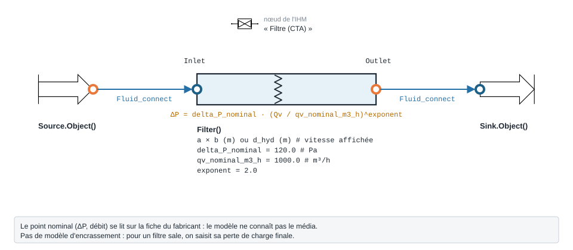

.. _filter_air:

Filtre de CTA — Filter
======================

   Forme, ports et raccordement ; paramètres sous leur nom de code, avec leur valeur par défaut.

À quoi ça sert
--------------

Chiffrer la perte de charge d'un **filtre de CTA** hors de son point nominal. On
saisit le point donné par le fabricant (perte de charge ``delta_P_nominal`` au débit
``qv_nominal_m3_h``) et le modèle l'extrapole au débit réel :

.. math::

   \Delta P = \Delta P_{nominal} \left(\frac{Q_v}{Q_{v,nominal}}\right)^{n}

avec ``exponent`` = 2 par défaut (loi quadratique). La perte de charge ne dépend
que du débit : la section (``a``, ``b`` ou ``d_hyd``) sert seulement à afficher la
vitesse frontale. Le modèle ne connaît ni le média ni la classe de filtration, et
**n'a pas de modèle d'encrassement** : pour chiffrer un filtre sale, on saisit sa
perte de charge finale. Aucune source n'est citée par le code pour l'exposant.

Exemple minimal
---------------

Filtre donné pour 150 Pa à 5000 m³/h, traversé par 4000 m³/h d'air à 20 °C. Le
composant amont est une ``Source`` d'air (ports fluide ``FluidPort``, voir
:doc:`../ports_connexions`).

.. code-block:: python

    from ThermodynamicCycles.Aeraulic import Filter
    from ThermodynamicCycles.Source import Source
    from ThermodynamicCycles.Sink import Sink
    from ThermodynamicCycles.Connect import Fluid_connect

    SOURCE = Source.Object()
    SOURCE.fluid = "air"
    SOURCE.Ti_degC = 20           # °C
    SOURCE.Pi_bar = 1.01325       # bar
    SOURCE.F_m3h = 4000           # débit réel de la CTA [m³/h]
    SOURCE.calculate()

    FILTRE = Filter()             # le paquet Aeraulic exporte la classe elle-même
    FILTRE.a, FILTRE.b = 0.600, 0.600   # section frontale [m]
    FILTRE.delta_P_nominal = 150        # perte de charge du fabricant [Pa]...
    FILTRE.qv_nominal_m3_h = 5000       # ... à ce débit nominal [m³/h]
    FILTRE.exponent = 2.0               # loi quadratique

    Fluid_connect(FILTRE.Inlet, SOURCE.Outlet)
    FILTRE.calculate()
    SINK = Sink.Object()
    Fluid_connect(SINK.Inlet, FILTRE.Outlet)
    SINK.calculate()

    print(FILTRE.df)

Sortie réelle :

.. code-block:: text

                                     Filter
   Timestamp     2026-09-28 13:12:09.824332
   section (m2)                        0.36
   rho (kg/m3)                     1.204575
   Qv (m3/s)                       1.111111
   u (m/s)                          3.08642
   delta_P (Pa)                        96.0
   P_in_Pa                         101325.0
   P_out_Pa                        101229.0

À 80 % du débit nominal, la loi quadratique donne 150 × 0,8² = 96 Pa.

Ce qu'on personnalise
---------------------

.. list-table::
   :header-rows: 1

   * - Paramètre
     - Effet
     - Valeur / plage
   * - ``delta_P_nominal``
     - Perte de charge du fabricant au point nominal ; propre, ou finale
       (encrassé) selon ce qu'on veut chiffrer
     - Pa, défaut ``120.0``
   * - ``qv_nominal_m3_h``
     - Débit du point nominal
     - m³/h, défaut ``1000.0`` ; strictement > 0
   * - ``exponent``
     - Forme de la loi : 2 = quadratique (turbulent), plus bas si le fabricant
       l'indique
     - défaut ``2.0``
   * - ``a``, ``b`` ou ``d_hyd``
     - Section frontale : vitesse affichée seulement
     - m

Variante : le même filtre, encrassé, avec la perte de charge finale du fabricant
(300 Pa au débit nominal).

.. code-block:: python

    from ThermodynamicCycles.Aeraulic import Filter
    from ThermodynamicCycles.Source import Source
    from ThermodynamicCycles.Sink import Sink
    from ThermodynamicCycles.Connect import Fluid_connect

    SOURCE = Source.Object()
    SOURCE.fluid = "air"
    SOURCE.Ti_degC = 20           # °C
    SOURCE.Pi_bar = 1.01325       # bar
    SOURCE.F_m3h = 4000           # débit réel de la CTA [m³/h]
    SOURCE.calculate()

    FILTRE = Filter()             # le paquet Aeraulic exporte la classe elle-même
    FILTRE.a, FILTRE.b = 0.600, 0.600   # section frontale [m]
    # variante : filtre encrassé, perte de charge finale du fabricant
    FILTRE.delta_P_nominal = 300        # [Pa] à qv_nominal_m3_h
    FILTRE.qv_nominal_m3_h = 5000       # ... à ce débit nominal [m³/h]
    FILTRE.exponent = 2.0               # loi quadratique

    Fluid_connect(FILTRE.Inlet, SOURCE.Outlet)
    FILTRE.calculate()
    SINK = Sink.Object()
    Fluid_connect(SINK.Inlet, FILTRE.Outlet)
    SINK.calculate()

    print(FILTRE.df)

Sortie réelle :

.. code-block:: text

                                     Filter
   Timestamp     2026-09-28 13:12:22.621496
   section (m2)                        0.36
   rho (kg/m3)                     1.204575
   Qv (m3/s)                       1.111111
   u (m/s)                          3.08642
   delta_P (Pa)                       192.0
   P_in_Pa                         101325.0
   P_out_Pa                        101133.0

La perte de charge au débit réel suit exactement le point nominal saisi : 192 Pa
au lieu de 96 Pa. C'est l'écart à prévoir sur le ventilateur entre filtre propre et
filtre à remplacer.

Éprouver le modèle
------------------

Sans débit nominal, la loi n'a pas de sens : le modèle le refuse.

.. code-block:: python

    from ThermodynamicCycles.Aeraulic import Filter
    from ThermodynamicCycles.Source import Source
    from ThermodynamicCycles.Connect import Fluid_connect

    SOURCE = Source.Object()
    SOURCE.fluid = "air"; SOURCE.Ti_degC = 20; SOURCE.Pi_bar = 1.01325; SOURCE.F_m3h = 4000
    SOURCE.calculate()

    FILTRE = Filter()
    FILTRE.a, FILTRE.b = 0.600, 0.600
    FILTRE.qv_nominal_m3_h = 0    # débit nominal non renseigné
    Fluid_connect(FILTRE.Inlet, SOURCE.Outlet)
    try:
        FILTRE.calculate()
    except ValueError as e:
        print("refusé :", e)

Sortie réelle :

.. code-block:: text

   refusé : qv_nominal_m3_h doit etre > 0

Pour aller plus loin
--------------------

- :doc:`registre_lames`, :doc:`obstruction`, :doc:`perte_pression_lineaire` — les
  autres pertes de charge d'un réseau aéraulique.
