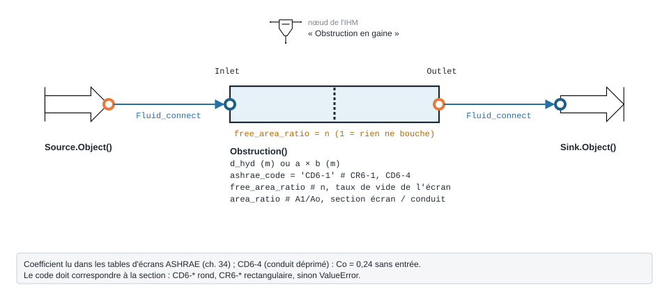

.. _obstruction_air:

Obstruction en gaine — Obstruction
==================================

   Forme, ports et raccordement ; paramètres sous leur nom de code, avec leur valeur par défaut.

À quoi ça sert
--------------

Chiffrer la perte de charge d'un **écran** posé en travers d'une gaine — grillage
anti-volatiles, grille de protection, tôle perforée — ou d'un **conduit déprimé**.
Le coefficient ``Co`` est lu dans les tables ASHRAE (Handbook-Fundamentals 2001,
ch. 34), puis :math:`\Delta P = C_o \cdot \rho u^2 / 2` sur la vitesse de la gaine.
Il n'y a pas de corrélation par défaut : ``ashrae_code`` est obligatoire.

.. list-table::
   :header-rows: 1

   * - ``ashrae_code``
     - Obstruction
     - Entrées de table
   * - ``'CD6-1'``
     - écran, conduit rond
     - ``free_area_ratio`` (n), ``area_ratio`` (A1/Ao)
   * - ``'CR6-1'``
     - écran, conduit rectangulaire
     - ``free_area_ratio`` (n), ``area_ratio`` (A1/Ao)
   * - ``'CD6-4'``
     - conduit déprimé
     - aucune (Co = 0,24)

``n`` est le **taux de vide** de l'écran : ``n = 1``, rien ne bouche et ``Co = 0``.
La ligne ``A1/Ao = 1`` de la table coïncide avec la formule d'Idel'chik
:math:`\zeta = 1{,}3\,(1-n) + ((1-n)/n)^2`, sauf aux très faibles taux de vide
(n ≤ 0,35), d'après la documentation du module.

.. note::

   Le module signale lui-même une **coquille** dans une cellule de la table
   ``CR6-1`` (``n = 0.65``, ``A1/Ao = 1.2`` : 0,36 imprimé, 0,52 attendu par
   cohérence avec ``CD6-1``). La valeur imprimée est conservée telle quelle, sans
   correction d'office : si vous tombez sur ce point, préférez la valeur de
   ``CD6-1``.

Exemple minimal
---------------

Grillage de taux de vide 70 % dans une gaine Ø 315 mm, 2000 m³/h d'air à 20 °C. Le
composant amont est une ``Source`` d'air (ports fluide ``FluidPort``, voir
:doc:`../ports_connexions`).

.. code-block:: python

    from ThermodynamicCycles.Aeraulic import Obstruction
    from ThermodynamicCycles.Source import Source
    from ThermodynamicCycles.Sink import Sink
    from ThermodynamicCycles.Connect import Fluid_connect

    SOURCE = Source.Object()
    SOURCE.fluid = "air"
    SOURCE.Ti_degC = 20           # °C
    SOURCE.Pi_bar = 1.01325       # bar
    SOURCE.F_m3h = 2000           # débit [m³/h]
    SOURCE.calculate()

    ECRAN = Obstruction()         # le paquet Aeraulic exporte la classe elle-même
    ECRAN.d_hyd = 0.315           # diamètre de la gaine [m]
    ECRAN.ashrae_code = "CD6-1"   # écran dans un conduit rond (table ASHRAE)
    ECRAN.free_area_ratio = 0.7   # n : taux de vide de l'écran (1 = rien ne bouche)
    ECRAN.area_ratio = 1.0        # A1/Ao : section de l'écran / section du conduit

    Fluid_connect(ECRAN.Inlet, SOURCE.Outlet)
    ECRAN.calculate()
    SINK = Sink.Object()
    Fluid_connect(SINK.Inlet, ECRAN.Outlet)
    SINK.calculate()

    print(ECRAN.df.to_string())   # tableau complet, citation comprise

Sortie réelle :

.. code-block:: text

                                                                            Obstruction
   Timestamp                                                 2026-09-28 13:06:28.347275
   section (m2)                                                                0.077931
   rho (kg/m3)                                                                 1.204575
   Qv (m3/s)                                                                   0.555556
   u (m/s)                                                                     7.128801
   delta_P (Pa)                                                               17.752721
   P_in_Pa                                                                     101325.0
   P_out_Pa                                                               101307.247279
   Co (-)                                                                          0.58
   taux de vide n (-)                                                               0.7
   ASHRAE fitting                                                                 CD6-1
   citation            ASHRAE Handbook-Fundamentals (2001), ch.34, table CD6-1, p.34.31

Ce qu'on personnalise
---------------------

.. list-table::
   :header-rows: 1

   * - Paramètre
     - Effet
     - Valeur / plage
   * - ``free_area_ratio``
     - Taux de vide ``n`` : plus il baisse, plus l'écran freine (effet très non
       linéaire)
     - entre 0 et 1, selon la table
   * - ``area_ratio``
     - Section de l'écran rapportée à celle du conduit (A1/Ao)
     - selon la table ; une valeur hors table est **bornée** et signalée
   * - ``ashrae_code``
     - Type d'obstruction (table ci-dessus)
     - obligatoire
   * - ``d_hyd`` ou ``a``, ``b``
     - Section : fixe la vitesse ``u`` ; doit correspondre au code
     - m

Variante : même gaine, grillage plus serré (taux de vide 50 %).

.. code-block:: python

    from ThermodynamicCycles.Aeraulic import Obstruction
    from ThermodynamicCycles.Source import Source
    from ThermodynamicCycles.Sink import Sink
    from ThermodynamicCycles.Connect import Fluid_connect

    SOURCE = Source.Object()
    SOURCE.fluid = "air"
    SOURCE.Ti_degC = 20           # °C
    SOURCE.Pi_bar = 1.01325       # bar
    SOURCE.F_m3h = 2000           # débit [m³/h]
    SOURCE.calculate()

    ECRAN = Obstruction()         # le paquet Aeraulic exporte la classe elle-même
    ECRAN.d_hyd = 0.315           # diamètre de la gaine [m]
    ECRAN.ashrae_code = "CD6-1"   # écran dans un conduit rond (table ASHRAE)
    # variante : grillage plus serré (taux de vide 50 %)
    ECRAN.free_area_ratio = 0.5   # n
    ECRAN.area_ratio = 1.0        # A1/Ao : section de l'écran / section du conduit

    Fluid_connect(ECRAN.Inlet, SOURCE.Outlet)
    ECRAN.calculate()
    SINK = Sink.Object()
    Fluid_connect(SINK.Inlet, ECRAN.Outlet)
    SINK.calculate()

    print(ECRAN.df.to_string())   # tableau complet, citation comprise

Sortie réelle :

.. code-block:: text

                                                                            Obstruction
   Timestamp                                                 2026-09-28 13:06:35.289966
   section (m2)                                                                0.077931
   rho (kg/m3)                                                                 1.204575
   Qv (m3/s)                                                                   0.555556
   u (m/s)                                                                     7.128801
   delta_P (Pa)                                                                50.50343
   P_in_Pa                                                                     101325.0
   P_out_Pa                                                                101274.49657
   Co (-)                                                                          1.65
   taux de vide n (-)                                                               0.5
   ASHRAE fitting                                                                 CD6-1
   citation            ASHRAE Handbook-Fundamentals (2001), ch.34, table CD6-1, p.34.31

Passer d'un taux de vide de 70 % à 50 % fait presque tripler le coefficient
(0,58 → 1,65) : 50,5 Pa au lieu de 17,8 Pa pour le même débit.

Éprouver le modèle
------------------

Une table d'écran rectangulaire (``CR6-1``) appliquée à une gaine ronde est
refusée : le code doit correspondre à la forme de la section.

.. code-block:: python

    from ThermodynamicCycles.Aeraulic import Obstruction

    ECRAN = Obstruction()
    ECRAN.d_hyd = 0.315           # conduit ROND
    ECRAN.ashrae_code = "CR6-1"   # table d'un conduit RECTANGULAIRE
    ECRAN.free_area_ratio = 0.7
    ECRAN.area_ratio = 1.0
    try:
        ECRAN.xi()
    except ValueError as e:
        print("refusé :", e)

Sortie réelle :

.. code-block:: text

   refusé : le code 'CR6-1' est une obstruction rectangular, mais la section resolue est circular.

Pour aller plus loin
--------------------

- :doc:`registre_lames`, :doc:`registre_iris`, :doc:`coude_aeraulique`,
  :doc:`te_aeraulique`, :doc:`perte_pression_lineaire`.
- Sources : ASHRAE Handbook-Fundamentals 2001 (SI), ch. 34, tables CD6 et CR6 ;
  Idel'chik, *Handbook of Hydraulic Resistance*, 4e éd. (2008).
