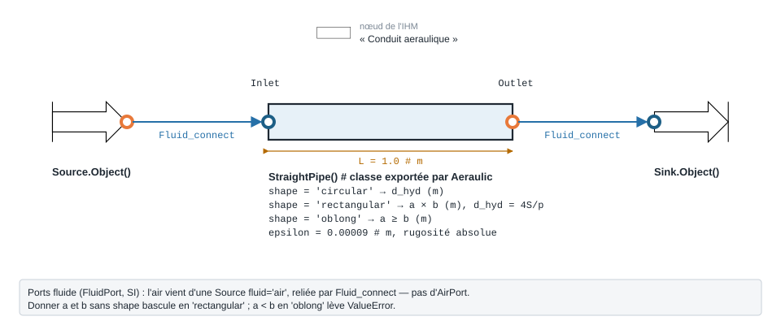

.. _straight_pipe_air:

Gaine d'air droite — StraightPipe
=================================

   Forme, ports et raccordement ; paramètres sous leur nom de code, avec leur valeur par défaut.

5.1.1. Exemple d'utilisation de "StraightPipe"
----------------------------------------------

.. code-block:: python

    from ThermodynamicCycles.Aeraulic import StraightPipe
    from ThermodynamicCycles.Source import Source
    from ThermodynamicCycles.Sink import Sink
    from ThermodynamicCycles.Connect import Fluid_connect

    SOURCE = Source.Object()
    STRAIGHT_PIPE = StraightPipe()   # le paquet Aeraulic exporte la classe elle-même
    SINK = Sink.Object()

    SOURCE.fluid = "air"
    SOURCE.Ti_degC = 15
    SOURCE.Pi_bar = 1
    SOURCE.F_m3h = 120            # débit volumique [m³/h]
    SOURCE.calculate()

    STRAIGHT_PIPE.d_hyd = 0.120   # diamètre hydraulique [m]
    STRAIGHT_PIPE.L = 1           # longueur [m]
    # STRAIGHT_PIPE.a = 0.3; STRAIGHT_PIPE.b = 0.2   # gaine rectangulaire a×b (alternative à d_hyd)
    # STRAIGHT_PIPE.epsilon = 0.0002                 # rugosité absolue [m]

    Fluid_connect(STRAIGHT_PIPE.Inlet, SOURCE.Outlet)
    STRAIGHT_PIPE.calculate()
    Fluid_connect(SINK.Inlet, STRAIGHT_PIPE.Outlet)
    SINK.calculate()

    print(STRAIGHT_PIPE.df)

5.1.2. Résultats
----------------

Sortie réelle (``STRAIGHT_PIPE.df``) :

.. code-block:: text

                                                  StraightPipe
    Timestamp                       2026-09-28 12:36:49.519575
    d_hyd (m)                                             0.12
    d_iso (m)                                             0.12
    d_equiv (m)                                           0.12
    viscosite dynamique (Pa.s)                        0.000018
    masse volumique (kg/m3)                           1.209506
    section (m2)                                       0.01131
    perimetre mouille (m)                             0.376991
    vitesse moyenne (m/s)                             2.947314
    Reynolds                                      23816.443735
    rugosite reduite                                   0.00075
    coefficient de perte de charge                    0.026193
    j lineaire (Pa/m)                                 1.146678
    perte lineaire (Pa)                               1.146678
    perte singuliere (Pa)                                  0.0
    perte totale (Pa)                                 1.146678
    P_in_Pa                                             100000
    P_out_Pa                                      99998.853322
    F_kgs                                             0.040317

Pour ``d_hyd`` = 120 mm, ``L`` = 1 m et 120 m³/h d'air à 15 °C : vitesse ≈ 2,95 m/s,
régime turbulent (Re ≈ 23 816), rugosité par défaut ``epsilon`` = 0,09 mm (rugosité
réduite 0,00075), coefficient de perte de charge λ ≈ 0,0262 et **perte de charge
linéaire ≈ 1,15 Pa/m** (``j lineaire (Pa/m)``).

5.1.3. Paramètres
-----------------

.. list-table::
   :header-rows: 1

   * - Attribut
     - Description
     - Unité
   * - ``d_hyd``
     - Diamètre hydraulique (gaine circulaire)
     - m
   * - ``a`` / ``b``
     - Côtés d'une gaine rectangulaire (alternative à ``d_hyd``)
     - m
   * - ``L``
     - Longueur de gaine
     - m
   * - ``epsilon``
     - Rugosité absolue de la paroi (défaut ``0.00009``, acier galvanisé selon le code)
     - m
   * - ``shape``
     - ``'circular'`` (défaut), ``'rectangular'`` (``a × b``) ou ``'oblong'`` (``a ≥ b``) ;
       ``a`` et ``b`` donnés sans ``shape`` basculent en rectangulaire
     - —

Le modèle calcule le nombre de Reynolds puis le coefficient de perte de charge λ
(Colebrook pour le régime turbulent), et en déduit la perte de charge linéaire
:math:`\Delta P = \dfrac{\lambda}{d_{hyd}} \cdot \dfrac{\rho\, u^2}{2} \cdot L`.

.. note::
   La gaine transmet l'état thermodynamique (transformation isenthalpique) vers
   l'aval : le ``Sink`` connecté restitue donc un DataFrame complet.