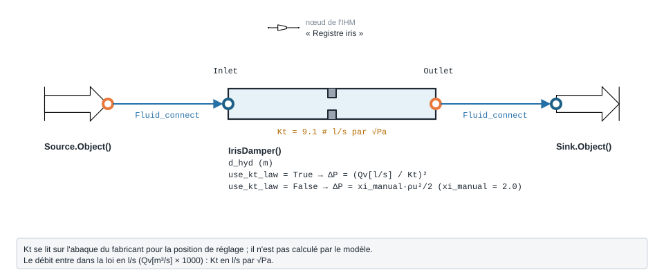

.. _iris_damper_air:

Registre iris — IrisDamper
==========================

   Forme, ports et raccordement ; paramètres sous leur nom de code, avec leur valeur par défaut.

À quoi ça sert
--------------

Chiffrer la perte de charge d'un **registre iris** de réglage, à partir du
coefficient ``Kt`` que donne l'abaque du fabricant pour la position de réglage :

.. math::

   Q_v\,[\mathrm{l/s}] = K_t \sqrt{\Delta P\,[\mathrm{Pa}]}
   \quad\Longrightarrow\quad
   \Delta P = \left(\frac{Q_v\,[\mathrm{l/s}]}{K_t}\right)^2

Le modèle ne calcule pas ``Kt`` : c'est une donnée d'entrée, liée à l'ouverture.
Sans abaque, ``use_kt_law = False`` bascule sur une loi classique
:math:`\Delta P = \xi \cdot \rho u^2 / 2` avec ``xi_manual`` (défaut 2,0). La loi
``Kt`` est notée dans le code comme « issue du cours » : aucune source publiée n'y
est citée.

Exemple minimal
---------------

100 l/s (360 m³/h) d'air à 20 °C traversent un registre iris Ø 200 mm réglé à
``Kt`` = 9,1. Le composant amont est une ``Source`` d'air (ports fluide
``FluidPort``, voir :doc:`../ports_connexions`).

.. code-block:: python

    from ThermodynamicCycles.Aeraulic import IrisDamper
    from ThermodynamicCycles.Source import Source
    from ThermodynamicCycles.Sink import Sink
    from ThermodynamicCycles.Connect import Fluid_connect

    SOURCE = Source.Object()
    SOURCE.fluid = "air"
    SOURCE.Ti_degC = 20           # °C
    SOURCE.Pi_bar = 1.01325       # bar
    SOURCE.F_m3h = 360            # débit à régler [m³/h] = 100 l/s
    SOURCE.calculate()

    IRIS = IrisDamper()           # le paquet Aeraulic exporte la classe elle-même
    IRIS.d_hyd = 0.200            # diamètre du registre [m]
    IRIS.Kt = 9.1                 # coefficient du fabricant [l/s par √Pa], selon l'ouverture

    Fluid_connect(IRIS.Inlet, SOURCE.Outlet)
    IRIS.calculate()
    SINK = Sink.Object()
    Fluid_connect(SINK.Inlet, IRIS.Outlet)
    SINK.calculate()

    print(IRIS.df)

Sortie réelle :

.. code-block:: text

                                 IrisDamper
   Timestamp     2026-09-28 12:56:05.545883
   section (m2)                    0.031416
   rho (kg/m3)                     1.204575
   Qv (m3/s)                            0.1
   u (m/s)                         3.183099
   delta_P (Pa)                  120.758363
   P_in_Pa                         101325.0
   P_out_Pa                   101204.241637

La perte de charge ne dépend ici que du débit et de ``Kt`` :
(100 / 9,1)² = 120,76 Pa. Le diamètre ``d_hyd`` ne sert qu'à afficher la vitesse.

Ce qu'on personnalise
---------------------

.. list-table::
   :header-rows: 1

   * - Paramètre
     - Effet
     - Valeur / plage
   * - ``Kt``
     - Coefficient du registre à sa position de réglage : plus il est grand, plus le
       registre est ouvert et moins il freine
     - l/s par √Pa, lu sur l'abaque du fabricant ; défaut ``9.1`` ; strictement > 0
   * - ``use_kt_law``
     - Choix de la loi
     - ``True`` (défaut) : loi ``Kt`` ; ``False`` : loi ``xi_manual``
   * - ``xi_manual``
     - Coefficient de perte singulière, loi classique seulement
     - défaut ``2.0``
   * - ``d_hyd`` (ou ``a``, ``b``)
     - Section : vitesse affichée, et vitesse de la loi ``xi_manual``
     - m

Variante : le même débit, registre plus ouvert (``Kt`` = 14).

.. code-block:: python

    from ThermodynamicCycles.Aeraulic import IrisDamper
    from ThermodynamicCycles.Source import Source
    from ThermodynamicCycles.Sink import Sink
    from ThermodynamicCycles.Connect import Fluid_connect

    SOURCE = Source.Object()
    SOURCE.fluid = "air"
    SOURCE.Ti_degC = 20           # °C
    SOURCE.Pi_bar = 1.01325       # bar
    SOURCE.F_m3h = 360            # débit à régler [m³/h] = 100 l/s
    SOURCE.calculate()

    IRIS = IrisDamper()           # le paquet Aeraulic exporte la classe elle-même
    IRIS.d_hyd = 0.200            # diamètre du registre [m]
    # variante : registre plus ouvert (Kt plus grand) pour le même débit
    IRIS.Kt = 14.0                # l/s par √Pa

    Fluid_connect(IRIS.Inlet, SOURCE.Outlet)
    IRIS.calculate()
    SINK = Sink.Object()
    Fluid_connect(SINK.Inlet, IRIS.Outlet)
    SINK.calculate()

    print(IRIS.df)

Sortie réelle :

.. code-block:: text

                                 IrisDamper
   Timestamp     2026-09-28 12:56:13.745644
   section (m2)                    0.031416
   rho (kg/m3)                     1.204575
   Qv (m3/s)                            0.1
   u (m/s)                         3.183099
   delta_P (Pa)                   51.020408
   P_in_Pa                         101325.0
   P_out_Pa                   101273.979592

Ouvrir le registre de ``Kt`` = 9,1 à 14 divise la perte de charge par
(14 / 9,1)² ≈ 2,4 : 51,0 Pa au lieu de 120,8 Pa pour le même débit.

Éprouver le modèle
------------------

Un ``Kt`` nul ou négatif n'a pas de sens physique : le modèle le refuse.

.. code-block:: python

    from ThermodynamicCycles.Aeraulic import IrisDamper
    from ThermodynamicCycles.Source import Source
    from ThermodynamicCycles.Connect import Fluid_connect

    SOURCE = Source.Object()
    SOURCE.fluid = "air"; SOURCE.Ti_degC = 20; SOURCE.Pi_bar = 1.01325; SOURCE.F_m3h = 360
    SOURCE.calculate()

    IRIS = IrisDamper()
    IRIS.d_hyd = 0.200
    IRIS.Kt = 0                   # coefficient non renseigné
    Fluid_connect(IRIS.Inlet, SOURCE.Outlet)
    try:
        IRIS.calculate()
    except ValueError as e:
        print("refusé :", e)

Sortie réelle :

.. code-block:: text

   refusé : Kt doit etre > 0 en mode use_kt_law

Pour aller plus loin
--------------------

- :doc:`coude_aeraulique`, :doc:`te_aeraulique`, :doc:`perte_pression_lineaire` —
  même raccordement.
