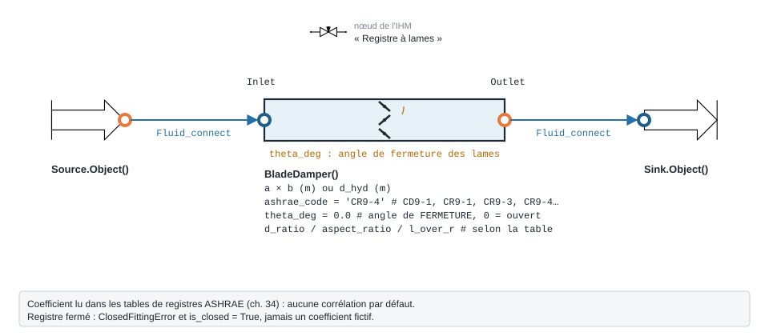

.. _blade_damper_air:

Registre à lames — BladeDamper
==============================

   Forme, ports et raccordement ; paramètres sous leur nom de code, avec leur valeur par défaut.

À quoi ça sert
--------------

Chiffrer la perte de charge d'un **registre à lame(s)** — papillon rond ou
rectangulaire, lames parallèles ou opposées, clapet coupe-feu — selon son **angle de
fermeture**. Le coefficient ``Co`` est lu dans les tables de registres du catalogue
ASHRAE (Handbook-Fundamentals 2001, ch. 34), puis
:math:`\Delta P = C_o \cdot \rho u^2 / 2`. Il n'y a **pas** de corrélation par
défaut : ``ashrae_code`` est obligatoire.

``theta_deg`` est un angle de **fermeture** : 0° = grand ouvert. Le coefficient
couvre plusieurs ordres de grandeur entre l'ouverture et la fermeture : c'est
l'organe le plus non linéaire d'un réseau.

.. list-table::
   :header-rows: 1

   * - ``ashrae_code``
     - Registre
     - Entrée de table à renseigner
   * - ``'CD9-1'``
     - papillon rond
     - ``d_ratio`` (D/Do)
   * - ``'CR9-1'``
     - papillon rectangulaire
     - ``aspect_ratio`` (H/W)
   * - ``'CR9-3'`` / ``'CR9-4'``
     - lames parallèles / opposées
     - ``l_over_r`` (L/R)
   * - ``'CD9-3'`` / ``'CR9-6'``
     - clapet coupe-feu, rideau
     - aucune

Exemple minimal
---------------

Registre à lames opposées 500 × 400 mm, fermé à 20°, traversé par 3600 m³/h d'air à
20 °C. Le composant amont est une ``Source`` d'air (ports fluide ``FluidPort``, voir
:doc:`../ports_connexions`).

.. code-block:: python

    from ThermodynamicCycles.Aeraulic import BladeDamper
    from ThermodynamicCycles.Source import Source
    from ThermodynamicCycles.Sink import Sink
    from ThermodynamicCycles.Connect import Fluid_connect

    SOURCE = Source.Object()
    SOURCE.fluid = "air"
    SOURCE.Ti_degC = 20           # °C
    SOURCE.Pi_bar = 1.01325       # bar
    SOURCE.F_m3h = 3600           # débit [m³/h]
    SOURCE.calculate()

    REG = BladeDamper()           # le paquet Aeraulic exporte la classe elle-même
    REG.a, REG.b = 0.500, 0.400   # section rectangulaire [m]
    REG.ashrae_code = "CR9-4"     # lames opposées (table ASHRAE)
    REG.l_over_r = 1.0            # L/R : longueur cumulée des lames / périmètre
    REG.theta_deg = 20            # angle de FERMETURE [degrés], 0 = grand ouvert

    Fluid_connect(REG.Inlet, SOURCE.Outlet)
    REG.calculate()
    SINK = Sink.Object()
    Fluid_connect(SINK.Inlet, REG.Outlet)
    SINK.calculate()

    print(REG.df.to_string())     # tableau complet, citation comprise

Sortie réelle :

.. code-block:: text

                                                                                  BladeDamper
   Timestamp                                                       2026-09-28 13:01:03.690790
   section (m2)                                                                           0.2
   rho (kg/m3)                                                                       1.204575
   Qv (m3/s)                                                                              1.0
   u (m/s)                                                                                5.0
   delta_P (Pa)                                                                     43.816422
   P_in_Pa                                                                           101325.0
   P_out_Pa                                                                     101281.183578
   Co (-)                                                                                2.91
   angle de fermeture (deg)                                                                20
   ASHRAE fitting                                                                       CR9-4
   citation                  ASHRAE Handbook-Fundamentals (2001), ch.34, table CR9-4, p.34.58

Ce qu'on personnalise
---------------------

.. list-table::
   :header-rows: 1

   * - Paramètre
     - Effet
     - Valeur / plage
   * - ``theta_deg``
     - Angle de fermeture : c'est lui qui règle le débit
     - degrés, 0 = ouvert ; défaut ``0.0``
   * - ``ashrae_code``
     - Type de registre (table ci-dessus)
     - obligatoire
   * - ``d_ratio``, ``aspect_ratio``, ``l_over_r``
     - Géométrie demandée par la table choisie
     - selon la table ; une valeur hors table est **bornée** et signalée
   * - ``a``, ``b`` ou ``d_hyd``
     - Section : fixe la vitesse ``u`` ; doit correspondre au code (``CD`` rond,
       ``CR`` rectangulaire)
     - m

Variante : le même registre, fermé à 45°.

.. code-block:: python

    from ThermodynamicCycles.Aeraulic import BladeDamper
    from ThermodynamicCycles.Source import Source
    from ThermodynamicCycles.Sink import Sink
    from ThermodynamicCycles.Connect import Fluid_connect

    SOURCE = Source.Object()
    SOURCE.fluid = "air"
    SOURCE.Ti_degC = 20           # °C
    SOURCE.Pi_bar = 1.01325       # bar
    SOURCE.F_m3h = 3600           # débit [m³/h]
    SOURCE.calculate()

    REG = BladeDamper()           # le paquet Aeraulic exporte la classe elle-même
    REG.a, REG.b = 0.500, 0.400   # section rectangulaire [m]
    REG.ashrae_code = "CR9-4"     # lames opposées (table ASHRAE)
    REG.l_over_r = 1.0            # L/R : longueur cumulée des lames / périmètre
    # variante : le même registre fermé à 45°
    REG.theta_deg = 45            # angle de FERMETURE [degrés]

    Fluid_connect(REG.Inlet, SOURCE.Outlet)
    REG.calculate()
    SINK = Sink.Object()
    Fluid_connect(SINK.Inlet, REG.Outlet)
    SINK.calculate()

    print(REG.df.to_string())     # tableau complet, citation comprise

Sortie réelle :

.. code-block:: text

                                                                                  BladeDamper
   Timestamp                                                       2026-09-28 13:01:10.753507
   section (m2)                                                                           0.2
   rho (kg/m3)                                                                       1.204575
   Qv (m3/s)                                                                              1.0
   u (m/s)                                                                                5.0
   delta_P (Pa)                                                                    692.103728
   P_in_Pa                                                                           101325.0
   P_out_Pa                                                                     100632.896272
   Co (-)                                                                              45.965
   angle de fermeture (deg)                                                                45
   ASHRAE fitting                                                                       CR9-4
   citation                  ASHRAE Handbook-Fundamentals (2001), ch.34, table CR9-4, p.34.58

Passer de 20° à 45° de fermeture multiplie le coefficient par 16 (2,91 → 45,97) :
la perte de charge monte de 43,8 Pa à 692 Pa pour le même débit.

Éprouver le modèle
------------------

Un registre **fermé** n'a pas de coefficient. La table ASHRAE y imprime la valeur
99999, que le modèle refuse de servir : il lève ``ClosedFittingError`` et passe
``is_closed`` à ``True``. Ici, un papillon rond qui occupe tout le conduit
(``d_ratio = 1``), fermé à 90°.

.. code-block:: python

    from ThermodynamicCycles.Aeraulic import BladeDamper, ashrae_fittings

    REG = BladeDamper()
    REG.d_hyd = 0.300
    REG.ashrae_code = "CD9-1"     # papillon rond
    REG.d_ratio = 1.0             # D/Do = 1 : le papillon occupe tout le conduit
    REG.theta_deg = 90            # complètement fermé
    try:
        REG.xi()
    except ashrae_fittings.ClosedFittingError as e:
        print("refusé :", type(e).__name__, "-", e)
    print("is_closed =", REG.is_closed)

Sortie réelle :

.. code-block:: text

   refusé : ClosedFittingError - CD9-1 : la table porte la valeur sentinelle 99999 a θ = 90. Elle signifie << FERME, resistance infinie >>, ce n'est PAS un coefficient de perte. La servir donnerait dp = 99999 . pv, un nombre d'apparence normale et vide de sens. Aucun debit ne passe : c'est un ETAT, pas une valeur.
   is_closed = True

Pour aller plus loin
--------------------

- :doc:`registre_iris` — registre de réglage à loi de fabricant ``Kt``.
- :doc:`coude_aeraulique`, :doc:`te_aeraulique`, :doc:`perte_pression_lineaire`.
- Source : ASHRAE Handbook-Fundamentals 2001 (SI), ch. 34, tables CD9 et CR9.
