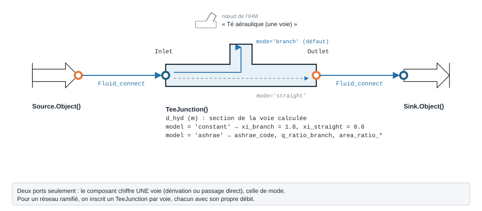

.. _tee_junction_air:

Té aéraulique — TeeJunction
===========================

   Forme, ports et raccordement ; paramètres sous leur nom de code, avec leur valeur par défaut.

À quoi ça sert
--------------

Chiffrer la perte de charge d'un **té de gaine** (jonction de soufflage ou de
reprise) sur **une** de ses voies. Le composant n'a que deux ports : il calcule soit
la **dérivation** (``mode = 'branch'``, défaut), soit le **passage direct**
(``mode = 'straight'``), avec :math:`\Delta P = \xi \cdot \rho u^2 / 2` sur la
vitesse de la voie calculée. Pour un réseau ramifié, on place un ``TeeJunction`` par
voie, chacun traversé par son propre débit — c'est aussi ainsi que la méthode ASHRAE
inscrit une jonction.

Deux sources pour le coefficient :

- ``model = 'constant'`` (**défaut**) : deux constantes, ``xi_branch = 1.8`` et
  ``xi_straight = 0.6``, **quels que soient** le partage de débit et les sections. Le
  code précise que leur provenance n'est pas établie.
- ``model = 'ashrae'`` : ``Cb`` et ``Cs`` lus dans les tables de jonction du
  catalogue ASHRAE (Handbook-Fundamentals 2001, ch. 34), interpolés selon le partage
  de débit ``q_ratio_branch`` (Qb/Qc) et les rapports de sections.

Sur une jonction convergente, un coefficient **négatif** est physique (le jet lent
gagne de l'énergie au mélange) : la pression de sortie peut alors dépasser celle
d'entrée, et le modèle ne le masque pas.

Exemple minimal
---------------

600 m³/h d'air à 20 °C partent dans la dérivation Ø 200 mm d'un té. Le composant
amont est une ``Source`` d'air (ports fluide ``FluidPort``, voir
:doc:`../ports_connexions`).

.. code-block:: python

    from ThermodynamicCycles.Aeraulic import TeeJunction
    from ThermodynamicCycles.Source import Source
    from ThermodynamicCycles.Sink import Sink
    from ThermodynamicCycles.Connect import Fluid_connect

    # débit qui part dans la dérivation du té
    SOURCE = Source.Object()
    SOURCE.fluid = "air"
    SOURCE.Ti_degC = 20           # °C
    SOURCE.Pi_bar = 1.01325       # bar
    SOURCE.F_m3h = 600            # débit de la voie calculée [m³/h]
    SOURCE.calculate()

    TE = TeeJunction()            # le paquet Aeraulic exporte la classe elle-même
    TE.d_hyd = 0.200              # diamètre de la voie [m]
    TE.mode = "branch"            # voie dérivée ('straight' : passage direct)

    Fluid_connect(TE.Inlet, SOURCE.Outlet)
    TE.calculate()
    SINK = Sink.Object()
    Fluid_connect(SINK.Inlet, TE.Outlet)
    SINK.calculate()

    print("xi =", TE.xi())
    print(TE.df)

Sortie réelle :

.. code-block:: text

   xi = 1.8
                                TeeJunction
   Timestamp     2026-09-28 12:50:43.602272
   section (m2)                    0.031416
   rho (kg/m3)                     1.204575
   Qv (m3/s)                       0.166667
   u (m/s)                         5.305165
   delta_P (Pa)                   30.512246
   P_in_Pa                         101325.0
   P_out_Pa                   101294.487754

Ce qu'on personnalise
---------------------

.. list-table::
   :header-rows: 1

   * - Paramètre
     - Effet
     - Valeur / plage
   * - ``d_hyd`` (ou ``a``, ``b``)
     - Section de la voie calculée : fixe la vitesse ``u``
     - m
   * - ``mode``
     - Voie chiffrée
     - ``'branch'`` (défaut) ou ``'straight'``
   * - ``model``
     - Source du coefficient
     - ``'constant'`` (défaut) ou ``'ashrae'``
   * - ``ashrae_code``
     - Table de jonction (``'SD5-1'`` soufflage rond, ``'ED5-1'`` reprise ronde,
       ``'SR5-13'``…)
     - mode ``'ashrae'`` seulement
   * - ``q_ratio_branch``
     - Part du débit commun qui passe en dérivation, Qb/Qc
     - strictement entre 0 et 1
   * - ``area_ratio_branch``, ``area_ratio_straight``
     - Rapports de sections Ab/Ac et As/Ac
     - selon la table ; une valeur hors table est **bornée** et signalée

Variante : la même dérivation, avec le coefficient de la table ASHRAE ``SD5-1``
(té divergent rond), 30 % du débit commun en dérivation.

.. code-block:: python

    from ThermodynamicCycles.Aeraulic import TeeJunction
    from ThermodynamicCycles.Source import Source
    from ThermodynamicCycles.Sink import Sink
    from ThermodynamicCycles.Connect import Fluid_connect

    # débit qui part dans la dérivation du té
    SOURCE = Source.Object()
    SOURCE.fluid = "air"
    SOURCE.Ti_degC = 20           # °C
    SOURCE.Pi_bar = 1.01325       # bar
    SOURCE.F_m3h = 600            # débit de la voie calculée [m³/h]
    SOURCE.calculate()

    TE = TeeJunction()            # le paquet Aeraulic exporte la classe elle-même
    TE.d_hyd = 0.200              # diamètre de la voie [m]
    TE.mode = "branch"
    # variante : coefficient lu dans la table ASHRAE SD5-1 (té divergent rond)
    TE.model = "ashrae"
    TE.ashrae_code = "SD5-1"
    TE.q_ratio_branch = 0.3       # Qb/Qc : 30 % du débit part en dérivation
    TE.area_ratio_branch = 0.5    # Ab/Ac : section de dérivation / section commune
    TE.area_ratio_straight = 1.0  # As/Ac : passage direct de même section

    Fluid_connect(TE.Inlet, SOURCE.Outlet)
    TE.calculate()
    SINK = Sink.Object()
    Fluid_connect(SINK.Inlet, TE.Outlet)
    SINK.calculate()

    print("xi =", TE.xi())
    print(TE.df.to_string())   # tableau complet, citation comprise

Sortie réelle :

.. code-block:: text

   xi = 1.37
                                                                        TeeJunction
   Timestamp                                             2026-09-28 12:50:53.307624
   section (m2)                                                            0.031416
   rho (kg/m3)                                                             1.204575
   Qv (m3/s)                                                               0.166667
   u (m/s)                                                                 5.305165
   delta_P (Pa)                                                           23.223209
   P_in_Pa                                                                 101325.0
   P_out_Pa                                                           101301.776791
   Cb (-)                                                                      1.37
   Cs (-)                                                                      0.15
   ASHRAE fitting                                                             SD5-1
   voie                                                                      branch
   citation        ASHRAE Handbook-Fundamentals (2001), ch.34, table SD5-1, p.34.50
   hors table                  valeur BORNEE sur un axe geometrique, non extrapolee

Le coefficient de dérivation passe de 1,8 (constante) à 1,37 (table ``SD5-1``) :
23,2 Pa au lieu de 30,5 Pa. La ligne ``hors table`` signale qu'un rapport de sections
a été **borné** à l'extrémité de la table, pas extrapolé : le chiffre est à prendre
avec cette réserve.

Éprouver le modèle
------------------

Un partage de débit de 0 ou 1 n'est pas un point de table : les coefficients y
divergent. Le modèle refuse plutôt que de borner.

.. code-block:: python

    from ThermodynamicCycles.Aeraulic import TeeJunction

    TE = TeeJunction()
    TE.d_hyd = 0.200
    TE.model = "ashrae"
    TE.ashrae_code = "SD5-1"
    TE.area_ratio_branch = 0.5
    TE.q_ratio_branch = 1.0       # tout le débit en dérivation : hors table
    try:
        TE.xi()
    except ValueError as e:
        print("refusé :", e)

Sortie réelle :

.. code-block:: text

   refusé : q_ratio_branch = 1 hors de ]0 ; 1[. Qb/Qc = 0 ou 1 n'est pas un point de table : les coefficients de jonction divergent vers zero (SD5-1 : 73.59 a Qb/Qc = 0.1). Aucune valeur n'est bornee ni extrapolee.

Pour aller plus loin
--------------------

- :doc:`coude_aeraulique`, :doc:`perte_pression_lineaire` — même raccordement.
- Source : ASHRAE Handbook-Fundamentals 2001 (SI), ch. 34 (tables de jonction) ;
  convention de vitesse de référence de la 2021 (SI), ch. 21, éq. (32) et (33).
