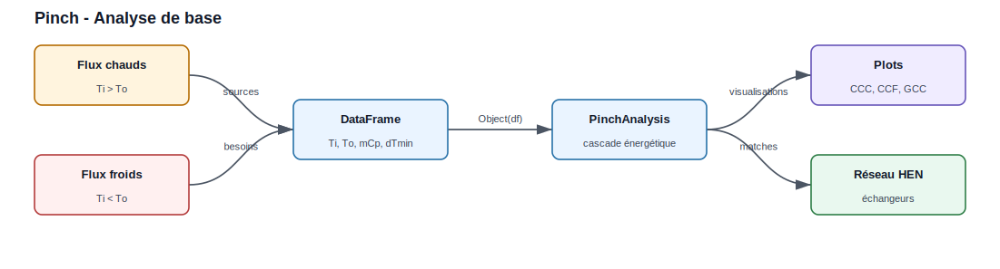
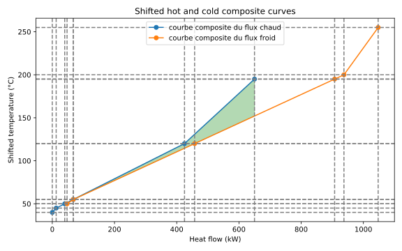
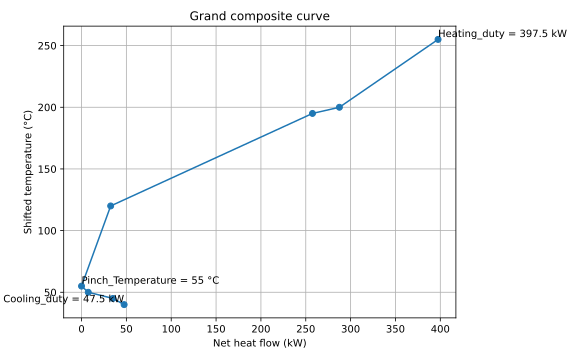

Exemple complet
===============

Cette page déroule **un seul cas de bout en bout** : on pose le problème, on
exécute le code, on lit les **sorties réelles** de la bibliothèque, puis on les
interprète. Toutes les valeurs et figures ci-dessous sont produites en
exécutant réellement ``PinchAnalysis`` sur le jeu de flux présenté.

Le problème
-----------

   Deux flux chauds à refroidir et deux flux froids à chauffer. L'analyse Pinch
   détermine combien de chaleur ces flux peuvent s'échanger entre eux, et donc
   les utilités (vapeur, eau de refroidissement) réellement nécessaires.

On considère quatre flux de procédé :

.. list-table::
   :widths: 12 12 12 12 12 40
   :header-rows: 1

   * - Flux
     - Type
     - Ti [°C]
     - To [°C]
     - mCp [kW/K]
     - Rôle
   * - H1
     - chaud
     - 200
     - 50
     - 3,0
     - flux chaud à refroidir
   * - H2
     - chaud
     - 125
     - 45
     - 2,5
     - flux chaud à refroidir
   * - C1
     - froid
     - 50
     - 250
     - 2,0
     - flux froid à chauffer
   * - C2
     - froid
     - 45
     - 195
     - 4,0
     - flux froid à chauffer

On fixe ``ΔTmin = 10 °C``, soit ``dTmin2 = 5 K`` (moitié du pincement minimal)
pour chaque flux.

Le code complet
---------------

.. code-block:: python

   import pandas as pd
   from PinchAnalysis import PinchAnalysis

   # Un flux par ligne. Colonnes attendues par PinchAnalysis.Object :
   #   id, name         : identifiant et nom du flux
   #   Ti, To           : températures initiale / finale [°C]
   #   mCp              : débit de capacité thermique [kW/K]
   #   dTmin2           : ΔTmin/2 propre au flux [K]
   #   integration      : True pour inclure le flux dans l'analyse
   # Le type (chaud/froid) est déduit automatiquement : Ti > To => chaud.
   df = pd.DataFrame({
       'id': [1, 2, 3, 4],
       'name': ['H1', 'H2', 'C1', 'C2'],
       'Ti': [200, 125, 50, 45],
       'To': [50, 45, 250, 195],
       'mCp': [3.0, 2.5, 2.0, 4.0],
       'dTmin2': [5, 5, 5, 5],
       'integration': [True, True, True, True],
   })

   # Toute l'analyse (décalage des températures, cascade, courbes composites,
   # appariements) est calculée à la construction de l'objet.
   pinch = PinchAnalysis.Object(df)

   # 1) Les quatre indicateurs de synthèse
   print(f"Température de pincement (décalée) : {pinch.Pinch_Temperature} °C")
   print(f"Utilité chaude minimale  Qh,min    : {pinch.Heating_duty} kW")
   print(f"Utilité froide minimale  Qc,min    : {pinch.Cooling_duty} kW")
   print(f"Chaleur récupérable                : {pinch.heat_recovery} kW")

   # 2) Les DataFrames de détail
   print(pinch.stream_list)          # flux + températures décalées
   print(pinch.df_surplus_deficit)   # cascade énergétique par intervalle

   # 3) Les figures
   pinch.plot_composites_curves()    # courbes composites chaude / froide
   pinch.plot_GCC()                  # grande courbe composite
   pinch.graphical_hen_design()      # réseau d'échangeurs proposé

Les résultats de sortie
-----------------------

**1. Indicateurs de synthèse** (sortie console) :

.. code-block:: text

   Température de pincement (décalée) : 55 °C
   Utilité chaude minimale  Qh,min    : 397.5 kW
   Utilité froide minimale  Qc,min    : 47.5 kW
   Chaleur récupérable                : 602.5 kW

**2. Flux avec températures décalées** — ``pinch.stream_list`` :

.. code-block:: text

      id name   Ti   To  mCp  dTmin2 StreamType  STi  STo  delta_H
   0   1   H1  200   50  3.0       5         HS  195   45   -450.0
   1   2   H2  125   45  2.5       5         HS  120   40   -200.0
   2   3   C1   50  250  2.0       5         CS   55  255    400.0
   3   4   C2   45  195  4.0       5         CS   50  200    600.0

* ``StreamType`` : ``HS`` (hot stream) si ``Ti > To``, sinon ``CS`` (cold stream).
* ``STi`` / ``STo`` : températures **décalées** de ``±dTmin2`` (−5 K pour les
  chauds, +5 K pour les froids) — c'est l'astuce qui garantit un écart réel de
  ``ΔTmin`` entre tout flux chaud et tout flux froid.
* ``delta_H = mCp × (To − Ti)`` : enthalpie échangée par le flux (négative pour
  un chaud qui cède, positive pour un froid qui reçoit).

**3. Cascade énergétique** — ``pinch.df_surplus_deficit`` (cœur de la méthode) :

.. code-block:: text

     IntervalName  Tsup  Tinf  mCp  delta_H  cumulative_delta_H
          255-200   255   200 -2.0   -110.0             -110.0
          200-195   200   195 -6.0    -30.0             -140.0
          195-120   195   120 -3.0   -225.0             -365.0
           120-55   120    55 -0.5    -32.5             -397.5   <- minimum
            55-50    55    50  1.5      7.5             -390.0
            50-45    50    45  5.5     27.5             -362.5
            45-40    45    40  2.5     12.5             -350.0

La colonne ``cumulative_delta_H`` cumule les surplus/déficits du haut vers le
bas. Son **minimum vaut −397.5 kW** à la frontière **55 °C** : c'est le point de
pincement, et cette valeur donne directement ``Qh,min``.

**4. Courbes composites** — ``pinch.plot_composites_curves()`` :

   Sortie réelle de ``plot_composites_curves()``. La composite chaude (bleu)
   et la composite froide (orange) en températures décalées. Le recouvrement
   horizontal correspond à la chaleur récupérable (602,5 kW) ; l'écart
   horizontal résiduel à gauche (47,5 kW) et à droite (397,5 kW) donne les deux
   utilités minimales. Le point où les deux courbes se frôlent verticalement
   est le pincement.

**5. Grande courbe composite (GCC)** — ``pinch.plot_GCC()`` :

   Sortie réelle de ``plot_GCC()``. La GCC trace le flux net de chaleur en
   fonction de la température décalée. Elle **touche l'axe vertical au
   pincement (55 °C)**, s'ouvre vers le haut de ``Qh,min = 397,5 kW`` et vers le
   bas de ``Qc,min = 47,5 kW``. C'est l'outil pour positionner des utilités à
   plusieurs niveaux (vapeur HP/MP/BP).

**6. Réseau d'échangeurs proposé** — ``pinch.graphical_hen_design()`` puis
``pinch.heat_exchangers`` :

.. code-block:: text

    HS   CS  HeatExchanged   delta_tlm     UA     Zone
    H1   C2       420.00      23.27      18.05   au-dessus du pinch
    H2   C1       130.00      15.61       8.33   au-dessus du pinch
    H1   C2        15.00      10.61       1.41   en dessous du pinch
    H2   C2         3.13      10.23       0.31   en dessous du pinch

L'algorithme apparie les flux en respectant la règle du pincement (voir plus
bas) : l'échangeur principal **H1 → C2** récupère 420 kW au-dessus du pincement,
**H2 → C1** en récupère 130 kW, et deux petits appariements complètent la
récupération en dessous. Chaque ligne fournit aussi le ``ΔT`` logarithmique et
le produit ``UA`` (avec ``U = 1000`` W/m²·K par défaut) pour dimensionner
l'échangeur.

Explication : lire et interpréter ces résultats
------------------------------------------------

Le bilan sans intégration
~~~~~~~~~~~~~~~~~~~~~~~~~~~

Avant toute récupération, chaque flux est traité séparément :

* chaleur à évacuer des flux chauds : ``450 + 200 = 650 kW`` ;
* chaleur à fournir aux flux froids : ``400 + 600 = 1000 kW``.

Sans échange interne, il faudrait donc **1000 kW** d'utilité chaude et
**650 kW** d'utilité froide. L'analyse Pinch va montrer qu'on peut faire
beaucoup mieux.

Pourquoi Qh,min = 397,5 kW et Qc,min = 47,5 kW
~~~~~~~~~~~~~~~~~~~~~~~~~~~~~~~~~~~~~~~~~~~~~~~~

La cascade (tableau 3) empile les excédents et déficits de chaleur intervalle
par intervalle. Prise telle quelle, elle descend jusqu'à **−397,5 kW** : cela
signifierait qu'à cet endroit on transfère plus de chaleur qu'il n'y en a de
disponible — physiquement impossible. Pour rendre toute la cascade réalisable,
on **injecte 397,5 kW en haut** : c'est ``Qh,min``. La cascade se relève alors
partout, et sa valeur en bas devient ``−350 + 397,5 = 47,5 kW`` : c'est la
chaleur qu'il reste à évacuer, ``Qc,min``.

La récupération se déduit par simple bilan :

* ``Q récupérée = 1000 − 397,5 = 602,5 kW`` (côté chaud), identique à
  ``650 − 47,5 = 602,5 kW`` (côté froid). C'est la valeur ``pinch.heat_recovery``.

On passe donc de **1000 → 397,5 kW** de vapeur (−60 %) et de **650 → 47,5 kW**
d'eau de refroidissement (−93 %), uniquement en faisant échanger les flux entre
eux.

Le rôle du point de pincement
~~~~~~~~~~~~~~~~~~~~~~~~~~~~~~~

Le pincement est l'endroit où la cascade s'annule (température décalée 55 °C,
soit **60 °C côté chaud** et **50 °C côté froid** une fois le décalage retiré).
Il coupe le procédé en deux zones thermodynamiquement indépendantes et impose
trois règles d'or, que le réseau d'échangeurs ci-dessus respecte :

1. **ne jamais transférer de chaleur à travers le pincement** ;
2. **au-dessus du pincement** : aucune utilité froide (pas de refroidissement
   externe) ;
3. **en dessous du pincement** : aucune utilité chaude (pas de chauffage
   externe).

Violer une seule de ces règles augmente *simultanément* ``Qh`` et ``Qc`` de la
même quantité — c'est l'erreur de conception que l'analyse Pinch permet
d'éviter.

Bonnes pratiques
----------------

1. **Valider les données d'entrée** : flux chauds avec ``Ti > To``, flux froids
   avec ``Ti < To``, et ``mCp > 0`` pour tous.
2. **Choisir un ΔTmin réaliste** : 10–20 °C pour un procédé standard, 3–5 °C en
   cryogénie, 20–40 °C en haute température. Plus ``ΔTmin`` est faible, moins on
   consomme d'utilités mais plus la surface d'échange (donc l'investissement)
   augmente : l'optimum se trouve par analyse du coût total annualisé (TAC).
3. **Confronter au terrain** : vérifier la faisabilité (pression, encrassement,
   distance entre flux) avant de figer le réseau proposé.
4. **Itérer** : rejouer l'analyse pour plusieurs ``ΔTmin`` et plusieurs
   configurations de flux avant d'arrêter le schéma d'intégration.

Références bibliographiques
---------------------------

* Kemp, I. C. (2007). *Pinch Analysis and Process Integration*.
* Smith, R. (2005). *Chemical Process Design and Integration*.
* Linnhoff, B., & Flower, J. R. (1978). « Synthesis of heat exchanger
  networks ». *AIChE Journal*, 24(4), 633-642.
