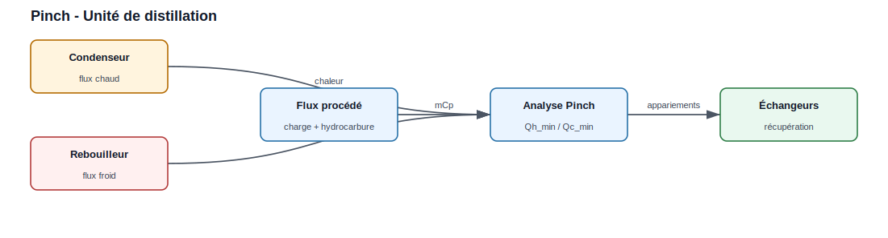
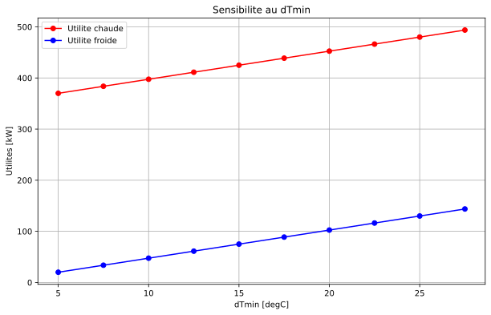

Analyse Pinch
=============

.. figure:: ../images/006_pinch_base.svg
   :alt: Schéma d'une analyse Pinch de base
   :align: center

   Les flux chauds et froids sont structurés dans un DataFrame, puis
   l'analyse produit les courbes, les utilités minimales et les appariements
   d'échange.

.. code-block:: python

   import pandas as pd
   from PinchAnalysis import PinchAnalysis

   # Créer un DataFrame avec les flux thermiques
   # Ti/To : températures initiale/finale [°C]
   # mCp : débit de capacité thermique [kW/K]
   # dTmin2 : ΔTmin/2 pour chaque flux [K]
   # integration : inclure le flux dans l'analyse
   # Les colonnes 'id' et 'name' sont requises par PinchAnalysis.Object
   df = pd.DataFrame({
       'id': [1, 2, 3, 4],
       'name': ['H1', 'H2', 'C1', 'C2'],  # 2 flux chauds, 2 flux froids
       'Ti': [200, 125, 50, 45],
       'To': [50, 45, 250, 195],
       'mCp': [3.0, 2.5, 2.0, 4.0],
       'dTmin2': [5, 5, 5, 5],
       'integration': [True, True, True, True]
   })

   # Créer l'objet d'analyse
   pinch = PinchAnalysis.Object(df)

   # Accéder aux résultats (valeurs réelles pour ce jeu de flux)
   print(f"Température de pincement : {pinch.Pinch_Temperature} °C")  # 55
   print(f"Utilité chaude minimale : {pinch.Heating_duty} kW")        # 397.5
   print(f"Utilité froide minimale : {pinch.Cooling_duty} kW")        # 47.5
   print(f"Chaleur récupérée : {pinch.heat_recovery} kW")            # 602.5

   # DataFrames de résultats
   print(pinch.stream_list)                    # Flux avec températures décalées
   print(pinch.df_intervals)                   # Intervalles de température
   print(pinch.df_surplus_deficit)             # Bilan énergétique

   # Générer les visualisations
   pinch.plot_composites_curves()              # Courbes composites
   pinch.plot_GCC()                            # Grande courbe composite
   pinch.plot_streams_and_temperature_intervals()  # Flux et intervalles
   pinch.graphical_hen_design()                # Réseau d'échangeurs

Résultats à afficher :

.. list-table::
   :widths: 35 45 20
   :header-rows: 1

   * - Résultat
     - Objet ou attribut
     - Unité
   * - Température de pincement
     - ``pinch.Pinch_Temperature`` (= 55)
     - degC
   * - Utilité chaude minimale
     - ``pinch.Heating_duty`` (= 397,5)
     - kW
   * - Utilité froide minimale
     - ``pinch.Cooling_duty`` (= 47,5)
     - kW
   * - Chaleur récupérée
     - ``pinch.heat_recovery`` (= 602,5)
     - kW
   * - Intervalles de température
     - ``pinch.df_intervals``
     - tableau

Plots prévus par l'exemple :

* ``pinch.plot_composites_curves()`` : courbes composites chaude et froide.
* ``pinch.plot_GCC()`` : grande courbe composite.
* ``pinch.plot_streams_and_temperature_intervals()`` : flux et intervalles.
* ``pinch.graphical_hen_design()`` : réseau d'échangeurs proposé.

.. figure:: ../images/006_pinch_plot_composites.svg
   :alt: Courbes composites réelles du cycle Pinch
   :align: center

   Sortie réelle de ``pinch.plot_composites_curves()`` pour les flux ci-dessus
   (générée en exécutant la bibliothèque) : composite chaude (bleu) et froide
   (orange) en températures décalées ; le recouvrement horizontal correspond à
   la chaleur récupérable (602,5 kW), le décalage vertical au pincement (55 °C).

Le réseau d'échangeurs optimal pourrait ressembler à :

* **E1** : H1 (200°C → 120°C) échange avec C2 (120°C → 195°C) → 240 kW
* **E2** : H2 (125°C → 45°C) échange avec C1 (50°C → 130°C) → 200 kW
* **E3** : H1 (120°C → 50°C) échange avec C1 (130°C → 250°C) → 210 kW
* **E4** : C2 (45°C → 120°C) chauffé par utilité chaude → 300 kW
* **E5** : H1 refroidi par utilité froide → 50 kW

Exemple 2 : Optimisation d'une unité de distillation
-----------------------------------------------------

Contexte industriel
~~~~~~~~~~~~~~~~~~~

   Les flux de condenseur, rebouilleur et procédé sont réunis dans la même
   analyse pour identifier les échanges récupérables.

Une unité de distillation comporte :

* **Rebouilleur** (flux froid C1) : chauffe le pied de colonne de 90°C à 140°C
* **Condenseur** (flux chaud H1) : refroidit la tête de colonne de 65°C à 40°C
* **Flux de procédé chaud H2** : hydrocarbure de 180°C à 70°C
* **Flux de procédé froid C2** : charge à préchauffer de 30°C à 120°C

Données
~~~~~~~

.. code-block:: python

   df_distillation = pd.DataFrame({
       'id': [1, 2, 3, 4],
       'name': ['Condenseur', 'Rebouilleur', 'Hydrocarbure', 'Charge'],
       'Ti': [65, 90, 180, 30],
       'To': [40, 140, 70, 120],
       'mCp': [5.0, 6.0, 3.5, 4.0],
       'dTmin2': [5, 5, 5, 5],
       'integration': [True, True, True, True]
   })

   # Analyse Pinch
   pinch_dist = PinchAnalysis.Object(df_distillation)

   # Résultats
   print(f"Utilité chaude minimale : {pinch_dist.Heating_duty:.1f} kW")
   print(f"Utilité froide minimale : {pinch_dist.Cooling_duty:.1f} kW")

   # Visualisation
   pinch_dist.plot_composites_curves()
   plt.show()

Résultats à afficher :

.. list-table::
   :widths: 40 40 20
   :header-rows: 1

   * - Indicateur
     - Attribut
     - Unité
   * - Utilité chaude minimale
     - ``pinch_dist.Heating_duty``
     - kW
   * - Utilité froide minimale
     - ``pinch_dist.Cooling_duty``
     - kW
   * - Flux compatibles
     - ``pinch_dist.df_combined``
     - tableau

Plot prévu par l'exemple :

* ``pinch_dist.plot_composites_curves()`` affiche le potentiel de récupération
  entre les flux de l'unité.

.. figure:: ../images/006_pinch_plot_composites.svg
   :alt: Aperçu des courbes composites pour distillation
   :align: center

   Même type de plot, appliqué cette fois aux flux de distillation.

Interprétation
~~~~~~~~~~~~~~

L'analyse Pinch révèle que :

* Le flux d'hydrocarbure chaud (H2) peut préchauffer la charge (C2)
* Le rebouilleur nécessite toujours une utilité chaude (vapeur)
* Le condenseur peut récupérer une partie de sa chaleur

Optimisation proposée :

1. **Échangeur E1** : Hydrocarbure (180°C → 90°C) préchauffe la Charge (30°C → 120°C) → 360 kW récupérés
2. **Utilité chaude** : Vapeur chauffe le Rebouilleur → 300 kW requis (au lieu de 360 kW sans intégration)
3. **Utilité froide** : Eau de refroidissement refroidit le Condenseur → 125 kW requis

**Économie annuelle** (estimée) :

* Réduction de vapeur : 60 kW × 8000 h/an × 0,03 €/kWh = **14 400 €/an**
* Réduction d'eau de refroidissement : économie additionnelle

Exemple 3 : Intégration avec sources d'énergie multiples
---------------------------------------------------------

Contexte
~~~~~~~~

.. figure:: ../images/006_pinch_base.svg
   :alt: Schéma d'intégration Pinch avec utilités multiples
   :align: center

   La grande courbe composite sert à positionner les niveaux de vapeur et de
   refroidissement.

Dans un procédé complexe, on dispose de plusieurs niveaux d'utilités :

* **Vapeur HP** : 250°C, coût élevé
* **Vapeur MP** : 150°C, coût moyen
* **Vapeur BP** : 120°C, coût faible
* **Eau de refroidissement** : 15-25°C

Optimisation via la GCC
~~~~~~~~~~~~~~~~~~~~~~~~

.. code-block:: python

   # Après avoir créé l'objet PinchAnalysis
   pinch.plot_GCC()
   plt.axhline(y=250, color='r', linestyle='--', label='Vapeur HP (250°C)')
   plt.axhline(y=150, color='orange', linestyle='--', label='Vapeur MP (150°C)')
   plt.axhline(y=120, color='y', linestyle='--', label='Vapeur BP (120°C)')
   plt.axhline(y=20, color='b', linestyle='--', label='Eau refroidissement (20°C)')
   plt.legend()
   plt.show()

La GCC permet de déterminer :

* Quelle vapeur utiliser à quel niveau de température
* Les économies potentielles en remplaçant la vapeur HP par de la vapeur BP quand possible
* Le plot prévu est ``pinch.plot_GCC()`` enrichi par les lignes horizontales
  des utilités disponibles.

Exemple 4 : Analyse de flexibilité
-----------------------------------

Étude de sensibilité au ΔTmin
~~~~~~~~~~~~~~~~~~~~~~~~~~~~~~

   Le même jeu de flux est recalculé pour plusieurs valeurs de ``ΔTmin``.

.. code-block:: python

   import numpy as np

   # Balayage du ΔTmin
   dTmin_values = np.arange(5, 30, 2.5)
   Qh_values = []
   Qc_values = []

   df_base = pd.DataFrame({
       'id': [1, 2, 3, 4],
       'name': ['H1', 'H2', 'C1', 'C2'],
       'Ti': [200, 125, 50, 45],
       'To': [50, 45, 250, 195],
       'mCp': [3.0, 2.5, 2.0, 4.0],
       'integration': [True, True, True, True]
   })

   for dTmin in dTmin_values:
       df_test = df_base.copy()
       df_test['dTmin2'] = dTmin / 2

       pinch_test = PinchAnalysis.Object(df_test)
       Qh_values.append(pinch_test.Heating_duty)
       Qc_values.append(pinch_test.Cooling_duty)

   # Tracer l'évolution
   plt.figure(figsize=(10, 6))
   plt.plot(dTmin_values, Qh_values, 'ro-', label='Utilité chaude')
   plt.plot(dTmin_values, Qc_values, 'bo-', label='Utilité froide')
   plt.xlabel('ΔTmin [°C]')
   plt.ylabel('Utilités [kW]')
   plt.title('Sensibilité au ΔTmin')
   plt.legend()
   plt.grid(True)
   plt.show()

Résultats à afficher :

.. list-table::
   :widths: 30 35 35
   :header-rows: 1

   * - Variable
     - Description
     - Usage
   * - ``dTmin_values``
     - valeurs testées de ``ΔTmin``
     - abscisse du plot
   * - ``Qh_values``
     - utilité chaude minimale
     - courbe rouge
   * - ``Qc_values``
     - utilité froide minimale
     - courbe bleue

Plot prévu par l'exemple :

* le graphique Matplotlib compare l'évolution des utilités avec ``ΔTmin``.

   Sortie réelle du balayage (générée en exécutant la bibliothèque) : de
   ``ΔTmin`` = 5 °C à 27,5 °C, l'utilité chaude passe de 370 à 494 kW et
   l'utilité froide de 20 à 144 kW — les deux croissent linéairement avec
   ``ΔTmin`` (à ``ΔTmin`` = 10 °C : 397,5 et 47,5 kW).

Interprétation économique
~~~~~~~~~~~~~~~~~~~~~~~~~~

Plus ΔTmin est faible :

* ✅ Moins d'utilités consommées → coûts opérationnels réduits
* ❌ Plus de surface d'échange → coûts d'investissement élevés

Le ΔTmin optimal se trouve par optimisation technico-économique (analyse TAC).

Exemple 5 : Export des résultats
---------------------------------

Sauvegarde des données
~~~~~~~~~~~~~~~~~~~~~~~

.. code-block:: python

   # Exporter les résultats vers Excel
   with pd.ExcelWriter('resultats_pinch.xlsx') as writer:
       pinch.stream_list.to_excel(writer, sheet_name='Flux', index=False)
       pinch.df_intervals.to_excel(writer, sheet_name='Intervalles', index=False)
       pinch.df_surplus_deficit.to_excel(writer, sheet_name='Surplus_Deficit', index=False)
       
       # Résumé
       df_summary = pd.DataFrame({
           'Paramètre': ['T Pinch', 'Qh min', 'Qc min', 'Q récupéré', 'ΔTmin'],
           'Valeur': [pinch.Pinch_Temperature, pinch.Heating_duty, pinch.Cooling_duty,
                      pinch.heat_recovery, df['dTmin2'].iloc[0]*2],
           'Unité': ['°C', 'kW', 'kW', 'kW', '°C']
       })
       df_summary.to_excel(writer, sheet_name='Résumé', index=False)

   print("Résultats exportés vers resultats_pinch.xlsx")

Génération de rapport automatique
~~~~~~~~~~~~~~~~~~~~~~~~~~~~~~~~~~

.. code-block:: python

   # Créer un rapport PDF avec tous les graphiques
   from matplotlib.backends.backend_pdf import PdfPages

   with PdfPages('rapport_pinch.pdf') as pdf:
       # Page 1 : Courbes composites
       pinch.plot_composites_curves()
       plt.title('Courbes Composites du Procédé')
       pdf.savefig()
       plt.close()

       # Page 2 : GCC
       pinch.plot_GCC()
       plt.title('Grande Courbe Composite')
       pdf.savefig()
       plt.close()

       # Page 3 : Flux et intervalles
       pinch.plot_streams_and_temperature_intervals()
       plt.title('Flux de procédé et intervalles de température')
       pdf.savefig()
       plt.close()

       # Page 4 : Réseau d'échangeurs
       pinch.graphical_hen_design()
       plt.title('Réseau d'échangeurs de chaleur')
       pdf.savefig()
       plt.close()

   print("Rapport PDF généré : rapport_pinch.pdf")

Bonnes pratiques
----------------

1. **Validation des données**
   
   * Vérifier que tous les flux chauds ont Ti > To
   * Vérifier que tous les flux froids ont Ti < To
   * S'assurer que mCp > 0 pour tous les flux

2. **Choix du ΔTmin**
   
   * Procédés standards : 10-20°C
   * Procédés cryogéniques : 3-5°C
   * Procédés haute température : 20-40°C

3. **Interprétation des résultats**
   
   * Comparer les économies d'énergie au coût d'investissement
   * Vérifier la faisabilité technique (contraintes de pression, encrassement)
   * Analyser la robustesse face aux variations de procédé

4. **Itération**
   
   * Tester plusieurs configurations
   * Varier le ΔTmin pour trouver l'optimum économique
   * Intégrer progressivement les échangeurs par ordre de priorité

Ressources complémentaires
---------------------------

Documentation du module
~~~~~~~~~~~~~~~~~~~~~~~

* Fonctions de calcul : ``PinchAnalysis.functions``
* Visualisation : ``plot_composites_curves()``, ``plot_GCC()``
* Conception HEN : ``HeatExchangerNetwork()``

Références bibliographiques
~~~~~~~~~~~~~~~~~~~~~~~~~~~~

* Kemp, I. C. (2007). *Pinch Analysis and Process Integration*
* Smith, R. (2005). *Chemical Process Design and Integration*
* Seider et al. (2016). *Product and Process Design Principles*
