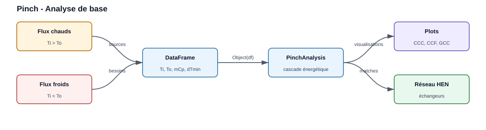
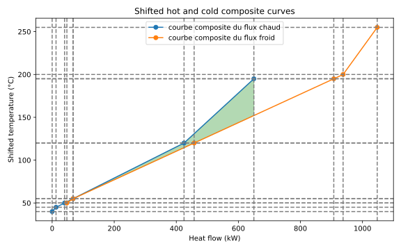
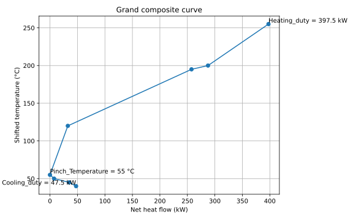
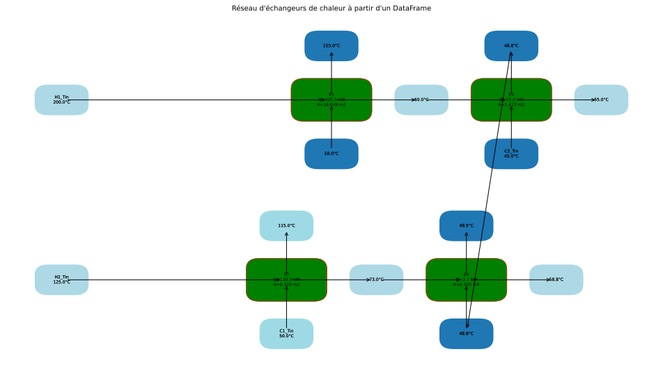

.. _pinch_analysis:

Analyse de pincement — PinchAnalysis
====================================

Le module ``PinchAnalysis`` optimise la récupération de chaleur entre flux
chauds et froids : à partir d'une simple liste de flux, il calcule les utilités
minimales (chaude et froide), la chaleur récupérable, le point de pincement, et
propose un réseau d'échangeurs. Cette page déroule **un seul cas de bout en
bout** — le code, ses sorties réelles, puis leur interprétation. Toutes les
valeurs et figures ci-dessous sont produites en exécutant réellement la
bibliothèque sur le jeu de flux présenté.

Le problème
-----------

   Deux flux chauds à refroidir et deux flux froids à chauffer. L'analyse Pinch
   détermine combien de chaleur ces flux peuvent s'échanger entre eux, et donc
   les utilités (vapeur, eau de refroidissement) réellement nécessaires.

On considère quatre flux de procédé, avec ``ΔTmin = 10 °C`` (soit
``dTmin2 = 5 K``) :

.. list-table::
   :widths: 12 12 12 12 12 40
   :header-rows: 1

   * - Flux
     - Type
     - Ti [°C]
     - To [°C]
     - mCp [kW/K]
     - Rôle
   * - H1
     - chaud
     - 200
     - 50
     - 3,0
     - flux chaud à refroidir
   * - H2
     - chaud
     - 125
     - 45
     - 2,5
     - flux chaud à refroidir
   * - C1
     - froid
     - 50
     - 250
     - 2,0
     - flux froid à chauffer
   * - C2
     - froid
     - 45
     - 195
     - 4,0
     - flux froid à chauffer

Le code
-------

.. code-block:: python

   import pandas as pd
   from PinchAnalysis import PinchAnalysis

   # Un flux par ligne. Colonnes attendues par PinchAnalysis.Object :
   #   id, name    : identifiant et nom du flux
   #   Ti, To      : températures initiale / finale [°C]
   #   mCp         : débit de capacité thermique [kW/K]
   #   dTmin2      : ΔTmin/2 propre au flux [K]
   #   integration : True pour inclure le flux dans l'analyse
   # Le type (chaud/froid) est déduit automatiquement : Ti > To => chaud.
   df = pd.DataFrame({
       'id': [1, 2, 3, 4],
       'name': ['H1', 'H2', 'C1', 'C2'],
       'Ti': [200, 125, 50, 45],
       'To': [50, 45, 250, 195],
       'mCp': [3.0, 2.5, 2.0, 4.0],
       'dTmin2': [5, 5, 5, 5],
       'integration': [True, True, True, True],
   })

   # Toute l'analyse est calculée à la construction de l'objet.
   pinch = PinchAnalysis.Object(df)

   # Indicateurs de synthèse
   print(f"Température de pincement (décalée) : {pinch.Pinch_Temperature} °C")
   print(f"Utilité chaude minimale  Qh,min    : {pinch.Heating_duty} kW")
   print(f"Utilité froide minimale  Qc,min    : {pinch.Cooling_duty} kW")
   print(f"Chaleur récupérable                : {pinch.heat_recovery} kW")

   # DataFrames de détail
   print(pinch.stream_list)          # flux + températures décalées
   print(pinch.df_surplus_deficit)   # cascade énergétique par intervalle

   # Figures
   pinch.plot_composites_curves()        # courbes composites chaude / froide
   pinch.plot_GCC()                      # grande courbe composite
   pinch.graphical_hen_design(plot=True) # réseau d'échangeurs proposé

Les résultats
-------------

**1. Indicateurs de synthèse** (sortie console) :

.. code-block:: text

   Température de pincement (décalée) : 55 °C
   Utilité chaude minimale  Qh,min    : 397.5 kW
   Utilité froide minimale  Qc,min    : 47.5 kW
   Chaleur récupérable                : 602.5 kW

**2. Flux avec températures décalées** — ``pinch.stream_list`` :

.. code-block:: text

      id name   Ti   To  mCp  dTmin2 StreamType  STi  STo  delta_H
   0   1   H1  200   50  3.0       5         HS  195   45   -450.0
   1   2   H2  125   45  2.5       5         HS  120   40   -200.0
   2   3   C1   50  250  2.0       5         CS   55  255    400.0
   3   4   C2   45  195  4.0       5         CS   50  200    600.0

* ``StreamType`` : ``HS`` (chaud) si ``Ti > To``, sinon ``CS`` (froid).
* ``STi`` / ``STo`` : températures **décalées** de ``±dTmin2`` (−5 K pour les
  chauds, +5 K pour les froids) — l'astuce qui garantit un écart réel de
  ``ΔTmin`` entre tout flux chaud et tout flux froid.
* ``delta_H = mCp × (To − Ti)`` : enthalpie échangée par le flux.

**3. Cascade énergétique** — ``pinch.df_surplus_deficit`` (cœur de la méthode) :

.. code-block:: text

     IntervalName  Tsup  Tinf  mCp  delta_H  cumulative_delta_H
          255-200   255   200 -2.0   -110.0             -110.0
          200-195   200   195 -6.0    -30.0             -140.0
          195-120   195   120 -3.0   -225.0             -365.0
           120-55   120    55 -0.5    -32.5             -397.5   <- minimum
            55-50    55    50  1.5      7.5             -390.0
            50-45    50    45  5.5     27.5             -362.5
            45-40    45    40  2.5     12.5             -350.0

Le minimum de ``cumulative_delta_H`` vaut **−397,5 kW** à la frontière
**55 °C** : c'est le point de pincement, et cette valeur donne directement
``Qh,min``.

**4. Courbes composites** — ``pinch.plot_composites_curves()`` :

   Composite chaude (bleu) et composite froide (orange) en températures
   décalées. Le recouvrement horizontal correspond à la chaleur récupérable
   (602,5 kW) ; les écarts résiduels à gauche (47,5 kW) et à droite (397,5 kW)
   donnent les deux utilités minimales.

**5. Grande courbe composite (GCC)** — ``pinch.plot_GCC()`` :

   La GCC touche l'axe vertical au pincement (55 °C), s'ouvre vers le haut de
   ``Qh,min = 397,5 kW`` et vers le bas de ``Qc,min = 47,5 kW``. C'est l'outil
   pour positionner des utilités à plusieurs niveaux (vapeur HP/MP/BP).

**6. Réseau d'échangeurs proposé** — ``pinch.graphical_hen_design()`` puis
``pinch.heat_exchangers`` :

.. code-block:: text

    HS   CS  HeatExchanged   delta_tlm     UA     Zone
    H1   C2       420.00      23.27      18.05   au-dessus du pinch
    H2   C1       130.00      15.61       8.33   au-dessus du pinch
    H1   C2        15.00      10.61       1.41   en dessous du pinch
    H2   C2         3.13      10.23       0.31   en dessous du pinch

L'échangeur principal **H1 → C2** récupère 420 kW au-dessus du pincement,
**H2 → C1** en récupère 130 kW, et deux petits appariements complètent la
récupération en dessous. Chaque ligne fournit le ``ΔT`` logarithmique et le
produit ``UA`` (avec ``U = 1000`` W/m²·K par défaut) pour dimensionner
l'échangeur.

L'appel ``pinch.graphical_hen_design(plot=True)`` trace directement le réseau
correspondant :

   Sortie réelle de ``graphical_hen_design(plot=True)``. Chaque flux chaud (H1,
   H2) chemine à travers ses échangeurs vers les flux froids (C1, C2), avec les
   températures d'entrée/sortie à chaque nœud et la puissance échangée par
   appariement.

Les explications
----------------

**Le bilan sans intégration.** Avant toute récupération, chaque flux est traité
séparément : il faut évacuer ``450 + 200 = 650 kW`` des flux chauds et fournir
``400 + 600 = 1000 kW`` aux flux froids. Sans échange interne, cela demanderait
**1000 kW** d'utilité chaude et **650 kW** d'utilité froide.

**Pourquoi Qh,min = 397,5 kW et Qc,min = 47,5 kW.** La cascade empile les
excédents et déficits intervalle par intervalle. Prise telle quelle, elle
descend jusqu'à **−397,5 kW** : cela reviendrait à transférer plus de chaleur
qu'il n'y en a de disponible — impossible. Pour rendre la cascade réalisable,
on **injecte 397,5 kW en haut** (``Qh,min``) ; la cascade se relève partout et
sa valeur en bas devient ``−350 + 397,5 = 47,5 kW`` (``Qc,min``). La
récupération se déduit par bilan : ``1000 − 397,5 = 602,5 kW``. On passe donc de
**1000 → 397,5 kW** de vapeur (−60 %) et de **650 → 47,5 kW** d'eau de
refroidissement (−93 %), uniquement en faisant échanger les flux entre eux.

**Le rôle du point de pincement.** Le pincement est l'endroit où la cascade
s'annule (température décalée 55 °C, soit **60 °C côté chaud** et **50 °C côté
froid**). Il coupe le procédé en deux zones indépendantes et impose trois règles
d'or, respectées par le réseau ci-dessus :

1. ne jamais transférer de chaleur **à travers** le pincement ;
2. **au-dessus** du pincement : aucune utilité froide ;
3. **en dessous** du pincement : aucune utilité chaude.

Violer une seule de ces règles augmente *simultanément* ``Qh`` et ``Qc`` de la
même quantité — c'est l'erreur de conception que l'analyse Pinch évite.

.. note::

   **Choix du ΔTmin** : 10–20 °C pour un procédé standard, 3–5 °C en cryogénie,
   20–40 °C en haute température. Plus ``ΔTmin`` est faible, moins on consomme
   d'utilités mais plus la surface d'échange (donc l'investissement) augmente ;
   l'optimum se trouve par analyse du coût total annualisé (TAC).

Ce qu'on personnalise
---------------------

.. list-table::
   :header-rows: 1

   * - Paramètre
     - Effet
     - Valeur / plage
   * - ``dTmin2`` (colonne, par flux)
     - Moitié de l'écart minimal admis entre flux chaud et flux froid ; décale les
       températures du flux. Plus il est grand, moins on récupère de chaleur mais
       plus les échangeurs sont petits
     - K ; ``ΔTmin = 2 × dTmin2`` (voir la note ci-dessus)
   * - ``mCp`` (colonne)
     - Débit de capacité thermique du flux : fixe sa puissance
       ``mCp × (To − Ti)``
     - kW/K
   * - ``Ti``, ``To`` (colonnes)
     - Températures initiale et finale ; ``Ti > To`` désigne un flux chaud
     - °C
   * - ``integration`` (colonne)
     - ``False`` exclut le flux de l'analyse sans le retirer du tableau
     - ``True`` (défaut si absente) / ``False``
   * - ``U`` (argument de ``PinchAnalysis.Object``)
     - Coefficient d'échange utilisé pour le produit ``UA`` des échangeurs proposés
     - W/m²·K, défaut ``1000.0``

Variante : les mêmes flux avec un ``ΔTmin`` de 20 °C au lieu de 10 °C.

.. code-block:: python

   import pandas as pd
   from PinchAnalysis import PinchAnalysis

   # variante : ΔTmin porté de 10 à 20 °C (dTmin2 = 10 K sur chaque flux)
   df = pd.DataFrame({
       'id': [1, 2, 3, 4],
       'name': ['H1', 'H2', 'C1', 'C2'],
       'Ti': [200, 125, 50, 45],
       'To': [50, 45, 250, 195],
       'mCp': [3.0, 2.5, 2.0, 4.0],
       'dTmin2': [10, 10, 10, 10],
       'integration': [True, True, True, True],
   })
   pinch = PinchAnalysis.Object(df)
   print(f"Température de pincement (décalée) : {pinch.Pinch_Temperature} °C")
   print(f"Utilité chaude minimale  Qh,min    : {pinch.Heating_duty} kW")
   print(f"Utilité froide minimale  Qc,min    : {pinch.Cooling_duty} kW")
   print(f"Chaleur récupérable                : {pinch.heat_recovery} kW")

Sortie réelle :

.. code-block:: text

   Température de pincement (décalée) : 60 °C
   Utilité chaude minimale  Qh,min    : 452.5 kW
   Utilité froide minimale  Qc,min    : 102.5 kW
   Chaleur récupérable                : 547.5 kW

Doubler le ``ΔTmin`` coûte **55 kW** de plus sur chaque utilité : 452,5 kW de
vapeur au lieu de 397,5 kW, 102,5 kW d'eau de refroidissement au lieu de 47,5 kW,
et la récupération tombe de 602,5 à 547,5 kW. C'est le prix, en énergie, d'échangeurs
plus petits.

Éprouver le modèle
------------------

``PinchAnalysis.Object`` ne vérifie pas ses flux : aucun garde-fou. Un flux
**isotherme** (``Ti = To``) est accepté, classé froid (``CS``) et porte une
puissance nulle — c'est à vous d'écarter ces lignes (``integration = False``).

.. code-block:: python

   import pandas as pd
   from PinchAnalysis import PinchAnalysis

   # un flux isotherme (Ti = To) : ni chaud ni froid
   df = pd.DataFrame({'id': [1, 2], 'name': ['H1', 'X'], 'Ti': [200, 80], 'To': [50, 80],
                      'mCp': [3.0, 2.0], 'dTmin2': [5, 5], 'integration': [True, True]})
   pinch = PinchAnalysis.Object(df)
   print(pinch.stream_list[['name', 'Ti', 'To', 'StreamType', 'delta_H']])

Sortie réelle :

.. code-block:: text

     name   Ti  To StreamType  delta_H
   0   H1  200  50         HS   -450.0
   1    X   80  80         CS      0.0
