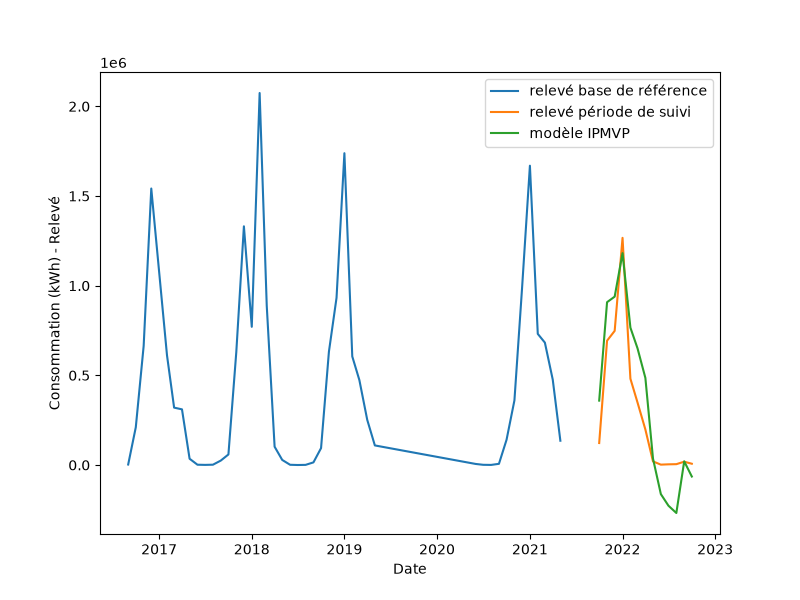

Mesure des économies
====================

Ce chapitre isole le **calcul et la revue des économies** produites par
``Mathematical_Models`` : les deux approches ANTE-POST / POST-ANTE, la figure du
modèle, et l'incertitude propagée de l'économie annoncée.

Code à copier
-------------

.. code-block:: python

   import pandas as pd
   from datetime import datetime
   from IPMVP.IPMVP import Mathematical_Models, incertitude_savings

   # --- Données + ajustement (voir chapitre Exemple complet) ---
   df = pd.read_excel("src/IPMVP/IPMVP_input.xlsx")
   df["Mois"] = pd.to_datetime(df["Mois"])
   df = df.set_index("Mois")
   col_conso = [c for c in df.columns if c.lower().startswith("consommation")][0]
   X, y = df[["DJU"]], df[col_conso]

   res = Mathematical_Models(
       y, X,
       datetime(2016, 9, 1), datetime(2021, 5, 1),
       datetime(2021, 10, 1), datetime(2022, 10, 1),
       degree=1, seuil_z_scores=3, site="exemple_site",
       print_report=True,   # produit eco-ANTE-POST.png / eco-POST-ANTE.png
   )
   df_bl, df_savings = res[1], res[8]

   # --- Revue des économies ---
   print("=== ÉCONOMIES ANTE-POST / POST-ANTE (df_savings) ===")
   print(df_savings)
   print("\nÉconomie ANTE-POST (%) :", df_savings.loc["pourcentage d'économie>0", "ANTE-POST"])
   print("Économie POST-ANTE (%) :", df_savings.loc["pourcentage d'économie>0", "POST-ANTE"])

   # --- Incertitude propagée de l'économie annoncée ---
   rmse    = float(df_bl.loc["rmse"].iloc[0])
   ddof    = float(df_bl.loc["ddof"].iloc[0])
   mask    = (y.index >= datetime(2016, 9, 1)) & (y.index <= datetime(2021, 5, 1))
   moyenne = float(y[mask].mean())

   inc = incertitude_savings(
       rmse, ddof, moyenne,
       gain_pct=0.18, duree_contrat_mois=60, duree_reporting_mois=12,
       niveau_confiance=0.9,
   )
   print("\n=== INCERTITUDE PROPAGÉE (incertitude_savings) ===")
   print("contrat  (60 mois) :", inc["contrat"])
   print("reporting (12 mois) :", inc["reporting"])

Résultats
---------

``df_savings`` — les deux approches de calcul :

.. code-block:: text

                              ANTE-POST    POST-ANTE
   Relevé de consommation    3914387.73  19655625.79
   Prédiction                4624795.55  16156026.80
   pourcentage d'économie>0       18.15        17.80

* **ANTE-POST** : modèle établi sur la **référence**, appliqué à la période de
  suivi → économie = prédiction − mesuré = **18,15 %**.
* **POST-ANTE** : modèle établi sur la période de **suivi**, appliqué à la
  référence (utile si la référence est trop courte pour un modèle fiable) →
  **17,80 %**.

``incertitude_savings`` — précision de l'économie annoncée (niveau 90 %) :

.. code-block:: text

   contrat  (60 mois) : {'mois': 60, 'economie_kwh': 5335141.89,
                         'precision_absolue_kwh': 3078077.25, 'precision_relative': 0.577}
   reporting (12 mois) : {'mois': 12, 'economie_kwh': 1067028.38,
                         'precision_absolue_kwh': 1376557.99, 'precision_relative': 1.290}

La précision relative s'améliore avec la durée cumulée (0,58 sur 60 mois contre
1,29 sur 12 mois) : plus la période d'observation est longue, plus l'économie
annoncée est robuste au sens IPMVP.

Figure produite
---------------

``print_report=True`` génère ``eco-ANTE-POST.png`` : relevé de référence, relevé
de suivi et modèle IPMVP appliqué à la période de suivi.

