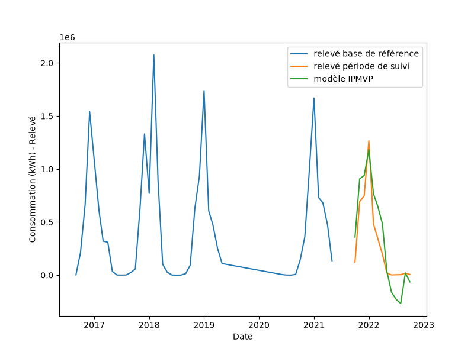

Mesure des économies
====================

Ce chapitre isole le **calcul et la revue des économies** produites par
``Mathematical_Models`` : les deux approches ANTE-POST / POST-ANTE, la figure du
modèle, et l'incertitude propagée de l'économie annoncée.

Code à copier
-------------

.. code-block:: python

   import numpy as np
   import pandas as pd
   from datetime import datetime
   from IPMVP.IPMVP import Mathematical_Models, incertitude_savings

   # --- Données mensuelles construites ici (aucun fichier à fournir) ---
   mois = pd.date_range("2016-09-01", "2022-10-01", freq="MS")
   dju_type = [150, 290, 420, 480, 400, 330, 210, 110, 30, 0, 0, 40]   # DJU sept. -> août
   dju = np.array([dju_type[(m.month - 9) % 12] for m in mois], dtype=float)
   dju *= 1 + 0.08 * np.sin(np.arange(len(mois)) * 1.7)                  # variabilité d'une année à l'autre
   conso = 12000 + 45 * dju + 400 * np.cos(np.arange(len(mois)) * 2.3)  # kWh/mois
   conso[mois >= datetime(2021, 10, 1)] *= 0.82                           # -18 % après travaux
   df = pd.DataFrame({"DJU": dju, "Consommation [kWh]": conso}, index=mois)
   X, y = df[["DJU"]], df["Consommation [kWh]"]

   res = Mathematical_Models(
       y, X,
       datetime(2016, 9, 1), datetime(2021, 5, 1),
       datetime(2021, 10, 1), datetime(2022, 10, 1),
       degree=1, seuil_z_scores=3, site="exemple_site",
       print_report=True,   # produit eco-ANTE-POST.png / eco-POST-ANTE.png
   )
   df_bl, df_savings = res[1], res[8]

   # --- Revue des économies ---
   print("=== ÉCONOMIES ANTE-POST / POST-ANTE (df_savings) ===")
   print(df_savings)
   print("\nÉconomie ANTE-POST (%) :", df_savings.loc["pourcentage d'économie>0", "ANTE-POST"])
   print("Économie POST-ANTE (%) :", df_savings.loc["pourcentage d'économie>0", "POST-ANTE"])

   # --- Incertitude propagée de l'économie annoncée ---
   rmse    = float(df_bl.loc["rmse"].iloc[0])
   ddof    = float(df_bl.loc["ddof"].iloc[0])
   mask    = (y.index >= datetime(2016, 9, 1)) & (y.index <= datetime(2021, 5, 1))
   moyenne = float(y[mask].mean())

   inc = incertitude_savings(
       rmse, ddof, moyenne,
       gain_pct=0.18, duree_contrat_mois=60, duree_reporting_mois=12,
       niveau_confiance=0.9,
   )
   print("\n=== INCERTITUDE PROPAGÉE (incertitude_savings) ===")
   print("contrat  (60 mois) :", inc["contrat"])
   print("reporting (12 mois) :", inc["reporting"])

Sortie réelle :

.. code-block:: text

   …
   === ÉCONOMIES ANTE-POST / POST-ANTE (df_savings) ===
                             ANTE-POST   POST-ANTE
   Relevé de consommation    227992.77  1235735.84
   Prédiction                278336.03  1012220.85
   pourcentage d'économie>0      18.09       18.09

   Économie ANTE-POST (%) : 18.09
   Économie POST-ANTE (%) : 18.09

   === INCERTITUDE PROPAGÉE (incertitude_savings) ===
   contrat  (60 mois) : {'mois': 60, 'economie_kwh': 234139.42254647537, 'precision_absolue_kwh': 3764.666590105374, 'precision_relative': 0.01607873868125778}
   reporting (12 mois) : {'mois': 12, 'economie_kwh': 46827.88450929507, 'precision_absolue_kwh': 1683.6100816195906, 'precision_relative': 0.03595315268374772}

Résultats
---------

Les données ont été construites avec une baisse **exacte de 18 %** de la
consommation à partir d'octobre 2021 : c'est ce qui permet de lire les deux
pourcentages de ``df_savings`` (sortie ci-dessus).

* **ANTE-POST** : modèle établi sur la **référence**, appliqué à la période de
  suivi. Le code calcule ``(prédiction − mesuré) / prédiction`` : l'économie est
  rapportée à la **consommation de référence ajustée** aux conditions du suivi,
  (278 336 − 227 993) / 278 336 = **18,09 %** pour une baisse réelle de 18 %.
* **POST-ANTE** : modèle établi sur la période de **suivi**, appliqué à la
  référence (utile si la référence est trop courte pour un modèle fiable) :
  ``(mesuré − prédiction) / mesuré`` sur la référence → **18,09 %**.

Les deux pourcentages ont la même base : la consommation **sans l'action**,
dans les conditions de la période comparée (la prédiction en ANTE-POST, le
relevé de référence en POST-ANTE). C'est la définition du FD X30-148 (§ 5.4.2 et
5.4.3 : énergie évitée = consommation ajustée − consommation mesurée) combinée à
la variation relative de l'ISO 50006 (§ 4.5.2 b) : écart « exprimé en
pourcentage de la valeur » de référence).

.. note::

   Jusqu'au 28/09/2026, la colonne ANTE-POST divisait par la consommation
   **mesurée après travaux** : ce même exemple affichait 22,08 % pour une baisse
   de 18 %. Un rapport produit avec une version antérieure surestime l'économie
   ANTE-POST ; recalculez-la depuis les lignes ``Relevé de consommation`` et
   ``Prédiction`` de ``df_savings``.

``incertitude_savings`` — précision de l'économie annoncée (niveau 90 %) : sur
60 mois, 234 139 kWh à ± 3 765 kWh (précision relative 0,016) ; sur 12 mois,
46 828 kWh à ± 1 684 kWh (0,036). La précision relative s'améliore avec la durée
cumulée : plus la période d'observation est longue, plus l'économie annoncée est
robuste au sens IPMVP.

Paramètres à personnaliser
--------------------------

Les paramètres de ``Mathematical_Models`` sont détaillés dans :doc:`exemples`.
Ceux de ``incertitude_savings`` :

.. list-table::
   :widths: 22 46 20 12
   :header-rows: 1

   * - Paramètre
     - Effet
     - Plage usuelle
     - Défaut
   * - ``rmse``, ``ddof``
     - Erreur-type et degrés de liberté du modèle de référence : lignes ``rmse``
       et ``ddof`` de ``df_bl``
     - —
     - —
   * - ``moyenne``
     - Consommation moyenne **par pas de temps** (ici par mois) sur la référence
     - —
     - —
   * - ``gain_pct``
     - Économie attendue, en fraction (0,18 = 18 %) de la moyenne
     - 0,05 à 0,40
     - —
   * - ``duree_contrat_mois``
     - Durée d'engagement sur laquelle l'économie est garantie
     - 36 à 120
     - —
   * - ``duree_reporting_mois``
     - Durée de la période de suivi rapportée
     - 12
     - —
   * - ``niveau_confiance``
     - Niveau de confiance de la précision annoncée
     - 0,80 à 0,95
     - 0,8

Variante : exigence de confiance à 95 %
---------------------------------------

Un contrat de performance plus exigeant : confiance 95 %, engagement de 36 mois,
gain attendu ramené à 12 %.

.. code-block:: python

   # variante : niveau de confiance 95 %, contrat de 36 mois, gain attendu ramené à 12 %
   inc95 = incertitude_savings(
       rmse, ddof, moyenne,
       gain_pct=0.12, duree_contrat_mois=36, duree_reporting_mois=12,
       niveau_confiance=0.95,
   )
   print(f"t de Student : {inc['stat_t']:.3f} (90 %) -> {inc95['stat_t']:.3f} (95 %)")
   for cle in ("contrat", "reporting"):
       r = inc95[cle]
       print(f"{cle:9s} {r['mois']:2d} mois : {r['economie_kwh']:9.0f} kWh "
             f"± {r['precision_absolue_kwh']:6.0f} kWh ({100 * r['precision_relative']:.1f} %)")

Sortie réelle :

.. code-block:: text

   t de Student : 1.673 (90 %) -> 2.004 (95 %)
   contrat   36 mois :     93656 kWh ±   3493 kWh (3.7 %)
   reporting 12 mois :     31219 kWh ±   2017 kWh (6.5 %)

Passer de 90 à 95 % de confiance élargit l'intervalle de 20 % (t = 2,004 au lieu
de 1,673) ; avec un gain attendu plus faible, la précision **relative** se dégrade
(6,5 % sur 12 mois au lieu de 3,6 %). Une économie annoncée n'a de sens que si sa
précision relative reste nettement inférieure à 50 % : c'est ce calcul qui dit si
le compteur et le modèle suffisent à la démontrer.

Figure produite
---------------

``print_report=True`` génère ``eco-ANTE-POST.png`` : relevé de référence, relevé
de suivi et modèle IPMVP appliqué à la période de suivi.

